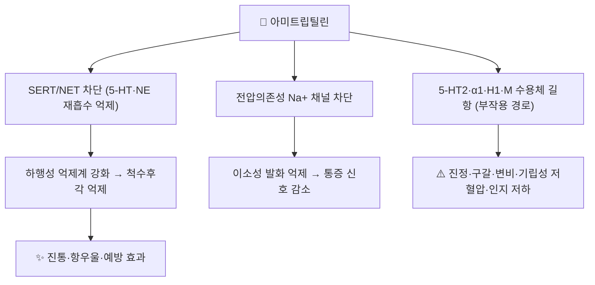

# 💊 아미트립틸린 (Amitriptyline, Elavil 등, ATC N06AA09)

> **핵심 3줄 요약 (Key Summary)**:
> 🧪 주성분·제형: 삼차 아민(tetriary amine) 계열 **[[삼환계항우울제]]**(TCA). 경구 정제(10·25 mg 등).
> 📍 작용 기전: **세로토닌(SERT)·노르에피네프린(NET) 재흡수 차단**으로 [[하행성 통증억제계]]를 강화 + **전압의존성 Na⁺ 채널 차단**으로 이소성 발화 억제 + 5-HT2·α1·H1·M 수용체 길항(부작용의 근원).
> 🎯 임상 적응증: 주요우울장애, **신경병증성 통증(허가외 사용)**, 편두통·긴장형 두통 예방(허가외).
> ⚠️ 주의사항: 항콜린성(구갈·변비·요저류)·진정·기립성 저혈압·QT 연장. **노인에서는 회피가 원칙**, 100 mg/일 초과 시 돌연심장사 위험 보고.

---

## 1. 약물 기본 정보 및 시판 제품 (Brand Identification)

> [!abstract]+ 🧪 3D 약리 분자 구조 (Interactive 3D Viewer)
> <iframe src="https://molecule-viewer-rho.vercel.app/?cid=2160" style="width: 100%; height: 600px; border: none; border-radius: 12px; box-shadow: 0 4px 20px rgba(0,0,0,0.15);" allowfullscreen></iframe>

| 항목 | 상세 정보 |
| :--- | :--- |
| **일반명 (Generic Name)** | 아미트립틸린(Amitriptyline) — 염산염 형태로 사용 |
| **대표 상품명 (Brand Names)** | 국내: **에나폰정**, 기타 제네릭 다수 / 해외: Elavil·Tryptizol·Laroxyl |
| **ATC 코드 / 분류** | **N06AA09** (비선택적 모노아민 재흡수 억제제 — 삼환계) |
| **주요 제형** | 경구 정제(10 mg·25 mg 등), 일부 국가 주사제 |
| **허가 적응증** | 주요우울장애(국내 허가) — 통증·두통 예방은 **허가외(off-label)** 사용 |

### 1.1 임상 사용 위치 (2026-09-18 근거 기준)
- NeuPSIG 2025 개정 권고(PMID 40252663): 신경병증성 통증 **1차 치료(강한 권고)** — TCA 계열로 묶여 평가되었고, 21편 중 13편이 아미트립틸린
- 편두통 예방: 동반 질환이 **불안·우울·불면**일 때 선택하는 경향(베타차단제=고혈압, 토피라메이트=비만에 대응) → [[편두통]]

---

## 2. 분자 약리 기전 및 작용 경로 (Mechanism of Action)

* **주요 작용 기전**: 세로토닌 수송체(SERT)에 대한 강한 억제 + 노르에피네프린 수송체(NET) 중등도 억제 → 시냅스 5-HT·NE 농도 상승 → 뇌간-척수 [[하행성 통증억제계]] 강화. 추가로 **전압의존성 나트륨 채널 차단**이 손상 신경의 이소성 발화를 줄인다
* **진통 용량과 항우울 용량의 분리**: 진통은 통상 **저용량(예: 야간 25 mg 시작 → 75 mg/일 부근까지 적정)** 에서 나타나고 항우울 효과는 더 높은 용량이 필요하다 — 진통 목적에서 저용량으로 쓰는 근거
* **대사**: CYP2D6·CYP2C19·CYP3A4(주로 간) → 활성 대사체 **노르트립틸린**. **CYP2D6 저해 약물(파록세틴·플루옥세틴·일부 항정신병약)과 병용 시 혈중농도 상승** 위험 → [[CYP3A4]] 관련 상호작용 점검

---

## 3. 약동학적 특성 (Pharmacokinetics: ADME)

| 약동학 파라미터 | 수치 및 임상적 의미 |
| :--- | :--- |
| **생체이용률 (F)** | 약 45~53% (초회통과효과 존재) |
| **혈장 단백결합률** | 약 96% — 저알부민혈증에서 유리형 증가 가능 |
| **간 대사 효소** | CYP2D6·CYP2C19·CYP3A4 → 노르트립틸린 |
| **배설 반감기** | 아미트립틸린 약 10~50시간(개체차 큼), 노르트립틸린은 더 길다 |
| **배설 경로** | 주로 신장(대사체) — 신기능 저하 시 감량 고려 |

---

## 의학/04_임상 용법·용량 및 처방 가이드 (Dosage & Administration)

| 임상 적응증 | 표준 용법·용량 | 비고 |
| :--- | :--- | :--- |
| **신경병증성 통증(허가외)** | **야간 10~25 mg 시작 → 25~75 mg/일 적정**(불내약이면 감량) | NeuPSIG 2025 메타분석 포함 시험은 대개 **25~150 mg/일** 범위 |
| **편두통·긴장형 두통 예방(허가외)** | 야간 10~25 mg 시작, 25~50 mg/일 유지 | 8~12주 후 월 두통일수 50% 감소로 판정 |
| **노인** | **원칙적으로 회피** — 특히 65세 이상 | 항콜린·진정·낙상·인지 저하; 100 mg/일 초과 시 돌연심장사 위험 보고 |

- **감량 원칙**: 장기 복용 후 중단 시 **단계적 감량**(불면·불안·감각 이상 등 중단증후군 방지)
- **심전도**: 고령·심질환·QT 연장 위험 환자에서 삼환계 사용 전/중 ECG 고려

---

## 5. 부작용, 경고 및 약물 상호작용 (Adverse Effects & Interactions)

### 5.1 주요 부작용
* **항콜린성**: 구갈, 변비, 요저류, 시야 흐림, 인지기능 저하 — **전립선비대·폐쇄각녹내장에서 금기/주의**
* **심혈관**: 기립성 저혈압(α1 차단), 심계항진, **QT 연장·전도장애**(과량에서 치명적)
* **중추신경**: 진정·주간 졸림, 체중 증가, 성기능 장애
* **과량**: 삼환계는 과량에서 **생명을 위협**(부정맥·경련·혼수) — 처방량 최소화, 자살 위험 환자는 소량 처방 원칙

### 5.2 주요 병용 주의
* **세로토닌 증후군**: SSRI·SNRI·트라마돌·triptan 병용 시
* **CYP2D6 저해제** 병용 → 혈중농도 상승
* **알코올·중추억제제** 병용 → 진정·호흡억제 가중
* ⚠️ **프레가발린·오피오이드 병용 환자**는 약물 관련 사망 위험 증가가 권고안에 명시됨 — 진통 목적 다약제 복용력을 반드시 청취 → [[프레가발린]]·[[트라마돌]]·[[오피오이드]]

---

## 6. 한의 치료 연계 및 병용/테이퍼링 프로토콜 (Integrative Medicine)

* **진통 목적 저용량(야간 10~25 mg)** 은 침·한약 병행 시 감량이 비교적 수월하다 — 진통 효과와 약물 부작용을 분리해 평가하고, **한방 진통(침·전침·약침)으로 잠식되는 만큼 단계적으로 줄인다**
* **중추억제성 처방 병용 주의**: 진정·안신 계열 처방을 함께 쓸 때는 주간 졸림·어지럼·낙상 위험을 평가 — 노인 환자에서는 특히
* **한약 간섭**: CYP2D6·CYP3A4와 겹치는 본초(예: 강한 CYP 저해 성분 함유 처방)를 병용할 때는 **시간차 투여(1~2시간)** 및 증상 모니터링 → [[CYP3A4]]

---

## 7. 💡 진료실 핵심 체크리스트

### 7.1 문진 체크리스트
1. **복용 용량·복용 시각**(야간 복용 여부)과 **주간 졸림** 정도
2. **항콜린성 증상**: 구갈·변비·배뇨 곤란·시야 흐림
3. **기립성 어지럼·낙상력**, 심질환·QT 연장 병력, 병용 약물(특히 프레가발린·오피오이드·SSRI)
4. 노인·전립선비대·녹내장 환자인지 확인 → **가능하면 국소제·SNRI 등 대안 검토**

### 7.2 환자 티칭 스크립트
> *"신경 손상으로 생긴 통증에는 우울증 치료에 쓰는 항우울제 계열을 **용량을 낮춰 잠자기 전에** 쓰는 방법이 있습니다. 통증은 저녁에 시작해서 몇 주에 걸쳐 효과가 나타나므로 3~4주는 기다려 보셔야 합니다. 입이 마르고 졸리고 변비가 생길 수 있는데, 줄이거나 시간을 조절하면 대부분 견딜 만합니다. 다만 나이가 많으시거나 어지럼이 있으면 쓰지 않는 편이 안전합니다."*

---

## 8. 출처 및 학술 참고 문헌 (References)

* 2026-09-18 심층리뷰 2번 — NeuPSIG 2025 개정 권고(Lancet Neurol 2025;24(5):413-428, PMID 40252663, DOI 10.1016/S1474-4422(25)00068-7): TCA 21편(아미트립틸린 13편, **25~150 mg/일**), **NNT 4.6(95% CI 3.2~7.7)·NNH 17.1(11.4~33.6)**, 노인 TCA 회피·100 mg/일 초과 돌연심장사 위험 보고, 프레가발린+오피오이드 병용 사망 위험 경고
* Goodman & Gilman's *The Pharmacological Basis of Therapeutics* — 삼환계 항우울제 약리·부작용 총론
* ATC 코드 N06AA09 및 약동학(생체이용률 45~53%·단백결합 96%·CYP2D6/2C19/3A4 대사) — 공개 약물 정보(Wikipedia Amitriptyline 항목, ATC/WHO 분류) 대조
* ⚠️ 국내 허가사항(용법·용량)은 제품별로 다르므로 처방 전 **식약처 의약품안전나라**에서 최신 허가사항 확인

<!-- 보관 태그(1회용·링크오류, 필요시 복원): 삼환계항우울제, TCA -->
