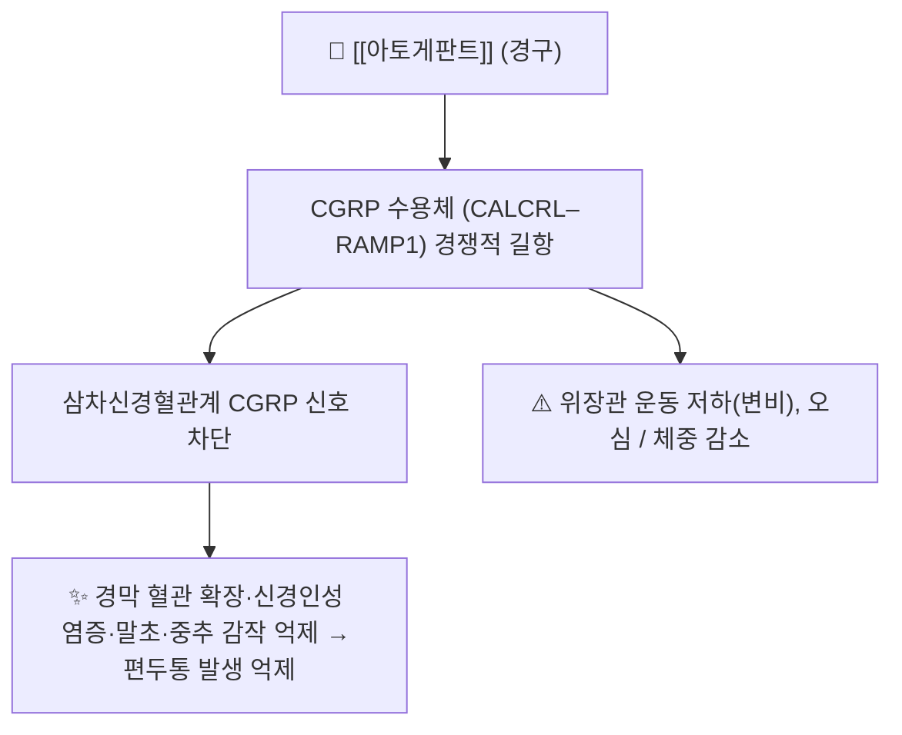

# 💊 [[아토게판트]] (Atogepant, Qulipta / Aquipta, ATC N02CD07)

> **핵심 3줄 요약 (Key Summary)**:
> 🧪 주성분·제형: 경구용 소분자 CGRP 수용체 길항제(gepant 계열). 분자식 C₂₉H₂₃F₆N₅O₃·분자량 603.5 g/mol. 경구 정제 **10 mg / 30 mg / 60 mg**.
> 🎯 작용 기전·적응증: CGRP 수용체(CALCRL–RAMP1)를 경쟁적으로 길항해 삼차신경혈관계 활성화·감작을 차단 → **성인 편두통의 예방 치료**(삽화성: 10/30/60 mg 1일 1회, **만성: 60 mg 1일 1회**).
> ⚠️ 주의사항: **변비(약 10%)**·오심이 흔하고 체중 감소(≥7%)가 보고됨. **CYP3A4 기질** — 강 억제제 병용 시 10 mg으로 감량, 강·중등도 유도제 병용 시 만성 편두통에는 권장되지 않음.

---

## 1. 약물 기본 정보 및 시판 제품 (Brand Identification)

> [!abstract]+ 🧪 3D 약리 분자 구조 (Interactive 3D Viewer)
> <iframe src="https://molecule-viewer-rho.vercel.app/?cid=72163100" width="100%" height="450px" frameborder="0" allow="webgl" style="border-radius: 8px;"></iframe>

| 항목 | 상세 정보 |
| :--- | :--- |
| **일반명 (Generic Name)** | [[아토게판트]](한글) / Atogepant (USAN) |
| **대표 상품명 (Brand Names)** | **Qulipta**(큐립타, 미국·AbbVie), **Aquipta**(EU) |
| **ATC 코드 / 분류** | **N02CD07** — N02C 항편두통제 / N02CD CGRP 길항제 |
| **PubChem CID** | [72163100](https://pubchem.ncbi.nlm.nih.gov/compound/72163100) |
| **화학식 / 분자량** | C₂₉H₂₃F₆N₅O₃ / 603.5 g/mol |
| **주요 제형 및 함량** | 경구 정제 10 mg, 30 mg, 60 mg |
| **허가 적응증** | 성인 **편두통의 예방 치료**(삽화성·만성). FDA 삽화성 2021-09 승인, 만성 2023-04-17 적응증 확대 |
| **표적** | CGRP 수용체(CALCRL, calcitonin receptor-like receptor) |

### 1.1 계열 내 위치 (gepant vs 단일클론항체)

| 구분 | 대표 약물 | 투여 | 특징 |
| :--- | :--- | :--- | :--- |
| **gepant(경구 소분자)** | **아토게판트**(예방 전용), rimegepant(급성기+예방), ubrogepant(급성기) | 경구 | 경구 복용 편의, CYP3A4 상호작용 확인 필요 |
| **항-CGRP 단일클론항체(주사)** | erenumab, galcanezumab, fremanezumab, eptinezumab | 피하·정맥, 수개월 간격 | 반감기 길고 순응도 유리, 주사 부위 반응 |

→ 계열 전체 개요는 [[CGRP 표적 약물]] 참조.

---

## 2. 분자 약리 기전 및 작용 경로 (Mechanism of Action)

* **주요 작용 기전**: [[CGRP]]는 편두통 발작 시 삼차신경절에서 유리되어 경막 혈관 확장·신경인성 염증·통각수용기 감작을 일으키는 핵심 매개체다. 아토게판트는 CGRP 수용체를 직접 길항해 삼차신경혈관계 활성화와 말초·중추 감작을 차단함으로써 발작 자체를 억제한다 → [[삼차신경혈관계]] · [[말초 감작]] · [[중추 감작]]
* 급성기 트립탄(5-HT1B/1D 작용)과 달리 **혈관수축 작용이 없어** 심혈관 위험 환자에서 대안적 위치를 갖는다

---

## 3. 임상 근거 — PROGRESS 3상 (만성 편두통)

| 항목 | 내용 |
| :--- | :--- |
| **연구** | Lancet 2023;402(10404):775-785, 무작위·이중맹검·위약대조 3상 RCT (18개국 142개 기관), NCT03855137 |
| **대상** | 만성 편두통 성인 778명(1:1:1) — 30 mg BID 257 / 60 mg QD 262 / 위약 259. 기저 월 편두통 일수 18.6~19.2일 |
| **1차 결과(12주 MMD 변화)** | 30 mg BID **−7.5일**, 60 mg QD **−6.9일**, 위약 −5.1일 |
| **위약 대비 차이(LSMD)** | 30 mg BID **−2.4일**(95% CI −3.5~−1.3, p<0.0001) / 60 mg QD **−1.8일**(95% CI −2.9~−0.8, p=0.0009) |
| **이상반응** | **변비** 30 BID 10.9% / 60 QD 10% / 위약 3%, **오심** 8% / 10% / 4%, 체중 감소(≥7%) 6% / 6% / 2% |
| **출처** | [PubMed PMID: 37516125](@url:`https://pubmed.ncbi.nlm.nih.gov/37516125/`) · DOI [10.1016/S0140-6736(23)01049-8](@url:`https://doi.org/10.1016/S0140-6736(23)01049-8`) |

- **삽화성 편두통**: ADVANCE 3상에서 10/30/60 mg 모두 위약 대비 월 편두통 일수 유의 감소(60 mg −4.2일 vs 위약 −2.48일), ≥50% 감소 반응률 55~61% vs 위약 약 29%
- AAN·미국두통학회 2026 근거 보고(SR, RCT 217건, PMID 42673559)에서는 편두통 예방약으로서 **중간 신뢰도(moderate)** 그룹에 위치 → [[CGRP 표적 약물]]

---

## 4. 임상 용법·용량 및 처방 가이드 (Dosage & Administration)

| 임상 적응증 | 표준 용법·용량 | 비고 |
| :--- | :--- | :--- |
| **삽화성 편두통 예방** | 10 mg, 30 mg 또는 60 mg 1일 1회 경구 | 음식과 무관 |
| **만성 편두통 예방** | **60 mg 1일 1회 경구** | 허가 용량은 60 mg |
| 중증 신장애·말기신질환 | 삽화성 10 mg 1일 1회 | 허가사항 기준 |
| **강 CYP3A4 억제제 병용** | 10 mg 1일 1회 | 삽화성·만성 모두 |
| **강·중등도 CYP3A4 유도제 병용** | 삽화성 60 mg 1일 1회(효과 저하 모니터) / **만성 편두통에는 권장되지 않음** | 허가사항 기준 |
| OATP 억제제 병용 | 삽화성 10~30 mg / 만성 30 mg 1일 1회 | 허가사항 기준 |

---

## 5. 부작용, 경고 및 약물 상호작용 (Adverse Effects & Interactions)

### 5.1 주요 부작용
* **변비(용량 의존적, 약 10%)** — 만성 편두통 환자는 진통제 과용·탈수·활동 저하로 이미 변비 경향이 흔하므로 **수분·섬유질 섭취와 필요 시 완하제 계획을 함께 안내**해야 순응도가 유지된다
* **오심**, 피로. **체중 감소(기저 대비 ≥7%)** — 저체중·식이장애 병력 환자에서 신중히 접근하고 체중을 추적
* 12주 이중맹검 구간에서는 중대한 안전성 신호가 보고되지 않았으나 장기 안전성·약물 중단 후 경과 자료는 별도 확인이 필요

### 5.2 주요 병용·상호작용
* **CYP3A4**: 강 억제제(예: 클래리트로마이신·케토코나졸 등) 병용 시 아토게판트 노출 증가 → 10 mg으로 감량. 강·중등도 유도제(예: 리팜핀·카르바마제핀 등)는 효과 저하·만성 편두통에서 권장되지 않음 → [[CYP3A4]]
* **OATP 수송체 억제제** 병용 시 용량 조정
* 국내에서는 **비급여·고가**인 경우가 많아 처방 전 비용 상담과 허가·급여 조건 확인이 필수

---

## 6. 한의 치료 연계 및 병용/테이퍼링 프로토콜 (Integrative Medicine)

* **기전적 상보성**: CGRP 표적 치료는 편두통 발생 기전을 직접 억제하고, 침·한약은 삼차신경혈관계·자율신경 조절, 항염·진통 기전으로 접근한다. 두 접근은 상충하지 않는다
* **임상 전략**: gepant 시작 후 반응이 불충분한 환자에서 침 치료([[전침]]·[[레이저침]])를 병용하는 전략이 합리적이다. 다만 **이 병용 조합 자체를 검증한 RCT는 아직 없으므로 근거 공백임을 환자에게 밝힌다**
* **주의**: 한약 중 CYP3A4를 강하게 저해하는 본초(예: 일부 보익·청열 약재)와 병용 시 상호작용 가능성을 점검하고 시간차 복용을 고려한다 → [[CYP3A4]]

---

## 7. 💡 사용자 진료실 핵심 필기 & 실전 임상 체크리스트

### 7.1 진료실 3대 핵심 문진 체크리스트
1. **편두통 빈도·약물과용 확인**: 월 두통일수 ≥15일 및 급성기 약물 사용일수(월 10일 이상이면 약물과용 두통 의심) → [[MIDAS]]로 장애 정도 평가
2. **복용 중인 약물의 CYP3A4 상호작용**: 항진균제·항생제·항경련제·일부 한약 병용 여부 확인
3. **위장 증상·체중 변화 모니터링**: 변비·오심·식욕 저하, 7% 이상 체중 감소 여부

### 7.2 환자 티칭 스크립트
> *"새로 나온 경구 편두통 예방약(아토게판트)을 12주 동안 매일 복용한 연구에서, 한 달에 두통 있는 날이 약 7일 줄었습니다(위약군은 약 5일). 가장 흔한 부작용은 변비와 메스꺼움이었고 일부는 체중이 줄었습니다. 약값이 비쌀 수 있어 비용 상담이 필요하고, 12주까지만 확인된 결과라 장기 복용 정보는 더 지켜봐야 합니다. 다만 4주 치료만으로 판단하지 말고 최소 8~12주 반응을 보는 것이 원칙입니다."*

---

## 8. 출처 및 학술 참고 문헌 (References)

* The Lancet 2023;402(10404):775-785 (PROGRESS 3상, PMID 37516125 / DOI 10.1016/S0140-6736(23)01049-8)
  * `[연구 요약]` 만성 편두통에서 아토게판트 30 mg BID·60 mg QD의 12주 예방 효능·안전성·내약성 위약 대조 검증.
* QULIPTA (atogepant) FDA 허가사항 — DailyMed 라벨(용법·용량, CYP3A4·OATP 상호작용, 이상반응)
  * `[연구 요약]` 삽화성/만성 편두통 예방 용량, 신장애·병용약물별 용량 조정, 변비·오심·체중 감소 정보.
* KEGG DRUG D11313 (Atogepant) — ATC N02CD07, 표적 CALCRL, CYP3A4 기질
  * `[연구 요약]` 약물 분류·표적 수용체·대사 효소 정보.

---

## 함께 보기
- [[CGRP 표적 약물]] · [[CGRP]] · [[편두통]] · [[삼차신경혈관계]] · [[말초 감작]] · [[중추 감작]] · [[CYP3A4]] · [[MIDAS]]
- 관련 논문: [[2026-09-11_신경계통증의학_심층리뷰]] 2번
