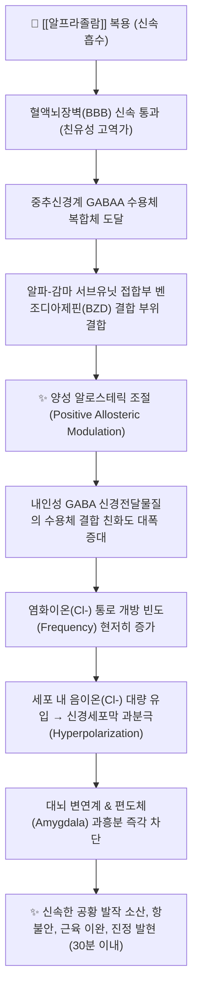

---
aliases:
  - Xanax
  - 자낙스
  - 자낙스정
  - Alprazolam
  - N05BA12
tags:
  - 약리/양방약
  - 정신신경계
  - 항불안제
  - 벤조디아제핀
  - 향정신성의약품
  - 공황장애치료제
---

# 💊 [[알프라졸람]] (Alprazolam, Xanax, N05BA12)

> **핵심 3줄 요약 (Key Summary)**:
> 🧪 주성분·제형: [[알프라졸람]] (Alprazolam), Triazolobenzodiazepine계 단기~중간형 고역가 벤조디아제핀(BZD), 타원형 정제(0.25mg 백색, 0.5mg 주황색, 1mg 연청색).
> 📍 작용 기전: GABAA 수용체 벤조디아제핀 결합 부위에 양성 알로스테릭 조절제(PAM)로 작용하여 염화이온 채널 개방 빈도를 높이고 신경세포막 과분극을 유도해 급속 진정·항불안 발현.
> 🎯 임상 적응증: 공황장애의 급성 발작 억제 및 유지 치료(Cross-National Panic Study), 불안장애 및 우울증에 수반하는 불안·긴장의 단기 대증요법.
> ⚠️ 주의사항: FDA 블랙박스 경고(오피오이드 병용 시 호흡마비 사망, 신체적 의존성 및 남용 위험, 급단 시 간질 발작), 자낙스 테이퍼링 시 장기형(디아제팜) 치환 및 한약 완충 필수.

---

## 📌 목차
1. [약물 기본 정보 및 시판 제품 (Brand Identification)](#1-약물-기본-정보-및-시판-제품-brand-identification)
2. [분자 약리 기전 및 작용 경로 (Mechanism of Action)](#2-분자-약리-기전-및-작용-경로-mechanism-of-action)
3. [약동학적 특성 (Pharmacokinetics: ADME)](#3-약동학적-특성-pharmacokinetics-adme)
4. [임상 용법·용량 및 처방 가이드 (Dosage & Administration)](#4-임상-용법용량-및-처방-가이드-dosage--administration)
5. [부작용, 경고 및 약물 상호작용 (Adverse Effects & Interactions)](#5-부작용-경고-및-약물-상호작용-adverse-effects--interactions)
6. [한의 치료 연계 및 병용/테이퍼링 프로토콜 (Integrative Medicine)](#6-한의-치료-연계-및-병용테이퍼링-프로토콜-integrative-medicine)
7. [💡 사용자 진료실 핵심 필기 & 실전 임상 체크리스트](#7--사용자-진료실-핵심-필기--실전-임상-체크리스트)
8. [출처 및 학술 참고 문헌 (References)](#8-출처-및-학술-참고-문헌-references)

---

## 1. 약물 기본 정보 및 시판 제품 (Brand Identification)

> [!abstract]+ 🧪 3D 약리 분자 구조 (Interactive 3D Viewer)
> <iframe src="https://molecule-viewer-rho.vercel.app/?cid=2118" width="100%" height="450px" frameborder="0" allow="webgl" style="border-radius: 8px;"></iframe>

![[알프라졸람_패키지.jpg|350]]
> [그림 1] [[알프라졸람]]의 대표적인 시판 완제의약품 패키지 외형

![[알프라졸람_알약_블리스터.jpg|350]]
> [그림 2] 알프라졸람 0.5mg 정제 성상 및 PTP 블리스터 포장

![[알프라졸람_화학구조.png|300]]
> [그림 3] [[알프라졸람]]의 2D 평면 화학 분자 구조식 (PubChem CID 2118)

![[알프라졸람_3D구조.jpg|300]]
> [그림 4] [[알프라졸람]]의 3차원 분자 공간 채움 모델

| 항목 | 상세 정보 |
| :--- | :--- |
| **일반명 (Generic Name)** | [[알프라졸람]] / Alprazolam |
| **대표 상품명 (Brand Names)** | **자낙스정 (Xanax, 화이자 오리지널), 자나팜정, 알프람정, 아졸락정 등** |
| **ATC 코드 / 분류** | N05BA12 (Benzodiazepine derivatives) / 식약처 분류 117 (정신신경용제 - 향정신성의약품) |
| **PubChem CID** | [2118](https://pubchem.ncbi.nlm.nih.gov/compound/2118) |
| **화학식 / 분자량** | C17H13ClN4 / 308.8 g/mol |
| **주요 제형 및 함량** | 경구용 정제 (0.25mg 백색, 0.5mg 주황색, 1.0mg 연청색), 서방정(XR) |
| **식약처 허가 적응증** | 1. 불안장애의 치료 및 불안증상의 단기완화<br>2. 우울증에 수반하는 불안<br>3. 광장공포증을 수반하거나 수반하지 않는 공황장애 |

### 1.1 대표 시판 제품 및 함유 복합제 매핑 (Brand Identification & Combinations)

| 구분 | 대표 제품명 / 브랜드 | 함유 성분 및 1회당 함량 | 제형 및 특징 | 주요 적응증 및 복약 지도 핵심 |
| :--- | :--- | :--- | :--- | :--- |
| **오리지널 단일제 (저용량)** | [[자낙스]] 0.25mg | [[알프라졸람]] 단일 (0.25mg) | 백색 타원형 분할정 | 불안 초기 시작 용량 및 고령자 투여, 테이퍼링 단위 |
| **오리지널 단일제 (표준)** | [[자낙스]] 0.5mg | [[알프라졸람]] 단일 (0.5mg) | 주황색 타원형 분할정 | 공황장애 및 불안장애 상용 처방, 졸림·어지럼 주의 |
| **오리지널 단일제 (고용량)** | [[자낙스]] 1.0mg | [[알프라졸람]] 단일 (1.0mg) | 청색 타원형 분할정 | 중증 공황장애 유지, 내성 및 신체적 의존성 주의 |
| **서방형 제제** | [[자낙스XR]] | [[알프라졸람]] 단일 (0.5mg/1mg) | 서방정 | 혈중 농도 변동을 줄여 1일 1회 복용, 씹거나 부수지 말 것 |

---

## 2. 분자 약리 기전 및 작용 경로 (Mechanism of Action)



* **GABA-A 수용체의 양성 알로스테릭 조절 기전 (PAM MoA)**:
  * 뇌의 주요 억제성 신경전달물질인 GABA의 수용체인 **$\text{GABA}_A$ 수용체** 복합체에 작용합니다.
  * 수용체의 $\alpha$ 서브유닛($\alpha_1, \alpha_2, \alpha_3, \alpha_5$)과 $\gamma_2$ 서브유닛 사이의 접합 부위에 위치한 고유의 벤조디아제핀 결합 부위에 부착합니다.
  * 직접 통로를 여는 것이 아니라, GABA가 수용체에 결합할 때 이온 통로가 열리는 **개방 빈도(Opening Frequency)**를 현저히 증가시키는 **양성 알로스테릭 조절제(PAM)**로 작용합니다.
* **신경세포막 과분극과 중추 억제**:
  * 염화이온($\text{Cl}^-$)이 세포 내로 다량 유입되면서 신경세포의 막전위가 더욱 음(Negative)의 전하를 띠게 되는 **과분극(Hyperpolarization)**이 일어납니다.
  * 흥분성 탈분극 신호 전달이 원천 차단되어 공포와 불안을 관장하는 대뇌 편도체(Amygdala), 변연계, 청반핵(Locus coeruleus)의 신경세포 발화가 즉시 억제됩니다.
* **고역가 트리아졸로(Triazolo) 골격의 특이점**:
  * 기존 디아제팜(Valium) 계열 구조에 트리아졸(Triazole) 고리가 융합되어 있어, 벤조디아제핀 수용체에 대한 결합 친화도가 극히 높습니다(High potency).
  * 복용 후 **15~30분 이내에 작용이 나타나** 급성 공황 발작을 즉각 진정시키는 독보적인 임상 효능을 보입니다.

---

## 3. 약동학적 특성 (Pharmacokinetics: ADME)

| 약동학 파라미터 | 수치 및 임상적 의미 |
| :--- | :--- |
| **생체이용률 (Bioavailability, F)** | 80~90% (경구 투여 시 위장관에서 신속하고 완전하게 흡수) |
| **최고혈중농도 도달시간 (Tmax)** | **1~2시간** (급성 불안 및 공황 증상을 신속하게 억제하는 근거) |
| **혈장 단백결합률 (Protein Binding)** | 약 80% (주로 혈청 알부민에 결합) |
| **간 대사 효소 (Metabolism)** | 주로 간 마이크로솜 **CYP3A4**에 의해 산화 대사 (4-hydroxyalprazolam, α-hydroxyalprazolam 생성) |
| **배설 반감기 (Elimination t1/2)** | **평균 11.2시간** (범위: 6.3~26.9시간, 중간 작용형 BZD, 고령자/간장애 시 연장) |
| **주요 배설 경로 (Excretion)** | 소변 배설 약 80% (대부분 글루쿠론산 포합 대사체), 대변 배설 약 7% |

---

## 4. 임상 용법·용량 및 처방 가이드 (Dosage & Administration)

| 임상 적응증 | 성인 표준 용법·용량 | 1일 최대 한도 용량 | 임상 복약 지도 핵심 |
| :--- | :--- | :--- | :--- |
| **불안장애 / 우울 수반 불안** | 1회 0.25~0.5mg, 1일 3회 시작<br>(반응에 따라 3~4일 간격으로 증량) | 최대 4mg/day | 가능한 최단기간(2~4주 이내) 투여, 임의 증량 엄금 |
| **공황장애 (Panic Disorder)** | 1회 0.5mg 1일 3회 시작<br>(필요 시 1일 1mg씩 점진적 증량) | 최대 10mg/day | 급성 공황 발작 완화 후 SSRI 병용하며 조기 감량 계획 수립 |
| **고령자 / 간장애 / 쇠약 환자** | 1회 0.25mg 1일 2~3회 저용량 시작 | 감량 적정 | 운동실조(Ataxia) 및 낙상으로 인한 대퇴골 골절 주의 |

### 4.1 진료과별 다빈도 처방 패턴 (Sweet Spot vs 금기)
* **[✅ 최적 적응증 (Sweet Spot)]**:
  * **응급실/외래 내원 급성 공황 발작 환자**: 복용 후 30분 이내 극심한 질식감, 심계항진, 죽을 것 같은 공포를 신속히 종결.
  * **SSRI 투여 초기(1~2주) 브릿지(Bridge) 치료**: 항우울제가 본격적인 효과를 내기 전 불안 악화를 일시적으로 완충.
* **[⚠️ 신중 투여 및 금기 (Caution / Contraindication)]**:
  * **약물 남용 및 알코올 중독 병력자**: 신체적·정신적 의존성 형성 위험이 극도로 높아 원칙적 금기.
  * **중증 근무력증(Myasthenia gravis) 환자**: 근이완 작용으로 호흡근 마비 위험.
  * **급성 폐쇄각 녹내장 환자**: 항콜린성 안압 상승 유발 가능.
  * **수면무호흡증 및 중증 만성 폐쇄성 폐질환(COPD)**: 중추성 호흡 억제 위험.

---

## 5. 부작용, 경고 및 약물 상호작용 (Adverse Effects & Interactions)

### 5.1 주요 부작용 및 독성 경고 (Black Box Warnings)

```
[🚨 FDA 블랙박스 경고 1: 마약성 진통제(오피오이드)와의 병용 위험]
• 알프라졸람을 포함한 벤조디아제핀계를 오피오이드계 약물과 병용할 경우 심각한 진정, 호흡 억제, 혼수 및 사망 초래.
• 대체 치료가 불가능한 경우에 한해 최저 유효 용량 및 최단기간으로 병용을 제한해야 함.

[🚨 FDA 블랙박스 경고 2: 남용, 오용 및 의존성 (Abuse, Misuse, and Addiction)]
• 장기간 투약 시 신체적·정신적 의존성이 빠르게 형성되며, 오남용으로 인한 과다복용 및 사망 위험 증가.

[🚨 FDA 블랙박스 경고 3: 급단 시 금단 증상 및 간질 발작 (Withdrawal & Seizures)]
• 알프라졸람 복용을 갑자기 중단하거나 용량을 급격히 줄일 경우 반동성 불안, 진전, 환각, 섬망 및 치명적인 전신 경련(간질 발작) 유발.
• 반드시 수 주~수 개월에 걸쳐 극도로 서서히 감량(테이퍼링)해야 함.
```

* **주요 부작용**:
  * 졸림(진정), 어지러움, 집중력 저하, 운동실조(비틀거림), 선행성 건망증(복용 후 일어난 일을 기억하지 못함).
  * 기이성 반응(Paradoxical reaction): 드물게 고령자나 소아에서 오히려 흥분, 공격성, 탈억제 행동 발현.
* **특이 해독제 (Reversal Agent)**:
  * **플루마제닐 (Flumazenil, 상품명 아넥세이트)**: 벤조디아제핀 수용체 경쟁적 길항제로, 급성 과다복용 시 정맥 투여하여 중추 신경 및 호흡 억제를 신속 역전. (단, 만성 복용자에게 투여 시 급성 금단 발작 유발 위험이 있으므로 주의).

### 5.2 주요 병용 금기 및 상호작용

| 병용 약물 / 성분군 | 상호작용 기전 | 임상적 결과 및 대처 방안 |
| :--- | :--- | :--- |
| **강력한 CYP3A4 억제제** | [[케토코나졸]], [[이트라코나졸]] | 알프라졸람 간 대사를 완전히 차단 $\rightarrow$ **혈중 농도 급상승 및 치명적 혼수 위험으로 병용 절대 금기** |
| **중등도 CYP3A4 억제제** | [[클라리스로마이신]], [[에리스로마이신]], 자몽주스 | 알프라졸람 대사 지연 $\rightarrow$ 과도한 진정 및 호흡 억제 (용량 50% 이상 감량) |
| **알코올 (술)** | GABAA 수용체 염화이온 유입 상승작용 중복 | 중추신경계 및 호흡중추 마비 $\rightarrow$ **급사(사망) 위험으로 음주 절대 금기** |
| **오피오이드 진통제** | [[트라마돌]], [[코데인]], 모르핀 | 중추 호흡 억제 시너지 $\rightarrow$ 혼수 및 호흡 정지 위험 급증 |

---

## 6. 한의 치료 연계 및 병용/테이퍼링 프로토콜 (Integrative Medicine)

### 6.1 한의학적 병전(病轉) 변증 및 시너지 배오
* **심담허겁(心膽虛怯)형 공황·불안장애**:
  * 사소한 일에도 심장이 덜컥 내려앉고 잘 놀람, 가슴 두근거림, 불안, 다몽, 설담태백(舌淡苔白), 맥현세(脈弦細).
  * **추천 처방**: [[온담탕]], [[가미온담탕]], [[복령보심탕]].
  * **배오 원리**: [[반하]], [[진피]], [[지실]], [[죽여]], [[원지]], [[석창포]]가 담음(痰飮)을 제거하고 심담(心膽)의 기운을 보하여 자율신경계 과민도를 낮춤.
* **간화요심(肝火擾心) & 화병(火病)형 급성 불안**:
  * 가슴 속 열감, 분노, 얼굴 붉어짐, 두통, 입마름, 변비.
  * **추천 처방**: [[시호가용골모려탕]], [[황련해독탕]].
  * **배오 원리**: [[시호]], [[황금]], [[황련]], [[용골]], [[모려]]가 중추의 흥분성 열을 식히고 뇌파 안정을 유도.
* **허번불면(虛煩不眠)**:
  * 가슴이 답답하여 잠을 이루지 못하고 식은땀이 남.
  * **추천 처방**: [[산조인탕]].

### 6.2 침구 치료 연계 (중추 억제 및 이완)
* **주요 치료 혈위**: 신문(神門), 내관(內關), 백회(百會), 심수(心兪), 간수(肝兪), 태충(太衝).
* **임상 효과**: 신문·내관 혈위 자침은 부교감신경을 활성화하고 심박변이도(HRV)를 개선하여, 알프라졸람 없이도 신체 긴장과 두근거림을 진정시키는 자생적 이완 반응 유도.

### 6.3 💡 자낙스 테이퍼링(감량) 임상 프로토콜 (Ashton Manual 기반)
* **알프라졸람 단독 감량의 한계**:
  * 반감기가 약 11시간으로 짧아 약효가 떨어질 때마다 투약 간격 사이 반동 불안(Inter-dose withdrawal)이 극심하여 단독 감량이 매우 어렵습니다.
* **장기형 벤조디아제핀 치환 감량법**:
  1. **치환 단계**: 알프라졸람을 반감기가 20~100시간으로 긴 **디아제팜(Diazepam)**으로 등가 치환합니다. (알프라졸람 0.5mg $\approx$ 디아제팜 10mg).
  2. **미세 감량 단계**: 1~2주 간격으로 디아제팜을 1~2mg씩 서서히 줄여나갑니다.
  3. **한약 완충 요법**: 약물을 줄이는 과정에서 치솟는 반동 불안과 불면을 [[가미온담탕]] 또는 [[산조인탕]]을 투약하여 신경 수용체를 완충합니다.

---

## 7. 💡 사용자 진료실 핵심 필기 & 실전 임상 체크리스트

### 7.1 진료실 3대 핵심 문진 체크리스트
1. **"자낙스를 드신 지 몇 주/몇 달 되셨고, 하루에 몇 알을 드시나요?"**:
   * 복용 기간이 4주 이상인 환자는 이미 신체적 의존성이 형성되었을 가능성이 높으므로 자의적 중단을 엄격히 금지하고 테이퍼링 계획 수립.
2. **"낮에 걸을 때 비틀거리거나 어지러워서 넘어질 뻔한 적이 있으신가요?"**:
   * 고령자에게 알프라졸람은 낙상과 고관절 골절의 주범이므로 보행 상태 및 기립성 어지럼을 필수 확인.
3. **"약 드시면서 맥주나 막걸리 등 술을 한 모금이라도 드시진 않나요?"**:
   * 알코올과 자낙스 병용은 호흡 마비 급사를 유발할 수 있으므로 금주를 단호하게 지도.

### 7.2 환자 티칭 스크립트
> *"환자분, 복용 중이신 자낙스(알프라졸람)는 극심한 불안이나 공황 발작이 올 때 뇌를 즉각 진정시켜 주는 매우 강력하고 고마운 응급약입니다. 하지만 이 약은 장기간 매일 드시게 되면 몸에서 약에 대한 내성과 의존성이 생겨, 나중에는 약이 없으면 더 큰 불안과 떨림이 찾아오게 됩니다. 특히 증상이 조금 가라앉았다고 해서 환자분 마음대로 내일부터 약을 딱 끊어버리시면 몸에서 심한 반동 발작이나 극심한 공포가 올 수 있어 매우 위험합니다. 저희 한의원의 침 치료와 온담탕 한약으로 심장과 신경의 자생력을 키우면서, 양약은 계단을 하나씩 내려오듯이 의사 선생님과 상의하여 아주 서서히 안전하게 줄여나가셔야 합니다."*

---

## 8. 출처 및 학술 참고 문헌 (References)

1. **식품의약품안전처 (MFDS)**. *의약품 품목허가사항 및 마약류 안전관리 정보: 알프라졸람 단일제 (자낙스정)*.
   - [의약품안전나라 품목정보](https://nedrug.mfds.go.kr)
   - `[연구 요약]` 알프라졸람의 불안장애 및 공황장애 허가 적응증, 오피오이드 병용 시 호흡마비 블랙박스 경고, 의존성 위험 및 마약류 관리 기준 공식 라벨.
2. **Ballenger, J. C. et al. (1988)**. *Alprazolam in panic disorder and agoraphobia: results from a multicenter trial. I. Efficacy in short-term treatment*. **Archives of General Psychiatry**, 45(5), 413-422.
   - [PubMed (PMID: 3282478)](https://pubmed.ncbi.nlm.nih.gov/3282478/) | [DOI](https://doi.org/10.1001/archpsyc.1988.01800290027004)
   - `[연구 요약]` 국제 다기관 공황장애 연구(526명): 알프라졸람 투여군은 위약 대비 투약 1주째부터 공황 발작 빈도를 급격히 감소시켰으며, 환자의 82%에서 중등도 이상의 우수한 불안 개선을 보여 공황장애 1차 치료제로서의 임상적 유효성을 확립.
3. **Ashton, H. (2005)**. *The diagnosis and management of benzodiazepine dependence*. **Current Opinion in Psychiatry**, 18(3), 249-255.
   - [PubMed (PMID: 16639148)](https://pubmed.ncbi.nlm.nih.gov/16639148/) | [DOI](https://doi.org/10.1097/01.yco.0000165594.60434.84)
   - `[연구 요약]` 벤조디아제핀 장기 복용 환자의 의존성 기전을 분석하고, 반감기가 짧은 고역가 BZD(알프라졸람 등)를 장기 작용형 디아제팜으로 전환한 뒤 1~2주 간격으로 점진 감량하는 전 세계 표준 테이퍼링(Ashton Manual) 프로토콜 제시.
4. **Brogden, R. N. & Goa, K. L. (1988)**. *Flumazenil. A preliminary review of its benzodiazepine antagonist properties, intrinsic activity and therapeutic use*. **Drugs**, 35(4), 448-467.
   - [PubMed (PMID: 2839329)](https://pubmed.ncbi.nlm.nih.gov/2839329/) | [DOI](https://doi.org/10.2165/00003495-198835040-00004)
   - `[연구 요약]` 벤조디아제핀 수용체 특이 길항제 플루마제닐의 약동학 및 작용 기전 총람: BZD 과다복용 및 진정 상태를 신속하게 가역적으로 역전시키는 표준 응급 해독제로서의 임상 지침 확립.
