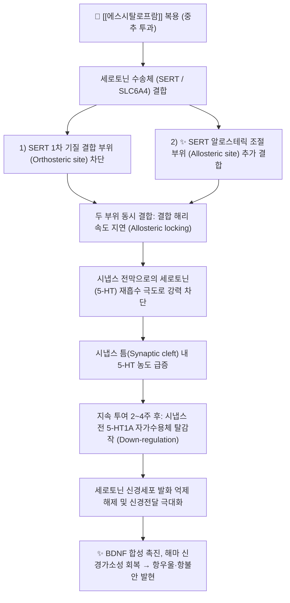

---
aliases:
  - Lexapro
  - 렉사프로
  - 렉사프로정
  - 수산화에스시탈로프람
  - Escitalopram
  - Cipralex
  - N06AB10
tags:
  - 약리/양방약
  - 정신신경계
  - 항우울제
  - SSRI
  - ASRI
  - 항불안제
---

# 💊 [[에스시탈로프람]] (Escitalopram Oxalate, Lexapro, N06AB10)

> **핵심 3줄 요약 (Key Summary)**:
> 🧪 주성분·제형: [[수산화에스시탈로프람]] (Escitalopram oxalate), 라세미체 시탈로프람의 순수 활성 S-거울상이성질체, 백색 타원형 필름코팅정(5mg, 10mg, 20mg).
> 📍 작용 기전: 세로토닌 수송체(SERT)의 1차 결합 부위와 알로스테릭 부위에 동시 결합(ASRI)하여 세로토닌 재흡수를 극도로 선택적 차단, 시냅스 세로토닌 신호 증폭.
> 🎯 임상 적응증: 주요 우울장애(MDD) 1차 치료(Lancet 21개 항우울제 비교 메타분석 최상위 효능·수용도), 공황장애, 범불안장애(GAD), 사회불안장애, 강박장애.
> ⚠️ 주의사항: FDA 블랙박스 경고(소아·청소년 자살 충동 주의), MAO 억제제 병용 시 세로토닌 증후군 위험, 갑작스러운 중단 시 뇌 감전감 등 금단증상(테이퍼링 필수).

---

## 📌 목차
1. [약물 기본 정보 및 시판 제품 (Brand Identification)](#1-약물-기본-정보-및-시판-제품-brand-identification)
2. [분자 약리 기전 및 작용 경로 (Mechanism of Action)](#2-분자-약리-기전-및-작용-경로-mechanism-of-action)
3. [약동학적 특성 (Pharmacokinetics: ADME)](#3-약동학적-특성-pharmacokinetics-adme)
4. [임상 용법·용량 및 처방 가이드 (Dosage & Administration)](#4-임상-용법용량-및-처방-가이드-dosage--administration)
5. [부작용, 경고 및 약물 상호작용 (Adverse Effects & Interactions)](#5-부작용-경고-및-약물-상호작용-adverse-effects--interactions)
6. [한의 치료 연계 및 병용/테이퍼링 프로토콜 (Integrative Medicine)](#6-한의-치료-연계-및-병용테이퍼링-프로토콜-integrative-medicine)
7. [💡 사용자 진료실 핵심 필기 & 실전 임상 체크리스트](#7--사용자-진료실-핵심-필기--실전-임상-체크리스트)
8. [출처 및 학술 참고 문헌 (References)](#8-출처-및-학술-참고-문헌-references)

---

## 1. 약물 기본 정보 및 시판 제품 (Brand Identification)

> [!abstract]+ 🧪 3D 약리 분자 구조 (Interactive 3D Viewer)
> <iframe src="https://molecule-viewer-rho.vercel.app/?cid=146570" width="100%" height="450px" frameborder="0" allow="webgl" style="border-radius: 8px;"></iframe>

![[에스시탈로프람_패키지.jpg|350]]
> [그림 1] [[에스시탈로프람]]의 대표적인 시판 완제의약품 패키지 외형

![[에스시탈로프람_알약_블리스터.jpg|350]]
> [그림 2] 에스시탈로프람 정제 성상 및 PTP 블리스터 포장

![[에스시탈로프람_화학구조.png|300]]
> [그림 3] [[에스시탈로프람]]의 2D 평면 화학 분자 구조식 (PubChem CID 146570)

![[에스시탈로프람_3D구조.png|300]]
> [그림 4] [[에스시탈로프람]]의 3차원 볼앤스틱(Ball-and-stick) 분자 모델

| 항목 | 상세 정보 |
| :--- | :--- |
| **일반명 (Generic Name)** | [[에스시탈로프람]] (수산화에스시탈로프람) / Escitalopram oxalate |
| **대표 상품명 (Brand Names)** | **렉사프로정 (Lexapro / Cipralex, 룬드벡 오리지널), 산도스에스시탈로프람, 엑스프람정 등** |
| **ATC 코드 / 분류** | N06AB10 (Selective serotonin reuptake inhibitors) / 식약처 분류 117 (정신신경용제) |
| **PubChem CID** | [146570](https://pubchem.ncbi.nlm.nih.gov/compound/146570) (옥살산염: [9801648](https://pubchem.ncbi.nlm.nih.gov/compound/9801648)) |
| **화학식 / 분자량** | C20H21FN2O (옥살산염: C22H23FN2O5) / 324.4 g/mol (옥살산염: 414.4 g/mol) |
| **주요 제형 및 함량** | 경구용 필름코팅정 (5mg, 10mg, 20mg), 경구용 시럽제 |
| **식약처 허가 적응증** | 1. 주요 우울장애(MDD)의 치료<br>2. 광장공포증을 수반하거나 수반하지 않는 공황장애의 치료<br>3. 사회불안장애(사회공포증)의 치료<br>4. 범불안장애(GAD)의 치료<br>5. 강박장애(OCD)의 치료 |

### 1.1 대표 시판 제품 및 함유 복합제 매핑 (Brand Identification & Combinations)

| 구분 | 대표 제품명 / 브랜드 | 함유 성분 및 1회당 함량 | 제형 및 특징 | 주요 적응증 및 복약 지도 핵심 |
| :--- | :--- | :--- | :--- | :--- |
| **오리지널 단일제 (표준)** | [[렉사프로]] 10mg | [[수산화에스시탈로프람]] 단일 (10mg) | 백색 타원형 분할정 | 우울증·불안장애 표준 유지 용량, 최소 6개월 이상 유지 |
| **오리지널 단일제 (저용량)** | [[렉사프로]] 5mg | [[수산화에스시탈로프람]] 단일 (5mg) | 백색 원형 정제 | 공황장애 초기 시작 용량(불안 반동 예방) 및 테이퍼링 |
| **오리지널 단일제 (고용량)** | [[렉사프로]] 20mg | [[수산화에스시탈로프람]] 단일 (20mg) | 백색 타원형 정제 | 난치성 강박장애 및 중증 우울증, QT 연장 모니터링 |
| **국내 제네릭 단일제** | 산도스에스시탈로프람, 엑스프람 | [[수산화에스시탈로프람]] 단일 | 필름코팅정 | 오리지널 동등 생물학적 동등성 확보 제네릭 제제 |

---

## 2. 분자 약리 기전 및 작용 경로 (Mechanism of Action)



* **순수 S-거울상이성질체의 알로스테릭 결합 특성 (ASRI MoA)**:
  * 라세미체 시탈로프람(Citalopram)에서 약효를 방해하는 R-이성질체를 제거하고 순수 항우울 활성을 지닌 **S-거울상이성질체**만을 분리 정제한 약물입니다.
  * 세로토닌 수송체(SERT)의 1차 활성 부위(Orthosteric site)뿐만 아니라 구조적 **알로스테릭 조절 부위(Allosteric site)**에도 결합합니다.
  * 알로스테릭 부위에 결합함으로써 1차 부위의 해리(Dissociation) 속도를 현저히 늦추어 SERT를 강력하게 잠그는(Locking) 효과를 발휘하여, 단일 결합 약물보다 훨씬 강력하고 지속적인 세로토닌 재흡수 억제능을 나타냅니다.
* **현존 SSRI 중 최고의 SERT 선택성 (High Selectivity)**:
  * 도파민 수송체(DAT)나 노르에피네프린 수송체(NET) 대비 SERT에 대한 선택성이 **1,000배 이상** 높습니다.
  * 구형 삼환계 항우울제(TCA)와 달리 아세틸콜린 무스카린 수용체, 히스타민 H1 수용체, 알파1 아드레날린 수용체에 대한 차단 작용이 거의 없습니다.
  * 따라서 구갈, 변비, 시야 흐림, 기립성 저혈압, 과도한 진정(졸림), 체중 증가 등의 항콜린성 부작용 빈도가 가장 적습니다.
* **자가수용체 탈감작과 신경가소성 회복 (2~4주 지연 발현 기전)**:
  * 복용 초기에는 시냅스 전막의 5-HT1A 자가수용체가 자극되어 음성 피드백(Negative feedback)으로 세로토닌 방출이 일시적으로 억제됩니다.
  * 약물을 2~4주간 지속 복용하면 5-HT1A 자가수용체가 하향 조절(Down-regulation) 및 탈감작되어 세로토닌 신경망의 발화가 정상화되고 세로토닌 방출이 급증합니다.
  * 하류 신호전달을 통해 뇌유래신경영양인자(BDNF) 생성을 유도하고 스트레스로 위축된 해마 신경세포의 수상돌기 가소성을 회복시킴으로써 지속적인 기분 개선 및 인지 기능 회복을 유도합니다.

---

## 3. 약동학적 특성 (Pharmacokinetics: ADME)

| 약동학 파라미터 | 수치 및 임상적 의미 |
| :--- | :--- |
| **생체이용률 (Bioavailability, F)** | 약 80% (식사 여부와 관계없이 소화관에서 우수하게 흡수) |
| **최고혈중농도 도달시간 (Tmax)** | 4~5시간 (정상 성인 기준, 다회 투여 시 1주 내 정상상태 도달) |
| **혈장 단백결합률 (Protein Binding)** | 약 56% (단백결합률이 비교적 낮아 타 약물과의 단백 치환 상호작용 위험 적음) |
| **간 대사 효소 (Metabolism)** | 주로 **CYP2C19** 및 보조적으로 **CYP3A4, CYP2D6**에 의해 약한 대사체(S-DCT)로 대사 |
| **배설 반감기 (Elimination t1/2)** | 약 27~32시간 (1일 1회 복용으로 24시간 동안 안정된 혈중 농도 유지) |
| **주요 배설 경로 (Excretion)** | 간 대사 후 대사체 형태로 소변 배설 (미변화체 배설 약 8%), 분변 배설 |

---

## 4. 임상 용법·용량 및 처방 가이드 (Dosage & Administration)

| 임상 적응증 | 성인 표준 용법·용량 | 1일 최대 한도 용량 | 임상 복약 지도 핵심 |
| :--- | :--- | :--- | :--- |
| **주요 우울장애 (MDD)** | 1일 1회 10mg 아침 또는 저녁 식사 무관 복용<br>(반응에 따라 최소 1주 후 20mg으로 증량) | 최대 20mg/day | 효과 발현까지 2~4주 소요, 증상 호전 후에도 최소 6개월 유지 권고 |
| **공황장애 (Panic Disorder)** | 초기 1주간 1일 5mg 시작 $\rightarrow$ 이후 1일 10mg으로 증량 | 최대 20mg/day | **초기 불안 악화(Jitteriness) 방지 위해 5mg 저용량 시작 필수** |
| **범불안장애 (GAD) / 사회불안장애** | 1일 1회 10mg 경구 복용 | 최대 20mg/day | 만성적인 과도한 걱정과 신체 긴장 증상 완화 |
| **고령자 (65세 이상) / 간장애 환자** | 1일 1회 5mg으로 시작하여 10mg으로 유지 | 최대 10mg/day | 대사 지연 및 QTc 간격 연장 위험 예방 위해 10mg 초과 금기 |

### 4.1 진료과별 다빈도 처방 패턴 (Sweet Spot vs 금기)
* **[✅ 최적 적응증 (Sweet Spot)]**:
  * **불안이 동반된 우울증 및 공황장애**: 전 세계 21개 항우울제 네트워크 메타분석(Lancet 2018)에서 유효성과 환자 수용도(내약성) 모두 최상위 1위 그룹을 차지한 표준 약제.
  * **신체화 증상을 호소하는 만성 질환자**: 약물 상호작용이 적고 항콜린성 부작용이 없어 기저 질환이 많은 내과 환자에게 안전.
* **[⚠️ 신중 투여 및 금기 (Caution / Contraindication)]**:
  * **소아 및 24세 이하 젊은 성인**: 투약 초기 자살 사고 충동 모니터링 필수.
  * **선천성 긴 QT 증후군 환자 또는 QTc 연장 약물 병용자**: 심실성 부정맥 위험으로 투여 금기.
  * **양극성 장애(조울증) 환자**: 조증 전환(Manic switch) 위험이 있으므로 기분조절제 없이 단독 투약 금기.

---

## 5. 부작용, 경고 및 약물 상호작용 (Adverse Effects & Interactions)

### 5.1 주요 부작용 및 독성 경고 (Black Box Warnings)

```
[🚨 FDA 블랙박스 경고: 소아·청소년 및 젊은 성인의 자살 충동 및 행동 (Suicidality)]
• 24세 이하의 소아, 청소년 및 젊은 성인 주요 우울장애 환자에게 투여 초기(1~2개월) 및 용량 변경 시 자살 충동, 자해 행동, 초조, 적대감 발생 위험이 증가할 수 있음.
• 가족과 보호자에게 환자의 이상 행동 및 자살 징후를 면밀히 관찰하도록 철저히 복약 지도해야 함.
```

* **투여 초기 일시적 이상반응**:
  * **소화기계**: 오심, 구역, 소화불량(위장관 점막의 5-HT3 수용체 자극 때문, 1~2주 내 소실). 식후 복용으로 경감.
  * **신경계**: 초기 일시적 불안 증가(Jitteriness), 불면증 또는 주간 졸림.
* **성기능 장애 (Sexual Dysfunction)**:
  * 복용 환자의 30~50%에서 성욕 감퇴, 발기 부전, 사정 지연, 오르가즘 쾌감 소실 호소 (임의 중단의 흔한 원인).
* **치명적 이상반응 및 금단 증상**:
  * **세로토닌 증후군 (Serotonin Syndrome)**: 고열, 근육 강직, 간대성 경련, 자율신경계 불안정, 섬망.
  * **항우울제 중단 증후군 (Discontinuation Syndrome)**: 약물을 갑자기 끊을 경우 **뇌 감전감(Brain zaps, 찌릿함)**, 심한 어지러움, 감기 유사 증상, 불면, 공격성 유발 $\rightarrow$ 최소 4주 이상 점진적 감량 필수.

### 5.2 주요 병용 금기 및 상호작용

| 병용 약물 / 성분군 | 상호작용 기전 | 임상적 결과 및 대처 방안 |
| :--- | :--- | :--- |
| **MAO 억제제 (MAOI)** | [[모클로베미드]], 셀레길린, 리네졸리드 | 세로토닌 분해 억제 + 재흡수 차단 $\rightarrow$ 치명적 **세로토닌 증후군 유발로 병용 절대 금기** (최소 14일 세척 기간 필요) |
| **세로토닌성 진통제 / 생약** | [[트라마돌]], 덱스트로메토르판, [[세인트존스워트]] | 시냅스 세로토닌 농도 과잉 축적 $\rightarrow$ 세로토닌 독성 위험 급증으로 병용 회피 |
| **QT 간격 연장 약물** | [[아미오다론]], 피모짓, 퀴놀론계 항생제 | 심근 재분극 지연 중복 $\rightarrow$ **치명적 심실성 부정맥(Torsades de pointes) 위험**으로 병용 금기 |
| **CYP2C19 억제제** | [[오메프라졸]], 플루코나졸 | 에스시탈로프람의 간 대사 저해 $\rightarrow$ 혈중 농도 50% 이상 상승 및 부작용 증가 (용량 50% 감량) |
| **NSAIDs / 항혈소판제** | [[아스피린]], [[이부프로펜]], [[클로피도그렐]] | 혈소판 내 세로토닌 고갈로 혈소판 응집력 저하 $\rightarrow$ **상부 위장관 출혈 위험 3~4배 증가** |

---

## 6. 한의 치료 연계 및 병용/테이퍼링 프로토콜 (Integrative Medicine)

### 6.1 한의학적 병전(病轉) 변증 및 시너지 배오
* **간기울결(肝氣鬱結) & 화병(火病)형 우울·불안증**:
  * 가슴 답답함, 한숨, 옆구리 통증, 분노 억압, 두통, 상열감, 설홍태박(舌紅苔薄).
  * **추천 처방**: [[시호가용골모려탕]], [[가미소요산]], [[시호소간산]].
  * **배오 원리**: [[시호]], [[황금]], [[용골]], [[모려]]가 중추 자율신경계의 교감신경 흥분을 진정시키고, 간화(肝火)를 식혀 에스시탈로프람의 불안 완화 작용을 가속화.
* **심비양허(心脾兩虛)형 만성 피로성 우울증**:
  * 의욕 저하, 건망, 불면, 다몽, 식욕 부진, 안색 창백, 맥세약(脈細弱).
  * **추천 처방**: [[귀비탕]], [[가미귀비탕]].
  * **배오 원리**: [[인삼]], [[백출]], [[원지]], [[산조인]], [[당귀]]가 기혈을 크게 보하고 뇌 신경세포의 진액을 공급하여 항우울제 초기 무기력과 피로감을 보충.
* **담음울결 & 매핵기(梅核氣)**:
  * 목에 가래나 이물질이 걸린 듯 삼켜도 넘어가지 않고 뱉어도 나오지 않는 신체화 증상.
  * **추천 처방**: [[반하후박탕]].
  * **배오 포인트**: [[반하]], [[후박]], [[복령]], [[생강]], [[소엽]]이 인후부 평활근 긴장을 풀고 이물감을 신속히 해소.

### 6.2 침구 치료 연계 (HPA 축 조절)
* **주요 치료 혈위**: 백회(百會), 신문(神門), 사신총(四神聰), 내관(內關), 태충(太衝), 풍지(風池).
* **신경생물학적 기전**: 전침(Electroacupuncture) 자극은 시상하부-뇌하수체-부신(HPA) 축의 과항진을 정상화하고, 뇌내 세로토닌 및 엔돌핀 방출을 유도하여 에스시탈로프람 복용 초기의 항불안 효과를 조기 유도합니다.

### 6.3 양약 감량 및 한의 전환(테이퍼링) 가이드
* **절대 급단 금지 원칙**: 렉사프로를 갑자기 끊으면 환자는 머리에서 찌릿한 전기 충격(Brain zaps), 심한 어지러움, 불면, 공황 발작을 경험하고 약물에 더 강하게 의존하게 됩니다.
* **단계적 테이퍼링 임상 프로토콜**:
  1. **안정기 확보**: 주요 우울 증상이 소실되고 일상생활이 완전히 안정된 상태를 **최소 6개월~1년 이상 유지**한 후 테이퍼링을 시작합니다.
  2. **10~25% 미세 감량법**: 4~8주 간격으로 기존 용량의 10~25%씩 단계적으로 축소합니다 (예: 20mg $\rightarrow$ 15mg $\rightarrow$ 10mg $\rightarrow$ 5mg $\rightarrow$ 2.5mg $\rightarrow$ 격일 투여 후 중단).
  3. **한약 완충 요법**: 용량을 줄이는 단계마다 [[귀비탕]] 또는 [[가미소요산]]을 투약하여 자율신경계 불안정 증상을 방어합니다.

---

## 7. 💡 사용자 진료실 핵심 필기 & 실전 임상 체크리스트

### 7.1 진료실 3대 핵심 문진 체크리스트
1. **"약을 드신 지 얼마나 되셨고, 처음에 속 메스꺼움이나 불안이 심하진 않으셨나요?"**:
   * 복용 2주 이내의 환자는 약효가 아직 본격적으로 나타나지 않고 위장 장애나 졸림만 심한 시기이므로, 정상적인 적응 과정임을 설명하여 임의 중단을 방지.
2. **"약을 하루라도 깜빡 잊고 안 드시면 머리가 찌릿찌릿하거나 어지럽지 않으신가요?"**:
   * 중단 증후군(Brain zap)을 경험한 환자에게 약물 의존성에 대한 과도한 공포를 덜어주고, 반드시 서서히 줄여야 함을 주지.
3. **"가슴이 답답하고 목에 뭔가 걸린 느낌(매핵기), 자꾸 한숨이 나오는 증상이 있으신가요?"**:
   * 양방 항우울제만으로 풀리지 않는 신체화 증상(기울증)을 한의 침·한약 치료로 즉각 해소할 수 있는 핵심 접점 포착.

### 7.2 환자 티칭 스크립트
> *"환자분, 지금 드시는 렉사프로(에스시탈로프람)는 전 세계에서 가장 널리 처방되는 매우 안전하고 우수한 우울·불안 치료제입니다. 뇌 신경 사이의 행복 호르몬인 세로토닌을 흩어지지 않게 모아주는 역할을 합니다. 이 약은 감기약처럼 바로 효과가 나는 것이 아니라, 뇌 신경망이 회복되는 데 2주에서 4주 정도의 시간이 걸립니다. 초기에 약간 속이 울렁거릴 수 있지만 곧 좋아집니다. 가장 중요한 것은 증상이 조금 좋아졌다고 해서 내일부터 당장 약을 끊으시면 머리가 찌릿하거나 어지러운 금단 증상이 올 수 있다는 점입니다. 저희 한의원의 침 치료와 한약으로 몸의 뭉친 기운과 자율신경을 안정시키면서, 양약은 계단을 내려오듯 아주 천천히 줄여나가실 수 있도록 도와드리겠습니다."*

---

## 8. 출처 및 학술 참고 문헌 (References)

1. **식품의약품안전처 (MFDS)**. *의약품 품목허가사항 및 안전성 정보: 수산화에스시탈로프람 단일제 (렉사프로정)*.
   - [의약품안전나라 품목정보](https://nedrug.mfds.go.kr)
   - `[연구 요약]` 수산화에스시탈로프람의 주요 우울장애, 공황장애, 범불안장애 허가 적응증, 용법·용량, 소아·청소년 자살 충동 블랙박스 경고 및 MAO 억제제 병용 금기 공식 라벨.
2. **Cipriani, A. et al. (2018)**. *Comparative efficacy and acceptability of 21 antidepressant drugs for the acute treatment of adults with major depressive disorder: a systematic review and network meta-analysis*. **The Lancet**, 391(10128), 1357-1366.
   - [PubMed (PMID: 29477251)](https://pubmed.ncbi.nlm.nih.gov/29477251/) | [DOI](https://doi.org/10.1016/S0140-6736(17)32802-7)
   - `[연구 요약]` 522개 RCT(116,477명)를 분석한 랜드마크 네트워크 메타분석: 에스시탈로프람은 21개 주요 항우울제 중 가장 높은 반응률(효능)과 가장 낮은 중단율(수용도/내약성)을 동시에 기록하여 임상적 1차 선택 항우울제로서의 최고 등급 근거 확립.
3. **Burke, W. J. et al. (2002)**. *Fixed-dose trial of the single isomer SSRI escitalopram in depressed outpatients*. **Journal of Clinical Psychiatry**, 63(4), 331-336.
   - [PubMed (PMID: 12000207)](https://pubmed.ncbi.nlm.nih.gov/12000207/) | [DOI](https://doi.org/10.4088/jcp.v63n0410)
   - `[연구 요약]` 주요 우울장애 외래 환자(491명) 대상 이중맹검 3상 RCT: 에스시탈로프람 10mg 및 20mg 투여군은 위약 대비 투약 1주째부터 유의한 MADRS 우울 척도 개선을 나타내어 조기 약효 발현 및 우수한 안전성을 입증.
4. **Sanchez, C. et al. (2014)**. *A comparative review of escitalopram, paroxetine, and sertraline: Are they all alike?*. **International Clinical Psychopharmacology**, 29(4), 185-196.
   - [PubMed (PMID: 24424469)](https://pubmed.ncbi.nlm.nih.gov/24424469/) | [DOI](https://doi.org/10.1097/YIC.0000000000000023)
   - `[연구 요약]` 에스시탈로프람이 세로토닌 수송체(SERT)의 1차 기질 결합 부위 외에 알로스테릭 조절 부위에도 결합하는 고유의 ASRI 메커니즘을 규명하고, 타 SSRI(파록세틴, 설트랄린) 대비 월등한 선택성과 약물 상호작용 최소화 특성을 총괄 정리.
