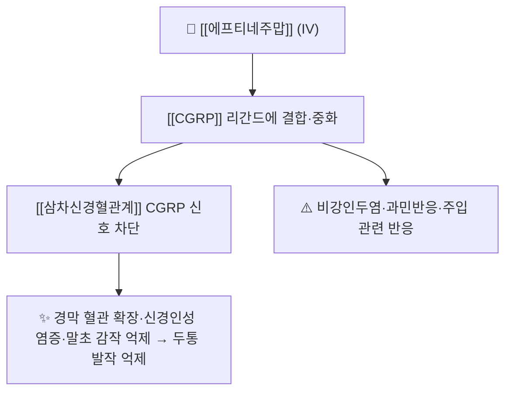

# 💊 [[에프티네주맙]] (Eptinezumab, Vyepti / 바이프티, ATC N02CD05)

> **핵심 3줄 요약 (Key Summary)**:
> 🧪 주성분·제형: [[CGRP]] 리간드에 결합하는 인체화 단일클론항체(ALD403, eptinezumab-jjmr). 정맥주입용 농축액 100 mg/mL(Vyepti). 저분자 화합물이 아니라 PubChem CID·2D 구조식이 없고, KEGG 기준 분자식은 C6352H9838N1694O1992S46(약 143 kDa)
> 📍 작용 기전: [[CGRP]] 리간드를 중화해 [[삼차신경혈관계]] 활성화·신경인성 염증·말초 감작을 차단한다. 반감기가 길어 12주(3개월) 1회 정맥주입으로 운용한다
> 🎯 임상 적응증: 성인 편두통 예방(100 mg IV 12주마다, 일부 환자 300 mg). 삽화성 [[군발두통]]에서는 1차 종료점이 음성이었고 50% 반응자 비율만 2~4주차 2차 지표에서 개선됐다
> ⚠️ 주의: 이상반응 발생률은 위약과 유사(비강인두염·과민반응 등). [[군발두통]]은 허가 적응 밖일 수 있어 국내 허가·급여 범위를 별도 확인한다

## 1. 약물 기본 정보 및 시판 제품 (Brand Identification)

> 🖼️ 이미지 미확보 — 단일클론항체(단백질)로 PubChem 2D 구조식 API가 제공되지 않아 분자구조식 이미지를 넣지 못했고, 국내 시판 패키지·블리스터 실사도 확보하지 못했다. 이미지 없이 표·문헌 정보로만 정리한다(파일명만 보고 다른 약 사진으로 채우지 않음).

| 항목 | 상세 정보 |
| :--- | :--- |
| 일반명 (Generic Name) | [[에프티네주맙]](한글) / Eptinezumab (USAN, eptinezumab-jjmr) |
| 대표 상품명 (Brand Names) | Vyepti(바이프티, Lundbeck) |
| ATC 코드 / 분류 | N02CD05 — N02C 항편두통제 / N02CD CGRP 길항제 |
| PubChem CID | 없음 — 단일클론항체(단백질)로 소분자 CID 미부여 |
| 화학식 / 분자량 | C6352H9838N1694O1992S46 / 약 143,193 Da (KEGG D11303) |
| 주요 제형 및 함량 | 정맥주입용 농축액 100 mg/mL (단회용 바이알) |
| 표적 | CALCA(CGRP) 리간드 — [[CGRP]] |
| 허가 적응증 | 성인 편두통의 예방 치료 (FDA 2020-02 승인, IV 12주 1회) |

### 1.1 계열 내 위치 (항-CGRP 단일클론항체 vs gepant)

| 구분 | 대표 약물 | 투여 | 특징 |
| :--- | :--- | :--- | :--- |
| 항-CGRP·수용체 단일클론항체(주사) | 에프티네주맙(리간드), erenumab(수용체), galcanezumab·fremanezumab(리간드) | 피하 또는 정맥 | 반감기가 길어 월 1회~분기 1회, 주사 부위·주입 반응 확인 |
| gepant(경구 소분자) | [[아토게판트]](예방), rimegepant(급성+예방), ubrogepant(급성) | 경구 | 경구 복용 편의, [[CYP3A4]] 상호작용 확인 필요 |

→ 계열 전체 개요는 [[CGRP 표적 약물]] 참조.

## 2. 분자 약리 기전 및 작용 경로 (Mechanism of Action)

- **주요 작용 기전**: [[CGRP]]는 삼차신경절 감각뉴런에서 유리되어 경막 혈관 확장·신경인성 염증·통각수용기 감작을 일으키는 핵심 매개체다. 에프티네주맙은 수용체가 아니라 CGRP 리간드 자체에 결합해 신호를 중화한다 → [[삼차신경혈관계]] · [[말초 감작]]
- 트립탄(5-HT1B/1D 작용)과 달리 혈관수축 작용이 없어 심혈관 위험 환자에서 대안적 위치를 갖는다
- 정맥주입 제형이라 최고 혈중농도가 빠르게 도달하는 것이 특징이며, 이 때문에 발작 빈도가 높은 삽화성 군발두통에서 시도됐다

## 3. 임상 근거 — 삽화성 군발두통 ALLEVIATE (위약대조 4주 단계)

| 항목 | 내용 |
| :--- | :--- |
| 연구 | JAMA Neurology 2025;82(7):706-714, 이중눈가림·위약대조 무작위 임상시험(1:1), 64개 기관, NCT04688775 |
| 대상 | 1년 이상 삽화성 [[군발두통]] 병력의 18~75세 성인 231명(에프티네주맙 118 vs 위약 113). 평균 44세, 남성 78%, 기저 주간 발작 15.2 vs 15.7회 |
| 중재 | 에프티네주맙 400 mg 정맥내 단회 주입(위약 동일 경로) |
| 1차 종료점 | 기저 대비 1~2주차 주간 발작 횟수 변화 −4.0 vs −4.6, 군간 차이 0.7(95% CI −1.3~2.6, P=.50) — 음성 |
| 2차(반응자) | 50% 이상 반응자 2주차 50.9% vs 37.3%(OR 1.77, 1.03~3.07, P=.04), 3주차 62.5% vs 43.8%(OR 2.26, P=.004), 4주차 66.7% vs 50.5%(OR 2.14, P=.009) |
| 안전성 | 치료유발 이상사건 25.0% vs 26.5% — 군간 차이 없음 |
| 출처 | [PubMed PMID: 40388178](https://pubmed.ncbi.nlm.nih.gov/40388178/) · DOI [10.1001/jamaneurol.2025.1317](https://doi.org/10.1001/jamaneurol.2025.1317) · PMC12090066 |

- **해석**: 1차 종료점이 음성이므로 [[군발두통]]의 1차 예방제로 올릴 근거는 아직 없다. 반응자 비율의 유의성은 다중 비교를 보정하지 않은 2차 종료점이라는 점도 감안한다
- 편두통 축에서는 별도 근거가 축적되어 있다(예방 적응 허가). 즉 이 약의 근거 중심은 편두통이고, 군발두통은 탐색적 위치다 → [[편두통]]

## 4. 용법·용량 및 처방 가이드 (Dosage & Administration)

| 임상 상황 | 표준 용법·용량 | 비고 |
| :--- | :--- | :--- |
| 편두통 예방(허가) | 100 mg 정맥주입, 12주(3개월)마다 | FDA 라벨 권장 용량 |
| 반응 불충분 시 | 300 mg 정맥주입, 12주마다 고려 | 일부 환자에서 이득 가능 |
| 투여 방식 | 100 mg/mL 농축액을 희석해 약 30분간 정맥 점적 | 주입 관련 반응 확인 |
| 삽화성 [[군발두통]] | 허가 적응 아님(연구 400 mg 단회) | 국내 허가·급여 범위 별도 확인 |

## 5. 부작용, 경고 및 약물 상호작용 (Adverse Effects & Interactions)

- **흔한 이상반응**: 비강인두염, 주입 부위·과민 관련 반응. 등록 시험에서 치료유발 이상사건은 위약과 유사했다
- **과민반응**: 단일클론항체 계열 공통으로 아나필락시스·혈관부종 보고가 있으므로 첫 주입 후 관찰하고, 이전 주입에서 과민반응이 있었던 환자는 재투여 전 판단한다
- **상호작용**: 단일클론항체는 간 CYP 대사 경로를 쓰지 않아 [[CYP3A4]] 매개 상호작용이 적다 — 경구 gepant 계열([[아토게판트]])과 대비되는 특성이다
- **임신·수유**: 개별 판단이 필요하며 전문과 상담을 원칙으로 한다. 중증 심혈관 질환 환자에서도 개별 평가를 한다

## 6. 한의 치료 연계 및 병용/테이퍼링 프로토콜 (Integrative Medicine)

- **기전적 상보성**: CGRP 표적 치료는 발작 기전을 직접 억제하고, 침·한약은 삼차신경혈관계·자율신경 조절·항염·수면 안정 기전으로 접근한다. 두 접근은 상충하지 않는다
- **진료실 전략**: 양방 표준 치료를 유지한 채, 발작기 사이의 이완·수면·자율신경 안정 목적으로 침·약침·한약을 병행한다. 태양(EX-HN5)·풍지(GB20)·두유(ST8)·합곡(LI4)·태충(LR3) 등을 환자 상태에 맞춰 조정한다
- **근거 고지**: [[군발두통]]에서 침의 근거는 편두통보다 훨씬 제한적이고, CGRP 항체와 침의 병용을 검증한 RCT도 없다. 근거 공백임을 환자에게 밝힌다 → [[전침]]
- **주의**: 베라파밀 등 군발두통 예방약과 병용 시 QT 연장·간효소 상호작용을 점검한다 → [[CYP3A4]]

## 7. 💡 사용자 진료실 핵심 필기 & 실전 임상 체크리스트

### 7.1 진료실 핵심 문진 체크리스트
1. **진단명 먼저 고정**: 일측 안와부 극심통 15~180분·동측 자율신경증상·초조가 있으면 [[군발두통]]을 의심하고 [[ICHD-3]] 기준으로 진단명을 정리한다. 전기충격양 수초 발작은 [[삼차신경통]], 4~72시간 지속·구역·빛공포는 [[편두통]]과 구분한다
2. **급성기 약의 위치 확인**: 급성기 1차는 100% 고유량 산소(12~15 L/min, 15~20분)와 수마트립탄 6 mg 피하주사다. 에프티네주맙은 이 자리를 대체하지 않는다
3. **비용·급여·접근성**: 정맥주입 약제라 국내에서는 적응·급여 범위가 좁고 비용 부담이 크다. 처방 전 허가·보험 조건을 확인한다

### 7.2 환자 티칭 스크립트
> *"편두통 예방에 쓰이는 정맥주사제(에프티네주맙)를 군발두통 환자분들에게 한 번 맞히고 4주간 관찰한 연구가 있었습니다. 아쉽게도 발작 횟수 자체를 통계적으로 유의하게 줄이지는 못했습니다(−4.0회 대 −4.6회). 다만 2~4주차에 발작이 절반 이하로 줄어든 분의 비율은 주사군이 더 높았고(4주차 67% 대 51%), 부작용은 위약과 비슷했습니다. 그래서 이 약은 아직 군발두통의 표준 1차 치료가 아니고, 급성기에는 고유량 산소와 수마트립탄이 우선입니다. 삽화기에는 술·담배를 끊고 잠을 규칙적으로 지키는 것이 재발 관리에 중요하며, 한방 치료는 발작 사이의 이완·수면 관리 목적으로 병행합니다."*

## 8. 출처 및 학술 참고 문헌 (References)

- Dodick DW, et al. Efficacy and Safety of Eptinezumab in Episodic Cluster Headache: A Randomized Clinical Trial. JAMA Neurol. 2025;82(7):706-714 (PMID 40388178 / DOI 10.1001/jamaneurol.2025.1317)
  - [연구 요약] 삽화성 군발두통 231명에서 에프티네주맙 400 mg IV 단회의 효능·안전성을 위약과 비교한 4주 이중눈가림 단계. 1차 종료점은 음성, 50% 반응자 비율은 2~4주차에 유의하게 높았다.
- FDA 허가사항 — VYEPTI (eptinezumab-jjmr) 처방정보 (https://www.accessdata.fda.gov/drugsatfda_docs/label/2020/761119s000lbl.pdf)
  - [연구 요약] 권장 용량(100 mg IV 12주마다, 일부 환자 300 mg), 제형·희석·주입 방법, 이상반응·경고 정보의 허가 원문.
- KEGG DRUG D11303 (Eptinezumab) — ATC N02CD05, 표적 CALCA(CGRP), 분자식 (https://rest.kegg.jp/get/dr:D11303)
  - [연구 요약] 약물 분류·표적 리간드·분자식(단백질 서열 기반) 정보.

## 함께 보기
- [[CGRP 표적 약물]] · [[CGRP]] · [[아토게판트]] · [[군발두통]] · [[편두통]] · [[삼차신경혈관계]] · [[말초 감작]] · [[ICHD-3]] · [[CYP3A4]]

<!-- 보관 태그(1회용·링크오류, 필요시 복원): eptinezumab, Vyepti, N02CD05, ALD403 -->
