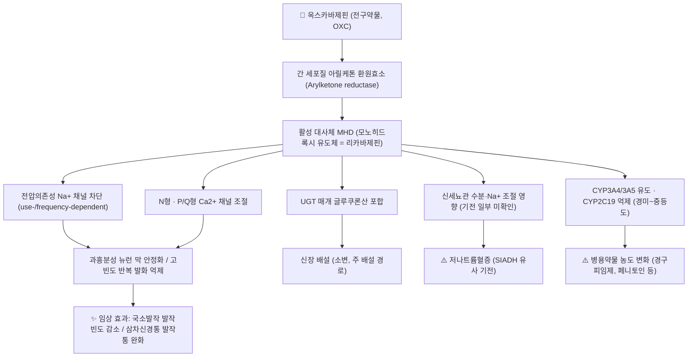

# 💊 [[옥스카바제핀]] (Oxcarbazepine, Trileptal, ATC N03AF02)

> **핵심 3줄 요약 (Key Summary)**:
> 🧪 주성분·제형: [[카르바마제핀]]의 10-케토 유사체(10-keto analogue)로, 그 자체는 항경련 활성이 약한 **전구약물(prodrug)** 이다. 국내에서는 트리렙탈정(150/300/600mg) 및 내복현탁액(60mg/mL), 그리고 옥스카바제핀 제네릭 정제로 시판되며, 함유 복합제는 허가되어 있지 않다.
> 📍 작용 기전: 경구 투여 후 간 세포질 아릴케톤 환원효소(arylketone reductase)에 의해 **활성 대사체 MHD(monohydroxy derivative, 리카바제핀)** 로 신속히 전환되고, MHD가 전압의존성 Na⁺ 채널을 사용·빈도 의존적으로(use-/frequency-dependent) 차단하여 과흥분성 뉴런의 반복 발화를 억제한다. N형·P/Q형 Ca²⁺ 채널 조절이 부가적으로 관여한다.
> 🎯 임상 적응증: 성인·소아(4세 이상) **국소발작(부분발작) 뇌전증의 단독요법 또는 부가요법**이 허가 적응증이다. **삼차신경통**에서는 카르바마제핀의 대안으로 널리 사용되지만 국내 허가 적응증 외(off-label) 사용이며, 무작위 대조 근거는 제한적이다.
> ⚠️ 주의사항: **저나트륨혈증**(약 25~30%, 용량 의존적, 고령자 위험), 어지럼·졸림·복시·운동실조, 발진 및 **SJS/TEN**(HLA-B*15:02 등 유전적 감수성), CYP3A4/3A5 유도와 CYP2C19 억제에 따른 병용약물 상호작용이 핵심이다.

---

## 1. 약물 기본 정보 및 시판 제품 (Brand Identification)

> [!abstract]+ 🧪 3D 약리 분자 구조 (Interactive 3D Viewer)
> <iframe src="https://molecule-viewer-rho.vercel.app/?cid=34312" width="100%" height="450px" frameborder="0" allow="webgl" style="border-radius: 8px;"></iframe>

| 항목 | 상세 정보 |
| :--- | :--- |
| **일반명 (Generic Name)** | [[옥스카바제핀]](한글) / Oxcarbazepine (English) |
| **대표 상품명 (Brand Names)** | **트리렙탈(Trileptal®)** — 오리지널 브랜드(국내 유통사는 허가 변동이 있을 수 있어 식약처 허가정보 확인 권장). 국내 제네릭은 **옥스카바제핀정** 명칭으로 다수 허가되어 있으며 제조사별 상품명이 상이하다(개별 상품명은 근거 미확인, 의약품안전나라에서 확인). |
| **ATC 코드 / 분류** | **N03AF02** (Antiepileptics / Carboxamide derivatives) / 식약처 분류 **117 항전간제** |
| **PubChem CID** | [34312](https://pubchem.ncbi.nlm.nih.gov/compound/34312) |
| **화학식 / 분자량** | C₁₅H₁₂N₂O₂ / 약 252.27 g/mol |
| **화학명** | 10-oxo-10,11-dihydro-5H-dibenz[b,f]azepine-5-carboxamide (카르바마제핀의 10-케토 유사체) |
| **주요 제형 및 함량** | 정제 150mg, 300mg, 600mg / 내복현탁액 60mg/mL (국내 시판 기준) |
| **식약처 허가 적응증** | 뇌전증(국소발작, 2차성 전신화를 동반한 부분발작)의 단독요법(성인) 또는 부가요법(성인 및 4세 이상 소아) |
| **처방 구분** | 전문의약품(ETC). 국내 OTC 일반약 제품 없음 |
| **관련·후속 성분** | [[에슬리카바제핀아세테이트]] (Eslicarbazepine acetate) — MHD의 S-거울상체(에스리카바제핀) 전구약물로 개발된 후속 세대 약물 / [[카르바마제핀]] — 화학적으로 가장 근접한 선행 약물 |

### 1.1 대표 시판 제품 및 함유 복합제 매핑 (Brand Identification & Combinations)

| 구분 | 대표 제품명 / 브랜드 | 함유 성분 및 1회당 함량 | 제형 및 특징 | 주요 적응증 및 복약 지도 핵심 |
| :--- | :--- | :--- | :--- | :--- |
| **단일 오리지널제 (ETC)** | **트리렙탈정**, 트리렙탈내복현탁액 6% | [[옥스카바제핀]] 단일 성분 (150/300/600mg, 60mg/mL) | 속방성 필름코팅정, 현탁액 | 뇌전증 국소발작 단독·부가요법. 삼차신경통에는 적응증 외 사용 |
| **단일 제네릭제 (ETC)** | 옥스카바제핀정 (제조사별 상품명 상이) | [[옥스카바제핀]] 150/300/600mg | 속방성 정제 | 오리지널과 동일 적응증. **성분명 기준으로 위키링크 통합 관리** |
| **복합제 (Combination)** | **해당 없음** | — | — | 국내외에 옥스카바제핀 함유 복합제는 허가되어 있지 않음 |
| **서방정 / 주사제** | **국내 허가 없음** | — | — | 서방성 제형은 일부 국가에서 검토되었으나 국내 허가 정보 기준 미출시(근거 미확인) |
| **감별 다빈도 인접약** | [[테그레톨]], [[에피렙틴]] | [[카르바마제핀]], [[발프로산나트륨]] | 정제, 시럽 | 동일 계열(카르바마제핀) **교차 과민반응 위험** 감별, 간효소 유도 강도 차이 비교 |

> **감별 포인트**: 옥스카바제핀은 카르바마제핀과 달리 **활성 에폭사이드 대사체(10,11-epoxide)를 만들지 않고 CYP450 자가유도(autoinduction)가 거의 없다.** 따라서 카르바마제핀에서 문제가 되던 간효소 유도성 상호작용과 일부 신경독성이 상대적으로 적다(Beydoun & Kutluay, 2002, PMID 11772334).

---

## 2. 분자 약리 기전 및 작용 경로 (Mechanism of Action)

* **주요 작용 기전 (Primary MoA)**:
  * 옥스카바제핀 원체의 항경련 활성은 **미미하며**, 임상 효과의 대부분은 간에서 세포질 **아릴케톤 환원효소**에 의해 생성되는 **활성 대사체 MHD(monohydroxy derivative, 10,11-dihydro-10-hydroxy-carbamazepine; 리카바제핀)** 에 의해 나타난다. 즉 옥스카바제핀은 **전구약물**이다(Jensen & Gram, 1991, PMID 1777069; Beydoun & Kutluay, 2002, PMID 11772334).
  * MHD는 신경세포 **전압의존성 Na⁺ 채널**의 불활성화 상태(inactivated state)에 결합하여 채널 회복(recovery from inactivation)을 지연시키고, 이로써 **고빈도 반복 발화(high-frequency repetitive firing)** 를 억제한다. 이 차단은 자극 빈도가 높을수록 강해지는 **사용·빈도 의존성** 특성을 보여, 정상 신경활동보다 발작성 과흥분 방전을 선택적으로 억제한다.
  * 부가적으로 **N형 및 P/Q형 전압의존성 Ca²⁺ 채널 조절**, K⁺ 전도 증가, 흥분성 신경전달물질(글루타메이트) 방출 억제가 관여하는 것으로 보고된다(Beydoun & Kutluay, 2002). 세부 분자 기여도는 실험 조건별 차이가 있어 단일 기전으로 단정하기 어렵다.
  * **카르바마제핀과의 기전 차이**: 카르바마제핀은 L형 Ca²⁺ 채널 및 아데노신 수용체에 대한 작용이 상대적으로 크고 심장 전도 및 진정 작용과 연관되는 반면, 옥스카바제핀(MHD)은 이러한 작용이 약하다. 또한 카르바마제핀의 독성 대사체인 10,11-epoxide를 생성하지 않는다.
* **하류 신호전달 및 생화학적 반응**:
  * Na⁺ 유입 감소 → 신경세포 탈분극 지연 및 과분극 안정화 → 발작 방전의 전파(spread)와 확장(generalization) 억제.
  * 삼차신경통에서는 삼차신경근 진입부의 탈수초 병소에서 발생하는 이소성(ectopic) 고빈도 발화를 동일한 Na⁺ 채널 기전으로 억제하는 것으로 설명된다(Lambru & Zakrzewska, 2021, PMID 34108244; Ashina & Robertson, 2024, PMID 38816415).

---

## 3. 약동학적 특성 (Pharmacokinetics: ADME)

| 약동학 파라미터 | 수치 및 임상적 의미 |
| :--- | :--- |
| **생체이용률 (Bioavailability, F)** | 경구 흡수 양호(문헌 기준 약 95% 이상 수준으로 보고). 음식 섭취가 흡수 정도에 미치는 영향은 크지 않으나, 개별 제품 허가사항 확인이 필요하다. |
| **최고혈중농도 도달시간 (Tmax)** | 원체 옥스카바제핀은 흡수 후 수 시간 내 급속히 환원되며, **활성 대사체 MHD 기준 약 4~6시간**(속방정). 현탁액은 이보다 다소 빠른 경향. |
| **혈장 단백결합률 (Protein Binding)** | **MHD 약 40%** 수준으로 낮은~중등도 결합(주로 알부민). 원체의 결합률은 문헌별로 보고가 상이하여 단정하지 않는다. |
| **간 대사 효소 (Metabolism)** | ① **세포질 아릴케톤 환원효소** → MHD로 환원(주 경로, CYP450 비의존). ② MHD는 **UGT 매개 글루쿠론산 포합**(UGT1A9, UGT2B7 등)으로 배설형으로 전환. ③ CYP450 관여가 적어 **자가유도(autoinduction)가 거의 없고**, 대사성 상호작용이 카르바마제핀보다 적다. 단, **CYP3A4/3A5 유도** 및 **CYP2C19 억제** 활성은 존재한다. |
| **배설 반감기 (Elimination t1/2)** | 원체 약 1~2.5시간(빠름) / **활성 대사체 MHD 약 8~10시간**(임상 효과 지속의 기준). 신기능 저하 시 MHD 반감기 연장. |
| **주요 배설 경로 (Excretion)** | **신장(소변)** 이 주 경로. 소변으로 MHD 글루쿠론산 포합체 및 대사체가 대부분 배설되며 **미변화체 배설은 1% 미만**. 담즙·분변 배설은 소량. |
| **치료약물농도 감시 (TDM)** | MHD 혈중농도 측정이 가능하나 **참고 범위는 검사실·가이드라인별로 상이**하다. 일반적으로 임상 반응과 부작용(특히 저나트륨혈증, 어지럼)을 우선 지표로 삼는다(구체 수치 근거 미확인). |
| **용량 비례성** | 임상 용량 범위에서 MHD 노출은 대체로 용량에 비례하나, 고용량에서 비례성 이탈 보고가 있어 개별 적정이 원칙이다(근거 미확인). |

---

## _의학/04_임상 용법·용량 및 처방 가이드 (Dosage & Administration)

| 임상 적응증 | 성인 표준 용법·용량 | 1일 최대 한도 용량 |
| :--- | :--- | :--- |
| **뇌전증 — 국소발작(부분발작), 성인 부가요법** | 초기 **300mg 1일 2회(600mg/day)** 로 시작, 3일마다 300mg/day씩 증량하여 통상 유지 **600~1,200mg/day** (1일 2회 분복) | **2,400mg/day** |
| **뇌전증 — 국소발작, 성인 단독요법** | 초기 300mg 1일 2회 → 필요 시 3일 간격 증량, 유지 600~1,200mg/day | **2,400mg/day** |
| **뇌전증 — 소아(4세 이상) 부가요법** | 초기 **8~10mg/kg/day** (1일 2회 분복) → 유지 **20~30mg/kg/day** 로 적정 | 약 **46mg/kg/day** (제품 허가사항 확인 필요) |
| **삼차신경통 (적응증 외, off-label)** | 초기 150mg 1일 1~2회 또는 300mg/day로 시작, 3~7일 간격으로 감각 이상·어지럼을 보며 증량. 통상 유효 용량 **600~1,200mg/day** (1일 2회) | 명확한 허가 상한 없음. 문헌상 최대 1,800mg/day 수준까지 사용 보고(근거 미확인) |
| **신기능 저하 (CrCl < 30mL/min)** | 초기 **300mg/day** 로 감량 시작, 증량 간격을 2주 이상으로 연장 | 개별화 |
| **고령자(65세 이상)** | 저나트륨혈증 위험이 높아 저용량에서 시작하고 감량·증량을 완만히 진행 | 개별화 |
| **현탁액 사용 시** | 60mg/mL 기준으로 1일 2회 분복, 투여 전 잘 흔들어 사용(소아 및 연하 곤란 환자) | 체중 기준 동일 |

> **투여 원칙 메모**
> 1. **음식과의 관계**: 흡수에 대한 음식 영향이 크지 않아 식후·식간 모두 가능하나, 위장관 불내성이 있으면 식후 투여를 권장한다.
> 2. **증량 속도**: 급격한 증량은 어지럼·복시·운동실조·졸림 및 저나트륨혈증 위험을 높인다. 3일~1주 간격의 단계적 증량이 원칙이다.
> 3. **삼차신경통 용량은 카르바마제핀보다 일반적으로 높게(또는 유사하게) 필요**할 수 있으며, 효과 판정에는 최소 2~4주의 적정 기간이 필요하다(Lambru & Zakrzewska, 2021, PMID 34108244).
> 4. **갑작스러운 중단 금지**: 발작 재발 및 삼차신경통 반동성 악화의 위험이 있다.

---

## 5. 부작용, 경고 및 약물 상호작용 (Adverse Effects & Interactions)

### 5.1 주요 부작용 및 독성 경고 (Black Box Warnings)

* **저나트륨혈증 (가장 특징적인 대사성 부작용)**
  * 기전은 완전히 규명되지 않았으나 **SIADH(항이뇨호르몬 부적절 분비 증후군) 유사 기전** 및 신세뇨관 수분·Na⁺ 조절 영향으로 설명된다(일부 기전 **근거 미확인**).
  * 발생률은 연구에 따라 차이가 있으나 **약 25~30%에서 경도의 혈청 Na⁺ 저하(주로 135mEq/L 미만)** 가 보고되며, 대부분 무증상이고 투여 초기 수주 내 또는 용량 증량 시 나타난다. 심한 저나트륨혈증(예: 125mEq/L 미만)은 소수이다.
  * **고위험군**: 고령자, 여성, 고용량 투여, 이뇨제(특히 티아지드) 병용, 기존 저나트륨혈증 또는 신기능 저하.
  * **모니터링**: 치료 시작 전 및 치료 초기(2~4주 간격), 용량 증량 시, 그리고 고위험군에서는 주기적 혈청 Na⁺ 측정. 두통, 오심, 혼동, 경련, 의식저하, 근경련 시 즉시 확인.
* **피부 및 과민반응 (중대 경고)**
  * 발진은 비교적 흔하며 **약 5~10% 수준**으로 보고된다. 대부분 경증이나 **스티븐스-존슨 증후군(SJS) / 독성표피괴사(TEN)**, DRESS(호산구증가 및 전신증상 동반 약물발진), 혈관부종, 아나필락시스 등 중대 반응이 드물게 발생한다.
  * **카르바마제핀과의 교차 과민반응** 위험이 있어(문헌상 약 25~30% 수준으로 인용), 카르바마제핀 과민반응 병력자는 원칙적으로 회피하거나 신중한 판단이 필요하다.
  * **약물유전체학**: 옥스카바제핀 치료에서 **HLA-B\*15:02 등 HLA 대립유전자와 SJS/TEN 위험의 연관성**이 논의되며, 아시아계(특히 한족 등) 환자에서 투여 전 유전형 검사가 권고되는 흐름이 있다(Yuan & Zhang, 2023, PMID 37092337). 검사 가능 여부 및 급여 기준은 기관·국가별로 다르다. HLA-A\*31:01 등 추가 표지자의 임상 적용은 연구가 진행 중이다.
  * 발진 발생 시 즉시 약물을 중단하고, 점막 침범·발열·안면부종·전신 증상 동반 여부를 확인하여 응급 평가가 필요하다.
* **신경계 부작용**
  * 어지럼, 졸림, 피로, 두통, 복시, 안구진탕, 운동실조, 진전, 인지·집중력 저하. 대부분 용량 의존적이며 증량 초기에 흔하다.
  * 삼차신경통 환자에서는 진정·어지럼으로 인한 낙상 위험, 운전 제한 상담이 필요하다.
* **간독성 / 신독성**
  * 옥스카바제핀은 CYP450 의존도가 낮고 자가유도가 없어 **카르바마제핀에 비해 간효소 이상·간독성 보고가 적다**. 다만 무증상 트랜스아미나제 상승이 드물게 보고되며, 간질환 환자에서는 주의한다.
  * **신배설이 주 경로**이므로 신기능 저하 환자에서 MHD가 축적되어 부작용(특히 저나트륨혈증, 어지럼) 위험이 증가한다. CrCl < 30mL/min에서는 감량 시작이 원칙이다.
* **기타**
  * 체중 변화, 탈모, 여드름 등 카르바마제핀에서 흔한 미용적 부작용은 상대적으로 적은 편이나 개인차가 있다. 골밀도 감소는 효소 유도형 항전간제 계열의 공통 이슈로 장기 복용 시 고려한다.
* **임신·수유**
  * 태아 기형 위험은 **발프로산보다 낮은 것으로 여겨지나 근거가 제한적**이며, 단독요법·최소 유효용량·엽산 보충이 권고된다. 수유 중에는 MHD가 모유로 이행하므로 영아 관찰이 필요하다(구체적 위험도 수치 **근거 미확인**).

### 5.2 주요 병용 금기 및 상호작용

* **위험 병용 약물 및 임상 양상**

| 병용 약물 | 기전 | 임상 결과 및 대응 |
| :--- | :--- | :--- |
| **경구피임제 (OCP)** | CYP3A4/3A5 유도 | 피임 효과 저하 → **비호르몬성 또는 고용량/대체 피임법 상담 필수** |
| [[페니토인]], [[페노바르비탈]] | CYP2C19 억제 | 병용 약물 혈중농도 상승 → 독성(안구진탕, 운동실조) 모니터링 및 감량 |
| **티아지드계 이뇨제** | 저나트륨혈증 상가 작용 | 혈청 Na⁺ 저하 위험 급증 → 병용 회피 또는 Na⁺ 집중 모니터링 |
| **디히드로피리딘계 CCB([[암로디핀]] 등), 면역억제제(사이클로스포린 등)** | CYP3A4 유도 | 병용약물 효능 저하 가능 → 용량 조정 검토 |
| **알코올, 벤조디아제핀, 다른 CNS 억제제** | 진정 작용 상가 | 졸림·인지저하·낙상 위험 증가 → 음주 제한 및 운전 금지 교육 |
| **카르바마제핀** | 상호 효소 유도 및 교차 과민 | 상호 농도 변동 및 피부 교차 반응 위험 → 병용 시 세심한 모니터링 |
| **발프로산** | 효소 억제 및 단백결합 관련 | MHD 노출 변화 가능(문헌 간 상이, **근거 미확인**) → 임상 반응 중심 조정 |

* **주의**: 옥스카바제핀은 와파린 등 CYP2C9 기질 약물에 대한 영향이 비교적 적다고 알려져 있으나, 항응고 효과의 개별 변동 가능성을 배제하지 말고 INR 추적을 유지한다.

---

## 6. 한의 치료 연계 및 병용/테이퍼링 프로토콜 (Integrative Medicine)

### 6.1 한약·양약 병용 투여 안전성 및 시너지 배오

* **대사 경로 간섭 완충 원칙**
  * 옥스카바제핀은 **CYP450 의존도가 낮고(주로 아릴케톤 환원 + UGT 포합)** 자가유도가 없어, 카르바마제핀에 비해 한약 병용 시 대사성 상호작용 부담이 상대적으로 작다. 다만 **CYP3A4 유도 / CYP2C19 억제** 활성은 유지되므로, 해당 경로에 작용하는 본초·처방과 병용 시 **1~2시간 시간차 투여** 및 임상 증상 관찰을 원칙으로 한다.
  * **감초(甘草) 함유 처방**([[작약감초탕]], [[시호가용골모려탕]] 등)은 글리시리진의 무기질코르티코이드 유사 작용으로 **Na⁺ 저류·저칼륨혈증·부종**을 유발할 수 있다. 이는 옥스카바제핀의 **저나트륨혈증을 은폐하거나 혈청 전해질 해석을 혼란시킬 수 있으므로**, 병용 시 혈청 Na⁺·K⁺ 추적을 강화한다(구체적 상호작용 데이터는 **근거 미확인**, 임상적 주의 권고 수준).
  * 신배설이 주 경로이므로, 이뇨 작용이 강한 본초([[택사]], [[저령]], [[목통]] 등)를 고용량으로 장기 사용할 때는 탈수·전해질 이상 위험을 함께 평가한다.
* **상승 배오 (Synergy) — 임상 경험 기반 접근**
  * **국소발작 뇌전증**: 항경련·진정 작용을 목표로 [[천마]], [[구등]], [[백강잠]], [[석창포]] 등을 포함한 처방(예: [[천마구등음]] 계열)을 양약과 병행하는 접근이 임상에서 시도된다. 다만 **양약 용량 감량을 목적으로 한 RCT 근거는 확인되지 않음(근거 미확인)**.
  * **삼차신경통·안면통**: [[작약감초탕]](근긴장·경련성 통증 완화), [[천궁]], [[백지]], [[세신]], [[청상견통탕]] 계열이 안면부 통증에 활용된다. 삼차신경통의 표준 약물치료는 카르바마제핀·옥스카바제핀 등 양방약이며, 한의 치료는 **보조적·증상 조절 목적**으로 위치시킨다(Lambru & Zakrzewska, 2021, PMID 34108244).
  * **주의**: [[세신]]·[[세신]] 함유 처방(예: 마황부자세신탕 계열) 또는 부자·오수유 등 열성 본초는 심혈관·신경계 자극 및 독성 위험이 있어, 항전간제 복용 환자에서는 신중한 감별과 용량 관리가 필요하다.
* **모니터링 항목**: 혈청 Na⁺/K⁺, 간기능(AST/ALT), 신기능(Cr/eGFR), 어지럼·졸림 정도, 발작 일지(빈도·유형·지속), 삼차신경통 발작 강도(VAS) 및 유발역치.

### 6.2 양약 감량 및 한의 전환(테이퍼링) 가이드

* **원칙**
  1. **환자 임의 중단 절대 금지.** 발작 재발 및 삼차신경통 반동성 악화가 발생할 수 있다.
  2. 한의 치료(침·약침·한약) 병행으로 증상이 **최소 3~6개월 안정**되고 발작 일지상 악화가 없을 때에만 감량을 논의한다.
  3. 감량은 **10~25% 단위, 2~4주 이상 간격**의 서행 감량을 원칙으로 한다(구체 감량 폭·간격은 근거 미확인, 담당 신경과 전문의와 공동 결정).
  4. 감량 기간에는 **수면 부족·음주·발열·과로** 등 발작 유발 인자를 적극 관리하고, 감량 직후 수주간은 외래 추적 간격을 좁힌다.
  5. 뇌전증에서 **단독요법 전환 또는 완전 중단**은 발작 유형·뇌파·MRI 병변·병력 기간에 따라 판단이 달라지므로 신경과 협진 없이 시행하지 않는다.
* **한의 전환 시기 설계(예시)**

| 단계 | 양약 처치 | 한의 처치 | 모니터링 |
| :--- | :--- | :--- | :--- |
| 1단계 (0~3개월) | 현행 유지 | 침·약침으로 증상 조절, 한약 병용 시작(시간차 1~2시간) | Na⁺, 간·신기능, 발작/통증 일지 |
| 2단계 (3~6개월) | 안정 시 10~25% 감량 | 처방 최적화 및 유지 | 감량 후 2~4주 내 재평가 |
| 3단계 (6개월 이후) | 단계적 추가 감량 또는 최소 유효용량 유지 | 증상 기반 유지 치료 | 악화 시 즉시 원용량 복귀 검토 |

---

## 7. 💡 사용자 진료실 핵심 필기 & 실전 임상 체크리스트

### 7.1 진료실 3대 핵심 문진 체크리스트
1. **복용 실태 및 중복 성분 확인**: 옥스카바제핀은 OTC 진통제와 성분이 겹치지 않으나, **카르바마제핀·발프로산 등 다른 항전간제를 중복 복용**하고 있지 않은지 반드시 확인한다. 복용 중단 여부, 임의 감량, 남은 약 보관 상태도 함께 문진한다.
2. **전해질·기저질환·병용약 청취**: 고령자, 여성, 이뇨제(특히 티아지드) 병용, 심부전·신장질환·기존 저나트륨혈증 병력 여부를 확인한다. **최근 두통·오심·혼동·근경련 등 저나트륨혈증 시사 증상**을 반드시 질문한다.
3. **피부 반응 및 유전적 위험도**: 과거 발진·점막 궤양·약물 과민반응 병력, **카르바마제핀 과민반응 병력(교차반응 위험)**, 아시아계 환자의 HLA-B\*15:02 검사 시행 여부를 확인한다.
4. **(추가) 피임 상담**: 가임기 여성에서 경구피임제 병용 시 피임 실패 가능성을 반드시 안내하고 대체 피임법을 권고한다.

### 7.2 환자 티칭 스크립트
> *"지금 드시는 옥스카바제핀(트리렙탈 계열)은 뇌전증의 부분발작과 삼차신경통의 발작성 통증을 줄여주는 약입니다. 이 약은 몸속에서 활성 성분으로 바뀐 뒤 소변으로 빠져나가기 때문에, 신장 상태와 혈액 속 나트륨 농도가 중요합니다. 그래서 어지럽거나 두통·메스꺼움·손발 저림이 생기면 참지 마시고 말씀해 주세요.*
> *또한 이 약은 다른 약의 대사를 바꿀 수 있어, 특히 피임약의 효과가 떨어질 수 있으니 피임 방법을 함께 상의해야 합니다. 절대 스스로 용량을 줄이거나 끊지 마시고, 저희 한의원에서는 침과 한약으로 몸의 긴장과 통증 역치를 조절하면서, 담당 신경과 선생님과 협의해 양약을 아주 천천히, 안전하게 줄여나가는 방향으로 도와드리겠습니다."*

---

## 8. 출처 및 학술 참고 문헌 (References)

* Yuan Y, Zhang S. Pharmacogenomics of oxcarbazepine in the treatment of epilepsy. *Pharmacogenomics*. 2023. PMID: **37092337**
  * `[연구 요약]` 옥스카바제핀 치료 반응 및 이상반응(특히 피부 중증 과민반응)과 관련된 약물유전체학적 표지자를 정리한 리뷰. HLA 대립유전자 등 유전형 기반 위험 평가의 임상 적용 가능성을 논의한다.
* Bresnahan R, Atim-Oluk M. Oxcarbazepine add-on for drug-resistant focal epilepsy. *Cochrane Database Syst Rev*. 2020. PMID: **32129501**
  * `[연구 요약]` 약물저항성 국소발작 뇌전증 환자에서 옥스카바제핀 부가요법의 발작 감소 효과를 평가한 체계적 문헌고찰. 부가요법으로서의 효능을 지지하나 근거의 확실성(certainty)에는 제한이 있음을 보고한다.
* Beydoun A, Kutluay E. Oxcarbazepine. *Expert Opin Pharmacother*. 2002. PMID: **11772334**
  * `[연구 요약]` 옥스카바제핀의 약리기전, 약동학(MHD 전환, 단백결합, 반감기, 배설), 국소발작에서의 효능 및 카르바마제핀 대비 상호작용·내약성 이점을 종합한 리뷰.
* Jensen PK, Gram L. Oxcarbazepine. *Epilepsy Res Suppl*. 1991. PMID: **1777069**
  * `[연구 요약]` 옥스카바제핀의 초기 약리·임상 자료를 정리한 고전적 리뷰로, 카르바마제핀 유사체로서의 개발 배경과 활성 대사체 개념을 제시한다.
* Lambru G, Zakrzewska J. Trigeminal neuralgia: a practical guide. *Pract Neurol*. 2021. PMID: **34108244**
  * `[연구 요약]` 삼차신경통의 진단 기준, 감별진단, 약물치료(카르바마제핀 및 옥스카바제핀의 위치), 수술적 치료 적응을 정리한 실전 가이드.
* Ashina S, Robertson CE. Trigeminal neuralgia. *Nat Rev Dis Primers*. 2024. PMID: **38816415**
  * `[연구 요약]` 삼차신경통의 병태생리, 분류, 진단 및 치료 전략을 총괄한 리뷰. 약물치료의 근거 수준과 한계를 함께 제시한다.
* Brunton LL, Hilal-Dandan R, Knollmann BC, eds. *Goodman & Gilman's The Pharmacological Basis of Therapeutics*. 13th ed. McGraw-Hill; 2018.
  * `[연구 요약]` 항전간제 계열의 분자 약리학, 약동학, 임상 용법 및 이상반응에 대한 표준 교과서 지침.
* 식품의약품안전처 의약품안전나라 의약품통합정보시스템 (https://nedrug.mfds.go.kr)
  * `[연구 요약]` 국내 허가 의약품(트리렙탈정·내복현탁액 및 옥스카바제핀 제네릭)의 품목기준코드, 허가사항, 용법·용량 및 이상반응 안전성 정보. 제조사별 상품명과 허가 적응증의 최종 확인 출처.

---
## 📎 개념 학습 보충 (2026-09-25 논문 연계)
- **삼차신경통 Level B 대안으로 재확인 (AAN-EFNS, PMID 18716236)**: [[삼차신경통]]에서 **옥스카바제핀 600~1,800 mg/일 분할 투여**가 카바마제핀에 이은 1차 대안이며, 내약성이 상대적으로 우수해 고령·다약제 환자에서 자주 선택된다 → [[카바마제핀]]
- **저나트륨혈증이 실무 변수**: 카바마제핀·옥스카바제핀 모두 저나트륨혈증을 유발할 수 있어, 이 때문에 에슬리카르바제핀으로 전환한 증례 보고가 있다(PMID 39722965). 한약·약침 병용 환자에서는 어지럼·보행불안정을 저나트륨 신호로 읽는다
- **난치성에서의 다음 단계**: 약물 불응 시 [[보툴리눔 톡신 A]](3차 옵션, PMID 38385501), 수술적 감압·감마나이프를 전문과와 상의한다 — 옥스카바제핀 단독 증량으로 버티지 않는다
- **한의 병용 원칙**: 발작통 조절이 되더라도 유발대(세안·양치·저작·찬 바람) 회피 교육과 수면·이완 관리가 재발을 줄인다 → [[삼차신경통]]
- 관련: [[2026-09-25_신경계통증의학_심층리뷰]] 3번 · [[옥스카바제핀]]

<!-- 보관 태그(1회용·링크오류, 필요시 복원): 면통 -->
