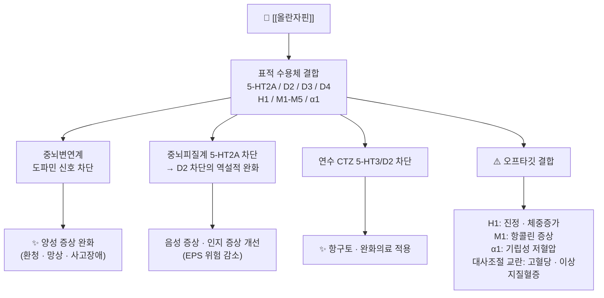

# 💊 [[올란자핀]] (Olanzapine, Zyprexa, N05AH03)

![[올란자핀_낱알.jpg|540]]
> [그림 1: ① 병태생리·영상 — 올란자핀_낱알]
![[올란자핀_3_구조식.png|540]]
> [그림 2: ② 관련 해부 구조물 — Olanzapine 2D 구조식 (PubChem CID 135398745)]

> **핵심 3줄 요약 (Key Summary)**:
> 🧪 주성분·제형: 티에노벤조디아제핀(thienobenzodiazepine) 계열의 비정형 항정신병제로, 정제(2.5·5·7.5·10·15·20 mg)·구강붕해정·속효성 근육주사제(10 mg) 및 [[올란자핀/사미도르판]] 복합제(경구정)로 시판된다.
> 📍 작용 기전: 중뇌변연계·중뇌피질계에서 **5-HT2A 수용체 길항을 매개로 한 D2 수용체 차단**을 주 기전으로 하며, H1·M1~M5·α1 수용체 차단이 부작용(체중 증가·진정·항콜린·기립성 저혈압)에 기여한다.
> 🎯 임상 적응증: 조현병(급성기 및 유지요법), 양극성 장애의 급성 조증 삽화 및 재발 방지가 핵심 적응증이며, 완화의료 영역에서 오심·섬망 등에 저용량으로 사용된다(Šoukalová Z, 2022; PMID: 35989084).
> ⚠️ 주의사항: 체중 증가·고혈당·지질 이상 등 **대사 증후군 위험**이 계열 내에서 가장 높은 축에 속하며, 진정·기립성 저혈압·QT 연장·드물게 심근병증(Tolu-Akinnawo OZ, 2024; PMID: 38767024)까지 보고된다. 급격한 중단은 금기(금단·재발 위험).

---

## 1. 약물 기본 정보 및 시판 제품 (Brand Identification)

![[올란자핀_낱알.jpg|540]]
> [그림 1: 식약처 의약품안전나라]

> [!abstract]+ 🧪 3D 약리 분자 구조 (Interactive 3D Viewer)
> <iframe src="https://molecule-viewer-rho.vercel.app/?cid=135398745" width="100%" height="450px" frameborder="0" allow="webgl" style="border-radius: 8px;"></iframe>

| 항목 | 상세 정보 |
| :--- | :--- |
| **일반명 (Generic Name)** | [[올란자핀]](한글) / Olanzapine (English Generic Name) |
| **대표 상품명 (Brand Names)** | **자이프렉사(Zyprexa)**, 자이프렉사 자이디스(Zyprexa Zydis), 자이프렉사 인트라머스큘러(IntraMuscular), **[[올란자핀/사미도르판]](Lybalvi)** (※ YAML `aliases:`에 필수 등록하여 위키링크 통합) |
| **ATC 코드 / 분류** | N05AH03 (Antipsychotics — Diazepines, oxazepines, thiazepines and oxepines) / 식약처 분류: 항정신병제(조현병 치료제) |
| **PubChem CID** | [135398745](https://pubchem.ncbi.nlm.nih.gov/compound/135398745) |
| **화학식 / 분자량** | C₁₇H₂₀N₄S / 312.43 g/mol (염기 기준) |
| **주요 제형 및 함량** | 경구정(2.5·5·7.5·10·15·20 mg), 구강붕해정(5·10·15·20 mg), 근육주사용 속효성 분말(10 mg/vial), 복합제 [[올란자핀/사미도르판]](5/10·10/10·15/10·20/10 mg) |
| **식약처 허가 적응증** | 조현병, 양극성 장애의 급성 조증 삽화(단독 또는 리튬/발프로에이트 병용), 양극성 장애의 재발 방지(유지요법) |

> [!warning] 국내외 허가 차이
> 올란자핀 단독요법은 미국 FDA에서 **[[플루옥세틴]] 병용 시 치료저항성 우울증(TRD)** 적응증을 추가로 보유하나, 국내 허가사항 포함 여부는 품목별로 다르므로 처방 시 반드시 해당 품목의 허가사항을 확인해야 한다(국내 허가 여부: **근거 미확인**).

### 1.1 대표 시판 제품 및 함유 복합제 매핑 (Brand Identification & Combinations)

| 구분 | 대표 제품명 / 브랜드 | 함유 성분 및 1회당 함량 | 제형 및 특징 | 주요 적응증 및 복약 지도 핵심 |
| :--- | :--- | :--- | :--- | :--- |
| **오리지널 단일제 (ETC)** | [[자이프렉사]](Zyprexa) | [[올란자핀]] 단일 성분 (2.5~20 mg) | 경구정 | 1일 1회, 1일 10 mg 표준. **체중·허리둘레·혈당·지질 정기 측정** 필수 |
| **구강붕해정 (ETC)** | [[자이프렉사 자이디스]] | [[올란자핀]] 단일 성분 (5~20 mg) | 구강붕해정 (Zydis) | 물 없이 혀 위에서 붕해, 연하곤란·비협조적 환자에서 유용. **흡수 속도가 빠름** |
| **속효성 주사제 (ETC)** | 자이프렉사 인트라머스큘러 | [[올란자핀]] 10 mg/vial | 근육주사용 분말 | 급성 흥분·격앙 상태의 신속 진정. **[[로라제팜]]·[[디아제팜]] 근주와 병용 시 과도한 진정·저혈압 위험** |
| **복합제 (ETC)** | **[[올란자핀/사미도르판]]**(Lybalvi) | [[올란자핀]] + [[사미도르판]] (μ-오피오이드 수용체 길항제) | 경구정 | 2021년 FDA 최초 승인(Paik J, 2021; PMID: 34304374). 대사성 부작용(체중 증가) 완화 목적. **오피오이드 진통제와 병용 시 길항 상호작용 주의** |
| **감별 다빈도 타계열 약물** | [[리스페리돈]], [[쿠에티아핀]], [[할로페리돌]] | 각 성분 단일 | 정제 / 서방정 / 데포주사 | 계열 내 대사 부작용·추체외로 증상 프로파일 비교 후 선택 |

> [!note] 사미도르판(Samidorphan) 병용의 임상적 의미
> 사미도르판은 μ-오피오이드 수용체 길항제로, 올란자핀에 의한 체중 증가를 완화할 목적으로 개발되어 조현병 및 양극성 I형 장애의 급성 조증·유지요법에 승인되었다(Paik J, 2021; PMID: 34304374). 즉 **올란자핀의 대사 부작용이 임상적으로 얼마나 큰 문제인지를 역설적으로 보여주는 사례**이며, 한의 임상에서도 올란자핀 복용 환자의 체중·대사 지표 관리가 핵심 과제임을 시사한다.

---

## 2. 분자 약리 기전 및 작용 경로 (Mechanism of Action)

* **주요 작용 기전 (Primary MoA)**:
  * **5-HT2A 수용체 길항(친화도 최상위군)**: 중뇌피질계 및 흑질선조체계에서 5-HT2A를 차단하면 도파민 신경세포의 발화와 도파민 유리가 증가하여, 선조체 D2 차단에 의한 추체외로 증상(EPS)이 상대적으로 완화된다. 이른바 **"비정형(atypical)" 프로파일의 핵심 기전**이다.
  * **D2 수용체 길항**: 중뇌변연계(mesolimbic)의 과활성 도파민 신호를 차단하여 양성 증상을 완화한다. 올란자핀은 D2 수용체에서 **일시적 결합(tight-binding 후 빠른 해리)** 특성을 보여, 전형 항정신병제보다 EPS·고프로락틴혈증 위험이 낮은 것으로 설명된다(**정량적 결합속도 수치는 제공 논문에서 확인되지 않음 — 근거 미확인**).
  * **기타 수용체 스펙트럼**: H1(진정·체중 증가), M1~M5(구갈·변비·요저류·인지 둔화), α1(기립성 저혈압·어지럼), 5-HT2C·5-HT3(식욕 및 항구토 관여) 등 광범위한 수용체 친화도를 가진다. 이 광범위한 오프타깃 결합이 **임상 효과와 부작용의 양면성**을 만든다.

* **하류 신호전달 및 생화학적 반응**:
  * D2 수용체는 Gi 단백 결합 수용체로, 차단 시 아데닐산고리화효소(adenylyl cyclase) 억제가 풀리고 cAMP 수준이 변동하며, 하류로 GSK-3β·β-아레스틴·ERK 신호가 조절된다. 만성 투여 시 선조체 D2 수용체 상향조절(depolarization block)이 발생한다.
  * 5-HT2A는 Gq 결합 수용체로 PLC–IP3–Ca²⁺ 경로를 활성화하므로, 길항 시 세포 내 Ca²⁺ 동원 감소 및 피질 흥분성 조절이 일어난다.
  * 항구토 효과는 연수 최후영역(area postrema)과 화학수용체유발영역(CTZ)의 5-HT3·D2 차단에 기인하는 것으로 설명되며, 이는 완화의료에서의 적용 근거가 된다(Šoukalová Z, 2022; PMID: 35989084).

---

## 3. 약동학적 특성 (Pharmacokinetics: ADME)

> [!note] 수치 출처에 관한 고지
> 아래 파라미터 중 일부는 표준 약리학 교과서 및 제품 허가사항에 근거한 일반 수치이며, **본 노트에 제공된 6편의 논문에서는 직접 확인되지 않은 항목이 포함되어 있다.** 해당 항목은 (근거 미확인)으로 표기하였다.

| 약동학 파라미터 | 수치 및 임상적 의미 |
| :--- | :--- |
| **생체이용률 (Bioavailability, F)** | 경구 약 60% 수준으로 보고됨(초회통과효과 존재). 구강붕해정은 연하 없이 흡수되어 협조가 어려운 환자에서 유용 (근거 미확인) |
| **최고혈중농도 도달시간 (Tmax)** | 속방 경구정 약 5~8시간. 구강붕해정은 이보다 빠른 흡수를 보임 (근거 미확인) |
| **혈장 단백결합률 (Protein Binding)** | 약 93% (주로 알부민 및 α1-산성당단백 결합) (근거 미확인) |
| **간 대사 효소 (Metabolism)** | **CYP1A2가 주 대사경로**, 그 외 CYP2D6, FMO3, UGT(글루쿠론산 포합) 관여. 대사산물은 대부분 불활성 (근거 미확인) |
| **배설 반감기 (Elimination t1/2)** | 약 21~54시간(평균 약 30시간). **1일 1회 투여로 정상상태 유지 가능** (근거 미확인) |
| **주요 배설 경로 (Excretion)** | 소변 약 57%, 대변 약 30% (대부분 대사산물 형태) (근거 미확인) |
| **연령 및 병용 요법의 영향** | 올란자핀 단독요법 대비 **병용요법(polytherapy)에서 항정신병 약물 부하(antipsychotic load)가 증가**하며, 연령에 따라서도 부하 양상이 달라진다는 연구 결과가 보고되었다(Solhaug V, Waade RB, 2025; PMID: 41420713). 즉 고령자·다약제 복용자에서 총 항정신병 부하가 누적될 위험이 있다. |

> [!important] 임상 적용 포인트
> * **CYP1A2 유도제(흡연)**: 흡연은 CYP1A2를 유도하여 올란자핀 혈중농도를 낮춘다. **금연 시 혈중농도가 상승**하여 진정·부작용이 급증할 수 있으므로, 금연 전후 용량 조정을 고려해야 한다(상호작용 방향성은 일반 약리학적 원리에 근거, **개별 논문 근거 미확인**).
> * **CYP1A2 억제제(예: [[플루복사민]], [[시프로플록사신]])**: 올란자핀 농도 상승 위험.
> * **연령·병용에 따른 부하 누적**: 2025년 연구는 단독요법과 병용요법, 연령대별 항정신병 부하 차이를 다룬 바 있어, 노인 환자에서 다약제 처방 시 총 부하를 정량적으로 평가할 필요성을 제기한다(Solhaug V, Waade RB, 2025; PMID: 41420713).

---

## _의학/04_임상 용법·용량 및 처방 가이드 (Dosage & Administration)

| 임상 적응증 | 성인 표준 용법·용량 | 1일 최대 한도 용량 |
| :--- | :--- | :--- |
| **조현병 (급성기)** | 1일 1회 5~10 mg으로 시작, 필요 시 1일 10 mg 유지. 1일 1회 경구 투여 | 최대 20 mg/day |
| **조현병 (유지요법)** | 1일 10 mg 유지(5~20 mg 범위에서 개별 조정) | 최대 20 mg/day |
| **양극성 조증 삽화** | 1일 1회 10~15 mg 단독 또는 [[리튬]]·[[발프로에이트]] 병용 | 최대 20 mg/day |
| **양극성 장애 재발 방지** | 1일 1회 5~20 mg 유지 | 최대 20 mg/day |
| **급성 흥분·격앙 (근주)** | 10 mg 근육주사 단회(필요 시 2시간 후 추가, 1일 최대 3회) | 30 mg/day (근주) |
| **완화의료 (오심·섬망 등)** | 저용량(예: 2.5~5 mg) 1일 1~2회 등 개별화 투여. 완화의료 영역에서의 적용 범위와 용량은 문헌별 차이가 있음 | **구체적 상한 근거 미확인**(Šoukalová Z, 2022; PMID: 35989084 참조) |
| **치료저항성 우울증 (TRD)** | [[플루옥세틴]]과의 고정용량 복합(미국 허가 기준) | 국내 허가 여부 **근거 미확인** |

> [!tip] 실전 처방 원칙
> 1. **"start low, go slow"** — 특히 고령자, 쇠약 환자, 간기능 저하자에서는 2.5~5 mg부터 시작한다.
> 2. **1일 1회 야간 투여**가 진정 작용을 수면에 활용할 수 있어 순응도에 유리하다.
> 3. **급격한 중단 금지** — 재발 및 콜린성 리바운드(불면·초조·오심) 위험. 감량은 수주~수개월에 걸쳐 단계적으로.
> 4. 투여 전후 **체중·BMI·허리둘레·공복혈당·HbA1c·지질패널**을 기준선 및 추적 관찰한다(대사 부작용이 이 약물의 최대 약점이기 때문).

---

## 5. 부작용, 경고 및 약물 상호작용 (Adverse Effects & Interactions)

### 5.1 주요 부작용 및 독성 경고 (Black Box Warnings)

* **대사 부작용 (계열 내 최고 수준)**:
  * 체중 증가, 복부비만, 고혈당·당뇨병 악화, 이상지질혈증. H1·5-HT2C 수용체 차단 및 시상하부 에너지 조절 교란이 관여하는 것으로 설명된다.
  * **기존 비만·당뇨 환자에서는 "비만성 심근병증"과 감별이 어려운 심장 변화를 유발할 수 있다**는 증례 보고가 있다. 즉 올란자핀 유발 심근병증이 비만성 심근병증의 모방질환(mimicker)으로 오인될 수 있다는 점이 지적되었다(Tolu-Akinnawo OZ, Awoyemi T, 2024; PMID: 38767024). **호흡곤란·말초부종·흉통·기좌호흡 등의 증상이 새로 발생하면 심초음파 등 심장 평가를 고려**해야 한다.
* **신경계 부작용**:
  * 진정·과다수면, 어지럼, 기립성 저혈압(α1 차단), 항콜린 증상(구갈·변비·요저류·시야흐림).
  * 추체외로 증상(EPS)·지연성 운동이상증(TD)·신경이완제 악성 증후군(NMS) — 전형 항정신병제보다 빈도는 낮으나 발생 가능.
  * **간질 환자에서의 주의**: 항정신병제는 발작 역치를 낮출 수 있어 간질 환자에서 신중한 사용이 요구된다. 올란자핀을 포함한 비정형 항정신병제의 발작 위험 프로파일이 계열별로 검토되었다(Górska N, Słupski J, 2019; PMID: 31681966). **개별 약물의 정량적 발작 위험 수치는 근거 미확인.**
* **심혈관계**:
  * QT 연장 가능성(특히 다른 QT 연장 약물과 병용 시), 기립성 저혈압, 드물게 심근병증·심근염.
* **기타**:
  * 간효소(AST/ALT) 일시 상승, 고프로락틴혈증(계열 내 상대적으로 낮음), 말초부종, 백혈구 감소(드묾).

### 5.2 주요 병용 금기 및 상호작용

* **위험 병용 약물**:
  * **[[로라제팜]]·[[디아제팜]] 등 벤조디아제핀 근주와의 병용**: 과도한 진정, 호흡억제, 저혈압 위험. 특히 근주 올란자핀 직후 벤조디아제핀을 투여하는 것은 권장되지 않는다(일반 안전성 원칙, **개별 논문 근거 미확인**).
  * **CYP1A2 억제제([[플루복사민]], [[시프로플록사신]] 등)**: 올란자핀 혈중농도 상승 → 용량 조정 필요.
  * **CYP1A2 유도제(흡연, [[카르바마제핀]])**: 혈중농도 저하 → 금연 시 농도 급상승 주의.
  * **중추신경억제제·알코올**: 진정·인지 저하 가중.
  * **QT 연장 약물([[할로페리돌]], 일부 항부정맥제, [[시탈로프람]] 등)**: QT 연장 상가작용 위험.
  * **복합제 [[올란자핀/사미도르판]]과 오피오이드 진통제**: 사미도르판의 μ-길항 작용으로 진통 효과가 길항될 수 있다(Paik J, 2021; PMID: 34304374의 복합제 특성에 근거한 추론).

---

## 6. 한의 치료 연계 및 병용/테이퍼링 프로토콜 (Integrative Medicine)

### 6.1 한약·양약 병용 투여 안전성 및 시너지 배오

* **간·신 대사 간섭 완충 처방**:
  * 올란자핀은 CYP1A2를 주 대사 경로로 사용하므로, CYP1A2에 영향을 주는 한약재와의 병용 시 **1~2시간 시간차 투여**를 원칙으로 하고 간기능 검사를 병행한다.
  * 올란자핀의 대표적 부작용이 **체중 증가·대사 이상·진정·항콜린 증상**이므로, 한의 치료의 목표는 ① 대사 부담 경감, ② 진정·인지 둔화 완화, ③ 소화기 항콜린 부작용 관리로 설정한다.
  * **[[비만]]·[[대사증후군]] 관리 처방**: [[태음조위탕]], [[방풍통성산]] 계열의 체중·부종 관리, [[오령산]] 계열의 수습 대사 조절을 고려할 수 있다(한의 변증 기반 접근, **양약-한약 병용 RCT 근거 미확인**).
  * **항콜린성 소화불량·변비**: [[대시호탕]], [[마자인환]] 등 윤장·이기 처방 고려.
  * **진정·과다수면·무기력**: [[온담탕]], [[귀비탕]] 계열로 心脾兩虛·痰濁 변증을 다스리는 접근.
* **상승 배오 (Synergy) — 변증 기반 접근**:
  * 조현병·조증의 한의 변증은 흔히 **痰火擾心, 肝鬱化火, 心脾兩虛, 陰虛火旺**으로 분류된다. 급성기 痰火에는 [[몽석곤담환]], [[온담탕]] 가미, 만성기 허증에는 [[천왕보심단]], [[귀비탕]] 계열을 변증에 따라 고려한다.
  * **[[간질]] 동반 환자**에서는 발작 역치를 낮출 수 있는 본초(예: 일부 走竄 개혈 약재) 사용에 신중해야 하며, 항정신병제 자체도 발작 역치를 낮출 수 있으므로 **양방 신경과와의 협진이 필수**다(Górska N, Słupski J, 2019; PMID: 31681966).
* **금기·주의 본초**:
  * 간독성 우려 본초(예: 일부 附子·烏頭 계열, 雷公藤 등)는 올란자핀의 간효소 상승 가능성과 겹치므로 정기 간기능 모니터링 없이 장기 사용하지 않는다.

### 6.2 양약 감량 및 한의 전환(테이퍼링) 가이드

> [!warning] 테이퍼링의 절대 원칙
> 정신과 약물의 감량·중단은 **반드시 처방 정신과 전문의와의 협진 하에** 진행한다. 임의 중단은 재발, 금단 증후군, 자·타해 위험을 초래할 수 있다. 한의 치료는 **감량을 가능하게 하는 보조 요법**이지 대체 요법이 아니다.

* **감량 프로토콜(개념적 골격 — 실제 적용은 개별 전문의 판단)**:
  1. **안정화 단계(4~12주)**: 침·약침·한약으로 수면·불안·소화기 증상을 먼저 안정시킨다. 이 단계에서 양약 용량은 유지.
  2. **기준선 재평가**: 체중·허리둘레·혈당·지질·간기능, 정신증상 평가척도(PANSS 등), 수면의 질을 기록.
  3. **미세 감량 단계**: 2~4주 간격으로 10~25% 수준의 소폭 감량을 원칙으로 하며, 감량 직후 2주간 증상 악화 여부를 집중 관찰한다.
  4. **유지·재평가**: 감량 후 안정이 유지되면 다음 단계로 진행, 불안정하면 이전 용량으로 회복.
  * **구체적 감량 수치·기간은 본 노트에 제공된 논문에서 확인되지 않음(근거 미확인)** — 개별 환자 상태와 정신과 협진 결과에 따라 결정한다.
* **한의 병행 시 모니터링 항목**: 체중, 식욕 변화, 추체외로 증상(손떨림·경직·좌불안석), 심전도(QT), 대사 지표, 그리고 **새로운 심장 증상(부종·호흡곤란)** 발생 여부.

---

## 7. 💡 사용자 진료실 핵심 필기 & 실전 임상 체크리스트

### 7.1 진료실 3대 핵심 문진 체크리스트

1. **복용 기간·용량·중단 이력 확인**: 현재 용량(mg/day), 마지막 처방일, 자가 감량 또는 임의 중단 여부. **임의 중단은 재발의 최대 위험 인자**이므로 반드시 확인한다. 흡연량 변화(금연) 여부도 함께 문진.
2. **대사 지표 및 기저 질환 청취**: 체중 변화(최근 3~6개월), 허리둘레, 당뇨·고지혈증·고혈압 병력, 음주 습관. **체중 증가는 올란자핀의 대표적 부작용이자 복약 중단의 주 원인**이다.
3. **심장·신경계 부작용 모니터링**: 새로 발생한 부종, 호흡곤란, 흉통, 심계항진(심근병증 감별, Tolu-Akinnawo OZ, 2024; PMID: 38767024), 어지럼·기립성 저혈압, 구갈·변비·요저류(항콜린), 손떨림·경직·좌불안석(EPS), 발작 병력(간질 여부).

### 7.2 환자 티칭 스크립트

> *"환자분, 지금 드시는 올란자핀은 환청이나 망상 같은 증상을 조절하는 데 효과적인 약입니다. 다만 두 가지를 꼭 기억해 주세요. 첫째, **이 약은 임의로 끊으면 안 됩니다.** 갑자기 중단하면 증상이 다시 심해지거나 불면·초조가 나타날 수 있어서, 감량이 필요하면 반드시 처방 선생님과 상의해야 합니다. 둘째, **체중과 혈당 관리가 매우 중요합니다.** 이 약은 식욕을 늘리고 체중을 증가시킬 수 있어서, 정기적으로 체중·허리둘레·혈당 검사를 받으셔야 합니다. 또 갑자기 어지럽거나, 다리가 붓거나, 숨이 차는 증상이 생기면 바로 알려주세요. 저희 한의원에서는 침과 한약으로 수면과 소화, 체중 관리, 불안 증상을 함께 도와드리면서, 처방 선생님과 협의하여 약을 서서히 줄여나갈 수 있도록 돕겠습니다. 음주는 약의 진정 작용을 심하게 만들어 떨어지거나 다칠 수 있으니 피해 주세요."*

> [!caution] 운전·기계 조작 및 온열 환경 주의
> 올란자핀은 진정 작용과 항콜린 작용으로 인해 **운전 및 기계 조작 시 주의**가 필요하며, **더위에 대한 내성이 떨어져** 고온 환경에서 열사병 위험이 증가할 수 있다. 여름철 야외 활동 및 사우나 이용에 대한 교육을 함께 시행한다(일반 안전성 원칙, **개별 논문 근거 미확인**).

---

## 8. 출처 및 학술 참고 문헌 (References)

* Paik J. Olanzapine/Samidorphan: First Approval. *Drugs*. 2021. PMID: 34304374
  * `[연구 요약]` 올란자핀/사미도르판 복합제의 최초 승인(First Approval) 리뷰. 사미도르판(μ-오피오이드 수용체 길항제)을 병용하여 올란자핀의 대표적 부작용인 체중 증가를 완화하려는 개발 배경, 조현병·양극성 I형 장애 적응증 및 승인 근거를 정리.
* Šoukalová Z. Olanzapine in oncology palliative care. *Klin Onkol*. 2022. PMID: 35989084
  * `[연구 요약]` 종양 완화의료 영역에서의 올란자핀 적용을 다룬 문헌. 오심·구토, 섬망, 불안, 불면 등에 대한 저용량 활용과 완화의료 맥락에서의 임상적 위치를 논의.
* Tolu-Akinnawo OZ, Awoyemi T. Olanzapine-induced cardiomyopathy: A mimicker of obesity cardiomyopathy? *Clin Cardiol*. 2024. PMID: 38767024
  * `[연구 요약]` 올란자핀 유발 심근병증 증례 보고. 비만성 심근병증과 감별이 어려운 양상(mimicker)을 보일 수 있음을 지적하여, 올란자핀 복용 환자에서 심장 증상 발생 시 감별 진단의 필요성을 제기.
* Duggan L, Fenton M. Olanzapine for schizophrenia. *Cochrane Database Syst Rev*. 2003. PMID: 12535408
  * `[연구 요약]` 조현병 치료에서 올란자핀의 유효성과 안전성을 평가한 코크란 체계적 문헌고찰. 증상 개선 측면의 유효성과 함께 체중 증가 등 대사 부작용의 임상적 중요성을 보고.
* Górska N, Słupski J. Antipsychotic drugs in epilepsy. *Neurol Neurochir Pol*. 2019. PMID: 31681966
  * `[연구 요약]` 간질 환자에서 항정신병제 사용을 다룬 리뷰. 항정신병제가 발작 역치에 미치는 영향과 계열별 위험 프로파일, 간질 환자에서의 신중한 처방 원칙을 정리.
* Solhaug V, Waade RB. Antipsychotic load during olanzapine mono- versus polytherapy and in relation to age. *Eur J Clin Pharmacol*. 2025. PMID: 41420713
  * `[연구 요약]` 올란자핀 단독요법과 병용요법에서의 항정신병 약물 부하(antipsychotic load)를 연령과 관련지어 분석한 연구. 고령 및 다약제 병용 상황에서 총 항정신병 부하가 증가하는 양상을 다룸.
* 식품의약품안전처 의약품안전나라 의약품통합정보시스템 (https://nedrug.mfda.go.kr)
  * `[연구 요약]` 국내 허가 의약품의 품목기준코드, 허가사항(적응증·용법용량·주의사항) 및 이상사례 안전성 정보의 1차 확인 출처.

<!-- 보관 태그(1회용·링크오류, 필요시 복원): 항정신병제, 비정형항정신병제, 도파민수용체길항제, 세로토닌수용체길항제 -->
