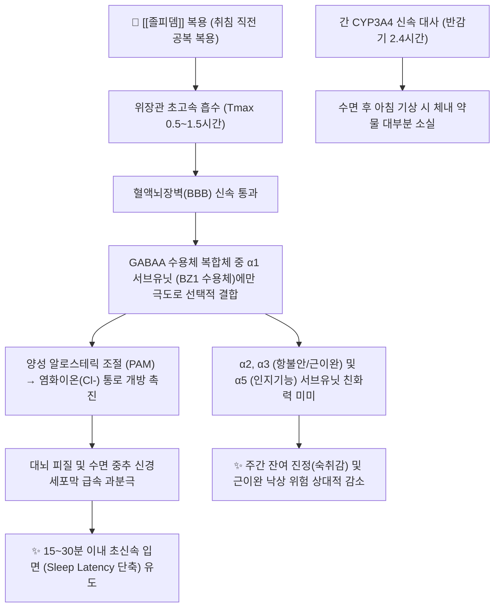

---
aliases:
  - Stilnox
  - 스틸녹스
  - 스틸녹스정
  - 주석산졸피뎀
  - Zolpidem
  - Ambien
  - N05CF02
tags:
  - 약리/양방약
  - 정신신경계
  - 수면진정제
  - 비벤조디아제핀
  - Z-drug
  - 향정신성의약품
  - 불면증치료제
---

# 💊 [[졸피뎀]] (Zolpidem Tartrate, Stilnox, N05CF02)

> **핵심 3줄 요약 (Key Summary)**:
> 🧪 주성분·제형: [[주석산졸피뎀]] (Zolpidem tartrate), 이미다조피리딘계 초단기 작용성 비벤조디아제핀 수면유도제(Z-drug), 백색 타원형 분할정(10mg, 5mg) 및 서방정(CR 6.25mg, 12.5mg).
> 📍 작용 기전: GABAA 수용체의 알파1 서브유닛(BZ1 수용체)에만 극도로 선택적으로 결합하여 다른 BZD 대비 근이완·항불안 부작용 없이 순수한 입면(Sleep onset)을 초신속 유도.
> 🎯 임상 적응증: 성인 불면증(입면 장애)의 단기 치료(초기 권장: 여성 및 고령자 5mg, 남성 5~10mg, 취침 직전 공복 복용, 최대 투약 기간 4주 이내).
> ⚠️ 주의사항: FDA 블랙박스 경고(수면 운전, 몽유병, 수면 중 폭식 등 복합 수면 행동 유발 시 즉시 영구 중단), 급단 시 반동 불면증, 최소 7~8시간 수면 시간 확보 필수.

---

## 📌 목차
1. [약물 기본 정보 및 시판 제품 (Brand Identification)](#1-약물-기본-정보-및-시판-제품-brand-identification)
2. [분자 약리 기전 및 작용 경로 (Mechanism of Action)](#2-분자-약리-기전-및-작용-경로-mechanism-of-action)
3. [약동학적 특성 (Pharmacokinetics: ADME)](#3-약동학적-특성-pharmacokinetics-adme)
4. [임상 용법·용량 및 처방 가이드 (Dosage & Administration)](#4-임상-용법용량-및-처방-가이드-dosage--administration)
5. [부작용, 경고 및 약물 상호작용 (Adverse Effects & Interactions)](#5-부작용-경고-및-약물-상호작용-adverse-effects--interactions)
6. [한의 치료 연계 및 병용/테이퍼링 프로토콜 (Integrative Medicine)](#6-한의-치료-연계-및-병용테이퍼링-프로토콜-integrative-medicine)
7. [💡 사용자 진료실 핵심 필기 & 실전 임상 체크리스트](#7--사용자-진료실-핵심-필기--실전-임상-체크리스트)
8. [출처 및 학술 참고 문헌 (References)](#8-출처-및-학술-참고-문헌-references)

---

## 1. 약물 기본 정보 및 시판 제품 (Brand Identification)

> [!abstract]+ 🧪 3D 약리 분자 구조 (Interactive 3D Viewer)
> <iframe src="https://molecule-viewer-rho.vercel.app/?cid=5732" width="100%" height="450px" frameborder="0" allow="webgl" style="border-radius: 8px;"></iframe>

![[졸피뎀_스틸녹스_패키지.jpg|350]]
> [그림 1] [[졸피뎀]] 오리지널 스틸녹스(Stilnox)의 대표적인 완제의약품 패키지 외형

![[졸피뎀_알약_블리스터.jpg|350]]
> [그림 2] 졸피뎀 10mg 정제 성상 및 PTP 블리스터 포장

![[졸피뎀_화학구조.png|300]]
> [그림 3] [[졸피뎀]]의 2D 평면 화학 분자 구조식 (PubChem CID 5732)

![[졸피뎀_3D구조.png|300]]
> [그림 4] [[졸피뎀]]의 3차원 공간 채움(Space-filling) 분자 모델

| 항목 | 상세 정보 |
| :--- | :--- |
| **일반명 (Generic Name)** | [[졸피뎀]] (주석산졸피뎀) / Zolpidem tartrate |
| **대표 상품명 (Brand Names)** | **스틸녹스정 (Stilnox / Ambien, 사노피 오리지널), 졸피신정, 졸피드정, 파마주석산졸피뎀정 등** |
| **ATC 코드 / 분류** | N05CF02 (Benzodiazepine related drugs) / 식약처 분류 117 (정신신경용제 - 향정신성의약품) |
| **PubChem CID** | [5732](https://pubchem.ncbi.nlm.nih.gov/compound/5732) (주석산염: [17754160](https://pubchem.ncbi.nlm.nih.gov/compound/17754160)) |
| **화학식 / 분자량** | C19H21N3O (주석산염: C42H48N6O8) / 307.4 g/mol (주석산염: 764.9 g/mol) |
| **주요 제형 및 함량** | 경구용 속방정 (10mg 백색 타원형 분할정, 5mg), 서방정 (스틸녹스CR 6.25mg, 12.5mg 이중방출정) |
| **식약처 허가 적응증** | 성인에서의 불면증의 단기 치료 (잠들기 어려운 입면 장애에 특화) |

### 1.1 대표 시판 제품 및 함유 복합제 매핑 (Brand Identification & Combinations)

| 구분 | 대표 제품명 / 브랜드 | 함유 성분 및 1회당 함량 | 제형 및 특징 | 주요 적응증 및 복약 지도 핵심 |
| :--- | :--- | :--- | :--- | :--- |
| **오리지널 속방정 (표준)** | [[스틸녹스]] 10mg | [[주석산졸피뎀]] 단일 (10mg) | 백색 타원형 분할정 | 입면 장애 1차 단기 치료, 복용 즉시 취침(수면 행동 주의) |
| **오리지널 속방정 (저용량)** | [[스틸녹스]] 5mg | [[주석산졸피뎀]] 단일 (5mg) | 백색 원형 정제 | **여성 및 65세 이상 고령자 초기 권장 용량**, 테이퍼링 단위 |
| **서방형 이중방출정** | [[스틸녹스CR]] 12.5mg / 6.25mg | [[주석산졸피뎀]] (이중코팅) | 서방정 | 속방층(신속 입면) + 서방층(새벽 각성 방지 수면 유지) |
| **국내 제네릭 속방정** | [[졸피드]], 졸피신 | [[주석산졸피뎀]] 단일 (10mg) | 정제 | 오리지널 동등 생물학적 동등성 입증 제네릭 제제 |

---

## 2. 분자 약리 기전 및 작용 경로 (Mechanism of Action)



* **GABA-A 수용체 $\alpha_1$ 서브유닛(BZ1)에 대한 극단적 선택성 (Selective MoA)**:
  * 전통적인 벤조디아제핀(BZD)이 $\text{GABA}_A$ 수용체의 $\alpha_1, \alpha_2, \alpha_3, \alpha_5$ 서브유닛에 무차별적으로 결합하는 것과 달리, 비벤조디아제핀계 이미다조피리딘 골격의 졸피뎀은 **$\alpha_1$ 서브유닛($\alpha_1\beta_2\gamma_2$ 조합, 과거 BZ1 수용체)**에만 매우 특이적으로 높은 친화도로 결합합니다.
  * $\alpha_1$ 서브유닛은 주로 대뇌 피질, 시상, 뇌간 망상체에 분포하여 **수면 유도(Sedation) 및 항경련** 작용을 전담합니다.
  * 반면 변연계의 불안을 조절하는 $\alpha_2$, 척수의 근긴장도를 조절하는 $\alpha_3$, 해마의 기억을 조절하는 $\alpha_5$ 서브유닛에 대한 친화력은 무시할 정도로 낮습니다.
  * 따라서 항불안, 근이완 작용은 거의 나타나지 않으며, **오직 잠에 빠져들게 하는 순수한 수면 유도(Hypnotic) 작용에만 선택적으로 집중**됩니다.
* **정상 수면 구조 보존 및 신속한 작용 발현**:
  * 복용 후 **15~30분 이내에 수면 잠복기(Sleep onset latency)를 획기적으로 단축**시킵니다.
  * BZD와 달리 깊은 수면 단계인 3단계 서파 수면(Slow-wave sleep)을 보존하며, REM 수면에 미치는 영향이 최소화되어 생리적 수면 구조의 왜곡이 적습니다.
* **초단기 반감기와 잔여 효과 최소화**:
  * 소실 반감기가 **약 2.4시간**으로 매우 짧아, 7~8시간 수면을 취하고 난 다음 날 아침에는 혈중 약물 농도가 소실되어 낮 시간대의 졸림, 인지 기능 저하, 운동실조와 같은 잔여 진정(Hangover) 효과가 BZD에 비해 현저히 적습니다.

---

## 3. 약동학적 특성 (Pharmacokinetics: ADME)

| 약동학 파라미터 | 수치 및 임상적 의미 |
| :--- | :--- |
| **생체이용률 (Bioavailability, F)** | 약 70% (초회통과효과 약 30%, **식사 직후 복용 시 Cmax 25% 감소 및 Tmax 60% 지연되므로 공복 복용 필수**) |
| **최고혈중농도 도달시간 (Tmax)** | **0.5~1.5시간 (평균 45분)** $\rightarrow$ 복용 후 침대에 누우면 즉시 잠드는 이유 |
| **혈장 단백결합률 (Protein Binding)** | 약 92.5% (혈청 단백질에 고도 결합) |
| **간 대사 효소 (Metabolism)** | 주로 **CYP3A4** (약 60%) 및 CYP2C9, CYP1A2에 의해 불활성 카르복실산 대사체로 산화 |
| **배설 반감기 (Elimination t1/2)** | **평균 2.4시간 (1.5~3.2시간)** (초단기형 약물, 단 여성 및 고령자에서 혈중 청소율 감소) |
| **주요 배설 경로 (Excretion)** | 소변 배설 약 56%, 대변 배설 약 37% (모두 불활성 대사체 형태) |

---

## 4. 임상 용법·용량 및 처방 가이드 (Dosage & Administration)

| 임상 적응증 | 성인 표준 용법·용량 | 1일 최대 한도 용량 | 임상 복약 지도 핵심 |
| :--- | :--- | :--- | :--- |
| **성인 남성 불면증** | 취침 직전 공복에 10mg 1회 경구 복용 (5mg 시작 권장) | 최대 10mg/day | **복용 후 바로 잠자리에 누울 것**, 7~8시간 수면 확보 |
| **성인 여성 불면증** | **취침 직전 공복에 5mg 1회 경구 복용 (FDA 의무 권고)** | 최대 10mg/day | **여성은 약물 청소율이 낮아 다음 날 주간 운전 장애 위험** |
| **고령자 (65세 이상) / 간장애** | 취침 직전 5mg 단회 경구 복용 | 최대 5mg/day | 약물 대사 지연에 따른 몽유병 및 낙상 골절 방지 |
| **스틸녹스CR 서방정** | 성인 12.5mg (여성/노인 6.25mg) 취침 직전 복용 | 12.5mg/day | 씹거나 부수지 말고 통째로 복용 (수면 유지 장애 환자) |

### 4.1 진료과별 다빈도 처방 패턴 (Sweet Spot vs 금기)
* **[✅ 최적 적응증 (Sweet Spot)]**:
  * **급성 스트레스성 입면 장애 환자**: 잠들기까지 1~2시간 이상 뒤척이는 환자에게 복용 후 20분 내 수면 유도.
  * **단기 시차 적응 및 교대근무자**: 일시적인 수면 주기 교정용 단기 처방.
* **[⚠️ 신중 투여 및 금기 (Caution / Contraindication)]**:
  * **복합 수면 행동 병력자**: 수면 운전, 몽유병, 수면 폭식 병력이 있는 환자 투약 **절대 영구 금기**.
  * **수면무호흡증(Sleep Apnea) 및 중증 호흡부전 환자**: 중추 호흡 억제로 인한 무호흡 악화 위험.
  * **알코올 중독 및 약물 오남용 병력자**: 중독성 향정신성의약품으로 엄격한 처방 제한.
  * **중증 간장애 환자**: 간성 뇌증 유발 위험.

---

## 5. 부작용, 경고 및 약물 상호작용 (Adverse Effects & Interactions)

### 5.1 주요 부작용 및 독성 경고 (Black Box Warnings)

```
[🚨 FDA 블랙박스 경고: 치명적인 복합 수면 행동 (Complex Sleep Behaviors)]
• 졸피뎀 복용 후 완전히 깨지 않은 수면 상태에서 수면 운전(Sleep-driving), 몽유병, 수면 중 취사 및 폭식, 수면 중 전화 통화나 성관계 등 복합 이상 행동을 한 후 다음 날 전혀 기억하지 못하는 사례가 빈발함.
• 이러한 복합 수면 행동은 낙상, 화재, 교통사고 등 환자 자신과 타인에게 치명적인 중상 또는 사망을 초래할 수 있음.
• 환자에게 한 번이라도 이러한 복합 수면 행동이 나타나면 즉시 본 제제의 투여를 영구히 중단해야 함.
```

* **흔한 부작용**:
  * 다음 날 아침 졸림(Drowsiness), 어지러움, 두통, 무기력, 설사, 오심.
* **선행성 건망증 및 환각**:
  * 약을 복용하고 바로 잠들지 않고 침대 밖에서 활동할 경우 시각적 환각, 착란, 일과성 기억상실증 발생.
* **반동성 불면증 (Rebound Insomnia) 및 의존성**:
  * 약물을 갑자기 중단하면 투약 전보다 불면증이 훨씬 더 심하게 튀어 오르는 반동 현상이 나타나 환자가 다시 약을 찾게 됨.
* **특이 해독제 (Reversal Agent)**:
  * **플루마제닐 (Flumazenil)**: $\text{GABA}_A$ $\alpha_1$ 수용체 결합을 즉각 경쟁적으로 차단하여 졸피뎀 과다복용 독성을 역전.

### 5.2 주요 병용 금기 및 상호작용

| 병용 약물 / 성분군 | 상호작용 기전 | 임상적 결과 및 대처 방안 |
| :--- | :--- | :--- |
| **알코올 (술)** | 중추성 GABAA 억제 시너지 및 탈억제 유발 | **복합 수면 행동(수면 운전) 위험 급증 및 치명적 호흡 정지 급사 $\rightarrow$ 절대 금주** |
| **오피오이드 및 타 진정수면제** | [[트라마돌]], [[알프라졸람]], [[로라제팜]] | 중추신경계 및 뇌간 호흡중추 마비 $\rightarrow$ 과도 진정, 혼수 및 사망 위험 |
| **강력한 CYP3A4 억제제** | [[케토코나졸]], [[이트라코나졸]], 에리스로마이신 | 졸피뎀 간 대사 저해 $\rightarrow$ **Cmax 30% 이상 상승, 반감기 연장으로 다음 날 극심한 주간 졸림** |
| **강력한 CYP3A4 유도제** | [[리팜피신]], [[세인트존스워트]], 카르바마제핀 | 졸피뎀 신속 분해 $\rightarrow$ 혈중 농도 60% 급락으로 수면 유도 효과 완전 소실 |

---

## 6. 한의 치료 연계 및 병용/테이퍼링 프로토콜 (Integrative Medicine)

### 6.1 한의학적 병전(病轉) 변증 및 시너지 배오
* **심담허겁(心膽虛怯)형 입면 장애 불면증**:
  * 잠자리에 누우면 온갖 사소한 걱정이 꼬리를 물고 심장이 두근거리며 1~2시간 이상 잠들지 못함, 악몽, 다몽.
  * **추천 처방**: [[산조인탕]], [[온담탕]], [[가미온담탕]].
  * **배오 원리**: [[산조인]](초산조인 - 가바성 신경 안정), [[지모]], [[복령]], [[천궁]]이 심장의 허열을 끄고 간담의 기운을 수렴하여 스틸녹스 없이도 뇌 신경망이 스스로 잠에 빠져들도록 유도.
* **음허화왕(陰虛火旺)형 새벽 각성 불면증**:
  * 잠은 겨우 들지만 2~3시간 만에 깨서 다시 잠들지 못함, 손발바닥 열감, 가슴 답답함, 식은땀, 설홍태소(舌紅苔少).
  * **추천 처방**: [[황련아교탕]], [[천왕보심단]].
  * **배오 원리**: [[황련]], [[황금]]으로 심화(心火)를 끄고, [[아교]], [[생지황]]으로 진액을 자양하여 중추 신경 과각성을 해소.
* **심비양허(心脾兩虛)형 쇠약성 불면**:
  * 신경을 너무 많이 써서 입맛이 없고 몸이 무거우며 얕은 잠만 잠.
  * **추천 처방**: [[귀비탕]], [[가미귀비탕]].

### 6.2 침구 치료 연계 (자연 멜라토닌 분비 촉진)
* **주요 치료 혈위**: 안면(安眠 - 불면 특효혈), 신문(神門), 백회(百會), 인당(印堂), 사신총(四神聰), 삼음교(三陰交).
* **임상 효능**: 인당·안면혈 자침은 송과체(Pineal gland)에서의 내인성 멜라토닌 분비를 촉진하고 뇌파를 서파 수면 상태(델타파)로 유도하여 졸피뎀 복용량을 조기에 줄일 수 있는 신경생리학적 기반 제공.

### 6.3 💡 스틸녹스 테이퍼링(감량 및 단약) 임상 프로토콜
* **스틸녹스 단약의 최대 장벽**:
  * 반감기가 2.4시간으로 극히 짧아 약을 안 먹은 날 밤에는 뇌세포의 $\alpha_1$ 수용체가 과흥분하여 극심한 **반동 불면증(Rebound Insomnia)**이 발생, 환자가 불안감에 다시 약을 먹게 됩니다.
* **단계적 탈출 3단계 프로토콜**:
  1. **용량 분할 단계 (Dose Reduction)**: 10mg 복용 환자는 정제 분할선을 이용해 **5mg(반 알)으로 1~2주간 감량**하여 복용.
  2. **격일 복용 전환 단계 (Alternate-day Strategy)**: 매일 먹던 패턴에서 벗어나 **이틀에 한 번(격일) 복용**으로 전환합니다.
  3. **한약 완충 교차 요법 (Herb-Bridge Therapy)**: 스틸녹스를 먹지 않는 날 취침 1시간 전에 **[[산조인탕]] 또는 [[황련아교탕]] 탕약을 복용**시켜 뇌신경 흥분을 진정시킴으로써 반동 불면증을 완벽하게 방어하고 자연 수면을 유도.

---

## 7. 💡 사용자 진료실 핵심 필기 & 실전 임상 체크리스트

### 7.1 진료실 3대 핵심 문진 체크리스트
1. **"약을 드시고 주무신 뒤, 자기도 모르게 냉장고 음식을 먹거나 전화를 걸고 다음 날 기억을 못 하신 적이 있나요?"**:
   * 복합 수면 행동(수면 중 폭식, 수면 운전 등) 여부를 반드시 스크리닝하여, 가족 증언이나 병력이 확인되면 생명 보호를 위해 스틸녹스 투약을 즉시 영구 중단시키고 신경과로 전원.
2. **"여성 환자분이신데 10mg 한 알을 통째로 드시고 계신가요?"**:
   * 여성은 졸피뎀 청소율이 남성보다 훨씬 낮아 다음 날 주간 운전 시 교통사고 위험이 2배 이상 높으므로 5mg으로 감량 처방받도록 지도.
3. **"약을 드신 후 침대에 눕지 않고 TV를 보거나 스마트폰을 보며 서성거리진 않으시나요?"**:
   * 복용 후 15분 내에 자리에 눕지 않으면 시각적 환각과 착란이 생길 수 있으므로, 반드시 모든 취침 준비를 마치고 이불 속에 들어간 상태에서 복용하도록 티칭.

### 7.2 환자 티칭 스크립트
> *"환자분, 복용 중이신 스틸녹스(졸피뎀)는 잠이 안 올 때 뇌를 신속하게 잠재워 주는 매우 강력한 수면제입니다. 복용 후 15분에서 30분이면 바로 약효가 나타납니다. 따라서 이 약은 TV를 보거나 설거지를 다 끝내고 침대에 몸을 완전히 누이신 직후에 물과 함께 드셔야 합니다. 약을 드시고 침대 밖을 돌아다니시면 방금 한 행동을 기억 못 하거나 환각을 보실 수 있습니다. 특히 이 약을 드신 상태에서 자기도 모르게 음식을 먹거나 운전을 하는 '몽유병 증상'이 나타나면 매우 위험하므로 즉시 복용을 멈추셔야 합니다. 스틸녹스는 4주 이상 매일 드시면 약 없이는 단 하루도 잠들 수 없는 신체적 의존성이 생깁니다. 저희 한의원의 침 치료와 산조인탕 한약으로 뇌 신경이 스스로 긴장을 풀고 깊은 잠에 빠져들 수 있도록 치료하면서, 스틸녹스는 반 알, 이틀에 한 알로 서서히 줄여나가 완전히 끊으실 수 있도록 도와드리겠습니다."*

---

## 8. 출처 및 학술 참고 문헌 (References)

1. **식품의약품안전처 (MFDS)**. *의약품 품목허가사항 및 마약류 안전관리 정보: 주석산졸피뎀 단일제 (스틸녹스정)*.
   - [의약품안전나라 품목정보](https://nedrug.mfds.go.kr)
   - `[연구 요약]` 주석산졸피뎀의 불면증 단기 치료 허가 적응증, 4주 이내 단기 투약 원칙, 복합 수면 행동(수면 운전 등) 발생 시 즉시 투약 중단 블랙박스 경고 및 여성 초기 권장 용량 5mg 공식 라벨.
2. **Scharf, M. B. et al. (1994)**. *A multicenter, placebo-controlled study evaluating zolpidem in the treatment of chronic insomnia*. **Journal of Clinical Psychiatry**, 55(5), 192-199.
   - [PubMed (PMID: 8071269)](https://pubmed.ncbi.nlm.nih.gov/8071269/)
   - `[연구 요약]` 만성 불면증 환자 대상 다기관 위약 대조군 3상 RCT: 졸피뎀 10mg 투여군은 위약 대비 수면 잠복기(Sleep latency)를 현저히 단축시키고 총 수면 시간을 유의하게 증가시키며, 투약 중단 후에도 반동성 불면증이 벤조디아제핀 대비 경미함을 입증.
3. **Holm, K. J. & Figgitt, D. P. (2000)**. *Zolpidem: an update of its pharmacology, therapeutic efficacy and tolerability in the treatment of insomnia*. **Drugs**, 59(4), 865-889.
   - [PubMed (PMID: 10804040)](https://pubmed.ncbi.nlm.nih.gov/10804040/) | [DOI](https://doi.org/10.2165/00003495-200059040-00014)
   - `[연구 요약]` 졸피뎀의 분자 약리학 및 임상 효능 총람: GABAA 수용체의 α1(BZ1) 서브유닛에 대한 독점적 선택성을 규명하고, 정상 수면 구조 보존 및 2.4시간의 짧은 반감기로 다음 날 주간 잔여 진정 효과를 최소화함을 체계적으로 입증.
4. **Dolder, C. & Nelson, M. (2008)**. *Hypnosedative-induced complex behaviours: incidence, mechanisms and management*. **CNS Drugs**, 22(12), 1021-1036.
   - [PubMed (PMID: 18998740)](https://pubmed.ncbi.nlm.nih.gov/18998740/) | [DOI](https://doi.org/10.2165/0023210-200822120-00005)
   - `[연구 요약]` 졸피뎀을 포함한 진정수면제 복용 후 나타나는 수면 운전(Sleep-driving), 수면 폭식(SRED), 몽유병 등 복합 수면 행동의 발생 빈도, 신경약리학적 기전 및 환자 안전 관리 지침 총람.
