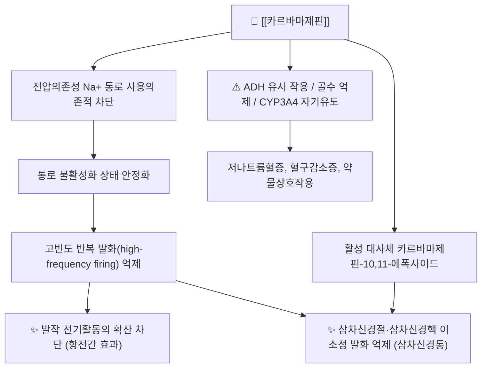

# 💊 [[카르바마제핀]] (Carbamazepine, Tegretol, ATC N03AF01)

![[카르바마제핀_3.jpg|540]]
> [그림 1: ① 병태생리·영상 — Epicutaneous patch test with <b>carbamazepine</b>]

> **핵심 3줄 요약 (Key Summary)**:
> 🧪 주성분·제형: 이미노스틸벤(iminostilbene) 계열의 디벤즈아제핀 카복사마이드 화합물(C₁₅H₁₂N₂O, MW 236.27)로, 삼환계 항우울제와 구조적으로 유사하다. 국내에서는 속방정(100/200mg)·서방정(CR 200/400mg)이 주력이며, 해외에는 경구 현탁액과 정맥주사 제형이 연구·개발되어 있다.
> 📍 작용 기전: 전압의존성 나트륨 통로(voltage-gated Na⁺ channel)를 사용의존적(use-dependent)으로 차단하여 고빈도 반복 발화를 억제하고, 이로써 국소 발작의 확산과 삼차신경통의 이소성 신경발화를 동시에 감소시킨다. 활성 대사체인 카르바마제핀-10,11-에폭사이드가 효과에 기여한다.
> 🎯 임상 적응증: 부분발작 및 전신강직간대발작, 삼차신경통(1차 약제), 양극성 장애의 조증 삽화. 삼차신경통에서는 통상 200mg 1일 2회로 시작하여 400~800mg/day로 유지한다.
> ⚠️ 주의사항: 무과립구증·재생불량성빈혈, 스티븐스-존슨 증후군(SJS)/독성표피괴사(TEN), DRESS 등 중증 과민반응이 핵심 경고 사항이며, 강력한 CYP3A4 **유도제**로서 병용약물의 혈중농도를 광범위하게 떨어뜨린다.

---

## 1. 약물 기본 정보 및 시판 제품 (Brand Identification)
> [!abstract]+ 🧪 3D 약리 분자 구조 (Interactive 3D Viewer)
> <iframe src="https://molecule-viewer-rho.vercel.app/?cid=2554" width="100%" height="450px" frameborder="0" allow="webgl" style="border-radius: 8px;"></iframe>

| 항목 | 상세 정보 |
| :--- | :--- |
| **일반명 (Generic Name)** | [[카르바마제핀]](카르바마제핀, 카바마제핀으로도 표기) / Carbamazepine |
| **대표 상품명 (Brand Names)** | **테그레톨(Tegretol), 테그레톨 CR** (오리지널) 및 다수의 국내 제네릭 카르바마제핀정 |
| **ATC 코드 / 분류** | **N03AF01** — Antiepileptics / Carboxamide derivatives (ATC N03A: 항전간제) |
| **PubChem CID** | [2554](https://pubchem.ncbi.nlm.nih.gov/compound/2554) |
| **화학식 / 분자량** | C₁₅H₁₂N₂O / 236.27 g/mol (5H-dibenz[b,f]azepine-5-carboxamide) |
| **주요 제형 및 함량** | 정제 100mg·200mg, 서방정(CR) 200mg·400mg, 경구 현탁액 100mg/5mL(해외), 정맥주사 제형(임상 개발·연구 단계) |
| **식약처 허가 적응증** | 간질(부분발작 및 전신강직간대발작), 삼차신경통, 양극성 장애의 조증·혼합 삽화 ※ 품목별 허가사항 재확인 필요 |

### 1.1 대표 시판 제품 및 함유 복합제 매핑 (Brand Identification & Combinations)

카르바마제핀은 **원칙적으로 단일제로만 사용**하는 약물이다. 진통·감기 복합제처럼 성분을 섞는 처방 문화가 없으며, 국내에서 본 성분을 함유한 복합제 허가 여부는 **근거 미확인**(식약처 의약품안전나라에서 확인 필요)이다. 아래 표는 제형별 실전 매핑이다.

| 구분 | 대표 제품명 / 브랜드 | 함유 성분 및 1회당 함량 | 제형 및 특징 | 주요 적응증 및 복약 지도 핵심 |
| :--- | :--- | :--- | :--- | :--- |
| **단일 속방정 (ETC)** | [[테그레톨]]정 | 카르바마제핀 100mg / 200mg | 즉시방출 정제, 1일 2~3회 | 간질·삼차신경통의 표준 시작 제형. 식후 투여로 위장장애 완화, 초기 졸림·어지럼 사전 설명 필수 |
| **단일 서방정 (ETC)** | 테그레톨 CR, 카르바마제핀 서방정 | 카르바마제핀 200mg / 400mg | 서방정(CR), 1일 2회 | 혈중농도 변동(Cmax spike)을 줄여 어지럼·복시 감소. **분할·분쇄 금지**, 통째로 삼키도록 지도 |
| **국내 제네릭 (ETC)** | 카르바마제핀정 등 다수 품목 | 카르바마제핀 단일 성분 | 정제 | 성분명이 같아도 제형·함량 차이가 있으므로 **품목 교체 시 반드시 함량 확인**, 임의 교체 금지 |
| **경구 현탁액** | 해외 브랜드 제품 | 카르바마제핀 100mg/5mL | 액제 | 소아·연하곤란 환자. 흔들어 복용, 정량 스푼 사용 |
| **정맥주사제** | 연구·개발 단계 | - | 주사액 | 경구 투여가 불가능한 성인 발작 환자에서 검토된 제형(PMID: 29020805). 국내 허가 여부 **근거 미확인** |
| **복합제** | 해당 없음 | - | - | 카르바마제핀 함유 복합제는 일반적이지 않음(근거 미확인) |
| **감별·대체 약물** | [[옥스카르바제핀]], [[에슬리카르바제핀]] | - | 정제 | 카르바마제핀의 케토 유사체 계열. 상호작용·과민반응 프로파일이 달라 감별 필요 |

---

## 2. 분자 약리 기전 및 작용 경로 (Mechanism of Action)

* **주요 작용 기전 (Primary MoA)**:
  * 카르바마제핀의 대표 기전은 **전압의존성 나트륨 통로 차단**이다. 통로의 불활성화(inactivated) 상태에 결합하여 회복을 지연시킴으로써, 정상적인 단발 신경전도에는 큰 영향을 주지 않으면서 **고빈도로 반복 발화하는 뉴런을 선택적으로 억제**한다(사용의존적 차단). 이 기전은 국소(부분) 발작의 발생·확산 억제와 삼차신경통의 발작성 통증 억제를 하나의 설명 틀로 묶어준다(PMID: 15011132; PMID: 2570287).
  * 삼차신경통의 병태생리에는 삼차신경근 진입부(root entry zone)의 탈수초와 이에 따른 **이소성 발화(ectopic firing)** 및 중추성 과흥분이 관여하는데, 나트륨 통로 차단은 이 지점을 직접 겨냥한다(PMID: 31908187).
  * 임상약리 리뷰에 따르면 카르바마제핀의 임상 효과·독성 프로파일은 활성 대사체인 **카르바마제핀-10,11-에폭사이드**의 농도와 밀접하게 연관된다(PMID: 8773289).
* **하류 신호전달 및 생화학적 반응**:
  * 나트륨 통로 차단 → 지속적 탈분극 억제 → 시냅스전 신경전달물질(글루타메이트 등) 유리 감소 → 흥분성 네트워크 동기화(synchronization) 억제로 이어진다.
  * 나트륨 통로 외에 칼슘 통로·아데노신 수용체 등 부수 표적이 문헌에서 논의되어 왔으나, 각 표적의 정량적 기여도는 **근거 미확인**으로 두는 것이 안전하다.
  * **오프타깃 기전**: 항이뇨호르몬(ADH) 작용 증강 → 저나트륨혈증/SIADH, 골수 전구세포 억제 → 무과립구증, CYP3A4 자기유도(autoinduction) → 자기 자신의 혈중농도 하강과 병용약물 농도 저하.

---

## 3. 약동학적 특성 (Pharmacokinetics: ADME)

| 약동학 파라미터 | 수치 및 임상적 의미 |
| :--- | :--- |
| **생체이용률 (Bioavailability, F)** | 약 75~85% (경구). 흡수가 느리고 불규칙할 수 있으며, 서방정은 흡수 속도를 완만하게 만든다 |
| **최고혈중농도 도달시간 (Tmax)** | 속방정 약 4~8시간, 서방정은 이보다 지연(제품별 차이). 1일 1회 CR 제형은 24시간 농도 변동을 줄이는 것이 목적 |
| **혈장 단백결합률 (Protein Binding)** | 약 70~80% (주로 알부민 및 α₁-산당단백) |
| **간 대사 효소 (Metabolism)** | **CYP3A4가 주 대사효소**로 10,11-에폭사이드 생성 → 에폭사이드 하이드롤라제에 의해 무활성 디올로 전환. 카르바마제핀은 CYP3A4를 **강력히 유도**하여 자기 대사를 가속(자기유도)한다(PMID: 8773289; PMID: 15011132) |
| **배설 반감기 (Elimination t₁/₂)** | 단회 투여 시 약 25~65시간 → 자기유도 완성 후 약 12~17시간으로 단축. **반감기가 짧아지므로 유지기에는 1일 2~3회 분할 투여가 원칙** |
| **주요 배설 경로 (Excretion)** | 소변으로 대사체 형태로 주로 배설(대략 70%대), 변으로 일부. 신기능 저하 시 용량 조절 필요 |

> ※ 위 수치는 카르바마제핀 임상약리의 통상 보고값을 정리한 것이다. 제공된 리뷰 문헌(PMID: 8773289, PMID: 15011132)의 개별 수치 원문 대조는 본 노트에서 수행하지 않았으므로, 처방 전 제품 허가사항 및 최신 교과서로 **재확인**할 것을 권한다.

---

## 의학/04_임상 용법·용량 및 처방 가이드 (Dosage & Administration)

| 임상 적응증 | 성인 표준 용법·용량 | 1일 최대 한도 용량 |
| :--- | :--- | :--- |
| **간질(부분발작·전신강직간대발작)** | 초회 100~200mg 1일 1~2회(식후), 이후 1주 간격으로 증량. 유지 400~1,200mg/day를 1일 2~3회 분할 | 1,200mg/day (일부 문헌에서 1,600~2,000mg/day까지 보고되나 **근거 미확인**) |
| **삼차신경통** | 초회 100mg 1일 2회, 필요 시 증량. 유지 400~800mg/day, 통증 소실 후 감량·중단 시도 | 1,200mg/day |
| **양극성 장애(조증 삽화)** | 400~1,200mg/day, 혈중농도 모니터링 하에 단계적 증량 | 1,200mg/day |
| **소아 간질** | 약 10~20mg/kg/day를 2~3회 분할, 서서히 증량 | 연령·체중별 개별 설정(허가사항 확인) |
| **정맥주사(연구 단계)** | 경구 투여 불가 성인 발작 환자에서 검토된 경로(PMID: 29020805). 국내 임상 적용 가능성 **근거 미확인** | - |

> **치료혈중농도 모니터링(TDM)**: 통상 4~12 μg/mL 범위가 언급되나, 제품·검사실 기준 차이가 있으므로 **근거 미확인** 항목으로 두고, 실제로는 발작 조절 여부와 독성 증상(복시, 운동실조, 진정)을 우선 지표로 삼는다. 적응증 전환, 병용약 추가, 임신, 제제 변경 시 측정을 고려한다.

---

## 5. 부작용, 경고 및 약물 상호작용 (Adverse Effects & Interactions)

### 5.1 주요 부작용 및 독성 경고 (Black Box Warnings)
* **혈액학적 독성 (가장 중요)**:
  * 무과립구증(agranulocytosis), 재생불량성빈혈(aplastic anemia), 백혈구감소증, 혈소판감소증이 보고되어 있다. 빈도는 드물지만 치명적일 수 있으므로 **치료 전 및 정기적 CBC 모니터링**이 필수이다. 발열·인후통·구내염 등 감염 증상이 발생하면 즉시 CBC를 확인하도록 환자를 교육한다.
* **중증 피부 과민반응**:
  * 스티븐스-존슨 증후군(SJS)/독성표피괴사(TEN), DRESS(호산구증가 및 전신증상 동반 약물발진) 위험이 있다. 카르바마제핀은 **임상약리유전학(CPIC) 가이드라인이 존재하는 대표 약물**로, HLA-B*15:02(주로 동아시아 계통) 및 HLA-A*31:01 등 유전자형에 따른 위험分层이 논의되며, 이들 약물에 대한 **약물유전검사의 비용효과성**을 다룬 체계적 문헌고찰이 보고되어 있다(PMID: 36149409). 발진이 나타나면 즉시 중단하고 재투여하지 않는다.
* **저나트륨혈증 / SIADH**:
  * ADH 유사 작용으로 저나트륨혈증이 발생할 수 있다. 노인, 이뇨제(특히 티아지드) 병용 환자에서 위험이 증가하므로 나트륨·삼투압 및 임상 증상(무력감, 혼동, 경련)을 확인한다.
* **기타**:
  * 용량의존성 중추신경 억제(어지럼, 졸림, 운동실조, 복시), 오심·구역, 간효소 상승 및 간염, 체중 증가, 시야 흐림, 인지기능 저하.
  * 모든 항전간제와 마찬가지로 자살 사고·행동 위험 증가에 대한 경고가 적용된다.
  * 급격한 중단 시 **금단 발작 및 반동성 발작** 위험이 있으므로 반드시 단계적으로 감량한다.

### 5.2 주요 병용 금기 및 상호작용
* **CYP3A4 유도로 인한 병용약 효과 감소 (임상에서 가장 흔한 문제)**:
  * 경구피임제(피임 실패), 와파린 등 항응고제, 라모트리진·발프로에이트·벤조디아제핀 등 항전간제, 항정신병약, 일부 항생제(독시사이클린 등), 스타틴, 면역억제제, 일부 항암제의 혈중농도가 낮아질 수 있다.
  * **경구피임제 병용 시 비호르몬 피임법 병행**을 반드시 안내한다.
* **카르바마제핀 농도를 상승시키는 약물(독성 위험)**:
  * 에리스로마이신·클래리트로마이신 등 마크로라이드계, 아졸계 항진균제(케토코나졸 등), 딜티아젬·베라파밀, 자몽주스, 일부 항우울제(SSRI 등) → CYP3A4 저해로 카르바마제핀 혈중농도 상승 → 어지럼·운동실조·복시.
* **발프로에이트 병용**: 에폭사이드 대사가 억제되어 활성 대사체가 축적될 수 있어 독성(특히 진정, 운동실조) 모니터링이 필요하다.
* **한약·건강기능식품**: 성요한초(St. John's wort) 등 CYP3A4 유도 성분과의 병용은 카르바마제핀 농도를 떨어뜨릴 수 있어 피하도록 지도한다.
* **알코올**: 중추신경 억제를 가중시키므로 금주 지도.

---

## 6. 한의 치료 연계 및 병용/테이퍼링 프로토콜 (Integrative Medicine)

### 6.1 한약·양약 병용 투여 안전성 및 시너지 배오
* **간·신 대사 간섭 완충 처방**: 카르바마제핀은 간 대사(CYP3A4) 의존도가 높고 간독성·혈액독성 보고가 있으므로, 간에 부담을 주는 한약재의 장기 고용량 투여는 피한다. 한약과 양약은 **최소 1~2시간 시간차 투여**를 원칙으로 하고, 복용 시작 후 4~8주 내 간기능·CBC 추적을 권장한다.
* **상승 배오 (Synergy) 관점**:
  * **간질(癲癇) 영역**: 담(痰)·풍(風)·경(驚) 변증에 따라 [[온담탕]](溫膽湯) 계열, [[청심연자탕]] 등 진정·안신 방제를 병용하는 접근이 임상에서 활용된다. 다만 카르바마제핀의 혈중농도·발작 조절을 대체할 수 있다는 근거는 **근거 미확인**이며, 어디까지나 보조적 접근으로 위치시킨다.
  * **삼차신경통(面痛·頭面痛) 영역**: [[천궁]], [[백지]], [[세신]] 등 거풍·활혈·지통 본초를 중심으로 한 [[천궁다조산]], [[청상견통탕]] 계열, 근긴장·경련성 통증에는 [[작약감초탕]](芍藥甘草湯) 배합이 고려된다. 침구는 攢竹(BL2)·四白(ST2)·下關(ST7)·頰車(ST6)·合谷(LI4)·太衝(LR3) 등을 삼차신경 분지별로 배혈한다.
  * **양극성·조증 영역**: [[시호가용골모려탕]], [[청심연자탕]] 등 청열·안신 처방이 보조적으로 검토되나, 정신과적 응급 상황 판단이 우선이다.
* **주의**: 상기 처방·본초 연계는 한의 임상 통용 수준의 접근이며, 카르바마제핀과의 약물상호작용을 정량적으로 검증한 문헌은 **근거 미확인**이다.

### 6.2 양약 감량 및 한의 전환(테이퍼링) 가이드
* **감량 프로토콜(일반 원칙)**: 카르바마제핀은 반감기가 짧고 자기유도 특성이 있어 **급격한 중단 시 금단 발작 위험이 크다**. 발작이 6~12개월 이상 완전 관해된 경우에 한해, 1~2주(필요 시 4주 이상) 간격으로 1회 총량의 10~25%씩 감량하는 방식이 통상적이다.
* **한의 전환 시점**: 침·약침·한약 치료를 병행하면서 발작 빈도·통증 강도 일지를 4~12주간 기록하고, 악화 없이 안정적일 때만 감량을 시작한다.
* **삼차신경통의 경우**: 자연 경과상 완화기가 있어 감량·중단 시도를 하게 되나, 재발 시 신속히 이전 유효 용량으로 복귀할 수 있도록 처방을 유지하고, 환자에게 **임의 중단 금지**를 강하게 교육한다.
* **모니터링 항목**: 발작/통증 일지, 어지럼·복시·운동실조(혈중농도 상승 신호), CBC, 간기능, 나트륨.

---

## 7. 💡 사용자 진료실 핵심 필기 & 실전 임상 체크리스트

### 7.1 진료실 3대 핵심 문진 체크리스트
1. **적응증과 복용 이력 확인**: 간질인지, 삼차신경통인지, 기분장애인지에 따라 감량·중단 전략이 전혀 다르다. 실제 복용 중인 **성분명·1일 총용량·제형(속방/서방)**을 확인하고, 최근 제네릭 교체 여부를 반드시 묻는다.
2. **상호작용 위험 약물 전수 조사**: 경구피임제, 와파린 등 항응고제, 다른 항전간제, 항진균제·마크로라이드계 항생제, 자몽주스, 성요한초 함유 건강기능식품, 음주력을 확인한다.
3. **중증 이상반응 red flag 문진**: 발열·인후통·구내염(무과립구증), 피부 발진·점막 침범(SJS/TEN), 전신 부종·림프절 종대(DRESS), 무력감·혼동(저나트륨혈증) 여부를 매 방문 확인한다. **정기 CBC·간기능 검사 시행 여부**도 함께 점검한다.

### 7.2 환자 티칭 스크립트
> *"지금 드시는 카르바마제핀은 발작이나 얼굴 통증 신호가 과도하게 퍼지는 것을 막아주는 약입니다. 다만 몇 가지 꼭 기억하셔야 합니다. 첫째, 다른 약의 대사에 영향을 주기 때문에 피임약, 혈전약, 항생제 등을 함께 드실 때는 반드시 저에게 알려주셔야 합니다. 둘째, 열이 나거나 목이 아프고 입안이 헐거나, 피부에 발진이 올라오면 즉시 약을 중단하고 연락 주십시오. 셋째, 스스로 용량을 줄이거나 끊으시면 발작이 다시 올 수 있으니 절대 임의로 중단하지 마시고, 저희 한의원 치료와 함께 일정표에 따라 서서히 줄여나가겠습니다."*

---

## 8. 출처 및 학술 참고 문헌 (References)

* Nieber K. [Carbamazepine]. *Dtsch Med Wochenschr*. 2004. PMID: 15011132
  * `[연구 요약]` 카르바마제핀의 작용 기전, 적응증, 부작용 및 임상 사용상의 기본 개요를 정리한 독일어 종설.
* Vickery PB, Tillery EE. Intravenous Carbamazepine for Adults With Seizures. *Ann Pharmacother*. 2018. PMID: 29020805
  * `[연구 요약]` 경구 투여가 어려운 성인 발작 환자에서의 카르바마제핀 정맥주사 제형의 임상적 활용 가능성과 안전성 검토.
* Carbamazepine update. *Lancet*. 1989. PMID: 2570287
  * `[연구 요약]` 카르바마제핀의 임상 위치와 안전성 이슈를 다룬 초기 종설.
* Albani F, Riva R. Carbamazepine clinical pharmacology: a review. *Pharmacopsychiatry*. 1995. PMID: 8773289
  * `[연구 요약]` 카르바마제핀 및 활성 대사체(10,11-에폭사이드)의 약동학, 자기유도, 치료약물농도모니터링(TDM)을 정리한 임상약리 리뷰.
* Gambeta E, Chichorro JG. Trigeminal neuralgia: An overview from pathophysiology to pharmacological treatments. *Mol Pain*. 2020. PMID: 31908187
  * `[연구 요약]` 삼차신경통의 병태생리(탈수초, 이소성 발화)와 나트륨 통로 차단제 중심의 약물치료 전략 개요.
* Morris SA, Alsaidi AT, et al. Cost Effectiveness of Pharmacogenetic Testing for Drugs with Clinical Pharmacogenetics Implementation Consortium (CPIC) Guidelines: A Systematic Review. *Clin Pharmacol Ther*. 2022. PMID: 36149409
  * `[연구 요약]` CPIC 가이드라인 대상 약물(카르바마제핀 포함)에서의 약물유전검사 비용효과성을 다룬 체계적 문헌고찰.
* Brunton LL, Hilal-Dandan R, Knollmann BC, eds. *Goodman & Gilman's The Pharmacological Basis of Therapeutics*. 13th ed. McGraw-Hill; 2018.
  * `[연구 요약]` 약물의 분자 약리학, 약동학 및 임상 치료 지침 총람(일반 참고 교과서).
* 식품의약품안전처 의약품안전나라 의약품통합정보시스템 (https://nedrug.mfds.go.kr)
  * `[연구 요약]` 국내 허가 의약품의 품목 기준코드, 허가사항, 용법용량 및 부작용 안전성 정보 확인용.

<!-- 보관 태그(1회용·링크오류, 필요시 복원): 나트륨통로차단제 -->
