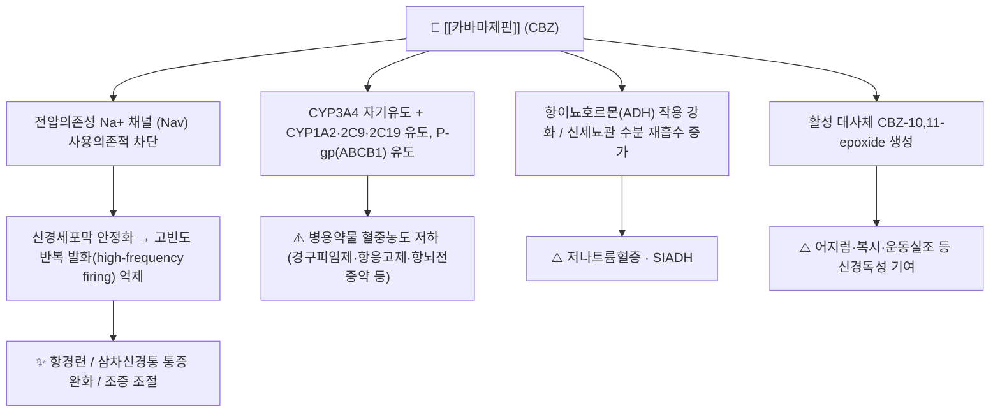

# 💊 [[카바마제핀]] (Carbamazepine, Tegretol, ATC N03AF01)

> **핵심 3줄 요약 (Key Summary)**:
> 🧪 주성분·제형: [[카바마제핀]](Carbamazepine, CBZ)은 디벤즈아제핀(dibenzazepine) 계열의 삼환구조(iminostilbene 유도체) 항뇌전증약으로, 화학식 C15H12N2O, 분자량 약 236.27 g/mol의 소수성 저분자 화합물이다. 속방정(100·200 mg), 서방정(CR/ER, 200·400 mg), 현탁액(100 mg/5 mL), 좌제 및 일부 국가에서는 정맥주사 제형이 사용된다.
> 📍 작용 기전: 전압의존성 나트륨 채널(Voltage-gated Na⁺ channel)을 사용의존적(use-dependent)으로 차단하여 신경세포막을 안정화하고 고빈도 반복 발화를 억제한다. 이와 함께 강력한 간효소(CYP3A4 등) 유도제이자 [[P-당단백질]](P-gp/ABCB1) 유도제로 작용하여 자기유도(autoinduction) 및 광범위한 약물상호작용을 일으킨다.
> 🎯 임상 적응증: 국소발작(부분발작) 및 이차성 전신화 발작, 삼차신경통의 **1차 선택 약물**, 조증 및 양극성장애의 기분조절 보조, 일부 신경병증성 통증·당뇨병성 신경병증에 사용된다. 삼차신경통에서는 보통 1일 200~1,200 mg 범위에서 개별 적정한다.
> ⚠️ 주의사항: 저나트륨혈증/항이뇨호르몬 부적절분비(SIADH), 어지럼·복시·운동실조, 피부 중증 발진(SJS/TEN, HLA-B\*1502 관련), 무과립구증·재생불량성빈혈, 간독성, 심장 전도장애가 주요 위험이다. 경구피임제·항응고제·항뇌전증약 등 병용약물의 혈중농도를 유도 효소를 통해 유의하게 저하시킨다.

---

## 1. 약물 기본 정보 및 시판 제품 (Brand Identification)

> [!abstract]+ 🧪 3D 약리 분자 구조 (Interactive 3D Viewer)
> <iframe src="https://molecule-viewer-rho.vercel.app/?cid=2554" width="100%" height="450px" frameborder="0" allow="webgl" style="border-radius: 8px;"></iframe>

| 항목 | 상세 정보 |
| :--- | :--- |
| **일반명 (Generic Name)** | [[카바마제핀]](카르바마제핀) / Carbamazepine |
| **대표 상품명 (Brand Names)** | **테그레톨(Tegretol), 테그레톨 CR, 카바제핀, 카마제핀, 뉴로톨, 카바트롤** (※ YAML `aliases:`에 등록하여 위키링크 통합) |
| **ATC 코드 / 분류** | **N03AF01** (Antiepileptics / Carboxamide derivatives) / 식약처 분류: 항전간제(213) |
| **PubChem CID** | [2554](https://pubchem.ncbi.nlm.nih.gov/compound/2554) |
| **화학식 / 분자량** | C15H12N2O / 약 236.27 g/mol |
| **주요 제형 및 함량** | 속방정 100 mg·200 mg, 서방정(CR/ER) 200 mg·400 mg, 경구현탁액 100 mg/5 mL, 좌제, (일부 국가) 정맥주사 제형 |
| **식약처 허가 적응증** | 간질(부분발작, 전신강직간대발작 등), 삼차신경통, 조증 및 조울증(양극성장애)의 조절, 당뇨병성 신경병증 등 (※ 품목별 허가사항은 의약품안전나라에서 개별 확인) |

### 1.1 대표 시판 제품 및 함유 복합제 매핑 (Brand Identification & Combinations)

| 구분 | 대표 제품명 / 브랜드 | 함유 성분 및 1회당 함량 | 제형 및 특징 | 주요 적응증 및 복약 지도 핵심 |
| :--- | :--- | :--- | :--- | :--- |
| **단일제 (ETC, 속방)** | [[테그레톨]] 100·200 mg, 카바제핀정 | 카바마제핀 단일 성분 | 속방정 | 초기 적정 및 신속한 혈중농도 상승 필요 시. 식후 투여로 위장관 자극 완화 |
| **단일제 (ETC, 서방)** | [[테그레톨 CR]] 200·400 mg, 뉴로톨서방정 | 카바마제핀 단일 성분 | 서방정(CR/ER) | 혈중농도 변동(peak-trough) 완화, 1일 2회 투여로 순응도 향상. **분할·분쇄·씹지 말 것** |
| **액제 (ETC)** | 카바마제핀현탁액 | 카바마제핀 100 mg/5 mL | 경구현탁액 | 소아·연하곤란 환자. **사용 전 충분히 흔들어** 정량 스푼/주사기 사용 |
| **좌제 (ETC)** | 카바마제핀좌제 | 카바마제핀 단일 성분 | 직장 좌제 | 경구 투여 불가 시 임시 대안. 흡수 변동성 큼 |
| **정맥주사 (일부 국가)** | IV carbamazepine 제제 | 카바마제핀 | 주사제 | 경구 투여가 불가능한 성인 발작 환자에서 대안적 경로로 논의됨(국내 허가 여부 별도 확인). 용량 전환비는 **근거 미확인** |
| **복합제** | 해당 없음 | 카바마제핀은 원칙적으로 단일제로 사용 | — | 타 약물과의 고정복합제는 국내에서 일반적이지 않음 |

> ⚠️ **제형 간 전환 주의**: 속방정 → 서방정 전환 시에는 총 1일 용량을 유지한 채 1일 2회로 분할하는 방식이 일반적이나, 제품별 생체이용률 차이가 있어 발작 조절 상태 및 혈중농도 모니터링이 필요하다.

---

## 2. 분자 약리 기전 및 작용 경로 (Mechanism of Action)

* **주요 작용 기전 (Primary MoA)**:
  * [[카바마제핀]]의 대표 기전은 **전압의존성 나트륨 채널의 사용의존적(use-dependent) 차단**이다. 채널이 반복적으로 활성화된 상태(탈분극 빈도가 높은 상태)에서 결합 친화도가 증가하므로, 정상적인 저빈도 신호전파는 상대적으로 보존하면서 발작 병소의 고빈도 발화(high-frequency repetitive firing)를 선택적으로 억제한다.
  * 이 기전은 국소발작 병소의 흥분성 전파 차단과 삼차신경통에서 나타나는 이소성(ectopic) 신경 발화의 억제를 설명하는 핵심 근거다. 삼차신경통은 혈관에 의한 삼차신경근 압박 후 신경이 탈수초화되면서 과흥분성 이소성 발화가 발생하는 것으로 이해되며, 나트륨 채널 차단 약물이 통증 발작을 억제하는 1차 치료로 쓰인다(Lambru & Zakrzewska, 2021; Ashina & Robertson, 2024).
  * 이차적으로 아데노신 수용체, NMDA 수용체, 모노아민 신경전달 등에 대한 작용이 보고되어 있으나, 임상 효과에 기여하는 정도는 **근거 미확인 또는 논쟁적**이다.
* **하류 신호전달 및 생화학적 반응**:
  * 나트륨 채널 차단 → 지속적 탈분극 억제 → 시냅스전 신경전달물질(글루탐산 등) 유리 감소 → 발작 파급 및 신경병증성 통증 신호 억제.
  * **자기유도(autoinduction)**: CBZ는 자신의 대사효소(CYP3A4)를 유도하여, 투여 3~5주 후부터 자신의 청소율이 증가하고 반감기가 유의하게 짧아진다. 따라서 동일 용량에서도 시간이 지나면 혈중농도가 저하될 수 있어 임상 경과에 따라 용량 재평가가 필요하다(Albani & Riva, 1995).
  * **활성 대사체**: CBZ-10,11-epoxide는 모체약물과 유사한 항경련 활성을 지니지만 동시에 신경독성(어지럼·복시·운동실조) 부담에 기여하며, 병용 약물이 epoxide 수준을 올릴 경우 독성이 악화될 수 있다.

---

## 3. 약동학적 특성 (Pharmacokinetics: ADME)

| 약동학 파라미터 | 수치 및 임상적 의미 |
| :--- | :--- |
| **생체이용률 (Bioavailability, F)** | 경구 정제 약 75~85% 수준으로 보고되며, 제형(속방/서방/현탁)과 식이에 따라 변동한다 (Albani & Riva, 1995) |
| **최고혈중농도 도달시간 (Tmax)** | 속방정 투여 후 대략 4~8시간, 서방정은 더 느리고 완만한 peak를 보인다. 서방정은 peak-trough 변동을 줄여 신경독성(복시·어지럼) 완화에 유리하다 |
| **혈장 단백결합률 (Protein Binding)** | 약 70~80% (주로 알부민 결합). 저알부민혈증·신증후군·간경변에서는 유리형(free) 농도가 상승할 수 있다 |
| **분포용적 (Vd)** | 대략 0.8~1.4 L/kg 범위로 보고(친지질성, 조직 분포 광범위) |
| **간 대사 효소 (Metabolism)** | 주로 **CYP3A4**에 의해 CBZ-10,11-epoxide로 대사되며, 이후 epoxide hydrolase에 의해 불활성 대사체로 전환된다. CYP1A2·2C8·2C9 등도 관여. **강력한 자기유도(autoinduction)** 및 타 효소 유도 특성 (Albani & Riva, 1995; Nieber, 2004) |
| **배설 반감기 (Elimination t1/2)** | 단회 투여 후 대략 25~35시간, 자기유도 이후에는 대략 12~17시간으로 단축된다. 따라서 유지용량은 적정 후에도 재평가가 필요하다 |
| **주요 배설 경로 (Excretion)** | 대사체 형태로 소변 배설이 주 경로(대략 70% 내외), 나머지는 분변으로 배설. 미변화체 소변 배설 비율은 소량(대략 수 % 수준) |
| **치료혈중농도 (TDM)** | 항경련 목적에서 통상 4~12 µg/mL 범위가 참고되며, 삼차신경통에서도 농도-효과 연관이 보고되어 있다. 다만 개체차·자기유도·상호작용이 커서 **증상 조절 여부를 우선 기준**으로 삼는다 (Vickery & Tillery, 2018; Albani & Riva, 1995) |

---

## 4. 임상 용법·용량 및 처방 가이드 (Dosage & Administration)

| 임상 적응증 | 성인 표준 용법·용량 | 1일 최대 한도 용량 |
| :--- | :--- | :--- |
| **국소발작(부분발작) / 이차성 전신화 발작** | 초기 100~200 mg 1일 2회(식후) 시작 → 1주 간격으로 증량, 통상 유지 400~1,200 mg/day를 1일 2~3회 분할 | 대략 1,600~2,000 mg/day (제품 허가사항 확인) |
| **삼차신경통** | 초기 100 mg 1일 1~2회 또는 200 mg/day 시작 → 통증 조절까지 증량. 통상 유효 용량 600~800 mg/day, 다수 환자에서 200~1,200 mg/day 범위 (Lambru & Zakrzewska, 2021; Ashina & Robertson, 2024) | 대략 1,200 mg/day(제품별 상이) |
| **조증 / 양극성장애 기분조절** | 200~400 mg/day 수준에서 시작하여 임상 반응에 따라 증량 | 대략 1,200 mg/day 이하 |
| **소아 간질** | 체중 기준 대략 10~20 mg/kg/day를 2~3회 분할(제품 허가사항 및 연령 기준 확인) | 제품 허가사항 기준 |
| **경구 투여 불가 성인 발작** | 정맥 제형이 도입된 일부 국가에서 경구 불가 시 대안으로 사용 | **근거 미확인**(제품별 허가사항 및 전환 프로토콜 별도 확인) |

**투여 원칙 및 실전 팁**
* **반드시 저용량에서 시작하여 서서히 증량**한다. 급격한 증량은 어지럼·복시·운동실조·오심 등 용량의존성 신경독성을 유발한다.
* **식후 투여**가 위장관 불내성(오심·속쓰림)을 줄인다.
* 서방정은 **분할·분쇄·씹지 않는다**(서방성 상실로 독성 위험).
* 치료 중 **혈액학적 검사(전혈구계산) 및 간기능, 전해질(특히 Na⁺), 심전도(고령·심질환자)** 를 기준선 및 주기적으로 모니터링한다.
* **임의 중단 금지**: 갑작스러운 중단은 발작 재발 및 반동성 악화를 초래할 수 있어 감량이 필요할 때는 계획적으로 서서히 줄인다.

---

## 5. 부작용, 경고 및 약물 상호작용 (Adverse Effects & Interactions)

### 5.1 주요 부작용 및 독성 경고 (Black Box Warnings)

* **저나트륨혈증 · SIADH**:
  * 가장 특징적인 전해질 이상으로, ADH(바소프레신) 작용 강화 및 신세뇨관 수분 재흡수 증가를 통해 발생한다. 고령자, 여성, 이뇨제([[티아지드계 이뇨제]], [[푸로세미드]]) 병용 환자에서 위험이 높다. 무증상부터 오심·두통·의식혼탁·경련까지 스펙트럼이 넓다.
* **신경계 독성(용량의존성)**:
  * 어지럼, 졸림, 복시, 안구진탕, 운동실조, 진전. 대개 혈중농도 최고점(peak) 시점과 연관되므로 **서방정 전환 또는 분할 투여**로 완화 가능하다. 활성 대사체 CBZ-10,11-epoxide 축적도 기여한다.
* **중증 피부 이상반응 (SJS/TEN, DRESS)**:
  * 스티븐스-존슨 증후군/독성표피괴사용해, 호산구증가·약물발진 증후군이 보고되어 있다. 발진 발생 시 즉시 중단하고 재투여하지 않는 것이 원칙이다. 특정 HLA 대립유전자(HLA-B\*1502 등)와의 연관성이 알려져 있으며, 아시아계 환자에서 치료 전 유전자 검사가 권고된다(세부 국가별 규제는 별도 확인).
* **혈액학적 독성**:
  * 무과립구증, 재생불량성빈혈, 백혈구감소증, 혈소판감소증이 드물게 보고된다. 발열·인후통·구내염·자반 등 감염 또는 출혈 징후 발생 시 즉시 CBC 검사를 시행한다.
* **간독성**:
  * 트랜스아미나제 상승에서부터 임상적 간염, 드물게 간부전까지. 황달·우상복부통·진한 소변 발생 시 즉시 평가한다.
* **심혈관계**:
  * 방실차단 등 전도장애 악화, 부정맥. 고령자 및 기존 심질환자에서 주의하며 필요 시 심전도 모니터링을 병행한다.
* **기타**:
  * 갑상선기능저하, 골밀도 감소(장기 투여), 시력 장애(수정체 혼탁), 피부 색소침착, 성기능 장애 등이 보고된다.

### 5.2 주요 병용 금기 및 상호작용

* **CYP3A4 유도에 의한 병용약물 효과 감소 (가장 중요)**:
  * 경구피임제(피임 실패), [[와파린]] 및 직접경구항응고제, 다수의 항뇌전증약([[라모트리진]], [[발프로산]] 등), 항정신병약, 항암제, 면역억제제([[타크로리무스]], [[사이클로스포린]]), 일부 항생제 등. **병용 시 용량 재평가 또는 대체 약물 고려**가 필요하다.
* **CBZ 혈중농도를 상승시키는 약물 (독성 위험 ↑)**:
  * CYP3A4 억제제([[에리스로마이신]], [[클래리트로마이신]], [[케토코나졸]], [[이트라코나졸]], 일부 칼슘채널차단제, [[플루옥세틴]] 등), [[발프로산]](epoxide 수준 상승 기여). 어지럼·복시·운동실조 발생 시 감량 검토.
* **CBZ 혈중농도를 저하시키는 약물 (발작 재발 위험 ↑)**:
  * [[페니토인]], [[페노바르비탈]], 리팜핀, **성요한풀(St. John's wort, 관엽연교)** 등 효소 유도제. 한약·건강기능식품 복용력 확인이 필수적이다.
* **알코올 및 중추신경억제제**: 진정·인지기능 저하 및 운동실조가 상승적으로 악화된다.
* **MAO 억제제**: 병용 시 중대한 부작용 위험으로 일반적으로 병용을 피한다.
* **[[티아지드계 이뇨제]]**: 저나트륨혈증 위험을 상승적으로 증가시킨다.
* **카바마제핀 복용 중 임신**: 기형 발생 위험 및 상호작용(엽산, 비타민K 의존성 응고인자) 문제로 반드시 사전 상담이 필요하다.

---

## 6. 한의 치료 연계 및 병용/테이퍼링 프로토콜 (Integrative Medicine)

### 6.1 한약·양약 병용 투여 안전성 및 시너지 배오
* **간 대사 간섭 완충 처방**: 카바마제핀은 CYP3A4의 **강력한 유도제**이므로, CYP3A4를 통해 대사되는 한약 성분의 혈중농도를 낮춰 효능이 감소할 수 있다. 반대로 CYP3A4를 억제하는 한약재를 병용하면 CBZ 혈중농도가 상승하여 어지럼·복시 등 독성이 나타날 수 있다. 한약과 양약은 **최소 1~2시간 시간차 투여**를 원칙으로 하되, 시간차만으로 효소 유도 상호작용이 해소되지는 않으므로 복용 중인 한약재 목록을 반드시 확인한다.
* **주의 한약재(임상 관찰 수준)**:
  * 간효소 유도를 유발할 수 있는 약재(예: 일부 보간·청열 배오)와 CBZ 병용 시 혈중농도 하강 가능성 — **개별 약재별 정량적 근거 미확인**, 병용 시 임상 증상 및 필요 시 TDM으로 확인.
  * [[감초]](glycyrrhizin)는 의사알도스테론증을 통한 저칼륨혈증·부종·혈압 상승을 유발할 수 있고, 카바마제핀의 저나트륨혈증 경향과 겹칠 경우 **전해질 교란 위험이 상승**하므로 고령자·이뇨제 병용 환자에서 특히 주의한다.
  * 이뇨·사하(瀉下) 작용이 강한 약재는 탈수 및 전해질 불균형을 유발하여 CBZ 독성(어지럼·운동실조)을 악화시킬 수 있다.
* **상승 배오 (Synergy) 검토 방향**: 카바마제핀 용량을 줄이면서도 발작·삼차신경통 발작 빈도를 조절하기 위해, 항경련·진경(鎭驚)·활혈지통(活血止痛) 계열 처방([[작약감초탕]], [[천마구등음]], [[반하백출천마탕]] 등)을 임상 상황에 맞게 검토할 수 있다. 다만 **무작위 대조시험 근거는 제공 문헌에서 확인되지 않으며**, 증상 악화 시 양약 용량 재상향이 우선이다.

### 6.2 양약 감량 및 한의 전환(테이퍼링) 가이드
* **감량 프로토콜(일반 원칙)**:
  1. 발작이 조절된 상태에서 **최소 수개월간 안정적으로 유지**된 경우에만 감량을 논의한다.
  2. **아주 작은 단계(예: 1일 총량의 10% 내외)로, 수주~수개월 간격**으로 감량한다. 카바마제핀은 자기유도 특성상 용량-혈중농도 관계가 비선형적이어서 감량 중 농도가 예상보다 급격히 떨어질 수 있다.
  3. 침·약침·한약 치료를 병행하여 수면·스트레스·자율신경 안정을 도모하고, **감량 중 발작 또는 통증 재발 시 즉시 이전 용량으로 회복**한다.
  4. 서방정 → 속방정, 또는 1일 2회 → 1일 1회 등 **제형·용법 변경은 감량과 동시에 하지 않는다**.
  5. 감량 전후로 전해질(Na⁺), 간기능, CBC, 필요 시 혈중농도 및 뇌파를 확인한다.
* **한의 전환 시 유의점**: 삼차신경통에서 카바마제핀은 통증 발작을 억제하는 대증 치료로 효과가 뚜렷하므로, 한의 치료는 **통증 역치 개선 및 재발 방지 보조**로 접근하고 환자 임의 중단을 반드시 금지한다. 약물 중단 후 혈관 압박에 의한 통증 재발은 흔하며, 재발 시 이전 용량으로 즉시 복귀시킨다. 구체적 감량 기간·비율의 표준화된 근거는 **근거 미확인**이며, 담당 신경과 전문의와의 협진이 원칙이다.

---

## 7. 💡 사용자 진료실 핵심 필기 & 실전 임상 체크리스트

### 7.1 진료실 3대 핵심 문진 체크리스트
1. **복용 중인 모든 약·한약·건강기능식품 확인**: 카바마제핀은 효소 유도 폭이 넓어, **경구피임제·항응고제·항뇌전증약·일부 항생제**의 효과를 떨어뜨린다. 성요한풀 등 허브 제품 복용력도 반드시 청취한다.
2. **어지럼·복시·졸림 및 전해질 증상 문진**: "약 먹고 눈이 두 개로 보이거나 휘청거리지 않는지", "머리가 아프고 속이 울렁거리며 무기력한 날이 늘었는지"를 물어 저나트륨혈증과 용량독성을 감별한다.
3. **피부·혈액 경고 증상 확인**: 발진·입술 부종·점막 궤양, 발열·인후통·구내염 등 감염 징후가 있으면 즉시 CBC 및 피부과 협진을 고려한다. 삼차신경통 환자는 통증 발작 빈도·지속시간·유발 자극(세수, 양치, 저작) 변화를 함께 기록한다.

### 7.2 환자 티칭 스크립트
> *"지금 드시는 카바마제핀은 신경이 과하게 흥분되는 것을 눌러 주어 발작이나 얼굴 통증을 조절하는 약으로, 삼차신경통에서는 가장 먼저 선택되는 치료제입니다. 다만 몇 가지 꼭 지켜 주셔야 할 점이 있습니다. 첫째, 임의로 끊거나 용량을 줄이시면 발작이나 통증이 다시 심해질 수 있으니 반드시 상의해 주십시오. 둘째, 이 약은 다른 약의 대사를 빠르게 만들어 피임약이나 혈전약 같은 약의 효과를 떨어뜨릴 수 있어, 다른 병원에서 약을 처방받으실 때는 항상 카바마제핀을 복용 중이라고 알려 주십시오. 셋째, 갑자기 어지럽고 눈이 두 개로 보이거나, 몸이 붓고 무기력해지거나, 피부에 발진이 올라오면 즉시 연락 주십시오. 저희 한의원에서는 침과 한약으로 통증과 수면, 스트레스를 함께 조절하면서 몸의 회복력을 높이는 방향으로 도와드리고, 양약은 반드시 신경과 선생님과 상의하에 서서히 조절해 나가겠습니다."*

---

## 8. 출처 및 학술 참고 문헌 (References)

* Nieber K. [Carbamazepine]. *Dtsch Med Wochenschr.* 2004. PMID: **15011132**
  * `[연구 요약]` 카바마제핀의 약리 기전, 적응증, 부작용 및 임상 사용 원칙을 정리한 독일어권 종설. 본 노트의 기전·적응증 개요에 참고.
* Vickery PB, Tillery EE. Intravenous Carbamazepine for Adults With Seizures. *Ann Pharmacother.* 2018. PMID: **29020805**
  * `[연구 요약]` 경구 투여가 불가능한 성인 발작 환자에서 카바마제핀 정맥주사 제형의 사용 근거와 임상적 고려사항. 본 노트의 정맥 제형 항목에 참고.
* Carbamazepine update. *Lancet.* 1989. PMID: **2570287**
  * `[연구 요약]` 카바마제핀의 임상 위치와 안전성 이슈를 조망한 초기 논평. 역사적 맥락 참고.
* Albani F, Riva R. Carbamazepine clinical pharmacology: a review. *Pharmacopsychiatry.* 1995. PMID: **8773289**
  * `[연구 요약]` 생체이용률, 단백결합, CYP3A4 대사 및 활성 대사체(CBZ-10,11-epoxide), 자기유도에 따른 반감기 단축 등 약동학 전반과 TDM 근거. 본 노트 3장의 핵심 근거.
* Lambru G, Zakrzewska J. Trigeminal neuralgia: a practical guide. *Pract Neurol.* 2021. PMID: **34108244**
  * `[연구 요약]` 삼차신경통의 진단과 치료 실무 지침. 카바마제핀을 1차 치료로 제시하고 용량 적정 및 부작용 모니터링을 다룸. 본 노트 4장 삼차신경통 용량의 근거.
* Ashina S, Robertson CE. Trigeminal neuralgia. *Nat Rev Dis Primers.* 2024. PMID: **38816415**
  * `[연구 요약]` 삼차신경통의 병태생리(탈수초화 및 이소성 발화)와 나트륨 채널 차단 약물의 작용 근거, 치료 전략 최신 종설. 본 노트 2장 기전 및 4장 용량의 근거.
* Brunton LL, Hilal-Dandan R, Knollmann BC, eds. *Goodman & Gilman's The Pharmacological Basis of Therapeutics*. 13th ed. McGraw-Hill; 2018.
  * `[연구 요약]` 항뇌전증약 전반의 분자 약리학·약동학·이상반응 총람(교과서 수준 참고).
* 식품의약품안전처 의약품안전나라 의약품통합정보시스템 (https://nedrug.mfds.go.kr)
  * `[연구 요약]` 국내 허가 카바마제핀 제품의 품목 기준코드, 허가사항, 용법·용량, 부작용 및 상호작용 안전성 정보(제품별 최신 허가사항 우선 확인).