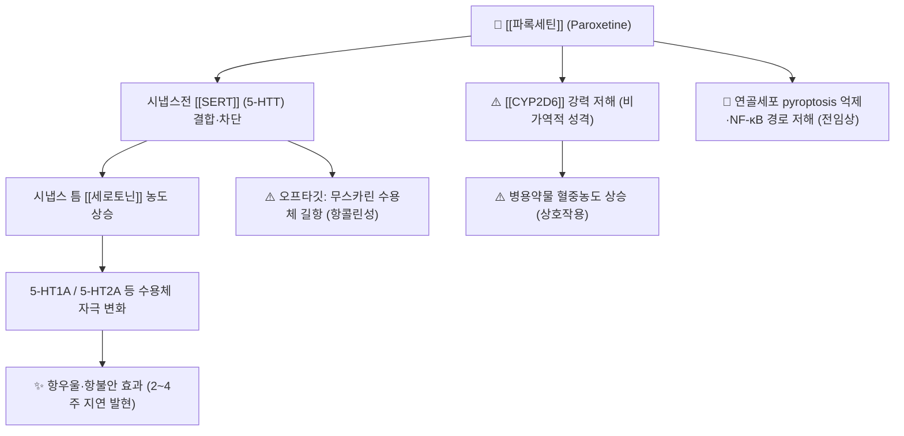

# 💊 [[파록세틴]] (Paroxetine, Paxil, ATC N06AB05)

![[파록세틴_낱알.jpg|540]]
> [그림 1: ① 병태생리·영상 — 파록세틴_낱알]
![[파록세틴_3_구조식.png|540]]
> [그림 2: ② 관련 해부 구조물 — Paroxetine 2D 구조식 (PubChem CID 43815)]

> **핵심 3줄 요약 (Key Summary)**:
> 🧪 주성분·제형: [[파록세틴|파록세틴염산염]](Paroxetine hydrochloride) 반수화물 형태의 경구용 [[SSRI]](선택적 세로토닌 재흡수 억제제). 임상에서는 주로 속방정(10 mg / 20 mg / 30 mg)이 사용되며, 서방정(CR, controlled-release, 12.5 mg / 25 mg)도 존재한다. 화학적으로는 페닐피페리딘 계열의 비삼환계 항우울제로, SSRI 군 중에서도 세로토닌 재흡수 억제 활성이 가장 강력한 축에 속한다.
> 📍 작용 기전: 시냅스 전 신경말단의 세로토닌 수송체([[SERT]], 5-HTT)를 차단하여 시냅스 틈의 [[세로토닌]](5-HT) 농도를 상승시킨다. SSRI 중 [[무스카린 수용체]] 길항(항콜린성) 작용이 상대적으로 가장 강하고, 간 [[CYP2D6]]를 강력하게 저해하여 수많은 약물상호작용을 유발한다.
> 🎯 임상 적응증: [[주요우울장애]], [[강박장애]], [[공황장애]], [[사회불안장애]], [[범불안장애]], [[외상후 스트레스장애]](PTSD), 월경전불쾌장애 등. 아울러 뇌졸중 후 우울증에서 유효성이 메타분석으로 지지되었다(PMID: 32093988). 대표 용법은 성인 20 mg 1일 1회 아침 식후 시작, 필요 시 증량.
> ⚠️ 주의사항: 오심·졸림·성기능장애가 흔하고, 반감기가 짧고 활성대사체가 없어 [[항우울제 중단증후군]](discontinuation syndrome) 위험이 SSRI 중 가장 높은 편이다(PMID: 36345093). [[MAO억제제]]와의 병용은 금기이며, CYP2D6 저해로 인한 [[타목시펜]]·[[메토프롤롤]]·[[삼환계 항우울제]] 등의 혈중농도 상승에 주의해야 한다.

---

## 1. 약물 기본 정보 및 시판 제품 (Brand Identification)

> [그림 1: 식약처 의약품안전나라]

> [!abstract]+ 🧪 3D 약리 분자 구조 (Interactive 3D Viewer)
> <iframe src="https://molecule-viewer-rho.vercel.app/?cid=43815" width="100%" height="450px" frameborder="0" allow="webgl" style="border-radius: 8px;"></iframe>

| 항목 | 상세 정보 |
| :--- | :--- |
| **일반명 (Generic Name)** | [[파록세틴]]염산염(한글) / Paroxetine hydrochloride (hemihydrate) |
| **대표 상품명 (Brand Names)** | **팍실(Paxil), 세로자트(Seroxat), 팍세틴, 파록세틴정 등** (※ YAML `aliases:`에 등록하여 위키링크 통합) |
| **ATC 코드 / 분류** | **N06AB05** (Psychoanaleptics → Antidepressants → Selective serotonin reuptake inhibitors) / 식약처 분류: 항우울제(기타의 중추신경용제) |
| **PubChem CID** | [43815](https://pubchem.ncbi.nlm.nih.gov/compound/43815) |
| **화학식 / 분자량** | C₁₉H₂₀FNO₃ (유리염기) / 329.37 g/mol · 염산염(C₁₉H₂₀FNO₃·HCl) 365.83 g/mol · 반수화물염 374.8 g/mol |
| **주요 제형 및 함량** | 속방정 10 mg / 20 mg / 30 mg, 서방정(CR) 12.5 mg / 25 mg, 액제(현탁액) 10 mg/5 mL (국내 유통은 주로 정제) |
| **식약처 허가 적응증** | [[주요우울장애]](우울증), [[강박장애]], [[공황장애]](광장공포증 동반/비동반), [[사회불안장애]](사회공포증), [[범불안장애]], [[외상후 스트레스장애]] |

### 1.1 대표 시판 제품 및 함유 복합제 매핑 (Brand Identification & Combinations)

| 구분 | 대표 제품명 / 브랜드 | 함유 성분 및 1회당 함량 | 제형 및 특징 | 주요 적응증 및 복약 지도 핵심 |
| :--- | :--- | :--- | :--- | :--- |
| **단일제 (ETC, 전문의약품)** | [[팍실정]] (Paxil), [[세로자트정]] (Seroxat) | [[파록세틴|파록세틴염산염]] 10 mg / 20 mg | 속방정(필름코팅정) | 우울·불안의 1차 표준 투여. 아침 식후 20 mg 시작, 2~4주 간격으로 10 mg씩 증량 |
| **서방정 (ETC)** | Paxil CR, 파록세틴서방정 | [[파록세틴|파록세틴염산염]] 12.5 mg / 25 mg | 서방정(CR) | 위장관 자극·오심 감소 목적, 통째로 삼키도록 지도(분할·씹기 금지) |
| **국내 제네릭 (ETC)** | 파록세틴정(다수 제약사) | [[파록세틴|파록세틴염산염]] 10 mg / 20 mg | 정제 | 성분명 처방 시 조제 가능, 제품 간 성분 동일 |
| **복합제 여부** | **없음 (단일 성분 제제만 존재)** | — | — | 다른 SSRI·SNRI·MAO억제제와의 **중복 투여 금지**, [[세로토닌 증후군]] 위험 |
| **감별 다빈도 일반약** | [[타이레놀]], [[아스피린]], [[이부프로펜]] | 아세트아미노펜, 아세틸살리실산, 이부프로펜 | 정제 | 파록세틴과 병용 시 **출혈 경향 증가** 가능 → 복약력 청취 시 감별 필수 |

> [!warning] 복합제 매핑 시 핵심 감별 포인트
> [[파록세틴]]은 **복합제가 존재하지 않는 단일 성분 전문의약품**이다. 따라서 진료실에서 "우울증 약"이라고 환자가 진술할 경우, 감기약·진통제와의 상호작용보다는 **다른 정신과 약물(SSRI/SNRI/MAOI/항정신병약/삼환계)과의 중복** 및 **CYP2D6 기질 약물과의 병용**을 우선 점검해야 한다.

---

## 2. 분자 약리 기전 및 작용 경로 (Mechanism of Action)

* **주요 작용 기전 (Primary MoA)**:
  * [[파록세틴]]은 시냅스 전 신경말단 세포막의 **세로토닌 수송체(SERT, 5-HTT)** 에 결합하여 세로토닌의 재흡수를 차단한다. 이로 인해 시냅스 틈의 5-HT 농도가 상승하고, 시냅스 후 5-HT 수용체 자극이 증가하여 항우울 효과가 발현된다.
  * SSRI 계열 내 비교에서 [[파록세틴]]은 **세로토닌 재흡수 억제 활성이 가장 강력한 약물 중 하나**로 평가되어 왔으며(PMID: 11420571; PMID: 18345955), 노르에피네프린 재흡수 억제 작용은 상대적으로 미미하다.
  * SSRI 중 **무스카린(M₁) 수용체 길항 작용이 가장 강하여** 구강건조, 변비, 요저류, 인지기능 저하 등 항콜린성 부작용이 상대적으로 잘 나타난다(PMID: 11420571).
* **하류 신호전달 및 생화학적 반응**:
  * 만성 투여 시 시냅스 후 5-HT₁A 수용체의 탈감작(desensitization)과 5-HT₂A 수용체 하향조절이 일어나며, 뇌유래신경영양인자([[BDNF]]) 발현 증가 및 해마 신경세포 생성 촉진이 항우울 효과의 하류 기전으로 제안되어 있다.
  * **전임상 연구(세포·동물 수준)**: 파록세틴이 **NF-κB 경로 활성화를 억제하여 연골세포의 pyroptosis(세포자멸성 염증)를 감쇠시키고 파골세포 형성을 억제함으로써 골관절염 진행을 지연**시켰다는 보고가 있다(PMID: 37605762). 이는 SSRI가 골·연골 대사에 영향을 줄 수 있음을 시사하는 연구로, **사람 대상 임상 근거는 아직 확립되지 않았다(근거 미확인)**.
  * 약물 대사 측면에서는 **CYP2D6에 대한 강력한 저해제**로 작용한다(PMID: 18345955). 이 저해는 경쟁적·부분적 비가역적 성격을 지녀, 병용 약물의 혈중농도를 유의하게 상승시킬 수 있다.

---

## 3. 약동학적 특성 (Pharmacokinetics: ADME)

| 약동학 파라미터 | 수치 및 임상적 의미 |
| :--- | :--- |
| **생체이용률 (Bioavailability, F)** | 약 50% 수준으로 알려져 있음 — 경구 흡수는 양호하나 **상당한 초회통과효과(first-pass)** 를 받음 (※ 일반 약리학 교과서 기준 수치, 제공 논문에서 직접 수치 미확인) |
| **최고혈중농도 도달시간 (Tmax)** | 속방정 약 5~8시간(복용 후 서서히 흡수), 서방정은 이보다 지연됨 (※ 일반 허가사항 기준) |
| **혈장 단백결합률 (Protein Binding)** | 약 93~95% (주로 알부민 및 α₁-산성 당단백 결합) (※ 일반 약리학 기준) |
| **간 대사 효소 (Metabolism)** | **[[CYP2D6]]가 주 대사 효소**(포화 가능성 있음), 일부 [[CYP3A4]] 관여. 대사 결과 생성되는 대사체는 거의 **불활성**이며, 파록세틴 자체가 CYP2D6를 강력 저해함 (PMID: 18345955) |
| **배설 반감기 (Elimination t1/2)** | 평균 약 21시간(개인차 큼, 3~65시간 범위 보고). **활성대사체가 없고 반감기가 상대적으로 짧아**, 용량 변동·중단 시 혈중농도가 빠르게 변동함 (PMID: 36345093에서 중단증후군 위험의 주요 기전으로 설명) |
| **주요 배설 경로 (Excretion)** | 소변 배설이 주 경로이며, 변(담즙) 배설도 일부 존재. **신장애·간장애 시 용량 조절 필요** (구체적 배설 비율은 제공 논문에서 확인되지 않음 → **근거 미확인**) |

> [!note] 약동학 임상 포인트
> ① **비선형(포화) 약동학** 경향이 있어 용량 증량 시 혈중농도가 예상보다 크게 상승할 수 있다.
> ② 반감기가 짧고 활성대사체가 없어 **복용을 잊거나 갑자기 중단하면 중단증후군이 빠르게 나타난다**(PMID: 36345093).
> ③ 간기능 저하 환자 및 고령자에서는 초기 용량을 감량하고, CYP2D6 저해로 인한 병용약물 농도 상승을 반드시 확인한다.

---

## _의학/04_임상 용법·용량 및 처방 가이드 (Dosage & Administration)

| 임상 적응증 | 성인 표준 용법·용량 | 1일 최대 한도 용량 |
| :--- | :--- | :--- |
| **[[주요우울장애]]** | 20 mg 1일 1회, **아침 식후** 투여. 2~4주 간격으로 10 mg씩 증량 가능 | 최대 50 mg/day (일반적으로 20~40 mg 유지) |
| **[[강박장애]]** | 20 mg 1일 1회 시작, 1주 간격 10 mg 증량 | 최대 60 mg/day |
| **[[공황장애]]** | 10 mg 1일 1회 시작(불안 증폭 방지), 1주 후 20 mg으로 증량 | 최대 60 mg/day (통상 40 mg) |
| **[[사회불안장애]]** | 20 mg 1일 1회 | 최대 60 mg/day |
| **[[범불안장애]] / [[외상후 스트레스장애]]** | 20 mg 1일 1회 시작, 필요 시 증량 | 최대 50~60 mg/day (PTSD는 통상 20~50 mg) |
| **고령자·간장애·신장애** | 10 mg 1일 1회로 시작, 증량은 주 1회 이하 | 최대 40 mg/day (고령자) |

* **복약 지도 핵심**:
  * **아침 투여**가 원칙이다. 파록세틴은 활성화 효과(activation)가 있어 저녁 투여 시 **불면**을 유발할 수 있다.
  * 효과 발현까지 **2~4주(불안 증상은 6~8주)** 가 소요되므로 조기 중단하지 않도록 교육한다.
  * **갑작스러운 중단 금지** — 반드시 2~4주 이상에 걸쳐 단계적으로 감량한다(6.2 참조).
  * 서방정(CR)은 **분할·분쇄·씹지 말고 통째로 복용**하도록 지도한다.
* **뇌졸중 후 우울증**: 메타분석에서 파록세틴이 뇌졸중 후 우울증 환자의 우울 척도를 유의하게 개선하는 것으로 보고되었다(PMID: 32093988). 다만 출혈 위험 및 뇌졸중 환자의 병용약물(항혈소판제·항응고제)과의 상호작용을 고려해야 한다.
* **[[외상후 스트레스장애]]**: 체계적 문헌고찰(Cochrane)에서 파록세틴을 비롯한 SSRI가 PTSD 약물치료 옵션으로 평가되었으며, 일부 가이드라인에서는 파록세틴·설트랄린을 1차 약물로 제시한다(PMID: 35234292). 다만 **외상 초점 인지행동치료(TF-CBT) 등 심리치료가 약물 단독보다 우월할 수 있다**는 근거도 함께 보고되었다(PMID: 35234292).

---

## 5. 부작용, 경고 및 약물 상호작용 (Adverse Effects & Interactions)

### 5.1 주요 부작용 및 독성 경고 (Black Box Warnings)

* **세로토닌 증후군 (Serotonin Syndrome)**:
  * [[MAO억제제]], [[트라마돌]], [[리네졸리드]], [[SSRI]]/[[SNRI]] 중복, [[triptan]]계, [[SSRI]]+[[부스피론]] 등과 병용 시 발생 위험이 높다. 발열, 초조, 간대성 근경련, 자율신경 불안정, 설사 등이 나타나면 즉시 중단하고 응급 평가한다.
* **항우울제 중단증후군 (Antidepressant Discontinuation Syndrome)**:
  * 파록세틴은 **반감기가 짧고 활성대사체가 없어** SSRI 중 중단증후군 위험이 가장 높은 축에 속한다(PMID: 36345093). 어지럼, 감각 이상(paresthesia), 오심, 불안, 불면, 전기충격감("brain zaps") 등이 급성 중단 후 수일 내 발생한다.
* **저나트륨혈증 / SIADH**:
  * 고령자, 이뇨제([[티아지드]], [[푸로세미드]]) 병용 환자에서 저나트륨혈증 위험이 증가한다. 우울증 환자의 전해질 이상은 섬망·낙상으로 이어질 수 있어 정기 확인이 필요하다.
* **성기능장애**:
  * SSRI 계열 전체에서 흔한 이상반응으로, **지연성 사정·성욕 저하·발기부전** 등이 나타날 수 있다. 복약 이행도를 떨어뜨리는 주요 원인이므로 투여 전 사전 설명이 중요하다.
* **항콜린성 부작용**:
  * SSRI 중 상대적으로 강한 **무스카린 수용체 길항** 작용으로 구강건조, 변비, 배뇨 곤란, 시야 흐림, 인지기능 저하가 나타날 수 있다(PMID: 11420571). 고령자·[[전립선비대증]]·[[녹내장]] 환자에서 특히 주의한다.
* **출혈 경향**:
  * 혈소판 5-HT 고갈 기전으로 [[NSAIDs]], [[아스피린]], [[와파린]], [[DOAC]] 병용 시 위장관 출혈 위험이 상승한다. 한방 치료에서 **[[단삼]], [[천궁]], [[삼칠근]], [[홍화]] 등 혈행 개선 본초**와 병용 시 출혈 경향을 반드시 모니터링한다.
* **임신·수유 및 소아청소년**:
  * 임신 1기 노출과 **선천성 심기형** 위험 증가 가능성이 보고되어 있어, 임신 계획 시 반드시 처방의와 상의해야 한다. 소아청소년에서는 **자살사고 위험 증가**에 대한 경고가 모든 항우울제에 적용된다.
* **알레르기 및 과민반응**:
  * 피부 발진, 두드러기, 혈관부종, 아나필락시스 등이 드물게 보고된다. 중증 피부 이상반응([[스티븐스-존슨 증후군]], [[독성표피괴사증]]) 발생 시 즉시 중단한다.

### 5.2 주요 병용 금기 및 상호작용

* **절대 병용 금기**:
  * [[MAO억제제]](예: [[페넬진]], [[트라닐시프로민]], [[셀레길린]]) — **세로토닌 증후군** 위험. MAO억제제 중단 후 최소 2주(플루옥세틴은 5주) 경과 후 시작해야 한다.
  * [[리네졸리드]], [[메틸렌블루]] 정맥투여 — 세로토닌 증후군 위험.
  * [[티오리다진]] — QT 연장 및 혈중농도 상승 위험.
* **CYP2D6 매개 상호작용 (파록세틴이 저해제)**:
  * [[타목시펜]]: CYP2D6 저해로 활성대사체(엔독시펜) 생성이 감소하여 **유방암 재발 위험 상승** 가능성이 보고됨.
  * [[메토프롤롤]], [[플레카이니드]], [[프로파페논]]: 혈중농도 상승 → 서맥·부정맥 위험.
  * [[삼환계 항우울제]]([[아미트립틸린]], [[이미프라민]]), [[리스페리돈]], [[할로페리돌]], [[클로자핀]]: 농도 상승 → 독성 위험.
  * [[코데인]], [[트라마돌]]: CYP2D6 매개 활성화 저해로 **진통 효과 감소** 가능.
* **기타 주의**:
  * [[알코올]]: 중추신경 억제 상승, 인지·운동 기능 저하.
  * [[NSAIDs]]/[[아스피린]]/[[항응고제]]: 출혈 위험 상승.
  * [[세인트존스워트]](St. John's wort): 세로토닌 증후군 위험 및 약물 대사 간섭.
  * 다른 [[SSRI]]/[[SNRI]]와의 병용은 원칙적으로 피한다(중복 투여).

---

## 6. 한의 치료 연계 및 병용/테이퍼링 프로토콜 (Integrative Medicine)

> [!warning] 근거 수준 안내
> 아래 6장의 내용은 제공된 논문(PMID: 18345955, 11420571, 32093988, 35234292, 36345093, 37605762)에서 직접 검증된 것이 아니라, **일반적인 임상 통합의학 원칙과 한의학 이론에 기반한 실전 지침**이다. 개별 한약재–파록세틴 간 약동학적 상호작용 데이터는 대부분 **근거 미확인** 상태이므로, 병용 시 환자 반응을 면밀히 관찰하고 필요 시 처방의와 협진한다.

### 6.1 한약·양약 병용 투여 안전성 및 시너지 배오

* **간·신 대사 간섭 완충 처방**:
  * [[파록세틴]]은 간 [[CYP2D6]] 및 일부 [[CYP3A4]]를 통해 대사되므로, **동일 대사경로를 공유할 가능성이 있는 한약재는 시간차 투여(최소 1~2시간 간격)** 를 원칙으로 한다.
  * 특히 **간독성 가능성이 있는 본초([[오약]], [[뇌환]], [[마황]] 등) 및 혈행 촉진 본초([[단삼]], [[천궁]], [[삼칠근]], [[홍화]], [[도인]])** 는 파록세틴의 출혈 경향과 겹칠 수 있으므로 병용 시 주의하고, 출혈 증상(잇몸 출혈, 자반, 흑변) 발생 여부를 문진한다.
  * 우울·불안 환자는 자율신경 실조로 위장관 증상(오심, 식욕부진)을 동반하는 경우가 많아, **[[향부자]], [[진피]], [[생강]], [[반하]]** 등 위기(胃氣)를 조화시키는 본초를 배합하여 파록세틴의 오심·소화불량을 완충하는 접근을 고려할 수 있다(임상 경험적 접근, 근거 미확인).
* **상승 배오 (Synergy) 개념**:
  * 한의학에서 우울·불안·불면은 **간울(肝鬱), 심담허겁(心膽虛怯), 심신불교(心腎不交), 기혈양허(氣血兩虛)** 등의 변증으로 접근한다.
  * 대표적으로 **[[소요산]](逍遙散)** — 간울비허(肝鬱脾虛)형 우울·불안, **[[귀비탕]](歸脾湯)** — 심비양허(心脾兩虛)형 불면·건망, **[[천왕보심단]](天王補心丹)** — 음허화왕(陰虛火旺)형 불면·초조, **[[시호가용골모려탕]](柴胡加龍骨牡蠣湯)** — 간울화화(肝鬱化火)형 불안·공황 증상에 고려할 수 있다.
  * 침 치료로는 **[[백회]](GV20), [[인당]](EX-HN3), [[신문]](HT7), [[내관]](PC6), [[태충]](LR3), [[삼음교]](SP6), [[사신총]](EX-HN1)** 등을 배혈하여 안신정지(安神定志) 효과를 노릴 수 있다.
  * 위 처방·혈위는 **파록세틴 감량을 목표로 하는 보조 요법**으로 활용하며, "한약이 파록세틴의 약효를 대체한다"는 표현은 피하고 반드시 **환자 상태에 따른 단계적 감량**으로 접근한다.

### 6.2 양약 감량 및 한의 전환(테이퍼링) 가이드

* **감량 프로토콜 (Discontinuation / Tapering)**:
  1. **사전 평가**: 환자가 현재 복용 중인 파록세틴 용량, 복용 기간(특히 4주 이상 여부), 과거 중단 시도 및 중단증후군 경험, 임신 계획, 병용약물(항혈소판제·NSAIDs·타목시펜 등)을 확인한다.
  2. **감량 속도**: 파록세틴은 **중단증후군 고위험 약물**이므로 급성 중단은 금지한다(PMID: 36345093). 통상 **4주 이상에 걸쳐 단계적 감량**이 권고되며, 필요 시 수개월에 걸친 초저용량 감량(hyperbolic tapering)을 고려한다.
  3. **액상 제형 활용**: 정제 분할이 어려운 경우 액제(현탁액)를 활용하거나, 필요 시 처방의와 상의하여 감량이 용이한 다른 SSRI로 전환(cross-taper)하는 방법을 검토한다.
  4. **한의 치료 병행 시점**: 감량 시작 **2~4주 전**부터 침·한약 치료를 병행하여 수면 안정, 자율신경 안정, 소화기 증상 완충 효과를 확보한 뒤 감량에 들어가는 것이 임상적으로 안전하다.
  5. **모니터링 체크**: 감량기에는 2주 간격으로 ① 기분 저하 재발, ② 어지럼·전기충격감·오심 등 중단증후군 증상, ③ 불면·불안 악화, ④ 자살사고 여부를 반드시 확인한다.
  6. **재증량 기준**: 중단증후군 증상이 일상생활을 방해하거나 우울 증상이 재발하면 **즉시 이전 용량으로 복귀**하고, 안정화 후 더 느린 속도로 재시도한다.

---

## 7. 💡 사용자 진료실 핵심 필기 & 실전 임상 체크리스트

### 7.1 진료실 3대 핵심 문진 체크리스트

1. **복용 약물 전체 목록 및 CYP2D6 상호작용 확인**: 단일제 전문약이므로 한약·일반약(감기약, 진통제, 수면제) 및 **타목시펜, 메토프롤롤, 리스페리돈, 트라마돌, 코데인** 병용 여부를 반드시 확인한다.
2. **출혈 경향 및 소화기 증상 청취**: 잇몸 출혈, 코피, 멍, 흑변 여부를 확인하고, 한방 처방에 혈행 촉진 본초가 포함될 경우 병용 위험을 재평가한다. 오심·식욕부진·변비 등 항콜린성/위장관 증상도 함께 문진한다.
3. **중단증후군 및 기분 상태 모니터링**: 감량 중이거나 복용을 잊은 환자에게서 어지럼, 전기충격감, 감각 이상, 불안·불면 악화가 있는지 확인하고, 자살사고·자해 위험을 반드시 사정한다.

### 7.2 환자 티칭 스크립트

> *"환자분, 지금 드시는 파록세틴은 뇌 속 세로토닌 농도를 올려 우울·불안·공황 증상을 완화하는 약입니다. 효과가 나타나기까지 보통 2~4주 정도 걸리기 때문에 증상이 조금 나아졌다고 임의로 끊으시면 안 됩니다. 특히 이 약은 다른 우울증 약보다 끊을 때 어지럼증이나 전기 오는 느낌, 오심 같은 증상이 잘 생기는 약이라서, 저희가 한약과 침 치료로 몸 상태를 안정시켜 드리면서 아주 천천히, 몇 주에서 몇 달에 걸쳐 줄여나갈 것입니다. 갑자기 중단하거나 다른 병원 약과 함께 드시면 세로토닌이 과해지는 위험한 상황이 생길 수 있으니, 새로운 약을 드시기 전에는 꼭 저희에게 먼저 알려주세요."*

### 7.3 실전 감별 포인트 메모

| 상황 | 감별 포인트 | 대응 |
| :--- | :--- | :--- |
| 복용 중 어지럼·감각 이상 호소 | 중단증후군 vs 기립성 저혈압 vs 한약 반응 | 복용 순응도 확인, 필요 시 이전 용량 복귀 |
| 갑작스러운 초조·발열·근경련 | [[세로토닌 증후군]] 감별 | 즉시 파록세틴 중단, 응급 평가 |
| 멍·잇몸 출혈 증가 | SSRI 출혈 경향 + 한약 혈행 본초 병용 | 혈행 본초 조정, 필요 시 혈액검사 |
| 고령 환자 의식 변화·낙상 | 저나트륨혈증/SIADH 감별 | 전해질 검사, 이뇨제 병용 확인 |
| 임신 계획 상담 | 선천성 심기형 위험 상담 필요 | 처방의 협진, 대체 약물 논의 |

---

## 8. 출처 및 학술 참고 문헌 (References)

* Tang SW, Helmeste D. Paroxetine. *Expert Opin Pharmacother*. 2008. PMID: [18345955](https://pubmed.ncbi.nlm.nih.gov/18345955/)
  * `[연구 요약]` 파록세틴의 약리학적 특성, SSRI 계열 내 위치, CYP2D6 저해 및 임상 적용을 종합적으로 정리한 약물 리뷰.
* Bourin M, Chue P. Paroxetine: a review. *CNS Drug Rev*. 2001. PMID: [11420571](https://pubmed.ncbi.nlm.nih.gov/11420571/)
  * `[연구 요약]` 파록세틴의 작용 기전, SSRI 중 세로토닌 재흡수 억제 강도 및 항콜린성 특성, 주요 적응증(우울증·공황장애·강박장애·사회공포증 등)을 정리한 리뷰.
* Li L, Han Z. Effectiveness of Paroxetine for Poststroke Depression: A Meta-Analysis. *J Stroke Cerebrovasc Dis*. 2020. PMID: [32093988](https://pubmed.ncbi.nlm.nih.gov/32093988/)
  * `[연구 요약]` 뇌졸중 후 우울증에서 파록세틴의 유효성을 평가한 메타분석 — 우울 척도 개선 효과를 보고.
* Williams T, Phillips NJ, et al. Pharmacotherapy for post traumatic stress disorder (PTSD). *Cochrane Database Syst Rev*. 2022. PMID: [35234292](https://pubmed.ncbi.nlm.nih.gov/35234292/)
  * `[연구 요약]` PTSD 약물치료에 대한 Cochrane 체계적 문헌고찰 — SSRI(파록세틴 등)의 효과 및 심리치료와의 비교 근거를 제시.
* Fornaro M, Cattaneo CI, et al. Antidepressant discontinuation syndrome: A state-of-the-art clinical review. *Eur Neuropsychopharmacol*. 2023. PMID: [36345093](https://pubmed.ncbi.nlm.nih.gov/36345093/)
  * `[연구 요약]` 항우울제 중단증후군에 대한 최신 임상 리뷰 — 반감기가 짧고 활성대사체가 없는 파록세틴의 높은 중단증후군 위험과 감량 원칙을 기술.
* Zheng X, Qiu J, et al. Paroxetine Attenuates Chondrocyte Pyroptosis and Inhibits Osteoclast Formation by Inhibiting NF-κB Pathway Activation to Delay Osteoarthritis Progression. *Drug Des Devel Ther*. 2023. PMID: [37605762](https://pubmed.ncbi.nlm.nih.gov/37605762/)
  * `[연구 요약]` 파록세틴이 NF-κB 경로 저해를 통해 연골세포 pyroptosis와 파골세포 형성을 억제하여 골관절염 진행을 지연시킨다는 전임상(세포·동물) 연구 — 사람 대상 임상 근거는 아직 미확립.
* 식품의약품안전처 의약품안전나라 의약품통합정보시스템 (https://nedrug.mfds.go.kr)
  * `[연구 요약]` 국내 허가 의약품의 품목 기준코드, 허가사항, 용법·용량 및 부작용 안전성 정보. (그림 1 출처)