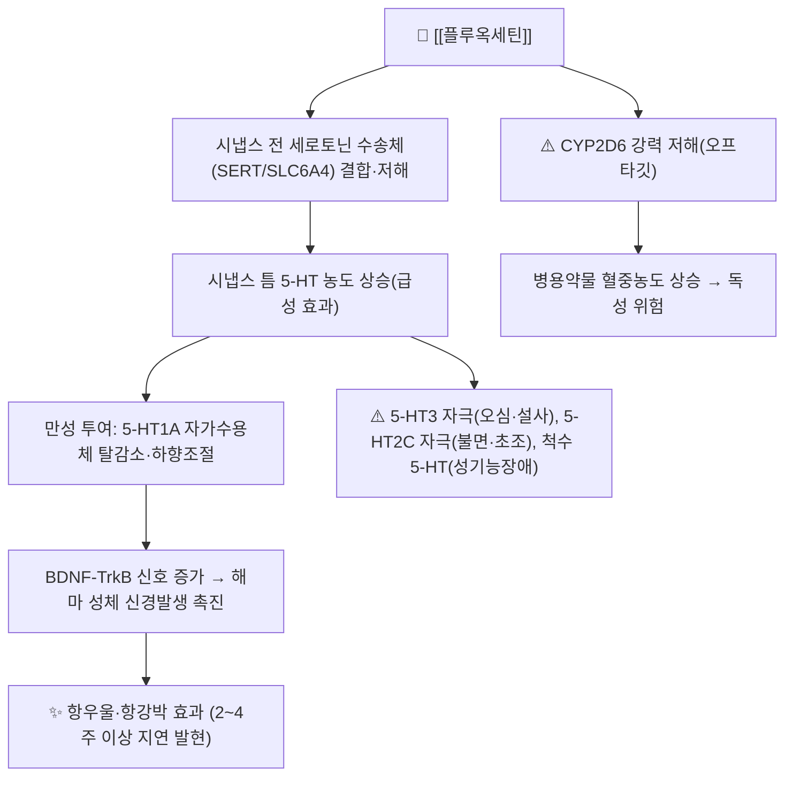

# 💊 [[플루옥세틴]] (Fluoxetine, Prozac, ATC N06AB03)

![[플루옥세틴_낱알.jpg|540]]
> [그림 1: ① 병태생리·영상 — 플루옥세틴_낱알]
![[플루옥세틴_3_구조식.png|540]]
> [그림 2: ② 관련 해부 구조물 — Fluoxetine 2D 구조식 (PubChem CID 3386)]

> **핵심 3줄 요약 (Key Summary)**:
> 🧪 주성분·제형: [[플루옥세틴]]은 17개의 탄소 골격에 트리플루오로메틸기(-CF₃)와 페녹시프로필아민 측쇄를 가진 **비가역적이지 않은(가역적) 선택적 세로토닌 재흡수 억제제(SSRI)** 이다. 분자식 C₁₇H₁₈F₃NO, 분자량 309.33 g/mol(유리염기)이며, 임상에서는 염산염(분자량 345.79) 형태로 **캡슐 10 mg·20 mg**이 가장 널리 쓰이고, 해외에서는 정제·경구용 액제(20 mg/5 mL)·지속형 제제도 시판된다.
> 📍 작용 기전: 시냅스 전 뉴런의 세로토닌 수송체(SERT, SLC6A4)를 저해하여 시냅스 틈의 5-HT 농도를 상승시키고, 만성 투여 시 5-HT₁A 자가수용체 탈감작·BDNF-TrkB 신호 증가·해마 성체 신경발생(adult neurogenesis) 촉진을 통해 항우울 효과를 나타낸다. 동시에 **CYP2D6 강력 저해제**로 작용하여 다수의 향정신성 약물 혈중농도를 끌어올린다.
> 🎯 임상 적응증: 주요우울장애(MDD)가 1차 적응증이며 강박장애(OCD)에도 사용된다. 성인 표준 시작 용량은 **20 mg 1일 1회 아침 투여**, 필요 시 4주 간격으로 증량하여 통상 최대 60 mg/day(제품·적응증에 따라 80 mg/day까지)이다.
> ⚠️ 주의사항: **MAO 억제제와 병용 금기**(세로토닌 증후군), 소아·청소년 및 젊은 성인의 자살사고·행동 증가에 대한 경고, 초기 불면·초조·오심, 성기능장애, 저나트륨혈증(SIADH, 특히 고령자), 출혈 경향 증가(NSAIDs·항응고제 병용)가 핵심 관리 포인트이다. 긴 반감기(노르플루옥세틴 7~15일) 때문에 **중단 후에도 5주간 MAOI를 투여할 수 없다.**

---

## 1. 약물 기본 정보 및 시판 제품 (Brand Identification)

> [그림 1: 식약처 의약품안전나라]
> [!abstract]+ 🧪 3D 약리 분자 구조 (Interactive 3D Viewer)
> <iframe src="https://molecule-viewer-rho.vercel.app/?cid=3386" width="100%" height="450px" frameborder="0" allow="webgl" style="border-radius: 8px;"></iframe>

| 항목 | 상세 정보 |
| :--- | :--- |
| **일반명 (Generic Name)** | [[플루옥세틴]](한글) / Fluoxetine hydrochloride (염산플루옥세틴) |
| **대표 상품명 (Brand Names)** | **프로작(Prozac)** — 한국릴리, 및 제네릭 **플루옥세틴캡슐/정 10·20 mg** 다수 (※ YAML `aliases:`에 등록하여 위키링크 통합) |
| **ATC 코드 / 분류** | **N06AB03** (N06AB — 선택적 세로토닌 재흡수 억제제 / Antidepressants) |
| **PubChem CID** | [3386](https://pubchem.ncbi.nlm.nih.gov/compound/3386) (fluoxetine, 유리염기) |
| **화학식 / 분자량** | C₁₇H₁₈F₃NO / **309.33 g/mol** (유리염기), 염산염 345.79 g/mol |
| **주요 제형 및 함량** | 캡슐 10 mg, 20 mg(국내 주력), 정제 10/20 mg, 경구용 액제 20 mg/5 mL(해외) |
| **식약처 허가 적응증** | **우울증(주요우울장애), 강박장애** 중심. 신경성 대식증(bulimia nervosa)·공황장애·사회공포증 등은 국가·제품별 허가사항에 따라 상이하므로 **제품별 허가사항 확인 필요(일부 적응증 근거 미확인)** |

### 1.1 대표 시판 제품 및 함유 복합제 매핑 (Brand Identification & Combinations)

플루옥세틴은 [[타이레놀]]·[[판피린]]과 같은 OTC 복합 진통·감기약 성분과는 성격이 전혀 다르며, **중독성·금단·자살위험 때문에 반드시 전문의 처방(ETC)으로만** 투여되는 향정신성 약물이다. 아래 표는 "동일 성분 단일제 / 복합 향정신제 / 감별 대상 약물" 구도로 재구성한 것이다.

| 구분 | 대표 제품명 / 브랜드 | 함유 성분 및 1회당 함량 | 제형 및 특징 | 주요 적응증 및 복약 지도 핵심 |
| :--- | :--- | :--- | :--- | :--- |
| **단일제 (ETC)** | [[프로작]], 플루옥세틴캡슐 | [[플루옥세틴]] 염산염 10 mg / 20 mg | 경질캡슐, 정제 | 1일 1회 아침 투여, 4주 후 반응 평가, 임의 중단·증량 금지 |
| **복합 향정신제 (해외)** | Symbyax (올란자핀+플루옥세틴) | [[올란자핀]] + [[플루옥세틴]] | 캡슐 | 치료저항성 우울증·양극성 우울 삽화, 체중·혈당·추체외로 모니터링 (※ 국내 출시 여부 근거 미확인) |
| **소아·청소년 제형** | 플루옥세틴 액제(해외) | 20 mg/5 mL | 경구 액제 | 소아 용량 적정용, 정제 삼킴 곤란 환자 |
| **감별 다빈도 약물** | [[설트랄린]](졸로프트), [[파록세틴]], [[에스시탈로팜]](렉사프로) | 다른 SSRI 계열 성분 | 정제 | 계열 내 교체 시 세로토닌 증후군·중단증후군 위험, 반감기 차이 고려 |
| **병용 금기 약물 (절대)** | [[페넬진]], [[트라닐시프로민]](MAOI), [[리네졸리드]] | MAO-A/B 억제제, 항생제 | 정제/주사 | 병용 시 세로토닌 증후군, 플루옥세틴 중단 후 **최소 5주** 경과 후 투여 |

---

## 2. 분자 약리 기전 및 작용 경로 (Mechanism of Action)

* **주요 작용 기전 (Primary MoA)**:
  * 플루옥세틴은 세로토닌 수송체(SERT)의 세로토닌 결합 부위에 결합하여 재흡수를 억제한다. 노르에피네프린 수송체(NET)·도파민 수송체(DAT)에 대한 친화성은 상대적으로 낮아 "선택적(selective)" SSRI로 분류되지만, 실제로는 5-HT₂C 수용체 길항 등 부수 작용도 일부 관여한다.
  * CYP450 효소 중 **CYP2D6를 강력하게 억제**하며(경쟁적·비가역적 성격 혼재), 이는 플루옥세틴 자체의 대사와 병용약물(삼환계 항우울제, 타목시펜, 코데인, 메토프롤롤, 플레카이니드 등)의 혈중농도 상승으로 이어진다.
* **하류 신호전달 및 생화학적 반응**:
  * 급성 효과는 시냅스 5-HT 상승이지만, **임상 효과 발현은 2~4주 이상 지연**된다. 이는 5-HT₁A 자가수용체 탈감작(desensitization), 5-HT₂A 수용체 하향조절, cAMP-CREB-BDNF 신호 축 증가를 통한 신경가소성 회복이라는 "만성 적응" 기전으로 설명된다.
  * 동물모델 연구에서 플루옥세틴은 해마 치상회(dentate gyrus)의 성체 신경발생을 증가시켰고, **신체 운동(physical exercise)과 병행 시 그 효과가 상승**하는 것으로 보고되었다(PMID: 30236533). 다만 이는 주로 설치류 기반 전임상 근거이며, 인간 우울증 치료에서 신경발생 증가가 임상 호전의 필수 경로인지에 대해서는 **인간 대상 확증 근거 미확인**이다.

---

## 3. 약동학적 특성 (Pharmacokinetics: ADME)

| 약동학 파라미터 | 수치 및 임상적 의미 |
| :--- | :--- |
| **생체이용률 (Bioavailability, F)** | 약 **72%**(문헌에 따라 60~80% 범위). 음식물 섭취는 흡수 정도에 임상적으로 유의한 영향을 주지 않는 것으로 보고됨(PMID: 8194283, PMID: 7935707) |
| **최고혈중농도 도달시간 (Tmax)** | 약 **6~8시간** (경구 캡슐 기준). 노르플루옥세틴은 대략 4~8시간대에 최고치 |
| **혈장 단백결합률 (Protein Binding)** | 약 **94~95%** (주로 알부민 및 α₁-산성당단백) |
| **간 대사 효소 (Metabolism)** | **CYP2D6**(주 경로) → 활성 대사체 **노르플루옥세틴(norfluoxetine)** 생성. CYP2C9·CYP2C19·CYP3A4도 일부 관여. 노르플루옥세틴 역시 SERT 저해 활성을 가진 **활성 대사체** |
| **배설 반감기 (Elimination t1/2)** | 플루옥세틴 **1~3일**(단회), 만성 투여 시 **4~6일**; 노르플루옥세틴 **7~15일**. CYP2D6 poor metabolizer에서는 더 연장됨(PMID: 8194283, PMID: 7935707) |
| **주요 배설 경로 (Excretion)** | 대사체 형태로 **소변 약 60%**, **분변 약 15%** 내외(문헌별 편차 존재). 신기능 저하 시 유의한 용량 조절은 통상 불필요하다고 보고되나, 중증 간기능 저하 시 감량 필요 |

> **임상 포인트**: 활성 대사체의 반감기가 7~15일에 달하기 때문에 플루옥세틴은 **스스로 "자가 테이퍼링(self-tapering)" 효과**를 가진다. 즉 다른 SSRI(파록세틴·벤라팩신)보다 중단증후군 발생이 적은 대신, 약효·부작용·상호작용이 **중단 후에도 수 주간 지속**되며 MAOI 전환 시 5주 washout이 필요하다.

---

## _의학/04_임상 용법·용량 및 처방 가이드 (Dosage & Administration)

| 임상 적응증 | 성인 표준 용법·용량 | 1일 최대 한도 용량 |
| :--- | :--- | :--- |
| **주요우울장애 (MDD)** | **20 mg 1일 1회 아침** 투여로 시작. 4주 이상 투여 후 반응 평가, 필요 시 20 mg씩 증량 | 통상 **60 mg/day** (일부 제품·국가 기준 80 mg/day) |
| **강박장애 (OCD)** | 20 mg 1일 1회 시작, 2주 이상 간격으로 증량 | 통상 60 mg/day (일부 80 mg/day) |
| **신경성 대식증 (bulimia nervosa)** | 60 mg/day 1일 1회 (해외 승인 용량) | 60 mg/day — **국내 허가 여부 제품별 확인 필요(근거 미확인)** |
| **고령자 / 간기능 저하** | 10 mg 1일 1회 또는 **10~20 mg 격일** 투여로 감량 시작 | 가능한 저용량 유지, 저나트륨혈증 모니터링 |
| **소아·청소년 (해외 기준)** | 8세 이상 우울증 10~20 mg/day 시작 | 20~60 mg/day (국내 허가 연령 **근거 미확인**) |

* **투여 시점**: 반감기가 길어 1일 1회 아침 투여가 기본이다. 초기 불면·초조를 줄이기 위해 아침 복용을 권장하며, 불면이 심하면 오전 이른 시간으로 앞당긴다.
* **용량 적정 원칙**: 항우울 효과는 즉시 나타나지 않으므로 **4주 이내 조기 증량을 서두르지 않는다**. 반면 부작용(오심·불안·불면)은 첫 1~2주에 집중되므로, 부작용이 심하면 오히려 감량 후 재증량한다.
* **중단 시**: 갑작스러운 중단 시 어지럼·감각이상·불안·불면 등 중단증후군이 발생할 수 있으므로 **단계적 감량**이 원칙이다(6장 참조).

---

## 5. 부작용, 경고 및 약물 상호작용 (Adverse Effects & Interactions)

### 5.1 주요 부작용 및 독성 경고 (Black Box Warnings)
* **자살사고·행동 증가 (Black Box Warning)**:
  * 소아·청소년 및 젊은 성인(25세 이하)에서 항우울제 투여 초기(특히 첫 1~2개월, 용량 변경 시) 자살사고·행동 위험이 증가할 수 있다. 초기 면밀한 추적 관찰과 가족 교육이 필수이다.
* **세로토닌 증후군 (Serotonin Syndrome)**:
  * MAOI, 리네졸리드, 트라마돌, 트립탄, 세인트존스워트(관엽연교) 등과 병용 시 초조·발한·근간대경련·고체온·자율신경 불안정이 나타날 수 있다. **MAOI는 절대적 병용 금기**이며, 플루옥세틴 중단 후 최소 5주(노르플루옥세틴 반감기 고려) 경과 후 MAOI를 시작한다.
* **위장관 및 중추신경계 부작용**:
  * 오심·설사·식욕감소(초기 체중감소)·구갈이 흔하다. 5-HT₃ 자극이 오심의 주요 기전으로 제시된다.
  * **불면·초조·불안·두통**이 초기 또는 용량 증량 시 흔하다. Cochrane 리뷰에서 성인 불면증에 대한 항우울제의 근거수준은 낮았고, **플루옥세틴은 오히려 불면을 유발·악화시킬 수 있어 수면 개선 목적의 단독 사용은 권고되지 않는다**(PMID: 29761479).
* **성기능장애**:
  * 지연성 사정, 성욕 감소, 오르가즘 지연 등이 SSRI 계열 공통의 용량의존적 부작용이며, 복약 순응도를 떨어뜨리는 주된 원인이다.
* **저나트륨혈증 / SIADH**:
  * 고령자, 이뇨제 병용 환자에서 위험이 높다. 항이뇨호르몬(ADH) 분비 이상이 기전으로 제시된다.
* **출혈 경향 증가**:
  * 혈소판 내 5-HT 고갈을 통해 출혈시간을 연장시킬 수 있어 NSAIDs·아스피린·와파린 병용 시 위장관 출혈 위험이 증가한다.
* **QT 연장 및 심장 독성**:
  * 고용량에서 QT 연장 보고가 있으며, 심질환자에서는 주의가 필요하다.
* **조증 전환 / 양극성 경향**:
  * 양극성 장애 환자에서 조증·경조증 삽화를 유발할 수 있어, 투여 전 양극성 선별이 필수이다.
* **임부·수유부**:
  * 임신 3기 노출 시 신생아 적응증후군(호흡곤란·수유곤란·초조) 및 신생아 지속성 폐고혈압(PPHN) 관련 논란이 보고되었다. 임신 중에는 반드시 이득/위험을 평가하여 결정하고, 임의 중단하지 않는다. 모유로 소량 이행되나 상대적 안전성 자료가 일부 존재한다.
* **알레르기 및 과민반응**:
  * 피부 발진, 두드러기, 혈관부종 등이 드물게 보고된다. 스티븐스-존슨 증후군(SJS)은 매우 드물며, 발진 동반 전신 증상 시 즉시 중단한다.

### 5.2 주요 병용 금기 및 상호작용
* **절대 병용 금기**: MAO 억제제([[페넬진]], [[트라닐시프로민]], [[모클로베미드]]), [[리네졸리드]], [[티오리다진]](QT 연장), 피모지드.
* **CYP2D6 저해로 인한 상호작용**: 삼환계 항우울제, [[타목시펜]](활성대사체 감소 → 재발 위험), [[코데인]]·[[트라마돌]](진통효과 감소·세로토닌 위험), [[메토프롤롤]]·[[프로파페논]]·[[플레카이니드]](심독성), 항정신병약 다수.
* **CYP2C19 관련**: [[클로피도그렐]] 활성화 감소 가능성.
* **출혈 위험 상승**: NSAIDs, 아스피린, [[와파린]], NOAC 계열.
* **세로토닌성 약물**: 트립탄, [[세인트존스워트]](관엽연교), SAMe, 트립토판.
* **알코올**: 중추신경 억제·판단력 저하를 악화시키므로 금주 권고.

---

## 6. 한의 치료 연계 및 병용/테이퍼링 프로토콜 (Integrative Medicine)

### 6.1 한약·양약 병용 투여 안전성 및 시너지 배오
* **간·신 대사 간섭 완충 처방**:
  * 플루옥세틴은 **CYP2D6·CYP2C19·CYP3A4** 경로를 공유하는 한약재와 병용 시 혈중농도 변동 위험이 있다. 다수의 한약 복합 처방이 이들 효소에 영향을 줄 수 있으므로, 명확한 상호작용 데이터가 확보되지 않은 처방은 **최소 1~2시간 시간차 투여**를 원칙으로 하고, 투여 초기 2~4주간 오심·어지럼·초조·불면 등 세로토닌 과잉 증상을 집중 관찰한다.
  * **특정 한약재-플루옥세틴 상호작용의 정량적 근거는 대부분 미확인**이며, 개별 본초 단위의 CYP 저해 데이터는 시험관(in vitro) 연구 수준에 머물러 있다.
* **절대 피해야 할 병용**:
  * **관엽연교(Hypericum perforatum, 세인트존스워트)** — 세로토닌 증후군 위험이 명확히 보고된 대표적 병용 금기 본초이다.
  * 마황(Ephedra), 교감신경 흥분성 본초 — 초조·불면·혈압 상승 악화.
* **상승 배오 (Synergy) 개념**:
  * 우울·불안의 한의 변증(간울기체, 심비양허, 담울 등)에 따라 [[소요산]]·[[단치소요산]], [[귀비탕]], [[시호가용골모려탕]], [[반하후박탕]], [[감맥대조탕]] 등을 변증에 맞게 운용하면서 양방약 용량을 서서히 줄여나가는 접근이 임상에서 시도된다. 다만 **플루옥세틴과 개별 처방의 병용에 대한 무작위 대조시험 근거는 확인되지 않음(근거 미확인)** 으로, 환자별 반응과 안전성 모니터링을 전제로 신중히 적용한다.
* **신경가소성 관점의 병용**: 전임상 연구에서 플루옥세틴의 해마 신경발생 촉진 효과가 **신체 운동과 병행 시 상승**하는 것으로 보고되었다(PMID: 30236533). 이는 침 치료·운동요법·기공 등 비약물적 개입을 병행하는 근거로 참고할 수 있으나, **인간 임상에서의 확증은 아직 부족하다.**

### 6.2 양약 감량 및 한의 전환(테이퍼링) 가이드
* **감량 프로토콜(일반 원칙)**:
  1. 환자가 정신과 전문의와 협의된 안정 상태(최소 4~8주 증상 안정)에 도달한 후 시작한다.
  2. **20 mg → 10 mg → 10 mg 격일 → 중단** 방향으로, 각 단계를 **2~4주 이상** 유지하며 관찰한다.
  3. 플루옥세틴은 활성 대사체 반감기가 7~15일로 길기 때문에 **다른 SSRI보다 중단증후군이 적게 나타나는 편**이다. 이 장점을 활용하면 감량 단계를 다소 단순화할 수 있으나, 그만큼 **약효·부작용이 오래 지속**된다는 점을 환자에게 반드시 설명한다.
  4. 한약·침 치료를 병행하는 경우, 감량 단계마다 **수면·식욕·기분·불안 스케일(예: PHQ-9, GAD-7)** 을 기록하여 악화 여부를 객관적으로 추적한다.
* **MAOI 또는 다른 계열로 전환 시**:
  * MAOI로 전환 시 플루옥세틴 중단 후 **최소 5주** 대기한다(노르플루옥세틴 반감기 고려).
  * 다른 SSRI/SNRI로 전환 시에도 중복 세로토닌 작용을 피하기 위해 교차 감량(cross-taper) 또는 시간차를 둔다.
* **한의 전환 시 주의**:
  * 감량기에는 **자율신경 불안정(어지럼·발한·심계항진)** 이 나타나기 쉬우므로, [[시호가용골모려탕]]·[[계지가용골모려탕]]·[[온담탕]] 계열의 안신(安神) 처방을 변증에 따라 검토할 수 있다(개별 병용 근거 미확인).
  * 감량 중 자살사고 재발, 심한 불면, 조증 삽화가 나타나면 **즉시 한의 단독 치료로 전환하지 말고 정신과 협진**을 우선한다.

---

## 7. 💡 사용자 진료실 핵심 필기 & 실전 임상 체크리스트

### 7.1 진료실 3대 핵심 문진 체크리스트
1. **복용 기간·용량·최근 변경 여부 확인**: 현재 용량(10/20/40/60 mg), 증량·감량 시점, 임의 중단 여부를 확인한다. 플루옥세틴은 반감기가 길어 **중단 후에도 2~4주간 약효·부작용이 지속**되므로 "끊었는데도 증상이 남는다"는 호소는 정상 범주일 수 있다.
2. **병용 약물·건강기능식품 전수 조사**: 감기약·진통제(NSAIDs)·와파린·타목시펜·트라마돌·트립탄, 그리고 **관엽연교(세인트존스워트) 함유 제품**까지 반드시 확인한다. CYP2D6 저해로 인한 상호작용이 이 약의 가장 큰 임상적 위험이다.
3. **자살사고·조증·불면·성기능장애 스크리닝**: 초기 1~2개월 및 용량 변경 시 자살사고를 직접 질문하고, 수면 양상(초기 불면·초조), 성기능 변화, 체중 변화를 확인한다. 양극성 장애 가족력이 있으면 조증 전환 가능성을 점검한다.

### 7.2 환자 티칭 스크립트
> *"환자분, 지금 드시는 플루옥세틴(프로작)은 뇌에서 세로토닌이라는 신경전달물질이 오래 머물도록 해서 기분을 안정시키는 약입니다. 효과는 보통 2~4주 뒤부터 서서히 나타나기 때문에, 첫 1~2주에 속이 울렁거리거나 잠이 얕아지고 불안해 보이는 것은 약이 적응하는 과정에서 흔히 생기는 반응입니다. 다만 이 약은 몸에서 빠져나가는 데 시간이 오래 걸려서, 드시던 약을 갑자기 끊으시면 어지럼이나 감각 이상이 생길 수 있으니 반드시 의료진과 상의해서 단계적으로 줄여야 합니다. 또 감기약·진통제·성요한풀(관엽연교) 같은 건강식품을 함께 드시면 위험할 수 있으니, 새로 드시는 약이나 영양제가 있으면 꼭 먼저 말씀해 주세요. 저희 한의원에서는 수면과 소화, 불안 증상을 한약과 침으로 함께 관리하면서 양약을 서서히 줄여나갈 수 있도록 돕겠습니다."*

---

## 8. 출처 및 학술 참고 문헌 (References)

* Altamura AC, Moro AR, Percudani M. Clinical pharmacokinetics of fluoxetine. *Clin Pharmacokinet*. 1994. PMID: **8194283**
  * `[연구 요약]` 플루옥세틴의 흡수·생체이용률(약 72%)·단백결합률·CYP2D6 매개 활성 대사체 생성 및 플루옥세틴·노르플루옥세틴의 반감기 차이 등 임상 약동학 전반을 정리한 대표 리뷰.
* Gram L. Fluoxetine. *N Engl J Med*. 1994. PMID: **7935707**
  * `[연구 요약]` 플루옥세틴의 작용기전(SERT 저해), 임상 적응증, 용량, 부작용 및 MAOI를 포함한 약물상호작용을 종합한 최상위 의학지 리뷰.
* Stokes PE. Fluoxetine: a five-year review. *Clin Ther*. 1993. PMID: **8519034**
  * `[연구 요약]` 출시 후 5년간의 플루옥세틴 임상 경험(효능·안전성·장기 투여 데이터)을 정리한 리뷰.
* Tiraboschi P, Spagnoli A. [Fluoxetine]. *Medicina (Firenze)*. 1989. PMID: **2682124**
  * `[연구 요약]` 플루옥세틴의 초기 임상 소개 및 약리학적 개요(이탈리아어 문헌).
* Micheli L, Ceccarelli M, D'Andrea G, Tirone F. Depression and adult neurogenesis: Positive effects of the antidepressant fluoxetine and of physical exercise. *Brain Res Bull*. 2018. PMID: **30236533**
  * `[연구 요약]` 우울증과 해마 성체 신경발생의 관계, 그리고 플루옥세틴 및 신체 운동이 신경발생을 촉진하는 기전(BDNF 등)을 다룬 전임상 중심 리뷰.
* Everitt H, Baldwin DS, Stuart B, et al. Antidepressants for insomnia in adults. *Cochrane Database Syst Rev*. 2018. PMID: **29761479**
  * `[연구 요약]` 성인 불면증에 대한 항우울제의 효과를 평가한 Cochrane 체계적 문헌고찰로, 전반적 근거수준이 낮음을 보고. 플루옥세틴의 불면 유발 가능성 및 수면 개선 목적 사용의 부적합성 판단에 참고.

* 식품의약품안전처 의약품안전나라 의약품통합정보시스템 (https://nedrug.mfds.go.kr)
  * `[자료 요약]` 국내 허가 플루옥세틴 제품의 성상·함량·허가 적응증·용법용량·부작용 안전성 정보 및 본 문서 상단 성상 이미지 출처. ※ 국내 허가 적응증 및 소아 적응 연령 등 세부 항목은 **제품별 허가사항 확인이 필요하며, 본 노트에서 "근거 미확인"으로 표시한 항목은 원문 허가사항 대조가 요구된다.**

<!-- 보관 태그(1회용·링크오류, 필요시 복원): 항우울제/SSRI -->
