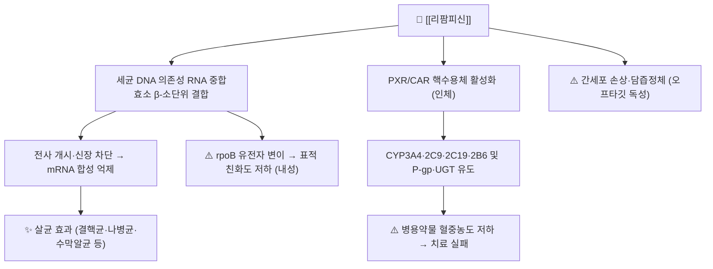

# 💊 [[리팜피신]] (Rifampicin, Rifampin, ATC J04AB02)

> **핵심 3줄 요약 (Key Summary)**:
> 🧪 **주성분·제형**: 리팜피신(Rifampicin, Rifampin)은 리파마이신 계열 반합성 광범위 항마이코박테리움제로, 분자식 C43H58N4O12·분자량 약 822.9 g/mol의 거대 지용성 거대환상(macrocyclic) 구조를 가진다. 경구용 캡슐·정제(150 mg/300 mg/450 mg 등) 및 정맥주사용 분말(리팜피신나트륨)로 시판되며, 결핵 치료에서는 [[이소니아지드]], [[피라진아미드]], [[에탐부톨]] 등과 복합요법으로 사용된다.
> 📍 **작용 기전**: 세균의 **DNA 의존성 RNA 중합효소(DNA-dependent RNA polymerase, RNAP) β-소단위**에 결합하여 mRNA 전사 개시·신장을 차단함으로써 단백질 합성을 억제하고 살균(bactericidal) 효과를 나타낸다(Acocella 1978; Schonell & Dorken 1972). 동시에 인체에서는 **CYP3A4·CYP2C9·CYP2C19·CYP2B6 및 P-당단백질(P-gp)·OATP 유도제**로 작용하여 광범위한 약물상호작용을 일으킨다(Niemi & Backman 2003; Baciewicz & Self 1984).
> 🎯 **임상 적응증**: 결핵(폐결핵·폐외결핵) 1차 표준 복합요법, 나병(한센병), 수막알균 보균자 박멸, 브루셀라증·MRSA 등 감수성 균주 감염의 병용요법. 성인 결핵 기준 **1일 10 mg/kg (보통 450~600 mg), 공복 1일 1회** 투여가 표준이다.
> ⚠️ **주의사항**: **간독성(치명적 간염 가능)**, 위장관 장애, 체액(소변·눈물·땀·객담)의 주황색 착색, 간헐요법 시 독감 유사 증후군·혈소판감소증, 과민반응이 주요 이상반응이다. 대사 유도로 인한 **경구피임제 실패, 와파린 항응고 효과 감소, 스테로이드 효력 상실** 등이 임상적으로 가장 중요한 상호작용이다(Lévesque & Lecomte 1998). 단독 투여 시 내성 발생이 매우 빠르므로 **반드시 병용요법**으로 사용한다.

---

## 1. 약물 기본 정보 및 시판 제품 (Brand Identification)

![[리팜피신_낱알.jpg|540]]
> [그림 1: 식약처 의약품안전나라]

> [!abstract]+ 🧪 3D 약리 분자 구조 (Interactive 3D Viewer)
> <iframe src="https://molecule-viewer-rho.vercel.app/?cid=5381226" width="100%" height="450px" frameborder="0" allow="webgl" style="border-radius: 8px;"></iframe>

| 항목 | 상세 정보 |
| :--- | :--- |
| **일반명 (Generic Name)** | [[리팜피신]](Rifampicin) / Rifampin(미국명) |
| **대표 상품명 (Brand Names)** | 국내 단일제는 리팜피신 캡슐·정제로 유통되며, 복합제(4제 고정용량복합제)로도 시판된다. 개별 상품명·제조사 목록은 **근거 미확인**(식약처 의약품안전나라 허가목록에서 최신 확인 필요) |
| **ATC 코드 / 분류** | **J04AB02** (J04AB — Rifamycins, 항결핵제 계열) |
| **PubChem CID** | [5381226](https://pubchem.ncbi.nlm.nih.gov/compound/5381226) |
| **화학식 / 분자량** | C43H58N4O12 / 약 822.94 g/mol |
| **주요 제형 및 함량** | 경구 캡슐·정제(150 mg, 300 mg, 450 mg, 600 mg 등), 정맥주사용 동결건조 분말(성인 1일 600 mg, 2~3회 분할 정맥주입) |
| **식약처 허가 적응증** | 결핵 및 기타 리팜피신 감수성 균주(폐결핵, 폐외결핵, 나병, 수막구균 보균자, 브루셀라증 등) 감염증. 정확한 국내 허가 문구는 식약처 의약품안전나라 품목정보 확인 필요 |

> [!note] 분자 구조적 특징
> 리팜피신은 *Streptomyces mediterranei* 유래 리파마이신 B를 반합성적으로 개량한 화합물로, 방향족 나프탈렌 코어와 거대 지방족 다리(ansa bridge)로 구성된 **안사마이신(ansamycin) 계열**이다. 분자 전체가 크고 지용성이 높아 세포막·세균 세포벽을 잘 통과하며, 이 특성이 결핵균 대식세포 내부까지 침투하는 세포내 살균력의 근거가 된다.

### 1.1 대표 시판 제품 및 함유 복합제 매핑 (Brand Identification & Combinations)

| 구분 | 대표 제품 / 성분 구성 | 함유 성분 및 1회당 함량 | 제형 및 특징 | 주요 적응증 및 복약 지도 핵심 |
| :--- | :--- | :--- | :--- | :--- |
| **단일제 (ETC)** | 리팜피신 캡슐/정 | [[리팜피신]] 단일 성분 | 경구 캡슐·정제 (150~600 mg) | 결핵 복합요법의 구성 성분, **빈속(식전 1시간 또는 식후 2시간)** 복용, 임의 중단 금지 |
| **결핵 복합제 (ETC)** | 2제·3제·4제 고정용량복합제(FDC) | [[리팜피신]] + [[이소니아지드]] (± [[피라진아미드]] ± [[에탐부톨]]) | 정제 | 초기 집중치료기(2개월) 표준, 복약 순응도 향상 목적, 간독성 중복 주의 |
| **주사제 (ETC)** | 리팜피신 주사용 분말 | [[리팜피신나트륨]] | 정맥주입용 | 경구 복용 불가 시, 중증 결핵·패혈증 등, 주입 시 저혈압 모니터링 |
| **나병·기타 감염 (ETC)** | 다제요법(MDT) 구성제 | [[리팜피신]] + [[답손]] ± [[클로파지민]] | 정제 | 나병 월 1회 요법, 소변 착색 사전 고지 필수 |
| **감별: 다른 항결핵제** | [[이소니아지드]], [[에탐부톨]], [[피라진아미드]] | 각 단일 성분 | 정제/캡슐 | 말초신경병증(INH), 시신경염(EMB), 고요산혈증(PZA) 등 고유 독성 감별 |
| **감별: 광범위 항생제** | [[아지트로마이신]], [[클래리트로마이신]] | 마크로라이드계 | 정제/주사 | 비결핵 마이코박테리움 감염에서 리팜피신과 병용 시 **CYP3A4 상호작용** 주의 |

---

## 2. 분자 약리 기전 및 작용 경로 (Mechanism of Action)

* **주요 작용 기전 (Primary MoA)**:
  * 리팜피신은 세균의 **DNA 의존성 RNA 중합효소(RNAP)의 β-소단위(rpoB 유전자 산물)**에 비공유적으로 결합한다. 결합 부위는 효소의 활성 중심에서 약간 떨어진 부위로, RNAP가 DNA 주형 위에서 2~3개의 뉴클레오티드만 중합한 상태(초기 전사 복합체)를 안정화·고정시켜 **전사 신장(elongation)을 물리적으로 차단**한다.
  * 결과적으로 세균의 mRNA 합성이 중단되어 단백질 합성이 정지하고, 리팜피신은 정균이 아닌 **살균(bactericidal)** 작용을 나타낸다. 세포내(intracellular) 결핵균에 대해서도 살균력이 유지되는데, 이는 지용성이 높아 대식세포막을 통과하기 때문이다.
  * 사람의 RNA 중합효소와는 구조적 차이가 커서 **선택적 독성(selective toxicity)**이 성립한다. 다만 세균 RNAP와의 결합 부위에 점돌연변이(rpoB)가 생기면 리팜피신 결합 친화도가 급격히 떨어져 내성이 발생하며, **단독요법 시 내성률이 매우 높아 반드시 타 항결핵제와 병용**한다(Acocella 1978).

* **하류 신호전달 및 생화학적 반응**:
  * **인체 측면 — 핵수용체 매개 효소 유도**: 리팜피신은 **PXR(pregnane X receptor)·CAR(constitutive androstane receptor)**를 활성화하여 표적 유전자 전사를 촉진한다. 그 결과 CYP3A4, CYP2C9, CYP2C19, CYP2B6, CYP2C8 등의 발현이 증가하고, 장관·간의 **P-당단백질(P-gp, ABCB1)** 및 **OATP(유기음이온운반단백질)** 등 수송체 발현도 함께 증가한다(Niemi & Backman 2003). 이 유도 효과는 투여 시작 후 수일~1주에 걸쳐 서서히 나타나고, 중단 후에도 **수일~2주간 지속**되어 약물 중단 시점을 기준으로 상호작용을 판단해야 한다.
  * **장간 순환**: 담즙으로 배설된 리팜피신 및 대사체가 장에서 재흡수되는 장간순환(enterohepatic circulation)이 일부 존재하여 혈중농도 곡선이 이중 봉우리를 보일 수 있다(Acocella 1978).
  * **내성 기전**: rpoB 변이 외에도 세포막 투과성 저하, 유출펌프 과발현 등이 보고되어 있으나, 임상적으로 가장 중요한 것은 rpoB 점돌연변이다.

---

## 3. 약동학적 특성 (Pharmacokinetics: ADME)

| 약동학 파라미터 | 수치 및 임상적 의미 |
| :--- | :--- |
| **생체이용률 (Bioavailability, F)** | 공복 시 약 **90~95%** 수준으로 높음. 다만 **음식물·제제 품질에 따라 흡수 변동성이 크며**, 이는 치료 실패와 내성 발생의 주요 원인이 되므로 공복 복용이 원칙이다(Ellard & Fourie 1999). |
| **최고혈중농도 도달시간 (Tmax)** | 공복 투여 시 약 **1.5~4시간**. 정맥 투여 시 즉시 최고 농도 도달(Acocella 1978). |
| **혈장 단백결합률 (Protein Binding)** | 약 **80~90%** (주로 알부민 결합). 저알부민혈증·간경변 시 유리형 증가 가능(Acocella 1978). |
| **간 대사 효소 (Metabolism)** | **간에서 주로 탈아세틸화(deacetylation)**되어 25-탈아세틸리팜피신(항균 활성 보유)으로 전환되고, 일부는 가수분해된다. 리팜피신의 제거는 CYP 의존성이 낮지만, **그 자체가 CYP3A4·2C9·2C19·2B6 및 P-gp의 강력한 유도제**로 작용하는 것이 약동학적 핵심이다(Niemi & Backman 2003). |
| **배설 반감기 (Elimination t1/2)** | 정상 성인에서 약 **2~5시간**. **반복 투여 시 반감기가 단축**되는 경향(자기유도, autoinduction)이 보고되어 있다(Acocella 1978). 간기능 저하 시 연장. |
| **주요 배설 경로 (Excretion)** | **주로 담즙을 통한 대변 배설**(탈아세틸화 대사체 형태), **요중 배설은 약 15~30%**(일부 미변화체) 수준으로 보고된다(Acocella 1978). 배설된 색소로 인해 소변·눈물·땀·객담이 주황색으로 착색된다. |
| **식사 영향** | 고지방 식사 후 투여 시 흡수 지연·감소가 관찰되며, 흡수 불량은 임상 실패와 직결되므로 **식전 1시간 또는 식후 2시간** 투여를 권장한다(Ellard & Fourie 1999). |

> [!caution] 흡수 편차의 임상적 의미
> Ellard & Fourie(1999)는 리팜피신의 생체이용률 확보가 화학요법 성패의 필수 조건임을 강조하였다. 제제 간 생물학적 동등성 차이, 음식물, 위장관 질환, 병용 제산제(알루미늄·마그네슘 함유) 등이 흡수를 저해할 수 있으므로 복약 지도 시 반드시 공복 복용과 병용 약물 간격을 함께 교육한다.

---

## 4. 임상 용법·용량 및 처방 가이드 (Dosage & Administration)

| 임상 적응증 | 성인 표준 용법·용량 | 1일 최대 한도 용량 |
| :--- | :--- | :--- |
| **폐결핵·폐외결핵 (초기 집중치료)** | **1일 10 mg/kg (보통 450~600 mg)**, **공복(식전 1시간 또는 식후 2시간) 1일 1회**. 통상 [[이소니아지드]]·[[피라진아미드]]·[[에탐부톨]]과 병용. | 600 mg/day |
| **결핵 유지치료 / 간헐요법** | 1일 10 mg/kg 또는 주 2~3회 600 mg 간헐 투여(직접복약확인치료 DOT 하에서). 간헐요법 시 면역학적 이상반응(독감 유사 증후군) 빈도 증가. | 600 mg/day |
| **수막알균 보균자 박멸** | 600 mg 1일 2회, 2일간 | 1,200 mg/day (단기) |
| **나병 (다제요법, MDT)** | 600 mg **월 1회** ([[답손]] 일 100 mg ± [[클로파지민]]과 병용) | 월 600 mg |
| **브루셀라증 등 감수성 균주 감염** | 600~900 mg/day 분할 투여, 타 항생제와 병용 | 900 mg/day |
| **경구 복용 불가 시 (정맥주사)** | 600 mg을 생리식염수에 희석하여 2~3시간 이상 천천히 정맥주입 | 600 mg/day |
| **소아** | 1일 10~20 mg/kg (최대 600 mg/day) | 600 mg/day |

> [!warning] 용량·용법 핵심 원칙
> 1) **단독요법 금지**: 리팜피신 단독 사용은 내성 선택을 촉진하므로, 결핵 치료에서는 반드시 2제 이상 병용한다.
> 2) **복용 시간 엄수**: 공복 복용 원칙. 제산제·수크랄페이트 등은 흡수를 저해하므로 **1~2시간 이상 간격**을 둔다.
> 3) **임의 중단 금지**: 치료 실패·재발·다제내성결핵(MDR-TB)의 최대 원인이 복약 중단이다.
> 4) **간기능 추적**: 치료 전 및 치료 중 정기적으로 AST/ALT·빌리루빈을 확인한다.

---

## 5. 부작용, 경고 및 약물 상호작용 (Adverse Effects & Interactions)

### 5.1 주요 부작용 및 독성 경고

* **간독성 (Hepatotoxicity) — 가장 중요한 독성**:
  * 리팜피신 투여 환자의 상당수에서 **무증상 트랜스아미나제 상승**이 관찰되며, 대개 투여 초기 1~2주 내에 나타나고 적응(adaptation)되면서 정상화되는 경향이 있다. 그러나 일부에서는 임상적 간염, 담즙정체성 황달, 드물게 **급성 간부전(치명적)**까지 진행할 수 있다(Acocella 1978; Schonell & Dorken 1972).
  * **고위험군**: 기존 간질환(간경변, 만성 B형/C형 간염), 알코올 남용, 영양실조, 고령, 그리고 **[[이소니아지드]]와의 병용**(간독성 상가 작용), 마이코박테리움 감염 치료 중 다른 간독성 약물 병용.
  * 주황색으로 변한 소변이 황달로 오인되는 경우가 있으므로, **체액 착색과 진성 황달(공막 황염색)을 감별**해야 한다.
* **위장관 장애**:
  * 오심, 구토, 복부 불쾌감, 식욕부진, 설사 등이 흔하다. 대개 경미하며 식후 투여로 완화될 수 있으나, 공복 복용 원칙과 충돌하므로 처방 시 환자와 상의한다.
* **체액 착색 (Orange-red discoloration)**:
  * 소변·눈물·땀·객담·모유가 주황~적색으로 착색된다. 이는 약물 자체의 색소 배설에 의한 것으로 **무해하나 반드시 사전 고지**해야 하며, **콘택트렌즈의 영구 착색**도 주의사항이다(Schonell & Dorken 1972).
* **면역학적 이상반응 (간헐요법 관련)**:
  * 간헐적(주 2~3회) 또는 불규칙 투여 시 **독감 유사 증후군(발열·오한·근육통·두통)**, **혈소판감소증**, 용혈성 빈혈, 급성 신부전, 호흡곤란 등이 보고된다. 매일 투여 시에는 상대적으로 빈도가 낮다.
* **알레르기 및 과민반응**:
  * 피부 발진·소양감, 약물열, 호산구 증가. 드물게 **아나필락시스**, **스티븐스-존슨 증후군(SJS)/독성표피괴사용해(TEN)** 및 급성 간질성 신염이 보고되어 있으며, 발생 시 즉시 중단하고 응급 처치한다.
* **기타**:
  * 두통, 어지럼, 졸음, 부종, 고요산혈증, 저칼륨혈증 등이 드물게 보고된다.

### 5.2 주요 병용 금기 및 상호작용

리팜피신은 **가장 강력한 임상적 효소 유도제 중 하나**이며, 그 결과는 "투여 약물의 혈중 농도를 떨어뜨려 치료 실패"로 나타난다. Niemi & Backman(2003)은 이 상호작용이 임상적으로 유의한 경우와 그렇지 않은 경우를 구분해 판단할 것을 강조하였다.

| 상호작용 약물/군 | 기전 | 임상 결과 및 대처 |
| :--- | :--- | :--- |
| **경구피임제** | CYP3A4 유도 → 에스트로겐·프로게스틴 대사 촉진 | **피임 실패**. 비호르몬성 피임법 병행 또는 다른 피임법 권장 |
| **[[와파린]] 등 경구 항응고제** | CYP2C9·3A4 유도 | INR 저하, 항응고 효과 감소. **INR 집중 모니터링 및 용량 증량** 필요 |
| **[[글루코코르티코이드]](스테로이드)** | CYP3A4 유도 | 스테로이드 혈중농도 저하로 **기저질환(천식·자가면역질환·부신기능부전) 악화**. Lévesque & Lecomte(1998)는 리팜피신-스테로이드 병용 시 용량 조정·모니터링의 필요성을 보고하였다 |
| **항레트로바이러스제(PI, NNRTI, INSTI 등)** | CYP3A4 유도 및 P-gp 유도 | HIV 치료 실패·내성 위험. 병용 시 대체 요법 검토 |
| **타크롤리무스·사이클로스포린·에베로리무스** | CYP3A4·P-gp 유도 | 면역억제 효과 상실 → 이식편 거부반응. 농도 측정 필수 |
| **[[스타틴]]계 (심바스타틴 등)** | CYP3A4 유도 | LDL 강하 효과 감소, 심혈관 위험 증가 |
| **[[디곡신]]** | 장관 P-gp 유도 | 디곡신 흡수·혈중농도 저하 → 심부전 조절 실패 가능 |
| **아졸계 항진균제([[이코나졸]], [[케토코나졸]]) 및 마크로라이드계([[클래리트로마이신]])** | 상호 CYP 억제/유도 | 양방향 상호작용, 항진균·항생 효과 저하 |
| **[[벤조디아제핀]]·[[부프레노르핀]]·일부 항정신병약** | CYP3A4 유도 | 진정·진통 효과 감소, 금단 증상 유발 가능 |
| **[[이소니아지드]]** | 간독성 상가 | 간염 위험 증가, 간기능 집중 모니터링 |
| **제산제(알루미늄·마그네슘), 수크랄페이트** | 위장관 흡수 저해 | 리팜피신 흡수 감소 → **1~2시간 이상 투여 간격** |
| **알코올** | 간독성 상가 | 치료 기간 중 **금주** 원칙 |

> [!danger] 상호작용 판단의 실제 원칙
> 리팜피신의 유도 효과는 **투여 시작 후 수일~1주에 걸쳐 서서히 발현되고, 중단 후에도 약 1~2주 지속**된다. 따라서 "리팜피신을 중단했으니 이제 안전하다"고 판단해서는 안 되며, 병용약물의 **용량 재조정(titration)** 및 혈중농도·INR·면역억제제 trough level 모니터링이 필수적이다(Baciewicz & Self 1984; Niemi & Backman 2003). 간독성 상가 작용이 있는 약물([[아세트아미노펜]] 고용량, [[메토트렉세이트]], 일부 항경련제)의 병용은 특히 주의한다.

---

## 6. 한의 치료 연계 및 병용/테이퍼링 프로토콜 (Integrative Medicine)

### 6.1 한약·양약 병용 투여 안전성 및 시너지 배오

* **간 대사 간섭 완충 처방 (필수 원칙)**:
  * 리팜피신은 **간독성 위험이 높은 약물**이며, 결핵 치료는 원칙적으로 수개월간 지속된다. 결핵 치료 중 한약을 병용할 경우 **가장 먼저 간기능(AST/ALT, 빌리루빈, ALP)을 확인**하고, 한약 개시 전후 2~4주 간격으로 추적검사를 시행한다.
  * 리팜피신 자체는 CYP 유도제이므로, 한약재 성분 중 CYP3A4·P-gp 기질로 알려진 성분의 혈중농도가 저하될 수 있다. 반대로 일부 한약재는 CYP3A4를 **억제**하여 리팜피신의 대사·유도 효과와 복합적으로 상호작용할 수 있다. 다만 **개별 한약재-리팜피신 간 정량적 상호작용 데이터는 현재 근거 미확인**이며, 따라서 임상적으로는 **한약과 리팜피신 복용을 최소 1~2시간 시간차**로 두고, 간독성 관련 본초(예: [[천궁]] 등 다량 사용 시 주의 본초)는 감량·단기 사용을 원칙으로 한다.
  * 또한 리팜피신은 위장관 흡수가 음식물·약물에 민감하므로, 한약(탕약)은 리팜피신 복용 **전후 1~2시간을 비워** 투여하는 것이 흡수 편차를 줄이는 안전한 방법이다.
* **상승 배오 (Synergy) — 신중한 접근**:
  * 결핵 치료 중 환자가 호소하는 **식욕부진·피로·기침·도한(盜汗)·체중감소**에 대해, 간독성 위험이 낮은 처방([[사군자탕]] 계열의 보기 처방, [[보중익기탕]] 등)과 [[황기]], [[백출]], [[맥문동]], [[오미자]] 등의 본초를 **소량·단기**로 병용하는 접근이 임상적으로 시도될 수 있다. 다만 리팜피신과의 병용에 대한 **직접적인 임상시험 근거는 미확인**이므로, 환자의 간기능 수치와 자각 증상을 매 방문마다 확인하면서 단계적으로 적용한다.
  * **금기 본초 접근**: 간독성이 보고된 본초(예: [[백선피]], 마황 과량, 일부 생약 복합제) 및 알코올 함유 제제는 리팜피신 복용 기간 중 **원칙적으로 배제**한다.

### 6.2 양약 감량 및 한의 전환(테이퍼링) 가이드

* **리팜피신은 "테이퍼링 대상"이 아니다 — 절대 원칙**:
  * 리팜피신을 포함한 항결핵제는 **결핵 치료 완료 시점(통상 6~9개월, 폐외결핵·약제내성에 따라 연장)**을 지침에 따라 결정하며, 증상 호전만을 이유로 한의원에서 임의로 감량·중단해서는 안 된다. 임의 중단은 **재발·다제내성결핵(MDR-TB)**의 최대 위험 인자다.
  * 한의 치료는 **항결핵제를 대체하는 것이 아니라 "치료 완주(treatment completion)를 지지하는 보조 요법"**으로 위치시킨다.
* **감량 프로토콜 (해당 없음 / 협진 원칙)**:
  * 결핵 치료 종료는 **결핵 전문 의료기관(보건소·결핵전문병원)의 판단**에 따른다. 한의원에서는 다음의 지지 요법만 담당한다.
    1. **치료 완주 지지**: 항결핵제 복약 순응도 상담, 부작용(오심·피로·간수치 상승) 관리, 보기(補氣)·양혈(養血) 처방의 보조적 적용.
    2. **간기능 보호 모니터링**: 매 방문 시 AST/ALT·빌리루빈 확인, 이상 시 즉시 처방 중단 및 양방 협진 의뢰.
    3. **잔여 증상 관리**: 치료 종료 후 남는 기침·기력저하·식욕부진에 대해 침·한약으로 단계적 회복 치료.
  * **즉시 협진이 필요한 적신호**: 공막 황염색, 진한 소변(주황색 착색과 감별 필요), 심한 오심·구토, 발열, 발진, 출혈 경향(혈소판감소 의심), 갑작스러운 시력 저하(에탐부톨 관련).

---

## 7. 💡 사용자 진료실 핵심 필기 & 실전 임상 체크리스트

### 7.1 진료실 3대 핵심 문진 체크리스트

1. **복용 약물 전체 리스트업 및 성분 중복 확인**:
   * 결핵 치료 중인지, 복합제(FDC)를 복용 중인지 확인한다. 결핵 복합제는 리팜피신 함량이 정제마다 다르므로 **정확한 1일 총 용량**을 확인한다.
   * **리팜피신은 강력한 CYP3A4 유도제**이므로, 복용 중인 모든 양약(항응고제, 경구피임제, 스테로이드, 항경련제, 면역억제제, 스타틴, 디곡신)과 한약·건강기능식품(특히 [[세인트존스워트]], 밀크씨슬 등)을 반드시 문진한다.
2. **간기능·음주력·영양상태 및 동반 간독성 약물**:
   * 주 3회 이상 음주 여부, 만성 B형/C형 간염 보유 여부, 기존 간질환 여부를 청취한다. **[[아세트아미노펜]] 함유 종합감기약·진통제를 습관적으로 복용**하는 환자는 간독성 상가 위험이 크므로 성분 중복을 반드시 확인한다.
   * 결핵 치료 중 발생한 식욕부진·체중감소·피로는 한의 보조 치료의 주요 표적이면서, 동시에 **간손상의 초기 신호일 수 있다**는 점을 항상 염두에 둔다.
3. **체액 착색 교육 여부 및 이상반응 모니터링**:
   * 소변·눈물·땀·객담의 주황색 착색은 **정상적인 약물 효과**임을 사전에 고지한다. 콘택트렌즈 착색 가능성도 안내한다.
   * 발진, 발열, 독감 유사 증상, 멍·출혈 경향, 심한 오심·복통, 황달 소견이 있으면 즉시 복용을 중단하고 양방 협진을 받도록 안내한다.

### 7.2 환자 티칭 스크립트

> *"환자분, 지금 드시는 리팜피신은 결핵균을 직접 죽이는 아주 중요한 약입니다. 두 가지 꼭 기억하셔야 합니다. 첫째, **빈속에(식전 1시간이나 식후 2시간) 하루 한 번, 정해진 시간에** 드셔야 약효가 제대로 나옵니다. 둘째, **이 약은 혼자 끊거나 줄이시면 안 됩니다.** 증상이 좋아져도 임의로 중단하면 균이 약에 저항하는 '내성'을 갖게 되어 치료가 훨씬 어려워집니다.*
> *또 하나, 이 약을 드시면 **소변이나 눈물, 땀이 주황색으로 변할 수 있는데 이는 정상이며 몸에 해롭지 않습니다.** 다만 콘택트렌즈가 착색될 수 있으니 안경을 착용하시는 것이 좋습니다.*
> *그리고 이 약은 다른 약의 효과를 떨어뜨리는 힘이 매우 강합니다. **피임약, 혈전약(와파린), 스테로이드, 당뇨·혈압약 등**을 함께 드시고 계시면 반드시 말씀해 주셔야 합니다. 저희 한의원에서는 결핵 치료를 방해하지 않도록 **침과 한약으로 기력과 식욕, 간 기능을 지지하면서 치료를 끝까지 마치실 수 있도록 함께 관리**해 드리겠습니다. 다만 한약과 이 약은 최소 1~2시간 간격을 두고 드시고, 간 수치는 정기적으로 확인하시겠습니다."*

---

## 8. 출처 및 학술 참고 문헌 (References)

* **Niemi M, Backman JT (2003).** Pharmacokinetic interactions with rifampicin: clinical relevance. *Clin Pharmacokinet*. PMID: 12882588
  * `[연구 요약]` 리팜피신이 CYP3A4·2C9·2C19·2B6 및 P-gp·OATP 등 약물대사효소와 수송체를 유도함으로써 발생하는 약동학적 상호작용을 임상적 중요도에 따라 정리한 종설. 본 노트의 5.2절 상호작용표의 핵심 근거.
* **Acocella G (1978).** Clinical pharmacokinetics of rifampicin. *Clin Pharmacokinet*. PMID: 346286
  * `[연구 요약]` 리팜피신의 흡수·분포·대사·배설, 단백결합률, 반감기 및 반복투여 시 자기유도(autoinduction) 등 약동학 전반을 정리한 고전적 근거 문헌. 본 노트의 3장 약동학 표 근거.
* **Lévesque H, Lecomte F (1998).** [Rifampicin-glucocorticoid combinations]. *Rev Med Interne*. PMID: 9775162
  * `[연구 요약]` 리팜피신과 글루코코르티코이드 병용 시 스테로이드 대사 촉진으로 인한 효력 저하 및 임상적 악화 사례를 다룬 문헌. 5.2절 스테로이드 상호작용 근거.
* **Ellard GA, Fourie PB (1999).** Rifampicin bioavailability: a review of its pharmacology and the chemotherapeutic necessity for ensuring optimal absorption. *Int J Tuberc Lung Dis*. PMID: 10593709
  * `[연구 요약]` 리팜피신의 생체이용률 확보가 결핵 화학요법 성패에 필수적임을 강조한 종설. 제제 간 차이, 음식물 영향, 흡수 불량과 치료 실패의 관계를 논함. 3장 및 4장의 공복 복용 원칙 근거.
* **Schonell M, Dorken E (1972).** Rifampin. *Can Med Assoc J*. PMID: 4622757
  * `[연구 요약]` 리팜피신의 항균 기전, 임상 적응증, 이상반응(특히 체액 착색, 위장관 장애, 간기능 이상)을 정리한 초기 임상 종설.
* **Baciewicz AM, Self TH (1984).** Rifampin drug interactions. *Arch Intern Med*. PMID: 6380442
  * `[연구 요약]` 리팜피신의 효소 유도에 의한 임상적으로 중요한 약물상호작용을 체계적으로 정리한 문헌. 항응고제·경구피임제·스테로이드 등 병용 시 용량 조정 원칙의 근거.

* Brunton LL, Hilal-Dandan R, Knollmann BC, eds. *Goodman & Gilman's The Pharmacological Basis of Therapeutics*. 13th ed. McGraw-Hill; 2018.
  * `[연구 요약]` 리팜피신을 포함한 항마이코박테리움제의 분자 약리학, 약동학 및 임상 치료 지침 총람(교과서 참고).
* 식품의약품안전처 의약품안전나라 의약품통합정보시스템 (https://nedrug.mfds.go.kr)
  * `[연구 요약]` 국내 허가 의약품의 품목기준코드, 허가사항, 용법·용량 및 이상반응 안전성 정보. 국내 시판 상품명 및 식약처 분류 코드는 본 시스템에서 최신 확인이 필요하다(본 노트에서는 **근거 미확인**으로 표기).

---

### 🔗 연계 개념 (Related Concepts)
* 병용 약물: [[이소니아지드]] · [[피라진아미드]] · [[에탐부톨]] · [[답손]] · [[클로파지민]]
* 상호작용 대상: [[와파린]] · [[글루코코르티코이드]] · [[디곡신]] · [[스타틴]] · [[경구피임제]]
* 개념: [[간독성]] · [[CYP3A4 유도]] · [[P-당단백질]] · [[다제내성결핵(MDR-TB)]] · [[약물상호작용]]
* 분류: [[항결핵제]] · [[항생제]] · [[양방약]]