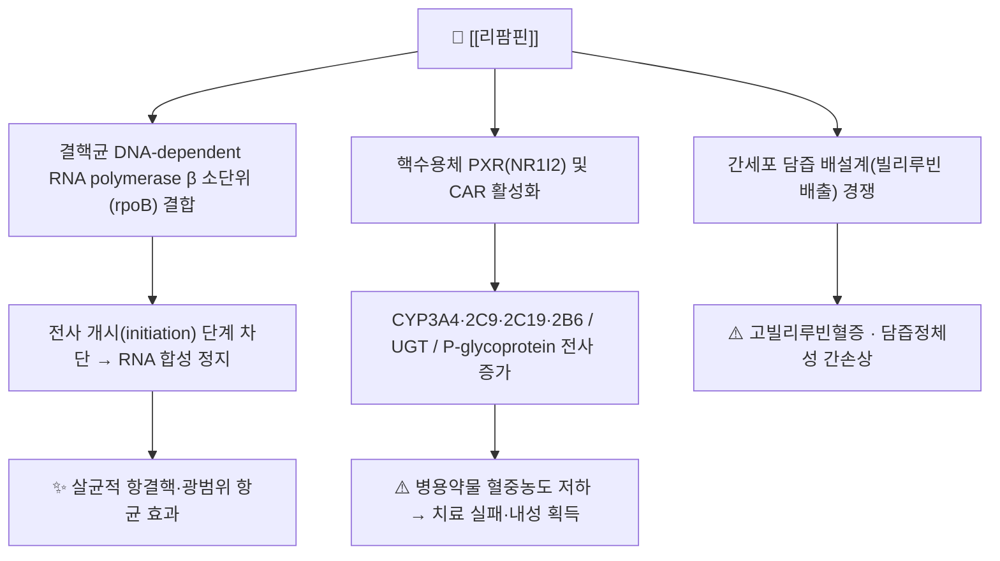

# 💊 [[리팜핀]] (Rifampin, Rifampicin, ATC J04AB02)

> **핵심 3줄 요약 (Key Summary)**:
> 🧪 주성분·제형: *Amycolatopsis rifamycinica*(구 *Streptomyces mediterranei*) 유래 리파마이신계 반합성 유도체 [[리팜핀]](C₄₃H₅₈N₄O₁₂, MW 822.9 g/mol). 국내에서는 주로 경구용 캡슐·정제(150 mg, 300 mg)로 유통되며, 이소니아지드·피라진아미드와의 고정용량복합제(FDC)도 사용된다. 주사제(정맥용)는 해외에서 중증 결핵·수막알균 질환에 사용된다.
> 📍 작용 기전: 결핵균의 DNA-dependent RNA polymerase β 소단위(*rpoB* 유전자 산물)에 결합하여 **전사 개시(initiation) 단계를 차단**함으로써 살균적 항균 효과를 나타낸다. 동시에 핵수용체 **PXR(NR1I2)/CAR를 활성화**하여 CYP3A4·CYP2C9·CYP2C19·CYP2B6 및 P-glycoprotein·UGT 전사를 광범위하게 증가시키는 **대표적 효소 유도제**다.
> 🎯 임상 적응증: 결핵(초치료·재치료 표준 병용요법의 핵심 약제), 잠복결핵감염(LTBI) 단독 4개월 요법, 나병(한센병), 수막알균 보균자 예방화학요법, 감수성 그람양성균(포도알균 등) 병용요법. 성인 결핵 표준은 체중 50 kg 미만 450 mg, 50 kg 이상 600 mg을 **1일 1회 공복** 투여.
> ⚠️ 주의사항: 담즙정체성 간손상·고빌리루빈혈증, 위장관 장애, 체액(소변·땀·눈물·객담)의 **주황색 변색**, 간헐 투여 시 독감양 증후군·혈소판감소증·급성 신손상. 경구피임제·와파린·면역억제제·스타틴·항레트로바이러스제 등 다수의 병용약물 효능을 소실시켜 **치료 실패·내성**을 유발할 수 있다.

---

## 1. 약물 기본 정보 및 시판 제품 (Brand Identification)

![[리팜핀_낱알.jpg|540]]
> [그림 1: 식약처 의약품안전나라]
> [!abstract]+ 🧪 3D 약리 분자 구조 (Interactive 3D Viewer)
> <iframe src="https://molecule-viewer-rho.vercel.app/?cid=5381226" width="100%" height="450px" frameborder="0" allow="webgl" style="border-radius: 8px;"></iframe>

| 항목 | 상세 정보 |
| :--- | :--- |
| **일반명 (Generic Name)** | [[리팜핀]](리팜피신) / Rifampin (USAN) · Rifampicin (INN, 영국·유럽·대한민국) |
| **대표 상품명 (Brand Names)** | 리팜피신 캡슐·정제(국내 다수 제네릭), **리파딘(Rifadin)** — ※ 정확한 국내 품목명·함량은 의약품안전나라 허가정보 확인 필요 |
| **ATC 코드 / 분류** | **J04AB02** (Rifampicin, 단일제) / J04AM02(＋isoniazid), J04AM05(＋isoniazid＋pyrazinamide), J04AM06(4제 FDC) — 결핵 치료제(항감염제) |
| **PubChem CID** | [5381226](https://pubchem.ncbi.nlm.nih.gov/compound/5381226) |
| **화학식 / 분자량** | C₄₃H₅₈N₄O₁₂ / 822.94 g/mol (리파마이신 SV의 3-[(4-메틸-1-피페라지닐)이미노]메틸 유도체) |
| **주요 제형 및 함량** | 경구 캡슐·정제 150 mg / 300 mg (성인 1일 450~600 mg), 소아용 현탁액(해외), 정맥주사용 분말(해외) |
| **식약처 허가 적응증** | 결핵 및 기타 항결핵제 내성 결핵, 나병(한센병), 수막알균 보균자 및 수막알균 뇌수막염 접촉자의 예방, 리팜핀에 감수성이 있는 세균(포도알균, 연쇄알균, 결핵균 등)에 의한 감염증 |

> [!warning] 리파마이신계 약물 구분
> [[리팜핀]](rifampicin), [[리파부틴]](rifabutin, J04AB04), [[리파펜틴]](rifapentine, J04AB05), 리파마이신 SV는 모두 동일 계열이나 **CYP3A4 유도 강도가 다르다**. 리팜핀은 유도 작용이 가장 강력하여, 항레트로바이러스제·면역억제제 병용이 필요한 환자에서는 리파부틴으로의 대체가 고려된다(대체 기준은 개별 진료지침 확인).

### 1.1 대표 시판 제품 및 함유 복합제 매핑 (Brand Identification & Combinations)

| 구분 | 대표 제품명 / 브랜드 | 함유 성분 및 1회당 함량 | 제형 및 특징 | 주요 적응증 및 복약 지도 핵심 |
| :--- | :--- | :--- | :--- | :--- |
| **단일제 (ETC)** | 리팜피신캡슐·정 150/300 mg (국내 제네릭 다수) | [[리팜핀]] 단일 성분 | 캡슐, 정제 | 결핵 표준 병용요법의 핵심 축, **공복(식전 1시간 또는 식후 2시간)** 투여, 체액 주황색 변색 사전 고지 |
| **복합 항결핵 FDC (ETC)** | 국내 HR / HRZ / HRZE 복합제 (품목명 근거 미확인) | [[이소니아지드]]＋[[리팜핀]] (±[[피라진아미드]] ±[[에탐부톨]]) | 정제 | 초치료 표준 4제 요법, 복약 순응도 향상 목적, 간독성·말초신경병증 동시 모니터링 |
| **잠복결핵 단독요법 (ETC)** | 리팜피신 캡슐 | [[리팜핀]] 600 mg | 캡슐/정제 | LTBI 4개월 단독 요법(4R) 또는 3HP(리파펜틴 병용), 간독성·상호작용 평가 필수 |
| **수막알균 예방 (ETC)** | 리팜피신 캡슐 | [[리팜핀]] 600 mg 1일 2회×2일(성인) | 캡슐/정제 | 밀접 접촉자 화학예방, 단기 요법으로 내성 발생 최소화 |
| **감별 대체 약물** | [[리파부틴]](마이코부틴 등) | 리파부틴 150 mg | 캡슐 | CYP3A4 유도 작용이 상대적으로 약함 — HIV 병용 등 상호작용 회피 전략 |

---

## 2. 분자 약리 기전 및 작용 경로 (Mechanism of Action)

* **주요 작용 기전 (Primary MoA)**:
  * 리팜핀은 세균의 **DNA-dependent RNA polymerase**에 결합하되, 사람·동물의 RNA polymerase에는 친화성이 매우 낮아 선택독성을 보인다. 결합 부위는 β 소단위를 암호화하는 ***rpoB* 유전자** 영역이며, 약물이 효소-주형 DNA 복합체에 결합하면 **첫 번째 인산이에스테르 결합 형성(전사 개시)이 물리적으로 차단**되어 mRNA 합성이 시작되지 못한다.
  * 작용은 **살균적(bactericidal)**이며 세포 내·외 결핵균 모두에 유효하다. 이 때문에 결핵 표준 병용요법(HRZE)에서 리팜핀은 재발 억제와 치료 기간 단축의 핵심 약제로 작용한다.
  * 반합성 유도체로, 리파마이신 B에서 측쇄를 개량하여 경구 흡수율과 항균력이 개선되었으며, 분자 구조상 안사(ansa) 사슬이 DNA 주형과의 결합에 관여한다.
* **내성 기전**:
  * *rpoB* 유전자의 점돌연변이(주로 81 bp 핵심영역, codon 531·526·516 등 — 구체 코돈 분포는 검사기관마다 보고가 달라 **근거 미확인** 표시)로 약물 결합 친화성이 감소한다.
  * 단일 돌연변이 빈도가 10⁻⁷~10⁻⁸ 수준으로 낮아 단독투여 시 내성 선택이 빠르게 일어난다 → **반드시 병용요법**으로 투여해야 하는 약리학적 근거가 된다.
* **CYP450 유도 기전 (PXR 경로)**:
  * 리팜핀은 소염제·스테로이드가 아니라 **핵수용체 PXR(pregnane X receptor, NR1I2)의 강력한 리간드**다. PXR–RXR 이종이합체가 표적 유전자 프로모터의 반응요소에 결합하면 CYP3A4, CYP2C9, CYP2C19, CYP2B6, CYP1A2, UGT(글루쿠론산 전이효소), OATP, **P-glycoprotein(MDR1)** 등의 전사가 동시에 증가한다.
  * 사람화(humanized) PXR-CAR-CYP3A4/3A7-CYP2D6 마우스 모델에서 리팜핀이 **타목시펜 대사를 유의하게 유도**하였음이 확인되었다(Chang JH, Chen J, 2016, PMID: 27538915). 이는 설치류와 달리 사람 PXR에 대한 리팜핀의 종특이적 강한 반응성을 보여주는 대표적 근거이며, 사람 유래 간세포·PXR 리포터 분석이 리팜핀 유도 상호작용 평가의 표준으로 쓰이는 이유다.
  * 유도 효과는 투여 후 수일(6~10일)에 최대가 되고, **중단 후에도 약 1~2주간 지속**되어 "약을 끊었으니 상호작용이 끝났다"는 판단이 오류가 될 수 있다.
  * 자기유도(autoinduction)로 리팜핀 자체의 대사도 촉진되어 반복 투여 시 반감기가 짧아지고 혈중농도가 초기보다 낮아진다.

---

## 3. 약동학적 특성 (Pharmacokinetics: ADME)

| 약동학 파라미터 | 수치 및 임상적 의미 |
| :--- | :--- |
| **생체이용률 (Bioavailability, F)** | 경구 흡수 양호(공복 시 약 90~95% 수준으로 보고됨, Acocella 1978, PMID 346286). 단 **음식과 함께 복용하면 흡수가 지연·감소**하므로 공복 투여 원칙. 제네릭 품목 간 생체이용률 차이가 치료 실패·내성과 연결될 수 있어 **최적 흡수 보장이 화학요법 성패를 좌우한다**(Ellard & Fourie 1999, PMID 10593709) |
| **최고혈중농도 도달시간 (Tmax)** | 공복 시 약 1.5~2시간, 식후 복용 시 2~4시간으로 지연 |
| **혈장 단백결합률 (Protein Binding)** | 약 80~90% (주로 알부민 결합). 낮은 농도에서는 결합률이 상대적으로 높고, 간질환·저알부민혈증에서 유리형 분율이 증가할 수 있다 |
| **간 대사 효소 (Metabolism)** | 간에서 주로 **탈아세틸화(deacetylation)**되어 활성 대사체 **25-desacetylrifampicin** 생성. 일부 가수분해·글루쿠론산 포합. **자기유도(autoinduction)**로 반복 투여 시 청소율 증가 |
| **배설 반감기 (Elimination t1/2)** | 정상 성인에서 약 3시간 내외(2~5시간 범위 보고). 반복 투여 시 자기유도로 약 2시간대로 단축. **간기능 저하 시 유의하게 연장** (Acocella 1978, PMID 346286) |
| **주요 배설 경로 (Excretion)** | 담즙 → 변으로 약 60~65%, 소변으로 약 15~30%(일부는 미변화체). **장간순환(enterohepatic circulation)**을 거치며, 담즙 배설이 포화되면 신배설 비율이 상대적으로 증가 |

> [!note] 담즙 배설 포화의 임상적 의미
> 리팜핀은 간에서 빌리루빈과 동일한 담즙 배설 경로를 두고 경쟁한다. 이 때문에 간질환이 없는 환자에서도 일시적·무증상 **고빌리루빈혈증**이 나타날 수 있고, 이는 간세포 괴사와 구별해야 하는 소견이다.

---

## 의학/04_임상 용법·용량 및 처방 가이드 (Dosage & Administration)

| 임상 적응증 | 성인 표준 용법·용량 | 1일 최대 한도 용량 |
| :--- | :--- | :--- |
| **폐·폐외 결핵 (초치료 표준)** | 체중 50 kg 미만 450 mg, 50 kg 이상 600 mg을 **1일 1회, 식전 1시간 또는 식후 2시간(공복)** 투여. 이소니아지드·피라진아미드·에탐부톨과 병용 | 600 mg/day (국내 허가 기준) |
| **잠복결핵감염 (LTBI) 4개월 단독요법(4R)** | 600 mg 1일 1회, 공복, 4개월간 | 600 mg/day |
| **나병(한센병)** | 다제요법(MDT) 구성약제로 600 mg **월 1회** 감독하 투여 | 월 600 mg |
| **수막알균 보균자·접촉자 예방** | 성인 600 mg **1일 2회 × 2일** (소아 10 mg/kg 1일 2회 × 2일, 생후 3개월 미만 용량 별도) | 1,200 mg/day (단기간) |
| **감수성 포도알균(MRSA 등) 병용요법** | 300~600 mg 1일 2회 병용 — 구체 용량·기간은 감염 부위별 진료지침 의존 (**근거 미확인**) | 개별 지침 |

> [!tip] 용량 조절 원칙
> * **신기능 저하**: 리팜핀은 주로 담즙으로 배설되므로 일반적으로 용량 조절이 불필요하다.
> * **간기능 저하**: 담즙정체성 간질환·간경변에서는 청소율 저하 및 독성 위험이 증가하여 감량·중단 판단이 필요하다.
> * **소아**: 10~20 mg/kg 1일 1회(결핵 병용요법)가 통상 사용된다.
> * **투여 시간**: 다른 항결핵제(특히 이소니아지드)와 함께 **공복 단회** 투여가 원칙이며, 위장관 장애가 심하면 소량 음식과 함께 복용하되 흡수 저하 가능성을 환자에게 설명한다.

---

## 5. 부작용, 경고 및 약물 상호작용 (Adverse Effects & Interactions)

### 5.1 주요 부작용 및 독성 경고 (Black Box Warnings)

* **간독성 (가장 중요)**:
  * 담즙정체성 황달, 트랜스아미나제 상승, 드물게 전격성 간염이 보고된다. 이소니아지드와 병용 시 간독성 위험이 상승하므로 치료 전·중 정기적 간기능 검사가 필수다.
  * 무증상 고빌리루빈혈증은 담즙 배설 경쟁에 의한 것으로, 간효소 상승·황달·전신 증상이 동반되면 약물 중단을 고려한다.
  * **위험 인자**: 기존 간질환, 음주, 고령, 영양실조, 다른 간독성 약물 병용(아세트아미노펜 과량, 이소니아지드 등).
* **위장관 장애**: 오심, 상복부 불쾌감, 구토, 설사, 식욕부진 — 공복 투여 시 빈도가 높아 환자 순응도 저하의 주요 원인이 된다.
* **체액 주황·적색 변색**: 소변·땀·눈물·객담·대변이 주황색으로 변색된다. **약리학적으로 무해**하나, 콘택트렌즈 착색, 치과 보철물 착색, 소변 검사(잠혈·빌리루빈 검사) 위양성 가능성을 반드시 사전 고지한다.
* **면역매개 이상반응 (간헐 투여 시 빈도 증가)**:
  * 독감양 증후군(발열·오한·근육통·두통), 혈소판감소증, 용혈성 빈혈, 급성 신손상(간질성 신염), 호흡곤란 증후군, 쇼크 등이 간헐적·불규칙 투여에서 더 흔히 보고된다.
* **알레르기 및 과민반응**: 피부 발진, 약물열, 호산구 증가, 드물게 **스티븐스-존슨 증후군(SJS)/독성표피괴사용해(TEN)** 등 중증 피부 이상반응.
* **금기 및 신중 투여**: 리파마이신계 과민증, 황달, 심한 간기능 장애. 임신 중에는 태아 위험보다 결핵 치료 이득이 커서 치료를 지연시키지 않는 것이 원칙이나, **비타민 K 의존성 응고인자 저하로 신생아 출혈 위험**이 있어 출산 전후 비타민 K 투여가 고려된다. 경구피임제와 병용 시 피임 실패 위험이 커 비호르몬성 피임법을 권고한다.

### 5.2 주요 병용 금기 및 상호작용

리팜핀의 상호작용은 "약물 자체의 독성"이 아니라 **병용약물의 혈중농도를 떨어뜨려 치료 실패를 만드는 유도 작용**이 핵심이며, 임상적 관련성에 대한 종합 정리는 Niemi & Backman(2003, PMID 12882588)에 제시되어 있다.

| 상호작용 대상 | 기전 | 임상 결과 및 대응 |
| :--- | :--- | :--- |
| **경구피임제(에스트로겐·프로게스틴)** | CYP3A4 및 UGT 유도 → 스테로이드 청소율 증가 | 피임 실패, 돌발성 출혈 → 비호르몬성 피임법 권고 |
| **글루코코르티코이드(프레드니솔론 등)** | CYP3A4 유도 → 스테로이드 대사 항진 | 부신기능 부전, 천식·자가면역질환 악화 → 스테로이드 용량 증량 필요 (Lévesque H, Lecomte F, 1998, PMID: 9775162) |
| **와파린 등 경구 항응고제** | CYP2C9/CYP3A4 유도 | INR 저하·혈전 위험 → INR 집중 모니터링, 용량 증량 및 중단 후 재조정 |
| **칼시뉴린 억제제(타크로리무스·사이클로스포린)** | CYP3A4 + P-gp 유도 | 이식편 거부 위험 → 혈중농도 측정 기반 용량 증량 |
| **항레트로바이러스제(프로테아제 억제제, NNRTI 등)** | CYP3A4 및 P-gp 유도 | HIV 치료 실패·내성 → 리파부틴 대체 또는 용량 조정 |
| **아졸계 항진균제(케토코나졸·이트라코나졸)** | 유도에 의한 항진균제 농도 저하 | 진균 치료 실패 |
| **스타틴·베라파밀·딜티아젬·베타차단제** | CYP3A4/2C9 유도 | 지질·혈압 조절 실패 |
| **페니토인·발프로산 등 항경련제** | 유도 및 상호 유도 | 발작 조절 악화 |
| **벤조디아제핀·오피오이드(메타돈)** | CYP3A4/2B6 유도 | 진정·진통 효과 감소, 금단 증상 |
| **설폰요소제·레보티록신·테오필린** | 대사·배설 항진 | 혈당 조절 실패, 갑상선 기능 악화, 기관지확장 효과 감소 |
| **타목시펜** | 사람 PXR 매개 CYP3A4/3A7 및 CYP2D6 유도 | 활성 대사체(endoxifen) 생성 변화 → 유방암 보조요법 효과 저하 우려 (Chang JH, Chen J, 2016, PMID: 27538915) |
| **알코올** | 간독성 상승 | 간손상 위험 증가 → 절주 교육 |
| **동일 계열 중복(리파부틴·리파펜틴)** | 중복 유도 및 독성 | 원칙적으로 병용하지 않음 |

> [!danger] 상호작용 회피의 함정
> 효소 유도는 **간세포 내 단백질 합성 증가**에 의해 나타나므로, 단순히 "복용 시간을 1~2시간 띄우는 것"으로는 회피되지 않는다. 리팜핀 복용 중에는 병용약물의 **용량 증량 또는 대체**가 원칙이며, 리팜핀 중단 후에도 유도 효과가 1~2주 지속되므로 병용약물 용량을 즉시 원래대로 되돌리면 독성이 나타날 수 있다.

---

## 6. 한의 치료 연계 및 병용/테이퍼링 프로토콜 (Integrative Medicine)

### 6.1 한약·양약 병용 투여 안전성 및 시너지 배오

* **간독성 중첩 회피가 최우선**: 리팜핀은 결핵 표준 병용요법에서 이소니아지드·피라진아미드와 함께 쓰이며, 이들 약제 자체가 간독성 위험을 갖는다. 따라서 결핵 치료 기간 중에는 간 대사 부담이 큰 본초(예: 독성 본초, 대량의 [[감초]]·[[황금]] 등 청열약의 장기 고용량)의 **무분별한 추가는 피하고**, 간기능 검사 결과를 확인하면서 처방을 구성한다. 개별 본초와 리팜핀의 정량적 상호작용 데이터는 **근거 미확인**이다.
* **시간차 투여의 원칙과 한계**: 일반적으로 한약과 양약은 1~2시간 간격을 두고 투여하나, **리팜핀의 CYP 유도 상호작용은 시간차 투여로 회피되지 않는다.** 시간차는 위장관 흡수 경쟁(예: 철분·칼슘·알루미늄 함유 제제)이나 물리적 결합을 줄이기 위한 조치로 이해해야 한다.
* **한의 치료 목표 설정**: 결핵 치료 중 한의 개입은 ① 항결핵제 부작용(오심·식욕부진·피로·간수치 상승 경향)의 완충, ② 기침·객담·야간 발한 등 잔여 증상 관리, ③ 면역·영양 상태 개선에 초점을 두며, **항결핵제를 대체하여 치료 기간을 단축하는 것을 목표로 삼지 않는다.** 결핵 치료의 중단은 재발·내성(MDR-TB)과 직결되므로 반드시 호흡기·감염내과 전문의 판단을 우선한다.
* **배오 예시(개념적)**: 결핵 치료 중 소화기 장애·허약감이 동반된 경우 [[사군자탕]] 계열 또는 [[보중익기탕]] 계열의 보기(補氣) 처방을 환자 상태에 맞추어 검토할 수 있으나, 이는 **증상 완충 목적의 임상적 판단**이며 리팜핀과의 약동학적 상호작용 근거는 **근거 미확인**임을 명시한다.

### 6.2 양약 감량 및 한의 전환(테이퍼링) 가이드

* **항결핵제는 임의 감량·중단 대상이 아니다**: 리팜핀을 포함한 결핵 치료제의 용량·기간은 국가 결핵 관리지침과 약제감수성 검사 결과에 따라 결정되며, 증상 호전만을 근거로 감량해서는 안 된다. 한의 치료를 병행하더라도 **항결핵제 테이퍼링은 원칙적으로 해당되지 않는다.**
* **감량이 검토되는 상황**: 리팜핀에 의한 간독성이 확인되어 치료 요법 변경(예: 간독성 약제 교체, 간보호제 병용)이 필요한 경우로, 이는 **처방 의료기관의 판단**에 따른다. 한의원에서는 간기능 수치·황달·피로·식욕 변화를 모니터링하여 조기 발견을 돕는 역할을 한다.
* **중단 후 관리**: 리팜핀 중단 시에도 효소 유도가 1~2주 지속되므로, 병용약물(와파린·항경련제·면역억제제 등) 용량 재조정 시기에 대해 처방의와 소통한다.

---

## 7. 💡 사용자 진료실 핵심 필기 & 실전 임상 체크리스트

### 7.1 진료실 3대 핵심 문진 체크리스트

1. **복용 중인 모든 약물·건강기능식품 전수 확인**: 리팜핀은 다수의 약물 농도를 떨어뜨리므로, 경구피임제·와파린·항경련제·스타틴·면역억제제·항진균제·HIV 치료제 병용 여부와 **한의원 처방 한약·일반의약품(종합감기약, 진통제)**까지 반드시 확인한다. 여성 환자에서는 피임 실패 가능성을 먼저 확인한다.
2. **간독성·음주력·간기능 검사 이력 청취**: 황달, 짙은 소변, 우상복부 불쾌감, 심한 피로, 식욕부진 여부와 최근 AST/ALT·빌리루빈 수치, 음주 습관(주 3회 이상 여부)을 문진한다.
3. **복약 순응도 및 이상반응 모니터링**: 결핵 치료는 장기간(6개월 이상) 지속되므로 자의적 중단이 없는지, 공복 투여가 지켜지는지, 체액 변색·오심·발진·발열(간헐 투여 시 독감양 증후군)이 있는지 확인한다.

### 7.2 환자 티칭 스크립트

> *"지금 드시는 리팜핀은 결핵 치료에서 가장 중요한 약이고, 임의로 끊으시면 균이 약에 내성을 갖게 되어 치료가 훨씬 어려워집니다. 소변이나 땀이 주황색으로 변하는 것은 약 때문에 생기는 정상적인 현상이니 놀라지 않으셔도 되고, 렌즈나 치아 착색이 있을 수 있습니다. 다만 피임약, 와파린, 당뇨약, 스테로이드 같은 다른 약의 효과를 떨어뜨릴 수 있어서, 다른 병원에서 약을 처방받거나 한약을 드실 때는 반드시 이 약을 복용 중이라고 알려주셔야 합니다. 식욕이 크게 떨어지거나 눈이 노래지고 소변이 진해지면 바로 연락 주세요. 저희 한의원에서는 결핵 치료를 계속 받으시면서 오심·피로·기침 같은 불편을 줄이는 쪽으로 도와드리겠습니다."*

---

## 8. 출처 및 학술 참고 문헌 (References)

* Niemi M, Backman JT. Pharmacokinetic interactions with rifampicin: clinical relevance. *Clin Pharmacokinet*. 2003;42(9):819-850. **PMID: 12882588**
  * `[연구 요약]` 리팜피신의 효소·수송체 유도에 의한 임상적으로 중요한 약동학적 상호작용을 정리한 종설. 경구피임제, 항응고제, 면역억제제, 항진균제, 항레트로바이러스제 등 병용약물별 임상적 관련성과 대응 전략을 제시한다. (본 노트에서 5번 항목으로 중복 제시된 문헌과 동일)
* Acocella G. Clinical pharmacokinetics of rifampicin. *Clin Pharmacokinet*. 1978;3(2):108-127. **PMID: 346286**
  * `[연구 요약]` 리팜피신의 경구 생체이용률, 흡수에 대한 음식의 영향, 단백결합, 간 대사(탈아세틸화), 담즙·신장 배설, 반감기 및 간기능 저하 시 변화를 정리한 고전적 약동학 총설.
* Lévesque H, Lecomte F. [Rifampicin-glucocorticoid combinations]. *Rev Med Interne*. 1998. **PMID: 9775162**
  * `[연구 요약]` 리팜피신이 글루코코르티코이드 대사를 촉진하여 스테로이드 효능을 감소시키는 상호작용을 다룬 문헌. 스테로이드 의존 질환에서 용량 증량 필요성을 논한다.
* Ellard GA, Fourie PB. Rifampicin bioavailability: a review of its pharmacology and the chemotherapeutic necessity for ensuring optimal absorption. *Int J Tuberc Lung Dis*. 1999;3(11 Suppl 3):S301-S308. **PMID: 10593709**
  * `[연구 요약]` 리팜피신 제제의 생체이용률이 결핵 화학요법 성패(치료 실패·재발·내성 발생)에 미치는 영향을 검토하고, 최적 흡수 보장을 위한 품질 기준과 임상적 필요성을 강조한 리뷰.
* Chang JH, Chen J. Rifampin-Mediated Induction of Tamoxifen Metabolism in a Humanized PXR-CAR-CYP3A4/3A7-CYP2D6 Mouse Model. *Drug Metab Dispos*. 2016. **PMID: 27538915**
  * `[연구 요약]` 사람 PXR·CAR·CYP3A4/3A7·CYP2D6를 도입한 인간화 마우스 모델에서 리팜핀이 타목시펜 대사를 유도함을 확인한 연구. 리팜핀의 CYP3A4 유도가 사람 PXR 매개성임을 종특이적으로 입증한 근거 자료.
* Brunton LL, Hilal-Dandan R, Knollmann BC, eds. *Goodman & Gilman's The Pharmacological Basis of Therapeutics*. 13th ed. McGraw-Hill; 2018.
  * `[연구 요약]` 항결핵제 및 리파마이신계 약물의 분자 약리학, 약동학, 임상 치료 지침 총람.
* 식품의약품안전처 의약품안전나라 의약품통합정보시스템 (https://nedrug.mfds.go.kr)
  * `[연구 요약]` 국내 허가 의약품의 품목 기준코드, 허가사항, 용법용량 및 부작용 안전성 정보. (본 노트의 이미지 출처)

> [!caution] 근거 한계 명시
> 본 노트에서 국내 개별 제네릭 품목명·함량, 한약재와 리팜핀의 정량적 약동학 상호작용, 특정 감염증에서의 병용 리팜핀 용량은 **근거 미확인**으로 표시하였다. 실제 처방·복약지도 시에는 최신 식약처 허가사항, 국가결핵관리지침, 그리고 환자의 약제감수성 검사 결과를 반드시 확인한다.

<!-- 보관 태그(1회용·링크오류, 필요시 복원): rifamycin, PXR작용제 -->
