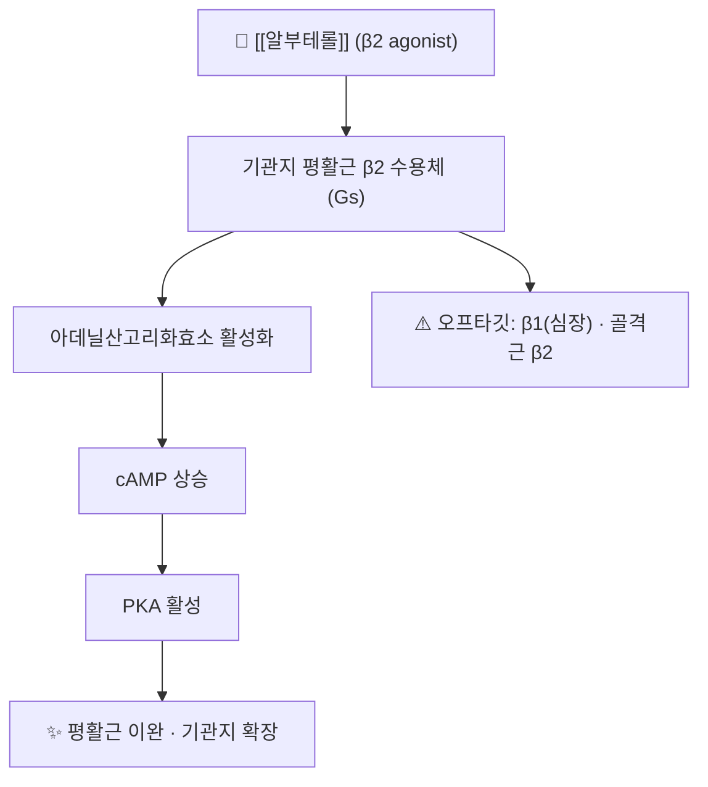

# 💊 [[알부테롤]] (Salbutamol/Albuterol, ATC R03AC02)

> **핵심 3줄 요약 (Key Summary)**:
> 🧪 주성분·제형: **속효성 β2 작용제(SABA)** 계열. 흡입제(MDI 100 µg/puff, 건조분말), **네뷸라이저 용액(2 mg/mL·5 mg/2.5 mL 등)**, 경구정(2~4 mg), 주사제.
> 📍 작용 기전: **기관지 평활근 β2 수용체 작용** → Gs–아데닐산고리화효소 → **cAMP↑ → PKA** → 미오신 경쇄 키나아제 억제·칼슘 재흡수 → 평활근 이완. 비만세포 안정화·점액섬모 청소 개선 부수 효과.
> 🎯 임상 적응증: **천식 급성 발작(1차 선택)**, 운동유발 기관지수축 예방, COPD 기관지수축, 고칼륨혈증 보조.
> ⚠️ 주의사항: 진전(tremor)·빈맥·두근거림·**저칼륨혈증**·고혈당, 고용량 지속 시 **젖산산증·역설적 기관지수축**. 협심증·부정맥·갑상선기능항진 환자 주의.

---

## 1. 약물 기본 정보 및 시판 제품 (Brand Identification)

> [!abstract]+ 🧪 3D 약리 분자 구조 (Interactive 3D Viewer)
> <iframe src="https://molecule-viewer-rho.vercel.app/?cid=2083" style="width: 100%; height: 600px; border: none; border-radius: 12px; box-shadow: 0 4px 20px rgba(0,0,0,0.15);" allowfullscreen></iframe>

| 항목 | 상세 정보 |
| :--- | :--- |
| **일반명 (Generic Name)** | 알부테롤(Albuterol) / 살부타몰(Salbutamol) — 황산염(sulfate) 형태 |
| **대표 상품명 (Brand Names)** | 국내·해외: **벤토린(Ventolin)**, 벤토린 에보할러, 숨테롤 등 제네릭 다수 / 성분명 처방 '살부타몰' |
| **ATC 코드 / 분류** | **R03AC02** (흡입용 선택적 β2 작용제) |
| **주요 제형** | MDI(100 µg/puff), 건조분말흡입제, 네뷸라이저 용액(2 mg/mL, 5 mg/2.5 mL), 경구정(2~4 mg), 주사액 |
| **허가 적응증** | 천식·기관지경련성 질환의 기관지경련 치료·예방, COPD, 운동유발 기관지수축 예방 |

### 1.1 임상 사용 위치 (2026-09-20 근거 기준)
- **급성 천식**: 1차 표준치료의 중심. 응급실 프로토콜은 **속효성 β2 작용제 반복/지속 네뷸라이제이션 + 이프라트로피움 + 전신 코르티코스테로이드 + 필요시 산소** → [[이프라트로피움]] · [[프레드니솔론]]
- **지속형 투여**: 2026-09-20 RCT는 체중 **≥20 kg 15 mg/h, <20 kg 10 mg/h**로 지속 네뷸라이즈하며 중환자 관리시간을 평가했다(시험군·대조군 모두 동일)
- 수치: 네뷸라이저 용액 **2.5~5 mg 1일 4회까지**, 병원에서 엄격한 감독하에 1일 최대 **40 mg**까지 투여 가능(제품 허가사항 기준)

---

## 2. 분자 약리 기전 및 작용 경로 (Mechanism of Action)

* **주요 작용 기전 (Primary MoA)**: β2 수용체 선택적 작용 → cAMP↑ → PKA가 **미오신 경쇄 키나아제를 인산화·억제**하고 세포내 Ca²⁺을 소포체로 회수 → 평활근 이완. 흡입 5~15분 내 기관지 확장, 3~6시간 지속
* **추가 효과**: 비만세포 매개 염증 매개체 유리 억제, 점액섬모 청소율 증가, 폐혈관 확장
* **오프타깃**: β1 자극 → 빈맥·진전, 골격근 β2 자극 → **진전(tremor)·저칼륨혈증**(Na⁺/K⁺-ATPase 활성화로 K⁺ 세포내 이동)

---

## 3. 약동학적 특성 (Pharmacokinetics: ADME)

| 약동학 파라미터 | 수치 및 임상적 의미 |
| :--- | :--- |
| **생체이용률 (F)** | 흡입 시 폐 흡수분은 전신 이행, 삼킨 분은 경구 생체이용률 낮음(초회통과) |
| **최고혈중농도 도달시간 (Tmax)** | 흡입 15~30분(임상 효과는 5~15분), 경구 2~3시간 |
| **혈장 단백결합률** | 약 10% 내외(낮음) |
| **간 대사** | 주로 **황산포합(SULT1A3)** — CYP 의존도 낮아 **상호작용 위험이 상대적으로 적다** |
| **반감기 (t1/2)** | 대략 3~6시간 |
| **배설** | 신장(소변) 위주, 대사산물 및 원형 배설 |

---

## _의학/04_임상 용법·용량 및 처방 가이드 (Dosage & Administration)

| 임상 상황 | 표준 용법·용량 |
| :--- | :--- |
| **경증 발작(MDI+스페이서)** | 100 µg/puff 2~4 puff, 필요 시 20분 간격 3회까지 |
| **중등도~중증(네뷸라이저)** | 2.5~5 mg + 생리식염수 총 3~5 mL, 20분 간격 3회(1시간 내) |
| **지속형(중환자 관리)** | 체중 ≥20 kg **15 mg/h**, <20 kg **10 mg/h** (2026-09-20 RCT 프로토콜) |
| **운동유발 기관지수축 예방** | 운동 전 2 puff(또는 2.5 mg 네뷸라이즈) |
| **경구(국내 사용 제한적)** | 2~4 mg 1일 3~4회 |

---

## 5. 부작용, 경고 및 약물 상호작용 (Adverse Effects & Interactions)

### 5.1 주요 부작용
* **심혈관**: 빈맥·두근거림·혈압 변동 — **연령 대비 빈맥**은 2026-09-20 RCT에서 시험군 26.5% vs 대조군 31.2%로 보고됐다
* **대사**: **저칼륨혈증**(고용량·반복), 고혈당, **젖산산증**(고용량 지속)
* **기타**: 진전, 불안·불면, 두통, 역설적 기관지수축(드묾)

### 5.2 주요 병용·상호작용
* **비선택적 β차단제**: 기관지수축 유발 — 천식 환자에서 원칙적 금기
* **이뇨제·전신 스테로이드·황산마그네슘과 병용**: **저칼륨혈증 가중** → K⁺ 모니터
* **MAO 억제제·삼환계 항우울제**: 심혈관 자극 증폭 보고
* **주의**: 지속형 투여가 8시간 이상 길어지면 빈맥·저칼륨혈증·CO2 저류 위험이 누적된다 — 이 경로로 갈 환자는 **한의원 외래 관리 범위 밖**

---

## 6. 한의 치료 연계 및 병용 프로토콜 (Integrative Medicine)

### 6.1 한약·양약 병용 안전성
* 알부테롤은 **황산포합**으로 대사되어 CYP 매개 상호작용은 상대적으로 적다. 다만 마황(에페드린) 함유 처방(마행탕·마행감석탕 등)은 **교감신경 자극이 중복**되므로 빈맥·혈압 상승에 주의하고, 급성기에는 원칙적으로 **양약 1차 + 한방은 안정화 단계**로 분리한다 → [[마행감석탕]]
* 시간차 투여(1~2시간) 관례를 지키고, 복약일지로 빈맥·불면을 확인한다

### 6.2 단계적 전환
* 급성기 종료 후 **흡입 스테로이드(ICS) 유지 + 한방 補肺健脾·化痰平喘** 병행 → 증상·발작 빈도 추적
* SABA 의존적 사용(주 2회 초과)은 조절 불충분 신호 — 한방으로 덮지 말고 **ICS 조정 검토**

---

## 7. 💡 진료실 핵심 필기 & 실전 체크리스트

### 7.1 문진 체크리스트
1. **주 2회 이상 SABA를 쓰는가** — 천식 조절 불충분 신호
2. **부정맥·협심증·갑상선기능항진·저칼륨혈증** 병력 및 이뇨제·스테로이드 병용
3. 소아에서 **MDI+스페이서 vs 네뷸라이저** 중 실제 사용법을 숙지하고 있는가(흡입 기법 오류가 치료 실패의 최대 원인)

### 7.2 환자 티칭 스크립트
> *"이 흡입제는 좁아진 기도를 5분 안에 넓혀 주는 응급용 약입니다. 하루 두 번 이상 필요해지면 천식 조절이 안 되고 있다는 신호이니 반드시 알려 주세요. 가슴 두근거림과 손 떨림은 흔하지만, 계속 심하면 용량을 조정해야 합니다."*

---
## 8. 출처 및 학술 참고 문헌 (References)
* Brunton LL, Hilal-Dandan R, Knollmann BC, eds. *Goodman & Gilman's The Pharmacological Basis of Therapeutics*.
* Salbutamol nebuliser solution SmPC (Medicines & Healthcare products Regulatory Agency) — ATC R03AC02, 네뷸라이저 용량·1일 상한.
* 2026-09-20 심층리뷰 2번(JAMA Netw Open 2026;9(8):e2630627, [PMID: 42646841](https://pubmed.ncbi.nlm.nih.gov/42646841/)) — 지속형 알부테롤 용량·이상반응 발생률.

<!-- 보관 태그(1회용·링크오류, 필요시 복원): 교감신경흡입제, SABA, β2작용제 -->
