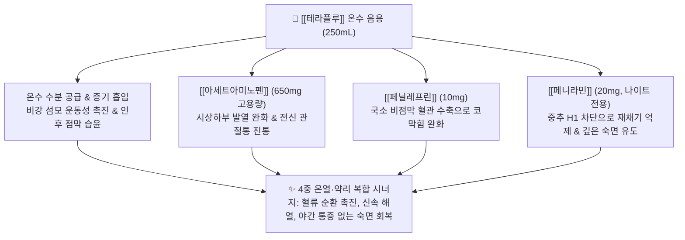

---
aliases:
  - Theraflu
  - 테라플루데이타임
  - 테라플루나이트타임
  - GSK테라플루
  - TherafluDaytime
  - TherafluNighttime
tags:
  - 의약품
  - 양방약
  - 복합제
  - 일반의약품
  - 종합감기약
  - 건조시럽
title: 테라플루
created: 2026-09-12
updated: 2026-09-12
---

# 💊 [[테라플루]] (Theraflu, GSK, Powder for Oral Solution)

> **핵심 3줄 요약 (Key Summary)**:
> - 🧪 주성분 배합: 1포당 고용량 [[아세트아미노펜]](650mg) + [[페닐레프린염산염]](10mg)을 기본으로 하며, 나이트타임에는 강력한 1세대 항히스타민제인 [[페니라민말레산염]](20mg)이 추가 배합된 건조시럽제.
> - 📍 복합 약리 기전: 따뜻한 물에 타서 차(Tea)처럼 복용하여 체온 상승, 수분 공급, 비점막 혈류 개선과 함께 고용량 해열진통·비충혈제거·진정 수면 유도 시너지 발휘.
> - 🎯 임상 적응증: 오한, 발열, 두통, 관절통, 인후통, 코막힘을 동반한 중등도 이상의 감기 몸살 대증 치료.
> - ⚠️ 특정 성분 금기: 1포당 AAP가 650mg에 달하여 "차처럼 자주 마시거나" 다른 감기약·진통제와 병용 시 하루 4,000mg을 쉽게 초과하여 치명적인 [[간독성]](급성 간부전) 유발, 나이트타임 복용 후 운전 절대 금기.

---

## 1. 복합 구성 성분 및 제형별 함량 (Active Ingredients & Formulations)

  <iframe src="https://embed.molview.org/v1/?mode=balls&cid=1983" style="position: absolute; top: 0; left: 0; width: 100%; height: 100%; border: 0;" title="테라플루 핵심 주성분 아세트아미노펜 3D 화학 구조식"></iframe>

> [인터랙티브 3D 분자 구조 모델] 테라플루 핵심 주성분 [[아세트아미노펜]] (Acetaminophen, PubChem CID: 1983)

> [그림 1] 따뜻하게 복용하는 차(Tea) 형태의 건조시럽 및 일반의약품 감기 치료 제제

> [그림 2] 테라플루 나이트타임의 강력한 수면 유도 및 항히스타민 성분인 [[페니라민]](Pheniramine) 2D 화학 분자 구조식 (PubChem CID: 4761)

### 1.1 테라플루 데이타임 vs 나이트타임 성분 구성 비교표

| 구성 성분 (한글/영문) | 데이타임 (1포 기준) | 나이트타임 (1포 기준) | 약효 분류 및 역할 | PubChem CID |
| :--- | :--- | :--- | :--- | :--- |
| [[아세트아미노펜]] (Acetaminophen) | **650mg** | **650mg** | 고용량 해열·진통 (시상하부 체온조절 억제) | [1983](https://pubchem.ncbi.nlm.nih.gov/compound/1983) |
| [[페닐레프린염산염]] (Phenylephrine HCl) | **10mg** | **10mg** | $\alpha_1$ 선택적 비충혈제거제 (비점막 혈관 수축) | [6041](https://pubchem.ncbi.nlm.nih.gov/compound/6041) |
| [[페니라민말레산염]] (Pheniramine Maleate) | **미함유 (무졸림)** | **20mg** | 1세대 항히스타민제 (강력한 진정·수면 유도, 콧물 정지) | [4761](https://pubchem.ncbi.nlm.nih.gov/compound/4761) |

---

## 2. 복합 상승 약리 기전 (Combination Mechanism & Synergy)

* **온수 용해 복용의 생체역학적·약역학적 이점**:
  * 뜨거운 물(약 250mL)에 녹여 복용하는 온음료(Hot drink) 제형은 복용 시 비강 내로 따뜻한 수증기가 유입되어 비점막 섬모 운동(Mucociliary clearance)을 자극하고 기도를 즉각 촉촉하게 만듭니다.
  * 위장관 내에서 정제보다 빠르게 용해·분산되어 공복 투여 시 20~30분 내로 빠른 흡수를 유도합니다.
* **데이타임 vs 나이트타임의 약리적 분리 설계**:
  * **데이타임**: 항히스타민제를 완전히 배제하여 낮 시간 동안 환자가 졸림이나 인지 저하 없이 일상생활을 유지할 수 있도록 설계.
  * **나이트타임**: 1세대 알킬아민계 항히스타민제인 페니라민 20mg을 고함량 배합하여 H1 수용체뿐만 아니라 중추 무스카린성 수용체를 차단, 감기 통증과 코막힘으로 잠을 이루지 못하는 환자에게 **강력한 수면 유도(Sedation)** 효과를 제공.

---

## 3. 브랜드 패밀리 라인업 비교 (Brand Lineup Analysis)

| 제품 라인업명 | 주성분 구성 및 특성 | 복용 시간대 | 임상 복약 지도 핵심 |
| :--- | :--- | :--- | :--- |
| **테라플루 데이타임** | AAP 650mg + 페닐레프린 10mg (베리맛/레몬맛 건조시럽) | **낮 (아침, 점심, 오후)** | 항히스타민 미함유로 주간 활동 유지, 4~6시간 간격 복용 (1일 최대 4포) |
| **테라플루 나이트타임** | AAP 650mg + 페닐레프린 10mg + 페니라민 20mg (허니레몬맛) | **취침 전 (야간)** | 강력한 졸림 및 진정 유발, 복용 후 운전 및 기계 조작 엄격 금지 |
| **테라플루 콜드앤코프** | AAP 650mg + 페닐레프린 10mg + 덱스트로메토르판 20mg (기침 특화) | 낮 또는 밤 | 중추성 진해제 보강, 마른기침이 극심한 환자군 |
| **[[판피린]] / [[판콜]]** | AAP 300mg + 메틸에페드린 + 카페인 + 구아이페네신 (액제) | 주간 / 식후 | AAP 함량이 300mg으로 상대적으로 낮으나 카페인 및 교감신경 각성제 함유 |

---

## 4. 복합제 특이 위험성 및 특정 성분 금기 (Black Box & Red Flags)

### 4.1 '차(Tea)' 형태의 인식 함정으로 인한 급성 간부전 (CRITICAL)
* **치명적 AAP 과다복용 위험**:
  * 테라플루 1포에는 일반 감기약(300mg)의 2배가 넘는 **아세트아미노펜 650mg**이 고함량으로 들어있음.
  * 환자들이 이를 "레몬차", "허브티"와 같은 단순 음료로 오인하여 목이 마르거나 한기를 느낄 때마다 하루 5~6포 이상 수시로 타 마시는 사례가 매우 빈번함.
  * 만약 환자가 이미 타이레놀 500mg/650mg을 먹고 있거나 정형외과 진통제, 판피린 등을 함께 복용한다면 하루 4,000~6,000mg 이상의 극단적 과다 복용에 도달하여 **급성 간괴사 및 간부전(Acute Liver Failure)**으로 직결될 수 있음.
  * **수칙**: 1회 1포, 복용 간격은 **반드시 4~6시간 이상** 유지해야 하며, 24시간 내 최대 4포(2,600mg)를 초과할 수 없음.

### 4.2 페니라민으로 인한 강력한 중추 진정 및 항콜린성 부작용
* 나이트타임에 함유된 페니라민(20mg)은 졸림 유발률이 30% 이상에 달하며, 다음 날 아침까지 숙취와 유사한 멍함(Hangover effect)을 남길 수 있음.
* 고령자에서 급성 뇨저류(배뇨 곤란), 변비, 안압 상승(녹내장 악화)을 촉발할 수 있음.

---

## 5. 한의학적 복합 처방 배오 비교 및 테이퍼링 프로토콜 (Integrative Medicine)

### 5.1 한방 온복(溫服) 및 해표(解表) 이론과의 접목

| 양방 테라플루 요법 | 한의 대응 치료법/처방 | 한의학적 배오 의미 및 상호작용 |
| :--- | :--- | :--- |
| **따뜻한 물 음용 (온음료)** | **탕약 온복(溫服) & 미음 복용** | 상한론(傷寒論)의 계지탕 복용 후 뜨거운 죽을 먹고 이불을 덮어 땀을 내는 해표(解表) 원리와 완벽히 일치 |
| **[[아세트아미노펜]] 650mg (해열)** | [[갈근]], [[마황]], [[계지]] | 군약(君藥): 기육(肌肉)의 사기를 풀고 발한(發汗)을 유도하여 울열을 발산시킴 |
| **[[페닐레프린]] (비충혈제거)** | [[신이]], [[백지]], [[세신]] | 신약(臣藥): 매운 맛으로 비규(鼻竅)를 열어 코막힘을 즉각 통하게 함 |
| **[[페니라민]] (진정·수면)** | [[산조인]], [[원지]], [[용골]] | 좌약(佐藥): 영심안신(寧心安神), 심신을 안정시키고 감기 중 편안한 숙면을 도움 |

### 5.2 진료실 임상 연계 프로토콜
* **초기 감기 한의 처방 연계**:
  * 테라플루를 찾는 환자 중 위장이 약하거나 간 질환 병력이 있는 환자에게는 간 독성 위험이 없는 [[갈근탕]](오한·발열·항강증) 또는 [[패독산]](오한·지절통), [[총백탕]](파뿌리·생강을 달인 온수 복용법)을 처방하여 안전한 발한을 유도.
  * 밤에 기침과 코막힘으로 잠을 못 자는 환자에게 나이트타임 대신 [[소청룡탕]] 보험과립제와 함께 백회(GV20), 신문(HT7), 안면(安眠) 혈위 침 치료를 병행.

### 5.3 환자 티칭 스크립트
> "환자분, 테라플루는 따뜻한 레몬차 맛이 나서 마시기 편하지만, 실제로는 1포에 일반 타이레놀보다 많은 650mg의 강력한 진통해열제가 들어있는 순수 의약품입니다. 맛있다고 차처럼 하루에 서너 잔씩 연달아 드시거나, 다른 감기약이나 두통약을 같이 드시면 간이 심각하게 망가질 수 있습니다. 반드시 4~6시간 간격을 두고 하루에 4포를 넘기지 마셔야 하며, 나이트타임을 드신 후에는 졸음이 매우 심하게 쏟아지므로 곧바로 주무셔야 합니다."

---

## 6. 출처 및 학술 참고 문헌 (References)

1. Sanu A, Eccles R. The effects of a hot drink on nasal airflow and symptoms of common cold and flu. *Rhinology*. 2008;46(4):271-275. [PMID: 19145994](https://pubmed.ncbi.nlm.nih.gov/19145994/)
   - [연구 요약] 감기 및 독감 환자에서 따뜻한 음료(Hot drink)의 섭취가 비강 기류의 물리적 변화와 무관하게 콧물, 기침, 재채기, 인후통, 오한, 피로 증상을 즉각적이고 지속적으로 경감시킴을 규명한 무작위 대조 임상시험.

2. Larson AM, Polson J, Fontana RJ, et al. Acetaminophen-induced acute liver failure: results of a United States multicenter, prospective study. *Hepatology*. 2005;42(6):1364-1372. doi:10.1002/hep.20948. [PMID: 16317692](https://pubmed.ncbi.nlm.nih.gov/16317692/)
   - [연구 요약] 미국 내 급성 간부전(ALF) 환자의 약 42%가 아세트아미노펜 과다복용에 기인하며, 이 중 절반가량이 복합 OTC 감기약 등의 우발적 중복 복용(Unintentional overdose)에 의한 것임을 밝혀 고용량 복합제의 위험성을 경고한 랜드마크 다기관 전향적 코호트 연구.

3. De Sutter AI, Eriksson L, van Driel ML. Oral antihistamine-decongestant-analgesic combinations for the common cold. *Cochrane Database Syst Rev*. 2022;1(1):CD004976. doi:10.1002/14651858.CD004976.pub4. [PMID: 35060618](https://pubmed.ncbi.nlm.nih.gov/35060618/)
   - [연구 요약] 항히스타민제, 비충혈제거제, 진통소염제의 다성분 복합 제제가 감기 초기 전반적 호흡기 증상 및 비점막 부종 개선에 단일 약제 대비 우수한 복합 치료 이점을 가짐을 총괄 평가한 코크란 체계적 문헌고찰.
