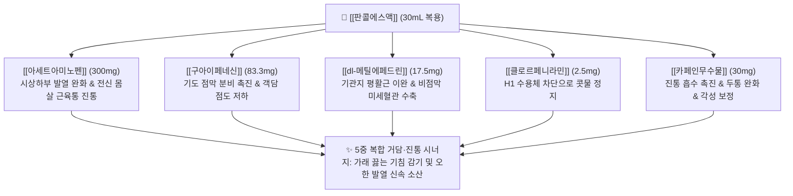

---
aliases:
  - Pancall
  - 판콜에스
  - 판콜에이
  - 동화약품판콜
  - PancallS
  - PancallA
tags:
  - 의약품
  - 양방약
  - 복합제
  - 일반의약품
  - 종합감기약
  - 해열진통제
title: 판콜
created: 2026-09-12
updated: 2026-09-12
---

# 💊 [[판콜]] (Pancall, Dongwha Pharm, Oral Solution)

> **핵심 3줄 요약 (Key Summary)**:
> - 🧪 주성분 배합: 약국용 판콜에스액 기준 [[아세트아미노펜]](300mg) + [[구아이페네신]](83.3mg) + [[dl-메틸에페드린염산염]](17.5mg) + [[클로르페니라민말레산염]](2.5mg) + [[카페인무수물]](30mg)의 30mL 고용량 거담 복합 액제.
> - 📍 복합 약리 기전: [[판피린]] 대비 2배의 고함량 구아이페네신을 배합하여 기관지 점액 유동성을 극대화하고 해열진통·비충혈제거·항히스타민 작용을 동시 발휘.
> - 🎯 임상 적응증: 기침, 가래가 동반된 감기 몸살, 발열, 두통, 관절통, 코막힘, 콧물의 신속한 대증 완화.
> - ⚠️ 특정 성분 금기: 편의점용 판콜에이([[페닐레프린]])와 약국용 판콜에스([[dl-메틸에페드린]])의 성분 차이 인지 필수, 만성 연용 시 약물과용두통(MOH), 고혈압 및 전립선비대증 악화 주의.

---

## 1. 복합 구성 성분 및 제형별 함량 (Active Ingredients & Formulations)

  <iframe src="https://embed.molview.org/v1/?mode=balls&cid=1983" style="position: absolute; top: 0; left: 0; width: 100%; height: 100%; border: 0;" title="판콜 핵심 주성분 아세트아미노펜 3D 화학 구조식"></iframe>

> [인터랙티브 3D 분자 구조 모델] 판콜 핵심 주성분 [[아세트아미노펜]] (Acetaminophen, PubChem CID: 1983)

> [그림 1] 판콜의 상징적 고함량 거담 성분인 [[구아이페네신]](Guaifenesin) 2D 화학 분자 구조식 (PubChem CID: 3516)

> [그림 2] 편의점용 판콜에이내복액의 비충혈제거 성분인 [[페닐레프린]](Phenylephrine) 2D 화학 분자 구조식 (PubChem CID: 6041)

### 1.1 판콜에스액 (약국용 30mL) vs 판콜에이내복액 (편의점용 30mL) 성분 비교표

| 구성 성분 (한글/영문) | 판콜에스 (약국용 30mL) | 판콜에이 (편의점용 30mL) | 약효 분류 및 임상 역할 | PubChem CID |
| :--- | :--- | :--- | :--- | :--- |
| [[아세트아미노펜]] (Acetaminophen) | **300mg** | **300mg** | 해열·진통 (시상하부 체온조절 억제) | [1983](https://pubchem.ncbi.nlm.nih.gov/compound/1983) |
| [[구아이페네신]] (Guaifenesin) | **83.3mg** | **80mg** | 점액 분비 촉진 거담제 (판피린의 2배 함량) | [3516](https://pubchem.ncbi.nlm.nih.gov/compound/3516) |
| [[클로르페니라민말레산염]] | **2.5mg** | **2.5mg** | 1세대 항히스타민제 (재채기·수양성 비루 억제) | [2725](https://pubchem.ncbi.nlm.nih.gov/compound/2725) |
| [[카페인무수물]] (Caffeine Anhydrous) | **30mg** | **30mg** | 중추 흥분, 뇌혈관 수축, 진통 보조 및 각성 | [2519](https://pubchem.ncbi.nlm.nih.gov/compound/2519) |
| [[dl-메틸에페드린염산염]] | **17.5mg** | **미함유** | $\alpha/\beta$ 교감신경 자극 (기관지 확장·비점막 수축) | [9290](https://pubchem.ncbi.nlm.nih.gov/compound/9290) |
| [[페닐레프린염산염]] | **미함유** | **10mg** | 선택적 $\alpha_1$ 수용체 효능 비충혈제거제 | [6041](https://pubchem.ncbi.nlm.nih.gov/compound/6041) |
| [[펜톡시베린시트르산염]] | **미함유** | **15mg** | 비마약성 중추성 진해제 (기침 반사 억제) | [8880](https://pubchem.ncbi.nlm.nih.gov/compound/8880) |

---

## 2. 복합 상승 약리 기전 (Combination Mechanism & Synergy)

* **판콜의 핵심 차별화: 거담 작용의 우위 (High-dose Guaifenesin)**:
  * 구아이페네신은 미주신경-위점막 반사를 자극하여 기관지 분비선에서 장액성(Serous) 점액 분비를 촉진하고 산성 점액다당류 섬유를 절단하여 가래의 점도를 현저히 낮춥니다.
  * 판콜에스액은 1병당 83.3mg을 함유하여 판피린(42mg) 대비 2배 가까이 강력한 객담 배출 능력을 발휘하므로, **"가래가 걸려 켁켁거리는 초기 감기"**에 임상적 우위를 가집니다.
* **약국용(에스)과 편의점용(에이)의 약리적 분기**:
  * **판콜에스([[dl-메틸에페드린]])**: 기관지 평활근의 $\beta_2$ 수용체를 자극하여 강력한 기관지 확장 효과를 내어 기침을 가라앉히지만, 중추 각성 및 혈압 상승 위험이 상대적으로 큼.
  * **판콜에이([[페닐레프린]] + [[펜톡시베린]])**: 에페드린의 의존성 및 남용 우려를 피하기 위해 편의점용으로 안전성을 조정한 배합으로, 중추 기침 반사는 펜톡시베린이 차단하고 코막힘은 말초 $\alpha_1$ 혈관 수축제인 페닐레프린이 담당함.

---

## 3. 브랜드 패밀리 라인업 비교 (Brand Lineup Analysis)

| 제품 라인업명 | 주성분 구성 및 용량 | 판매 채널 | 임상 선택 및 복약 지도 포인트 |
| :--- | :--- | :--- | :--- |
| **판콜에스액** (Pancall S) | AAP 300mg + 구아이페네신 83.3mg + 메틸에페드린 17.5mg + 클로르페니라민 2.5mg + 카페인 30mg (30mL) | **약국 전용 (일반의약품)** | 기침·가래가 주증인 감기 몸살 1차, 메틸에페드린 함유로 기관지 확장력 우수, 1회 1병 1일 3회 식후 복용 |
| **판콜에이내복액** (Pancall A) | AAP 300mg + 구아이페네신 80mg + 페닐레프린 10mg + 펜톡시베린 15mg + 클로르페니라민 2.5mg + 카페인 30mg (30mL) | **편의점 24시간 안전상비약** | 야간·휴일 응급 시 구입 용이, 메틸에페드린 배제 처방 |
| **판피린큐액** (동아제약) | AAP 300mg + 구아이페네신 42mg + 티페피딘 10mg + 메틸에페드린 18mg + 클로르페니라민 2.5mg + 카페인 30mg (20mL) | 약국 전용 (일반의약품) | 거담제 함량은 적으나 비마약성 진해제 티페피딘 보강, 20mL 소용량 |

---

## 4. 복합제 특이 위험성 및 특정 성분 금기 (Black Box & Red Flags)

### 4.1 편의점용 판콜에이 페닐레프린의 경구 흡수 논쟁
* **경구 페닐레프린의 한계**: 최근 미국 FDA 자문위원회는 경구 투여된 페닐레프린이 장관 및 간의 광범위한 초회통과 대사(First-pass metabolism)로 인해 혈중 생체이용률이 1% 미만에 불과하여 경구 비충혈제거제로서 위약 대비 유의한 효과가 없음을 지적함. 따라서 극심한 코막힘 환자는 약국용 판콜에스([[dl-메틸에페드린]]) 또는 비강 분무제(옥시메타졸린)를 사용하는 것이 유리함.

### 4.2 중복 투약에 따른 급성 간독성 (AAP Overdose)
* 판콜에스/에이 1병에는 아세트아미노펜 300mg이 함유되어 있음. 환자가 감기 몸살로 타이레놀 500mg/650mg을 함께 마시거나 정형외과 조제약을 복용할 경우 하루 4,000mg을 초과할 위험이 있으므로 병용 금기 지도 필수.

### 4.3 교감신경 자극 부작용
* 판콜에스의 메틸에페드린과 판콜에이의 페닐레프린은 모두 혈관을 수축시키므로 **중증 고혈압 환자, 관상동맥 질환자, 배뇨 장애(전립선비대증) 환자, 갑상선 기능 항진증 환자**에서는 증상이 악화될 수 있으므로 투여 금기 또는 극히 신중 투여.

---

## 5. 한의학적 복합 처방 배오 비교 및 테이퍼링 프로토콜 (Integrative Medicine)

### 5.1 한방 거담해표(祛痰解表) 처방과의 배오 매핑

| 양방 판콜 구성 | 한의 대응 본초/처방 | 한의학적 배오 의미 및 기전 비교 |
| :--- | :--- | :--- |
| **[[구아이페네신]] (고함량 거담)** | [[반하]], [[진피]], [[패모]], [[길경]] | 군약(君藥)/신약: 화담지해(化痰止咳), 인후에 막힌 끈적한 객담을 삭이고 배농(排膿)을 촉진 |
| **[[아세트아미노펜]] (해열·진통)** | [[갈근]], [[시호]], [[황금]] | 군약(君藥): 해기퇴열(解肌退熱), 풍열과 풍한으로 인한 오한 발열 및 전신 관절통을 완화 |
| **[[dl-메틸에페드린]] (기관지확장)** | [[마황]], [[행인]] | 신약(臣藥): 선폐평천(宣肺平喘), 폐기를 틔워 쌕쌕거리는 기침과 천식을 진정시킴 |
| **[[클로르페니라민]] (항히스타민)** | [[신이]], [[세신]], [[창이자]] | 좌약(佐藥): 통규지체(通竅止涕), 비규(鼻竅)를 뚫고 콧물을 말림 |
| **[[카페인무수물]] (두통·각성)** | [[천궁]], [[백지]] | 사약(使藥): 승청강탁(升淸降濁), 약효를 두면부로 끌어올려 두통을 해소 |

### 5.2 진료실 임상 연계 프로토콜
* **가래 끓는 기침 감기 환자의 한약 처방**:
  * 판콜을 복용하던 환자가 입마름(구갈), 가슴 답답함, 변비를 호소할 때 [[이진탕]](반하, 진피, 복령, 감초)이나 [[행소산]](소엽, 행인, 길경 등), [[마행감석탕]] 보험 과립제로 전환.
  * 기허(氣虛)한 노인 환자가 판콜을 장기 연용하여 기운이 빠질 때는 보기해표(補氣解表)제인 [[삼소음]]을 처방하여 면역력을 높이며 약물 의존성 차단.
* **침구 치료**:
  * 해수·천식 완화: 천돌(CV22), 척택(LU5), 폐수(BL13), 열결(LU7) 자침 및 뜸 치료.

### 5.3 환자 티칭 스크립트
> "환자분, 판콜은 가래를 묽게 해주는 성분이 많이 들어있어 기침과 가래가 심한 초기 감기 몸살에 효과적인 약입니다. 하지만 편의점에서 파는 판콜에이와 약국에서 파는 판콜에스는 들어있는 기침·코막힘 성분이 다릅니다. 또한 심장 질환이나 고혈압, 전립선 질환이 있으신 분은 혈압이 오르거나 소변 보기가 힘들어질 수 있습니다. 며칠 이상 계속 드시지 마시고, 3일 이상 증상이 지속되면 폐를 맑혀주는 한약 치료와 침 치료를 병행하시는 것이 안전합니다."

---

## 6. 출처 및 학술 참고 문헌 (References)

1. De Sutter AI, Eriksson L, van Driel ML. Oral antihistamine-decongestant-analgesic combinations for the common cold. *Cochrane Database Syst Rev*. 2022;1(1):CD004976. doi:10.1002/14651858.CD004976.pub4. [PMID: 35060618](https://pubmed.ncbi.nlm.nih.gov/35060618/)
   - [연구 요약] 성인 및 연장 소아의 감기 증상에서 항히스타민제, 비충혈제거제, 진통소염제의 복합 경구 제제가 전반적 임상 증상 개선 및 비점막 회복에 단일제 대비 우수한 치료 효과를 보임을 확립한 코크란 체계적 문헌고찰.

2. Albrecht HH, Dicpinigaitis PV, Guenin EP. Role of guaifenesin in the management of chronic bronchitis and upper respiratory tract infections. *Multidiscip Respir Med*. 2017;12:31. doi:10.1186/s40248-017-0113-4. [PMID: 29238574](https://pubmed.ncbi.nlm.nih.gov/29238574/)
   - [연구 요약] 상기도 감염 및 기관지염 환자에서 구아이페네신 경구 투여가 기도 점액의 점도(Viscosity)와 탄성도를 유의하게 감소시키고 섬모 운동성을 촉진하여 객담 배출을 가속화함을 입증한 임상 종설.

3. Hatton RC, Winterstein AG, McKelvey RP, Shuster J, Hendeles L. Efficacy and safety of oral phenylephrine: systematic review and meta-analysis. *Ann Pharmacother*. 2007;41(3):381-390. doi:10.1345/aph.1H679. [PMID: 17264159](https://pubmed.ncbi.nlm.nih.gov/17264159/)
   - [연구 요약] 경구용 페닐레프린의 비충혈 완화 효과에 대한 메타분석으로, 상용량(10mg) 경구 투여 시 광범위한 간 대사로 인해 비강 저항 개선 효과가 위약 대비 유의미하지 않음을 밝혀 안전상비의약품 성분 평가의 기초 자료로 활용된 문헌.
