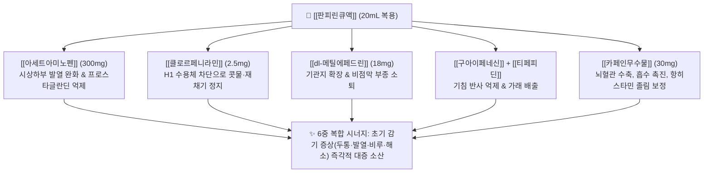

---
aliases:
  - Panpyrin
  - 판피린큐
  - 판피린티
  - 동아제약판피린
  - PanpyrinQ
tags:
  - 의약품
  - 양방약
  - 복합제
  - 일반의약품
  - 종합감기약
  - 해열진통제
title: 판피린
created: 2026-09-12
updated: 2026-09-12
---

# 💊 [[판피린]] (Panpyrin, Dong-A Pharm, Oral Solution & Tablet)

> **핵심 3줄 요약 (Key Summary)**:
> - 🧪 주성분 배합: [[아세트아미노펜]](300mg) + [[클로르페니라민말레산염]](2.5mg) + [[카페인무수물]](30mg) + [[dl-메틸에페드린염산염]](18mg) + [[구아이페네신]](42mg) + [[티페피딘시트르산염]](10mg)의 6중 복합 액제.
> - 📍 복합 약리 기전: 중추성 해열진통(AAP)과 교감신경 흥분성 기관지확장·비충혈제거(메틸에페드린), 항히스타민(클로르페니라민), 진해거담 및 카페인의 뇌혈관 수축·진통 상승 시너지.
> - 🎯 임상 적응증: 초기 감기 몸살, 오한, 발열, 두통, 관절통, 콧물, 코막힘, 기침, 가래의 신속 대증 완화.
> - ⚠️ 특정 성분 금기: [[카페인무수물]] 만성 연용에 의한 [[약물과용두통]](MOH) 및 심리적 의존성, 중복 AAP 투여에 따른 급성 간독성, 교감신경 자극으로 인한 혈압 상승 및 안압 상승 주의.

---

## 1. 복합 구성 성분 및 제형별 함량 (Active Ingredients & Formulations)

  <iframe src="https://embed.molview.org/v1/?mode=balls&cid=1983" style="position: absolute; top: 0; left: 0; width: 100%; height: 100%; border: 0;" title="판피린 핵심 주성분 아세트아미노펜 3D 화학 구조식"></iframe>

> [인터랙티브 3D 분자 구조 모델] 판피린 핵심 주성분 [[아세트아미노펜]] (Acetaminophen, PubChem CID: 1983)

> [그림 1] 동아제약 판피린(Panpyrin) 브랜드 시판 패키지 외형 및 상징 캐릭터

> [그림 2] 판피린의 진통 보조 및 혈관수축 복합 성분인 [[카페인무수물]](Caffeine Anhydrous) 2D 화학 분자 구조식 (PubChem CID: 2519)

### 1.1 판피린큐액(약국용 20mL 액제) 성분 구성표

| 구성 성분 (한글/영문) | 1병(20mL)당 함량 | 약효 분류 및 역할 | PubChem CID | 주된 약리 작용 및 시너지 포인트 |
| :--- | :--- | :--- | :--- | :--- |
| [[아세트아미노펜]] (Acetaminophen) | 300mg | 해열·진통 (주성분) | [1983](https://pubchem.ncbi.nlm.nih.gov/compound/1983) | 시상하부 체온조절중추 억제 및 중추 통증 전달 차단 |
| [[클로르페니라민말레산염]] (Chlorpheniramine Maleate) | 2.5mg | 1세대 항히스타민제 | [2725](https://pubchem.ncbi.nlm.nih.gov/compound/2725) | 말초 H1 수용체 및 중추 차단으로 콧물, 재채기 억제 |
| [[dl-메틸에페드린염산염]] (dl-Methylephedrine HCl) | 18mg | $\alpha/\beta$ 교감신경 흥분제 | [9290](https://pubchem.ncbi.nlm.nih.gov/compound/9290) | 기관지 평활근 이완(기침 완화) 및 비점막 혈관 수축(코막힘 제거) |
| [[카페인무수물]] (Caffeine Anhydrous) | 30mg | 중추신경 흥분제 | [2519](https://pubchem.ncbi.nlm.nih.gov/compound/2519) | 뇌혈관 수축을 통한 두통 완화, AAP 진통 효과 증대 및 항히스타민 졸림 상쇄 |
| [[구아이페네신]] (Guaifenesin) | 42mg | 점액 분비 촉진 거담제 | [3516](https://pubchem.ncbi.nlm.nih.gov/compound/3516) | 기도 분비물 점도를 낮추어 객담 배출 촉진 |
| [[티페피딘시트르산염]] (Tipepidine Citrate) | 10mg | 비마약성 중추성 진해제 | [65651](https://pubchem.ncbi.nlm.nih.gov/compound/65651) | 연수의 기침 중추를 억제하여 발작성 기침 완화 |

---

## 2. 복합 상승 약리 기전 (Combination Mechanism & Synergy)

* **액제 제형의 초신속 체내 흡수 (Rapid PK Advantage)**:
  * 정제(알약)와 달리 위장관 내에서 붕해(Disintegration) 과정을 거치지 않고 액상 형태로 즉시 소장으로 이행되어, 복용 후 **15~20분 만에 혈중 약물 농도가 급상승**하여 빠른 초기 진통·해열 효과를 발휘합니다.
* **카페인-아세트아미노펜 진통 상승 시너지**:
  * 아데노신 $A_{2A}$ 수용체 길항제인 카페인이 통증 전달 뉴런의 억제를 해제하고 위장관 점막 혈류를 촉진하여 아세트아미노펜의 흡수율 및 진통 효능을 약 1.4~1.6배 증폭시킵니다.
* **항히스타민과 각성제의 약리적 길항 상쇄**:
  * 1세대 항히스타민제인 클로르페니라민의 졸림·진정 작용을 카페인과 메틸에페드린의 중추 각성 작용이 부분적으로 상쇄하여 주간 일상생활 저하를 경감시킵니다.

---

## 3. 브랜드 패밀리 라인업 비교 (Brand Lineup Analysis)

| 제품 라인업명 | 주요 구성 성분 및 제형 | 유통 채널 | 임상 복약 지도 핵심 |
| :--- | :--- | :--- | :--- |
| **판피린큐액** (Panpyrin Q) | AAP 300mg + 클로르페니라민 2.5mg + 메틸에페드린 18mg + 카페인 30mg + 구아이페네신 42mg + 티페피딘 10mg (20mL 유리병 액제) | **약국 전용 (일반의약품)** | 6종 복합 처방, 빠른 흡수, 기침·가래·코막힘 포함 종합 증상에 투여, 1일 3회 식후 1병 |
| **판피린티정** (Panpyrin T) | AAP 300mg + 클로르페니라민 2mg + 카페인무수물 30mg (3정 블리스터 포장 정제) | **편의점 안전상비의약품** & 약국 | 진해거담·비충혈제거 성분 제외, 발열·두통·초기 콧물 중심의 간소화 처방, 1회 1정 복용 |
| **[[판콜에스액]]** (경쟁 약물) | AAP 300mg + 클로르페니라민 2.5mg + dl-메틸에페드린 17.5mg + 카페인 30mg + 구아이페네신 83.3mg (동화약품 액제) | 약국 전용 (일반의약품) | 구아이페네신 함량이 2배 높아 객담 배출에 특화, 티페피딘 대신 메틸에페드린 중심 |

---

## 4. 복합제 특이 위험성 및 특정 성분 금기 (Black Box & Red Flags)

### 4.1 카페인 의존성 및 약물과용두통 (MOH: Medication Overuse Headache)
* **노인층의 습관적 연용 위험**:
  * 판피린큐액은 "초기 감기 몸살약"임에도 불구하고, 카페인(30mg)과 아세트아미노펜(300mg)의 복합 각성 효과로 인해 **"피로회복제"나 "박카스 대용"으로 하루 3~5병씩 매일 수년간 장기 연용하는 고령 환자가 진료실에 매우 흔함**.
  * **약물과용두통 기전**: 약효가 떨어질 때 카페인 금단에 의한 뇌혈관 확장성 두통이 발생하고, 이를 완화하기 위해 다시 판피린을 복용하는 악순환 고리가 형성됨.
  * **투약 가이드**: 감기 증상이 없는 상태에서 두통 목적으로 주 2~3회 이상 복용하는 것은 절대 금지해야 함.

### 4.2 중복 투약에 의한 급성 간부전 위험 (Acetaminophen Toxicity)
* **동시 복용 금기**: 환자가 두통이나 관절염으로 [[타이레놀]](AAP 500mg/650mg)이나 정형외과 조제약(AAP 복합 진통제)을 이미 복용 중인 상태에서 판피린큐액(300mg)을 함께 마시면 **일일 최대 안전 용량인 4,000mg을 쉽게 초과**하여 독성 대사체인 NAPQI 축적으로 급성 간괴사 유발 가능.

### 4.3 교감신경 흥분제(메틸에페드린) 관련 금기
* **심혈관 질환자**: 혈관 수축 및 심박수 증가로 인해 고혈압, 심근경색 병력 환자에서 급성 혈압 상승 유발.
* **전립선비대증 환자**: 방광 경부 및 요도 괄약근의 $\alpha_1$ 수용체를 자극하여 급성 요폐(Urinary retention) 위험 급증.
* **폐쇄각 녹내장**: 산동 작용으로 안압 급상승 가능.

---

## 5. 한의학적 복합 처방 배오 비교 및 테이퍼링 프로토콜 (Integrative Medicine)

### 5.1 한방 군신좌사(君臣佐使) 배오 원리와의 비교

| 양방 판피린 구성 | 한의 대응 본초/처방 | 한의학적 배오 의미 및 상호작용 비교 |
| :--- | :--- | :--- |
| **[[아세트아미노펜]] (해열·진통)** | [[갈근]], [[마황]], [[계지]] | 군약(君藥): 풍한(風寒) 사기를 발한해표(發汗解表)시키고 기육(肌肉)의 열을 풀어 몸살 통증 진정 |
| **[[dl-메틸에페드린]] (기침·비충혈)** | [[마황]], [[행인]] | 신약(臣藥): 선폐평천(宣肺平喘), 폐기를 열어 기침을 멎게 하고 상초의 수습 울체를 뚫음 |
| **[[클로르페니라민]] (콧물)** | [[세신]], [[신이]], [[백지]] | 좌약(佐藥): 한음(寒飲)으로 인한 수양성 비루를 말리고 두면부 규도(竅道)를 개통시킴 |
| **[[구아이페네신]] + [[티페피딘]] (거담·진해)** | [[반하]], [[진피]], [[패모]] | 좌약(佐藥): 조습화담(燥濕化痰), 인후 기관지의 끈적한 가래를 삭이고 폐기를 숙강 |
| **[[카페인무수물]] (혈관수축·승제)** | [[승마]], [[시호]], [[생강]] | 사약(使藥)/좌약: 양기를 끌어올리고 제반 약효를 신속히 두면부로 인도하며 기운을 북돋움 |

### 5.2 진료실 실전 문진 및 테이퍼링(감량) 프로토콜
1. **문진 체크리스트**:
   * "원장님, 저는 머리가 띵하고 찌뿌둥할 때마다 판피린 한 병씩 마셔야 하루가 개운해요." $\rightarrow$ 전형적인 카페인-AAP 유발 **[[약물과용두통]] 및 중독 징후**.
   * "최근 1주일간 판피린을 며칠이나 드셨습니까? 하루에 몇 병 드십니까?" 확인 필수.
2. **한약 처방 전환 테이퍼링**:
   * **초기 감기 몸살 환자**: 판피린 대신 발한해표제인 [[갈근탕]](오한·목덜미 뻣뻣함)이나 [[삼소음]](기허자 초기 감기), [[소청룡탕]](맑은 콧물·기침)으로 즉시 전환.
   * **만성 판피린 중독·MOH 환자**:
     * 1단계: 판피린 복용을 주 3병 $\rightarrow$ 2병 $\rightarrow$ 완전 중단으로 유도.
     * 2단계: 금단 두통 및 기혈 부족 해소를 위해 [[청상견통탕]], [[조등산]], [[천궁차조산]]을 원내 과립제 또는 탕약으로 처방.
     * 3단계: 풍지(GB20), 견정(GB21), 백회(GV20), 합곡(LI4) 침 치료 및 두판상근, 두반극근 긴장 이완 침도요법 시행.

### 5.3 환자 티칭 스크립트
> "어르신, 판피린은 초기 감기 몸살에 1~2일 정도 짧게 드시는 비상약이지, 피로회복제나 보약처럼 매일 드시는 약이 아닙니다. 약에 들어있는 카페인 때문에 마실 때는 잠깐 머리가 맑아지는 것 같지만, 약기운이 떨어지면 혈관이 다시 늘어나면서 두통이 더 심해지는 악순환이 생깁니다. 또한 매일 드시면 간에 심각한 무리가 가므로 오늘부터 판피린을 완전히 끊으시고, 몸을 따뜻하게 보호해 주는 한약 보험과립제와 침 치료로 몸살과 두통을 다스리셔야 합니다."

---

## 6. 출처 및 학술 참고 문헌 (References)

1. Derry CJ, Derry S, Moore RA. Caffeine as an analgesic adjuvant for acute pain in adults. *Cochrane Database Syst Rev*. 2014;(12):CD009281. doi:10.1002/14651858.CD009281.pub3. [PMID: 25502052](https://pubmed.ncbi.nlm.nih.gov/25502052/)
   - [연구 요약] 파라세타몰(아세트아미노펜) 또는 이부프로펜에 카페인(100mg 또는 30mg 이상)을 복합 배합할 경우, 단일 진통제 대비 통증 완화 환자의 비율이 유의하게 상승(NNT 약 15)함을 입증한 코크란 체계적 문헌고찰.

2. Eccles R. Efficacy and safety of over-the-counter analgesics in the treatment of common cold and flu. *J Clin Pharm Ther*. 2006;31(4):309-319. doi:10.1111/j.1365-2710.2006.00754.x. [PMID: 16882099](https://pubmed.ncbi.nlm.nih.gov/16882099/)
   - [연구 요약] 감기 및 인플루엔자 환자에서 아세트아미노펜, 항히스타민제, 비충혈제거제의 복합 일반의약품(OTC) 처방이 단일제 대비 두통, 발열, 비점막 부종 및 기침 증상을 포괄적으로 조절하는 임상적 유효성과 안전성을 검증한 종설 논문.

3. Diener HC, Holle D, Solbach K, Gaul C. Medication-overuse headache: risk factors, pathophysiology and management. *Nat Rev Neurol*. 2016;12(10):575-583. doi:10.1038/nrneurol.2016.124. [PMID: 27615418](https://pubmed.ncbi.nlm.nih.gov/27615418/)
   - [연구 요약] 카페인이 함유된 복합 진통제를 월 10~15일 이상 만성 복용 시 중추 감작 및 삼차신경혈관계 수용체 조절 장애로 발생하는 약물과용두통(MOH)의 병태생리와 단계적 약물 중단(Tapering) 치료 지침을 제시한 랜드마크 연구.
