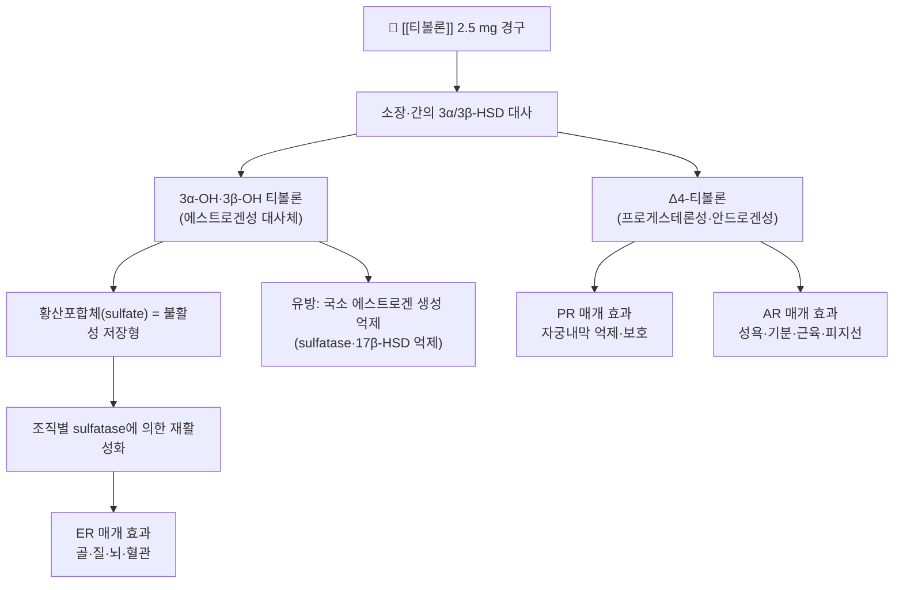

# 💊 [[티볼론]] (Tibolone, Livial, ATC G03CX01)

> **핵심 3줄 요약 (Key Summary)**:
> 🧪 주성분·제형: [[티볼론]](Tibolone)은 19-노르테스토스테론(19-nortestosterone) 골격에서 유도된 **합성 스테로이드**로, 인체 내 자연 호르몬이 아니라 대사체를 통해 작용하는 일종의 **프로드러그(prodrug)**이다. 임상에서는 대부분 **경구용 정제 2.5 mg** 단일제(대표 브랜드 [[리비알]], Livial)로 시판되며, 일부 국가에서는 1.25 mg 저용량 정제가 추가로 허가되어 있다.
> 📍 작용 기전: 경구 복용 후 장관·간의 3α/3β-하이드록시스테로이드 탈수소효소(3α/3β-HSD)에 의해 **3α-OH·3β-OH 대사체(에스트로겐성)** 와 **Δ4-티볼론(프로게스테론성·안드로겐성)** 으로 전환된다. 각 대사체가 에스트로겐 수용체(ER)·프로게스테론 수용체(PR)·안드로겐 수용체(AR)에 선택적으로 결합하여 **조직 선택적(tissue-selective) 복합 호르몬 작용**을 나타내는 것이 핵심이다.
> 🎯 임상 적응증: 폐경 후 여성의 **에스트로겐 결핍 증상(안면홍조, 야간 발한 등) 치료**와 **골다공증 예방(골절 고위험군)** 이 대표 적응증이며, 자궁을 보유한 여성에서도 Δ4-대사체의 프로게스테론 작용 덕분에 **프로게스틴 추가 투여 없이 단독 지속 투여**가 가능하다는 점이 다른 호르몬요법(HRT)과의 큰 차이다.
> ⚠️ 주의사항: 유방암·에스트로겐 의존성 종양 병력, 원인 미상의 질출혈, 정맥혈전색전증(VTE)·동맥혈전증 병력, 중증 간질환이 **금기**이다. 초기 수개월간 질 출혈·점상출혈, 유방 압통, 체중 변화, 여드름·지루(안드로겐성) 등이 흔하며, 고령 여성에서 뇌졸중 등 혈관계 위험에 대한 평가가 필요하다.

---

## 1. 약물 기본 정보 및 시판 제품 (Brand Identification)
> [!abstract]+ 🧪 3D 약리 분자 구조 (Interactive 3D Viewer)
> <iframe src="https://molecule-viewer-rho.vercel.app/?cid={{pubchem_cid}}" width="100%" height="450px" frameborder="0" allow="webgl" style="border-radius: 8px;"></iframe>

| 항목 | 상세 정보 |
| :--- | :--- |
| **일반명 (Generic Name)** | [[티볼론]](한글) / Tibolone (English Generic Name) |
| **대표 상품명 (Brand Names)** | **[[리비알]](Livial)**, 티볼론정(국내 제네릭 다수) (※ YAML `aliases:`에 필수 등록하여 위키링크 통합) |
| **ATC 코드 / 분류** | **G03CX01** — G03C(에스트로겐계) > G03CX(기타 에스트로겐). 국내 식약처 효능군 분류 코드는 허가사항 원문 확인 필요 |
| **PubChem CID** | {{pubchem_cid}} — **미확인**(PubChem에서 직접 검색하여 채울 것. 임의 수치 기재 금지) |
| **화학식 / 분자량** | C₂₁H₂₈O₂ / 약 **312.45 g/mol** (19-노르테스토스테론 유도체 합성 스테로이드, CAS 5630-53-5로 알려져 있으나 **원문 재확인 권장**) |
| **주요 제형 및 함량** | 경구용 정제 **2.5 mg** (표준), 일부 국가에서 1.25 mg 정제 추가 허가(국내 허가 여부 **근거 미확인**) |
| **식약처 허가 적응증** | ① 폐경 후 여성의 에스트로겐 결핍 증상 치료 ② 폐경 후 여성의 골다공증 예방(골절 고위험군) — 세부 문구 및 연령 제한은 **식약처 허가사항 원문 확인 필요** |

### 1.1 대표 시판 제품 및 함유 복합제 매핑 (Brand Identification & Combinations)

| 구분 | 대표 제품명 / 브랜드 | 함유 성분 및 1회당 함량 | 제형 및 특징 | 주요 적응증 및 복약 지도 핵심 |
| :--- | :--- | :--- | :--- | :--- |
| **단일제 (ETC)** | [[리비알]](Livial) | [[티볼론]] 2.5 mg 단일 성분 | 경구 정제 | 1일 1회 **매일 같은 시간** 지속 투여, 휴약기 없음. 자궁 보유자에서 프로게스틴 추가 불필요 |
| **단일제 (제네릭, ETC)** | 티볼론정 2.5 mg (제조사별 상이) | [[티볼론]] 2.5 mg 단일 성분 | 경구 정제 | 오리지널과 동일 허가사항. 제조사·품목코드는 식약처 의약품안전나라에서 확인 |
| **저용량 제형** | Livial 1.25 mg 등(일부 국가) | [[티볼론]] 1.25 mg | 경구 정제 | 국내 허가 여부 **근거 미확인**. 유지요법 목적 보고 |
| **복합제** | 해당 없음 | — | — | 티볼론 함유 복합제는 확인되지 않음(**근거 미확인**, 허가목록 대조 필요) |
| **감별 다빈도 호르몬요법** | [[프레마린]], [[프로베라]], [[에스트라디올]] 단독/복합 | 접합형 에스트로겐, MPA, 에스트라디올 | 정제·패치·겔 | 폐경 증상 치료 목적은 유사하나, **자궁 보유 시 프로게스틴 병용이 원칙**이라는 점에서 티볼론과 감별 |

> **복약 지도 핵심**: 티볼론은 "에스트로겐 단독제"로 오인되기 쉽지만, 실제로는 **에스트로겐+프로게스테론+안드로겐 활성을 동시에 지닌 복합 작용 스테로이드**이다. 따라서 자궁내막 보호 목적의 프로게스틴을 따로 처방하지 않으며, 환자에게 "이 약 하나로 호르몬 균형을 맞추는 약"이라고 설명하면 복약 순응도가 올라간다.

---

## 2. 분자 약리 기전 및 작용 경로 (Mechanism of Action)

* **주요 작용 기전 (Primary MoA)**:
  * [[티볼론]]은 그 자체로는 수용체 친화성이 낮고, **복용 후 체내에서 대사체로 전환되어 작용하는 프로드러그형 스테로이드**이다(Albertazzi & Di Micco, 1998, PMID 9881330).
  * **3α-OH·3β-OH 티볼론**: 3α/3β-HSD에 의해 생성되는 에스트로겐성 대사체로, **에스트로겐 수용체(ER)** 에 결합하여 골·질점막·뇌·혈관에서 에스트로겐 효과를 매개한다. 즉, 안면홍조 완화·골흡수 억제·질 위축 개선의 주요 기전이다.
  * **Δ4-티볼론**: 이중결합이 이동한 이성질체로 **프로게스테론 수용체(PR)와 안드로겐 수용체(AR)** 에 작용한다. 자궁내막에서 프로게스테론성 효과를 발휘하여 자궁내막 증식을 억제하므로, 자궁 보유 여성에서 프로게스틴을 별도로 추가하지 않아도 되는 근거가 된다. 또한 AR 작용은 성욕·기분·근육량 유지에 기여하는 것으로 설명된다.
  * **조직 선택성(tissue selectivity)**: 순환 중 3-OH 대사체는 대부분 **황산포합체(sulfate conjugate, 불활성 저장형)** 로 존재하다가, 표적 조직의 **sulfatase**에 의해 국소적으로 재활성화된다. 유방 조직에서는 반대로 sulfatase 및 17β-HSD type 1 활성을 억제하여 **국소 에스트로겐 생성이 감소**하는 방향으로 작용하는 것으로 보고되었다(Lello & Capozzi, 2023, PMID 37450250). 이러한 조직별 효소 활성 차이가 "골·질에서는 에스트로겐처럼, 자궁내막에서는 프로게스틴처럼, 유방에서는 자극이 적게"라는 임상 프로파일의 분자적 배경이다.
* **하류 신호전달 및 생화학적 반응**:
  * ER 매개 경로를 통해 파골세포 활성 억제·조골세포 보호 방향으로 골대사가 조정되어 **골밀도 유지·골절 위험 감소**에 기여한다(골절 위험 감소의 정량적 수치는 본 노트에 인용된 문헌만으로는 **근거 미확인**).
  * 중추신경계에서는 에스트로겐성 대사체 및 Δ4-대사체가 신경전달·신경보호 기전(항염증, 항아밀로이드, 시냅스 보호 등)에 관여할 가능성이 제시되어 있으며, 알츠하이머병 재창출(repurposing) 후보로 검토되고 있다(Barreto, 2023, PMID 37509151; Del Río & Molina, 2020, PMID 32507541).
  * 혈관계에서는 에스트로겐성 효과에 따른 혈관운동 증상 개선이 기대되는 반면, 고령 여성에서는 혈전·뇌졸중 위험과의 상쇄 관계를 반드시 함께 평가해야 한다(§5 참조).

---

## 3. 약동학적 특성 (Pharmacokinetics: ADME)

| 약동학 파라미터 | 수치 및 임상적 의미 |
| :--- | :--- |
| **생체이용률 (Bioavailability, F)** | 경구 흡수는 **빠르고 광범위(>90% 수준으로 보고)** 하지만 장관벽·간의 **초회통과 대사가 광범위**하여 미변화체 티볼론의 혈중 농도는 매우 낮다. 절대 생체이용률의 정확한 수치는 **근거 미확인(제품 허가사항 원문 확인 필요)** |
| **최고혈중농도 도달시간 (Tmax)** | 미변화체 기준 **약 1.5~2시간 내외**로 알려져 있으나, 본 노트의 인용 문헌에는 정량값이 제시되지 않아 **근거 미확인(허가사항 확인 필요)** |
| **혈장 단백결합률 (Protein Binding)** | 티볼론은 **SHBG(성호르몬결합글로불린)에 결합하지 않는 것**으로 알려져 있다. 알부민 등 기타 결합 단백의 정량적 결합률은 **근거 미확인** |
| **간 대사 효소 (Metabolism)** | 주경로는 **3α/3β-HSD에 의한 하이드록실화 → sulfotransferase에 의한 황산포합**이며, 이는 CYP450 비의존적 경로가 중심이다. 다만 **일부 CYP3A4 관여**가 보고되어 있어, 강력한 CYP3A4 유도제(리팜피신, 카르바마제핀, 페니토인, 성요한초 등)는 대사를 촉진해 효과를 감소시킬 수 있다(허가사항 기준, 원문 확인 권장) |
| **배설 반감기 (Elimination t1/2)** | 미변화체는 매우 짧고, 황산포합 대사체가 저장형으로 순환하며 최종 소실이 지연된다. **최종 반감기의 정확한 수치는 근거 미확인** — 처방 시 반감기 수치를 인용하지 말고 "저장형 대사체로 인해 작용이 지속된다"는 정성적 서술로 대체할 것 |
| **주요 배설 경로 (Excretion)** | 대사체는 주로 **포합체 형태로 소변 배설**되고 일부는 대변으로 배설되는 것으로 알려져 있으나, 비율(%)은 **근거 미확인** |

> ⚠️ 약동학 수치를 환자 설명·학술 인용에 사용할 때는 반드시 **제품 허가사항(SmPC/식약처 허가사항)** 원문으로 재확인해야 한다. 본 노트는 인용 가능한 리뷰 문헌 범위 내에서 정성적 특성만 확정 기술하였다.

---

## 4. 임상 용법·용량 및 처방 가이드 (Dosage & Administration)

| 임상 적응증 | 성인 표준 용법·용량 | 1일 최대 한도 용량 |
| :--- | :--- | :--- |
| **폐경 후 에스트로겐 결핍 증상(안면홍조·야간 발한)** | [[티볼론]] **2.5 mg 1일 1회**, 매일 **동일한 시간대** 경구 투여. 휴약기 없이 **지속 투여** | 2.5 mg/day |
| **폐경 후 골다공증 예방(골절 고위험군)** | [[티볼론]] **2.5 mg 1일 1회** 지속 투여 | 2.5 mg/day |
| **유지요법(일부 국가)** | 1.25 mg 1일 1회 등 저용량 요법이 보고되어 있음 | 국내 허가 여부 **근거 미확인** |

* **투여 시작 시점**: 자연 폐경 여성에서는 **최종 월경 후 최소 12개월 경과 후** 시작하는 것이 원칙이며, 수술적 폐경(양측 난소절제 등)의 경우에는 즉시 시작할 수 있다. 정확한 기준은 **허가사항 원문 확인 필요**.
* **자궁 보유 여성**: Δ4-대사체의 프로게스테론 작용으로 자궁내막이 보호되므로 **프로게스틴 추가 투여가 필요하지 않다**(Albertazzi & Di Micco, 1998, PMID 9881330). 이는 에스트로겐 단독 요법이 자궁내막암 위험을 높여 프로게스틴 병용이 필수인 일반 HRT와의 결정적 차이점이다.
* **투여 중단**: 정해진 감량 프로토콜이 필수는 아니나, 중단 시 혈관운동 증상이 반동성으로 재발할 수 있으므로 §6의 한의 연계 프로토콜을 참고한다.

---

## 5. 부작용, 경고 및 약물 상호작용 (Adverse Effects & Interactions)

### 5.1 주요 부작용 및 독성 경고 (Black Box Warnings)

* **혈관계 위험(혈전색전증·뇌졸중)**:
  * 호르몬요법 전반에서 정맥혈전색전증(VTE) 및 동맥혈전증(심근경색, 뇌졸중) 위험 증가가 보고되어 왔다. 최근 스웨덴 전국 등록자료 기반 에뮬레이티드 목표시험(BMJ, 2024, PMID 39603704)은 **현대적 폐경 호르몬요법 사용과 심혈관질환 위험의 연관성**을 평가하였다. 다만 이 연구는 티볼론 단독에 특이적인 결론을 제시한 것이 아니므로, **티볼론 고유의 심혈관 위험 정량치는 본 노트에서 근거 미확인**으로 표시한다. 임상적으로는 고령(특히 60세 이상), 비만, 흡연, 혈전 병력 보유 여성에서 시작 전 위험-편익 평가가 필수이다.
  * 급성 또는 과거 VTE·동맥혈전증 병력은 **금기**로 취급한다.
* **유방 조직 및 유방암**:
  * Lello & Capozzi(2023, PMID 37450250)의 리뷰는 **티볼론이 정상 유방조직에 대해 상대적으로 제한된 증식 자극 프로파일**을 보인다는 점을 정리하였다. 유방 조직 내 sulfatase·17β-HSD 억제를 통한 국소 에스트로겐 생성 감소가 그 배경으로 제시된다.
  * 그러나 **유방암 생존자**에서 전신 호르몬요법의 안전성을 다룬 체계적 문헌고찰 및 메타분석(Poggio 등, 2022, PMID 34731351)은 **전신 HRT가 유방암 생존자의 재발 위험을 증가시킬 수 있음**을 보고하였다. 따라서 **유방암 병력 또는 의심되는 여성에서 티볼론은 금기**로 간주해야 한다.
* **자궁내막**:
  * Δ4-대사체의 프로게스테론성 효과로 자궁내막 자극이 적고 출혈 발생률도 낮은 편이나, **원인 미상의 질출혈, 자궁내막증식증**은 금기이며 투여 중 비정상 출혈 발생 시 반드시 감별 진단이 필요하다.
* **간·담도**:
  * 중증 간질환, 급성 간질환, 간기능 수치의 임상적 상승은 금기이다. 담즙정체성 황달·담석 병력자에서 주의가 필요하며, 투여 중 간기능 이상 소견 시 중단을 고려한다.
* **안드로겐성 부작용**:
  * 여드름, 지루, 다모증, 음성 변화(드묾), 체중 증가, 부종 등이 Δ4-대사체의 AR 작용과 관련하여 나타날 수 있다.
* **기타 흔한 이상반응**:
  * 질 출혈·점상출혈(특히 치료 초기 3~6개월에 흔함), 유방 압통, 두통, 어지럼, 소화불량, 복부팽만, 기분 변화·우울감, 말초 부종.
* **알레르기 및 과민반응**:
  * 피부 발진, 소양감, 혈관부종 등. 아나필락시스는 드물다. 특이 체질자에서는 스테로이드 구조에 대한 과민 반응을 항상 문진한다.
* **기타 금기 요약**: 임신 및 수유, 에스트로겐 의존성 종양(자궁내막암 등) 및 그 병력, 진단되지 않은 질출혈, 중증 간질환, 활동성 또는 과거 VTE·혈전색전성 질환, 포르피린증.

### 5.2 주요 병용 금기 및 상호작용

* **CYP3A4 유도제**: 리팜피신, 카르바마제핀, 페니토인, 페노바르비탈, **성요한초(관엽연교, Hypericum perforatum)** 등은 티볼론의 대사를 촉진하여 혈중 농도 및 임상 효과를 감소시킬 수 있다(허가사항 기준, 원문 확인 권장).
* **항응고제(와파린 등)**: 에스트로겐성 성분이 응고인자에 영향을 줄 수 있어 병용 시 INR 등 응고 지표 모니터링이 필요하다.
* **동일 계열 중복 투여**: 다른 에스트로겐 제제(경구·경피 에스트라디올, 접합형 에스트로겐 등)와의 중복 투여는 호르몬 부하를 증가시키므로 피한다.
* **알코올 및 간독성 약물**: 간 대사 부담이 가중될 수 있으므로 음주력이 높은 환자에서는 시작 전 간기능 평가를 우선한다.

---

## 6. 한의 치료 연계 및 병용/테이퍼링 프로토콜 (Integrative Medicine)

### 6.1 한약·양약 병용 투여 안전성 및 시너지 배오

* **변증적 접근**: 티볼론의 임상 표적은 한의학적으로 **신허(腎虛)**, **음허화동(陰虛火動)**, **간울(肝鬱)**, **어혈(瘀血)**, 그리고 골다공증의 경우 **골위(骨痿)·골고(骨枯)** 범주와 대응시켜 해석할 수 있다. 안면홍조·야간 발한·불면은 음허화동 또는 신음허, 골밀도 저하는 신허·골위, 정서 불안·울체감은 간울로 변증을 나누어 접근한다.
* **간·신 대사 간섭 완충 처방**: 티볼론은 CYP3A4 관여가 일부 보고되어 있고 황산포합 대사가 중심이므로, **간 대사 부담을 공유할 수 있는 한약재(예: 황금·황련 등 苦寒淸熱類, 대량의 감초 등)와 병용 시 시간차 투여(1~2시간 간격)** 를 원칙으로 한다. 다만 구체적 상호작용 데이터는 대부분 **근거 미확인**이므로, 병용 시작 후 4~8주 간격으로 간기능(AST/ALT, γ-GT)을 확인하는 보수적 모니터링을 권장한다.
* **상승 배오 (Synergy) 후보**:
  * **안면홍조·발한·불면**: [[감맥대조탕]], [[계지가용골모려탕]], [[이음전]], [[시호계지탕]] 등에서 음허·영위불화(營衛不和)를 조정하는 접근. 티볼론 용량을 늘리지 않고도 주관적 증상 조절을 보조하는 것이 목표.
  * **골다공증·골위**: [[육미지황환]](또는 [[좌귀음]]·[[지백지황환]]), [[대영전]] 등 신정(腎精) 보익 처방에 [[골쇄보]], [[속단]], [[두충]], [[우슬]], [[보골지]], [[녹각교]] 등 강근골 본초를 배오.
  * **정서 불안·간울**: [[소요산]], [[당귀작약산]] 등 소간해울·양혈 처방.
  * ⚠️ 특히 [[음양곽]](淫羊藿, Epimedium) 등 **에스트로겐 유사 활성이 논의되는 본초**는 호르몬요법과 병용 시 이론적 상가작용 가능성이 제기되나, 임상적 근거는 **근거 미확인**이므로 병용 시 증상·호르몬 관련 부작용을 면밀히 관찰한다.
* **침구 연계**: 폐경 증상에는 삼음교(SP6), 관원(CV4), 기해(CV6), 신수(BL23), 태계(KI3), 조해(KI6) 등을 변증에 따라 활용하고, 골다공증 관리에는 신수·대장수·위중·족삼리 등을 배합하는 전통적 접근이 병행될 수 있다(티볼론 병용 시 특별한 침구 금기는 알려져 있지 않으나 **근거 미확인**).

### 6.2 양약 감량 및 한의 전환(테이퍼링) 가이드

* **기본 원칙**: 티볼론은 다른 스테로이드성 약물처럼 부신 억제 반동이 정해진 감량 프로토콜을 요구하지는 않는다. 다만 **중단 시 혈관운동 증상 재발(rebound)** 이 흔하므로 다음과 같은 완충 전략을 사용한다.
  1. **한의 치료 선행 안정화**: 침·한약으로 안면홍조·불면·정서 증상을 4~8주 먼저 안정시킨 후 양약 조정에 들어간다.
  2. **단계적 감량**: 격일 투여 → 주 2~3회 → 중단, 또는 저용량 제형(1.25 mg)이 확보 가능한 경우 용량 단계적 감량(국내 허가 여부 확인 필요).
  3. **중단 후 추적**: 중단 후 4주·12주 시점에 증상 점수(안면홍조 빈도, 야간 각성 횟수)를 재평가하고, 필요 시 한약 처방을 조정한다.
* **골다공증 환자에서의 주의**: 골절 고위험군에서 티볼론을 중단할 경우 골밀도 추적(DXA)과 칼슘·비타민 D 섭취, 체중부하 운동, 한약(골위 처방) 병행을 통해 **골대사 공백기를 최소화**해야 한다.
* **재평가 원칙**: 호르몬요법은 증상 조절 목적일 때 **최소 유효 용량·최단 기간** 원칙을 적용하고, 연 1회 이상 유방·자궁·간기능·혈전 위험을 재평가한다.

---

## 7. 💡 사용자 진료실 핵심 필기 & 실전 임상 체크리스트

### 7.1 진료실 3대 핵심 문진 체크리스트

1. **호르몬 의존성 종양 및 혈전 병력 확인**: 유방암·자궁내막암·난소암 병력, 원인 미상의 질출혈, VTE·뇌졸중·심근경색 병력 여부를 반드시 확인한다. 하나라도 해당하면 티볼론은 선택하지 않는다.
2. **폐경 경과 기간 및 자궁 보유 여부 확인**: 자연 폐경 후 1년이 경과했는지, 자궁적출술을 받았는지 확인한다. 자궁 보유 여성이라도 티볼론은 프로게스틴 추가가 불필요하다는 점을 설명한다.
3. **병용 약물·본초 및 간기능·음주력 청취**: 성요한초(관엽연교) 함유 제품, 항경련제, 리팜피신, 와파린, 그리고 환자가 복용 중인 한약·건강기능식품을 모두 확인한다. 주 3회 이상 음주 시 간기능 검사를 우선 시행한다.

추가로, **투여 초기 질 출혈**은 흔한 소견이지만 지속·다량 출혈은 반드시 자궁내막 평가가 필요함을 환자에게 사전 교육한다.

### 7.2 환자 티칭 스크립트

> *"환자분, 지금 처방드리는 티볼론(리비알)은 단순한 여성호르몬제가 아니라, 몸 안에서 여러 대사체로 바뀌어 뼈와 질 점막에는 에스트로겐처럼, 자궁에는 프로게스테론처럼 작용하는 복합 호르몬약입니다. 그래서 자궁이 있는 분도 자궁내막을 보호하는 약을 따로 드실 필요가 없습니다. 다만 유방암이나 혈전 병력이 있으신 분에게는 쓸 수 없고, 드시는 동안 성요한초 같은 일부 허브 제품이나 항경련제는 약효를 떨어뜨릴 수 있습니다. 복용 시작 후 몇 달 동안은 소량의 질 출혈이나 유방 압통이 나타날 수 있는데, 출혈이 계속되거나 양이 많아지면 꼭 알려주십시오. 저희 한의원에서는 침과 한약으로 홍조·불면·기분 증상을 함께 조절하면서, 필요하면 이 약을 줄여나갈 수 있도록 단계적으로 도와드리겠습니다."*

---

## 8. 출처 및 학술 참고 문헌 (References)

* Lello S, Capozzi A. Tibolone and Breast Tissue: a Review. *Reprod Sci*. 2023. PMID: **37450250**
  * `[연구 요약]` 티볼론이 유방 조직에 미치는 영향(국소 에스트로겐 생성 효소 억제, 증식 자극 프로파일)을 정리한 리뷰. 유방 조직 선택성 해석의 핵심 근거.
* Barreto GE. Repurposing of Tibolone in Alzheimer's Disease. *Biomolecules*. 2023. PMID: **37509151**
  * `[연구 요약]` 티볼론의 신경보호 기전 및 알츠하이머병 재창출(repurposing) 가능성을 검토한 논문. 중추 작용 관련 서술의 근거.
* Del Río JP, Molina S, et al. Tibolone as Hormonal Therapy and Neuroprotective Agent. *Trends Endocrinol Metab*. 2020. PMID: **32507541**
  * `[연구 요약]` 티볼론의 호르몬요법으로서의 임상 활용과 신경보호 작용(뇌·인지 기능)을 종합한 리뷰.
* Albertazzi P, Di Micco R, et al. Tibolone: a review. *Maturitas*. 1998. PMID: **9881330**
  * `[연구 요약]` 티볼론의 대사 경로(3α/3β-OH 및 Δ4-대사체), 조직 선택적 작용, 자궁 보유 여성에서 프로게스틴 추가 불필요성 등 기본 약리·임상 특성을 정리한 고전적 리뷰.
* Johansson T, Karlsson T, et al. Contemporary menopausal hormone therapy and risk of cardiovascular disease: Swedish nationwide register based emulated target trial. *BMJ*. 2024. PMID: **39603704**
  * `[연구 요약]` 스웨덴 전국 등록자료 기반 에뮬레이티드 목표시험으로, 현대적 폐경 호르몬요법과 심혈관질환 위험의 연관성을 평가. 티볼론 특이적 결론이 아니므로 본 노트에서는 일반적 위험 평가 맥락으로만 인용.
* Poggio F, Del Mastro L, et al. Safety of systemic hormone replacement therapy in breast cancer survivors: a systematic review and meta-analysis. *Breast Cancer Res Treat*. 2022. PMID: **34731351**
  * `[연구 요약]` 유방암 생존자에서 전신 호르몬요법의 안전성을 다룬 체계적 고찰·메타분석. 유방암 병력자에서 호르몬요법(티볼론 포함) 사용 금기의 근거로 인용.
* 식품의약품안전처 의약품안전나라 의약품통합정보시스템 (https://nedrug.mfds.go.kr)
  * `[연구 요약]` 국내 허가 의약품(티볼론 정제)의 품목 기준코드, 허가 적응증, 용법·용량, 금기 및 이상반응 안전성 정보. 본 노트에서 **근거 미확인**으로 표시한 약동학 수치·국내 허가 여부·제네릭 품목 목록은 이 원문에서 최종 확인할 것.