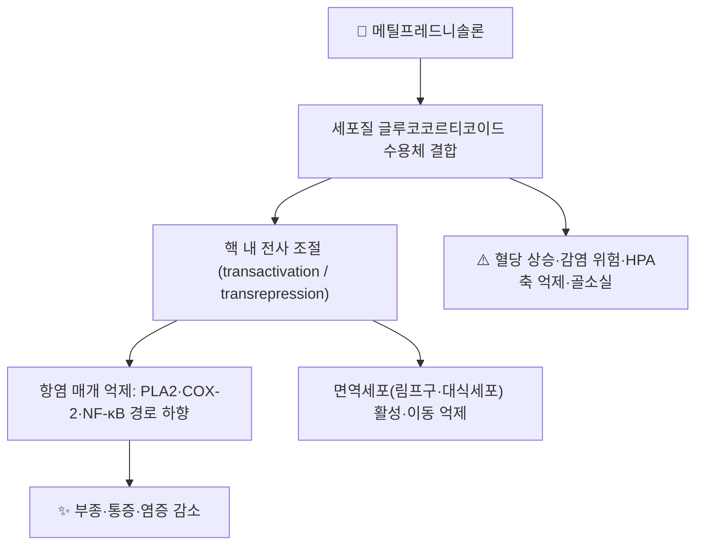

# 💊 [[메틸프레드니솔론]] (Methylprednisolone, ATC H02AB04)

> 🖼️ **이미지 1장 확보 — 시판 패키지·PTP 알약 실사 2장 미확보.** 2D 구조식은 PubChem CID 6741로 확보·검수했으나, 국내 시판 제품 사진은 확인된 출처에서 구하지 못해 슬롯을 비웠다(다른 약 사진으로 채우지 않는다).

> **핵심 3줄 요약 (Key Summary)**:
> 🧪 주성분·제형: 프레드니솔론 계열 합성 글루코코르티코이드(C22H30O5). 경구정, 그리고 아세테이트(현탁·서방)와 숙시네이트(수용성) 주사제가 있다
> 📍 작용 기전: 세포질 글루코코르티코이드 수용체(GR) 결합 → 전사 조절로 항염 매개물질·면역세포 활성을 억제한다. 광물코르티코이드 작용은 거의 없다
> 🎯 임상 위치: 전신 항염(경구·정맥)과 국소 주사(관절내·경막외·점액낭내)에 두루 쓴다. 2026-10-08 실용적 RCT의 경막외 주사액은 아세테이트 80 mg이었다
> ⚠️ 주의사항: 혈당 상승·감염 위험·장기 사용 시 HPA 억제. 갑작스러운 중단 금지(테이퍼링)

## 1. 약물 기본 정보 및 시판 제품 (Brand Identification)

| 항목 | 상세 정보 |
| :--- | :--- |
| **일반명 (Generic Name)** | 메틸프레드니솔론(Methylprednisolone) / 염 형태: 아세테이트·숙시네이트 나트륨 |
| **대표 상품명 (Brand Names)** | Solu-Medrol(솔루메드롤 — 숙시네이트 주사), Depo-Medrol(디포메드롤 — 아세테이트 현탁 주사) ※ 국내 허가 품목명은 의약품안전나라에서 확인한다 |
| **ATC 코드 / 분류** | H02AB04 (전신성 코르티코스테로이드) |
| **PubChem CID** | [6741](https://pubchem.ncbi.nlm.nih.gov/compound/6741) |
| **화학식 / 분자량** | C22H30O5 / 약 374.5 g/mol |
| **주요 제형 및 함량** | 경구정(4 mg·8 mg·16 mg), 아세테이트 현탁주사(40 mg/mL 등), 숙시네이트 주사(40~125 mg/vial) |
| **허가 적응증** | 각종 염증·알레르기·자가면역 질환의 전신 치료, 관절내·연부조직내·경막외 주사 등 국소 치료 |

### 1.1 제형별 선택 매핑

![[메틸프레드니솔론_01_구조식_PubChem.png|520]]
> [그림 1: 메틸프레드니솔론 2D 구조식 — 스테로이드 4환 골격에 케톤·수산기 — PubChem CID 6741 (구조식 정본: PubChem PNG API)]

| 구분 | 제형 | 특징 | 대표 사용 |
| :--- | :--- | :--- | :--- |
| 속효성 전신 | 숙시네이트 주사 | 수용성 — 정맥 투여, 즉시 작용 | 급성 중증 염증·천식 급성발작·아나필락시스 보조 |
| 서방성 국소 | 아세테이트 현탁 | 난용성 — 조직 내 서서히 방출 | 관절내·점액낭내·경막외 주사 |
| 경구 유지 | 정제 | 4~48 mg/일 범위 | 만성 염증질환 유지·테이퍼링 |

## 2. 분자 약리 기전 및 작용 경로 (Mechanism of Action)

- **주요 기작**: 프레드니솔론보다 항염 활성이 약간 강하고 광물코르티코이드(나트륨 저류) 작용이 거의 없어 부종·고혈압 부담이 상대적으로 적다.
- **주사 제형의 층위**: 아세테이트는 결정 현탁액이라 조직에 오래 머물러 국소 항염을 길게 유지한다. 경막외·관절내 주사의 근거가 여기에 있다 → [[경막외 스테로이드 주사]]

## 3. 약동학적 특성 (Pharmacokinetics: ADME)

| 약동학 파라미터 | 수치 및 임상적 의미 |
| :--- | :--- |
| **생체이용률 (Bioavailability, F)** | 경구 약 80% (초회통과 일부) |
| **최고혈중농도 도달시간 (Tmax)** | 경구 1~2시간 / 숙시네이트 주사 즉시 / 아세테이트 현탁 지연 |
| **혈장 단백결합률 (Protein Binding)** | 약 75~80% (주로 알부민·트랜스코르틴) |
| **간 대사 효소 (Metabolism)** | 간에서 대사(CYP3A4 일부 관여) — CYP3A4 유도·억제 약물과 상호작용 |
| **배설 반감기 (Elimination t1/2)** | 혈장 2~3시간, 생물학적 작용은 12~36시간(수용체 매개) |
| **주요 배설 경로 (Excretion)** | 소변(대사체) |

## 4. 용법·용량 및 처방 가이드 (Dosage & Administration)

| 임상 적응증 | 표준 용법·용량 | 비고 |
| :--- | :--- | :--- |
| 전신 항염(경구) | 4~48 mg/일, 1일 1회 아침 투여 | 장기 사용 시 최소 유효 용량·격일 요법 |
| 관절내·점액낭내 주사 | 아세테이트 4~80 mg, 관절 크기에 따라 | 반복 주사 간격·횟수 제한 |
| 경막외 주사 | 아세테이트 80 mg + 국소마취제 | 2026-10-08 시험 프로토콜([[경막외 스테로이드 주사]]) |
| 급성 중증(정맥) | 숙시네이트 40~125 mg, 필요 시 반복 | 감염 배제 후 사용 |

## 5. 부작용, 경고 및 약물 상호작용 (Adverse Effects & Interactions)

### 5.1 주요 부작용 및 독성 경고
- **대사·내분비**: 고혈당, 체액 저류(경미), 장기 사용 시 시상하부-뇌하수체-부신축(HPA) 억제 → [[시상하부-뇌하수체-부신축]] · [[코르티솔]]
- **감염·면역**: 감염 위험 증가, 잠복결핵 재활성, 상처 치유 지연
- **근골격**: 골소실·골괴사(장기), 힘줄 약화 → [[골다공증]] · [[골 재형성]]
- **국소 주사 합병증**: 시술 후 통증 악화(스테로이드 결정 유발), 피부 위축·색소 변화, 드물게 감염·척수 손상(경막외 경로)

### 5.2 주요 병용 금기 및 상호작용
- **CYP3A4**: 강한 억제제(일부 항진균·항생제)와 병용 시 스테로이드 노출 증가 → [[CYP3A4]]
- **당뇨약·인슐린**: 혈당 상승으로 용량 조정 필요 → [[메트포르민]]
- **NSAIDs**: 위장관 점막 손상 위험 상승 → [[NSAIDs]]
- **생백신**: 면역 억제 상태에서 금기

## 6. 한의 치료 연계 및 병용/테이퍼링 프로토콜 (Integrative Medicine)

### 6.1 한약·양약 병용 투여 안전성 및 시너지 배오
- 경구 스테로이드 장기 복용자는 감염·혈당·위장관 위험이 상승한 상태이므로, 침습 시술(도침·약침·매선) 강도를 낮추고 시술 후 감염 징후를 문진한다.
- CYP3A4 경로가 겹치는 약재([[감초]]의 글리시리진 대사 등)는 시간차 투여로 접근한다 → [[글리시리진]] · [[11β-HSD2]]

### 6.2 양약 감량 및 한의 전환(테이퍼링) 가이드
- 장기 사용자의 감량은 **반드시 단계적**으로 한다(급성 중단 시 부신위기). 감량 중에는 ① 체온·혈압·피로감 모니터링 ② 한의 치료로 통증·염증을 대체할 축(침·약침·한약)을 먼저 세워 두고 ③ 감량 폭을 처방의와 상의해 조정한다.

## 7. 💡 사용자 진료실 핵심 필기 & 실전 임상 체크리스트

### 7.1 진료실 3대 핵심 문진 체크리스트
1. **복용 기간·총 용량**: 장기 경구 복용인지, 최근 주사 이력(경막외·관절내)이 있는지 확인한다.
2. **감염·혈당**: 발열·상처·구강 칸디다, 당뇨 환자의 공복혈당 변화를 확인한다.
3. **금단 증상**: 피로·식욕 저하·관절통 악화는 감량 중 부신기능 저하 신호일 수 있다.

### 7.2 환자 티칭 스크립트
> *"스테로이드는 염증을 빠르게 줄여 주지만, 오래 쓰면 혈당이 오르고 감염에 약해지며 뼈가 약해질 수 있습니다. 그래서 필요한 만큼만, 짧게 쓰고 서서히 줄이는 것이 원칙입니다. 줄이는 동안에는 침·한약으로 통증을 받쳐 드리겠습니다."*

## 8. 출처 및 학술 참고 문헌 (References)
- Moreira AM, et al. Comparing the Effectiveness and Safety of Dexamethasone, Methylprednisolone and Betamethasone in Lumbar Transforaminal Epidural Steroid Injections. *Pain Physician*. 2024;27(7):341-348 (PMID 39087972) (https://pubmed.ncbi.nlm.nih.gov/39087972/)
  - [연구 요약] 요추 신경공 경유 경막외 주사에서 덱사메타손·메틸프레드니솔론·베타메타손의 효과·안전성을 비교한 연구 — 스테로이드 선택 시 혈당·합병증 프로파일을 함께 보는 근거.
- Kyada M, et al. Effectiveness of Epidural Methylprednisolone Injection in Management of Lumbar Prolapsed Intervertebral Disc. *J Orthop Case Rep*. 2025;15(10):441-449 (PMID 41078682) (https://doi.org/10.13107/jocr.2025.v15.i10.6280)
  - [연구 요약] 요추 추간판 탈출증에서 경막외 메틸프레드니솔론 주입 경로별 효과를 비교한 임상 연구.
- Wende O, et al. Prolotherapy versus epidural steroid injections for lumbar pain with associated leg pain. *PM R*. 2026 (PMID 42053118) (https://doi.org/10.1002/pmrj.70136)
  - [연구 요약] 경막외 주사액으로 메틸프레드니솔론 아세테이트 80 mg + 0.5% 부피바카인 2 cc를 생리식염수로 8 cc로 희석해 투시 유도로 주입한 프로토콜 출처.
- 식품의약품안전처 의약품안전나라 의약품통합정보시스템 (https://nedrug.mfds.go.kr)
  - [연구 요약] 국내 허가 품목명·함량·허가사항 확인 경로(제품사진 확보 실패 사유와 함께 기록).

## 함께 보기
- [[경막외 스테로이드 주사]] · [[트리암시놀론]] · [[베타메타손]] · [[프레드니솔론]] · [[시상하부-뇌하수체-부신축]] · [[코르티솔]] · [[CYP3A4]] · [[NSAIDs]] · [[골다공증]] · [[포도당 프로로테라피]]
