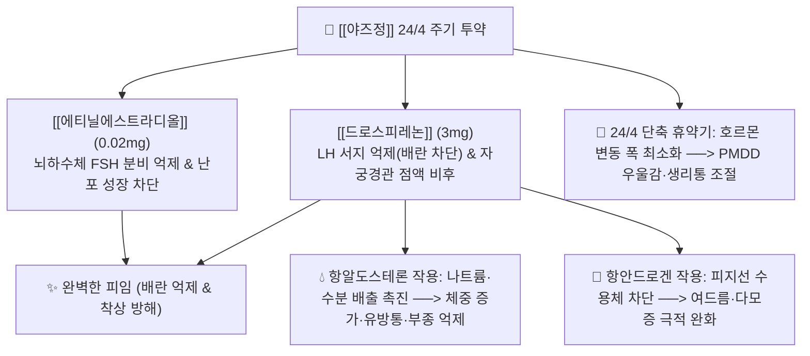

---
aliases:
  - Yaz
  - 야즈정
  - 바이엘야즈
  - 드로스피레논_에티닐에스트라디올
  - Drospirenone_Ethinylestradiol
tags:
  - 의약품
  - 양방약
  - 복합제
  - 전문의약품
  - 부인과
  - 경구피임약
  - 월경전불쾌장애
  - 월경곤란증
title: 야즈
created: 2026-09-12
updated: 2026-09-12
---

# 💊 [[야즈]] (Yaz, Bayer, Oral Tablet 24/4 Regimen)

> **핵심 3줄 요약 (Key Summary)**:
> - 🧪 주성분 배합: 활성 정제 1정당 4세대 프로게스틴인 [[드로스피레논]](3mg) + 초저용량 에스트로겐인 [[에티닐에스트라디올]](0.02mg) 복합 배합 (24일 분홍색 활성정 + 4일 백색 위약정).
> - 📍 복합 약리 기전: HPO 축 억제를 통한 배란 차단 및 자궁내막 위축과 함께, 스피로노락톤 유도체 특유의 항미네랄코르티코이드(수분 저류·부종 억제) 및 항안드로겐(피지 분비 억제) 시너지 발휘.
> - 🎯 임상 적응증: 피임, 피임을 원하는 여성의 중등도 여드름 치료, 월경전불쾌장애([[PMDD]]) 완화, 원발성 [[월경곤란증]](생리통) 치료.
> - ⚠️ 특정 성분 금기: **35세 이상 흡연 여성 복용 절대 금기(Black Box Warning)**, 레보노르게스트렐 대비 정맥혈전색전증([[VTE]]) 위험 증가, 항알도스테론 작용으로 인한 고칼륨혈증 모니터링 필요.

---

## 1. 복합 구성 성분 및 제형별 함량 (Active Ingredients & Formulations)

  <iframe src="https://embed.molview.org/v1/?mode=balls&cid=68873" style="position: absolute; top: 0; left: 0; width: 100%; height: 100%; border: 0;" title="야즈 핵심 프로게스틴 드로스피레논 3D 화학 구조식"></iframe>

> [인터랙티브 3D 분자 구조 모델] 야즈의 4세대 핵심 성분 [[드로스피레논]] (Drospirenone, PubChem CID: 68873)

> [그림 1] 경구 복합 피임제의 28일 블리스터 포장 및 복용 요일 표시 성상

> [그림 2] 4세대 프로게스틴인 [[드로스피레논]](Drospirenone) 2D 화학 분자 구조식 (PubChem CID: 68873)

> [그림 3] 초저용량 합성 에스트로겐인 [[에티닐에스트라디올]](Ethinylestradiol) 2D 화학 분자 구조식 (PubChem CID: 5991)

### 1.1 야즈정(28정 팩) 1정당 구성 성분표

| 구분 | 성분명 (한글/영문) | 1정당 함량 | 약효 분류 및 생체 작용 | PubChem CID |
| :--- | :--- | :--- | :--- | :--- |
| **활성정 (1~24일차: 분홍색)** | [[드로스피레논]] (Drospirenone) | **3.0 mg** | 4세대 합성 프로게스틴 (항안드로겐, 항알도스테론) | [68873](https://pubchem.ncbi.nlm.nih.gov/compound/68873) |
| **활성정 (1~24일차: 분홍색)** | [[에티닐에스트라디올]] (Ethinylestradiol) | **0.02 mg (20$\mu$g)** | 합성 에스트로겐 (FSH 분비 억제, 파탄 출혈 방지) | [5991](https://pubchem.ncbi.nlm.nih.gov/compound/5991) |
| **위약정 (25~28일차: 백색)** | 유당수화물 및 첨가제 (Placebo) | - | 무약효 위약 정제 (복용 루틴 유지 및 소퇴성 출혈 유도) | - |

---

## 2. 복합 상승 약리 기전 (Combination Mechanism & Synergy)

* **3중 피임 상승 메커니즘**:
  1. 시상하부-뇌하수체-난소(HPO) 축의 GnRH, FSH, LH 펄스를 음성 피드백으로 차단하여 난포 성숙과 **배란(Ovulation)을 100% 억제**.
  2. 자궁경관 점액의 점도를 높여 정자의 자궁 내 침투를 물리적으로 차단.
  3. 자궁내막 증식을 억제하여 수정란이 착상할 수 없도록 위축된 환경 조성.
* **드로스피레논만의 고유한 약리적 우위**:
  * 기존 1, 2세대 프로게스틴(레보노르게스트렐 등)은 안드로겐 수용체를 자극하여 여드름, 다모증, 체중 증가, 부종을 유발했음.
  * 드로스피레논은 이뇨제인 [[스피로노락톤]] 유도체로서 **미네랄코르티코이드 수용체 길항(항알도스테론)** 작용을 하여 수분 저류를 막아 체중 증가가 없고, **안드로겐 수용체를 차단**하여 난소/부신 유래 피지 분비를 줄여 성인성 여드름 치료제로 공식 허가를 획득함.
* **24/4 복용 스케줄의 임상적 혁신**:
  * 전통적 21/7 요법(7일 휴약)은 휴약기 동안 내인성 에스트로겐과 FSH가 반동 상승하여 두통, 기분 장애, 골반통이 발생했으나, 야즈의 4일 단축 휴약기(24/4)는 **호르몬 요동을 극소화하여 월경전불쾌장애([[PMDD]])와 생리통을 탁월하게 통제**함.

---

## 3. 브랜드 패밀리 라인업 비교 (Brand Lineup Analysis)

| 제품 라인업명 | 프로게스틴 성분 및 세대 | 에스트로겐 함량 | 복용 스케줄 | 임상 적응증 및 차별점 |
| :--- | :--- | :--- | :--- | :--- |
| **야즈정 (Yaz)** | **드로스피레논 3mg (4세대)** | **EE 0.02mg (초저용량)** | **24일 활성 + 4일 위약** | **전문의약품**: 피임, 여드름 치료, PMDD 치료, 월경곤란증 공식 승인 |
| **야스민정 (Yasmin)** | 드로스피레논 3mg (4세대) | EE 0.03mg (중용량) | 21일 활성 + 7일 휴약 | 전문의약품: 피임 1차, 에스트로겐 함량이 높아 파탄 출혈은 적으나 유방통 빈도 |
| **머시론정 (Mercilon)** | 데소게스트렐 0.15mg (3세대) | EE 0.02mg (초저용량) | 21일 활성 + 7일 휴약 | 일반의약품(OTC): 약국 구입 가능, 안드로겐 부작용 중간 |
| **미니보라30 (Minivora)** | 레보노르게스트렐 0.15mg (2세대) | EE 0.03mg | 21일 활성 + 7일 휴약 | 일반의약품(OTC): VTE 혈전 위험이 가장 낮으나 여드름·체중증가 유발 가능 |

---

## 4. 복합제 특이 위험성 및 특정 성분 금기 (Black Box & Red Flags)

### 4.1 35세 이상 흡연 여성 복용 절대 금기 (FDA Black Box Warning)
* **심혈관 허혈성 위험의 기하급수적 상승**:
  * 35세 이상 여성이 흡연하면서 에스트로겐 함유 경구피임약을 복용할 경우, 혈관 내피 손상과 혈전 형성 기전이 중복되어 **심근경색, 뇌졸중, 지주막하 출혈 위험이 비흡연자 대비 10배 이상 폭증**함.
  * 35세 이상 흡연자는 경구 복합 피임약 처방이 법적으로 엄격히 금기됨.

### 4.2 4세대 프로게스틴의 정맥혈전색전증 (VTE: Venous Thromboembolism) 논쟁
* 드로스피레논 함유 4세대 제제는 2세대(레보노르게스트렐)에 비해 심부정맥혈전증([[DVT]]) 및 폐색전증([[PE]])의 상대적 위험도가 약 1.5~2.0배 높다는 대규모 코호트 연구 결과가 보고됨.
* 비만(BMI $\ge$ 30), 장기 고정 환자, 대수술 예정자, 혈전증 가족력 환자에게는 투여를 피해야 함.

### 4.3 항알도스테론 효과로 인한 고칼륨혈증 (Hyperkalemia)
* 드로스피레논 3mg의 항미네랄코르티코이드 역가는 스피로노락톤 25mg과 유사함.
* 신기능 저하 환자나 칼륨 저류성 이뇨제, [[ACEI]], [[ARB]](로사르탄 등), [[NSAIDs]] 만성 복용자와 병용 시 혈청 칼륨 수치가 위험 수준으로 상승할 수 있음.

---

## 5. 한의학적 복합 처방 배오 비교 및 테이퍼링 프로토콜 (Integrative Medicine)

### 5.1 한방 조경(調經) 및 파혈거어(破血祛瘀) 원리와의 비교

| 양방 야즈 요법 | 한의 대응 처방/본초 | 한의학적 병태 배오 의미 및 비교 |
| :--- | :--- | :--- |
| **인위적 HPO 축 차단 (배란 억제)** | **기체어혈(氣滯瘀血) 유발 가능성** | 호르몬제로 월경혈을 강제 통제하여 자궁 내 어혈 정체 및 간기울결(肝氣鬱結) 촉발 |
| **[[드로스피레논]] (항안드로겐·여드름)** | [[당귀]], [[작약]], [[황금]], [[치자]] | 청열소종(淸熱消腫), 혈열(血熱)을 식혀 상열성 피부 트러블과 두면부 여드름 진정 |
| **항알도스테론 (수분 저류·부종 억제)** | [[복령]], [[택사]], [[백출]], [[의이인]] | 건비이습(健脾利濕), 하초의 수습(水濕) 정체를 풀어 생리 전 부종과 무거움 해소 |

### 5.2 피임약 복용 중단 후 무월경(Post-pill Amenorrhea) 한의 회복 프로토콜
* **임상 문진 및 문제점**:
  * 피임이나 생리통 치료를 목적으로 야즈를 2~3년 이상 장기 복용한 여성이 임신을 준비하거나 약을 끊었을 때, 스스로 난포를 키우지 못해 **수개월~1년 이상 무월경이 지속되는 '피임약 유발성 무월경'**으로 내원하는 사례가 다수 발생함.
* **단계별 한의 조경 치료 스크립트**:
  * 1단계 (어혈 소탕기): 야즈 중단 직후 자궁 내 정체된 어혈과 골반 순환 장애를 해소하기 위해 [[계지복령환]] 또는 [[현부이경탕]] 처방.
  * 2단계 (신음 보충 및 배란 촉진기): 난소의 자발적 난포 발육 능력을 재건하기 위해 자궁을 덥히고 충임맥(衝任脈)을 보하는 **[[조경종옥탕]]** 또는 **[[온경탕]]**을 투여하여 자연 배란성 생리 주기 회복.
  * 3단계 (침구 치료): 관원(CV4), 기해(CV6), 자궁(EX-CA1), 삼음교(SP6), 혈해(SP10) 온침 및 전침 자극을 통해 골반 혈류량 극대화.

### 5.3 환자 티칭 스크립트
> "환자분, 야즈는 생리통과 여드름, 생리 전 감정 기복(PMDD)을 아주 깔끔하게 잡아주는 뛰어난 약입니다. 하지만 매일 일정한 시간에 단 한 알도 빠짐없이 드셔야 부정 출혈을 막고 완전한 피임 효과를 유지할 수 있습니다. 만약 하루를 잊으셨다면 생각난 즉시 드셔야 합니다. 또한 35세 이상이시면서 담배를 피우시면 뇌졸중이나 혈전 위험이 급격히 커져 절대 드실 수 없습니다. 피임약을 오래 드시다가 끊으신 후 생리가 정상적으로 돌아오지 않을 때는 자궁과 난소의 본래 기능을 회복시켜 주는 한약 치료가 필수적입니다."

---

## 6. 출처 및 학술 참고 문헌 (References)

1. Yonkers KA, Brown C, Pearlstein TB, et al. Efficacy of a new low-dose oral contraceptive with drospirenone in premenstrual dysphoric disorder. *Obstet Gynecol*. 2005;106(3):492-501. doi:10.1097/01.AOG.0000175834.77215.2e. [PMID: 16135578](https://pubmed.ncbi.nlm.nih.gov/16135578/)
   - [연구 요약] 월경전불쾌장애(PMDD) 환자 대상 이중맹검 위약 대조 임상시험으로, 드로스피레논 3mg/에티닐에스트라디올 20$\mu$g 24/4 요법이 위약 대비 신체적 증상(유방통, 부종) 및 정서적 증상(분노, 우울)을 통계적으로 유의하게 개선함을 증명한 랜드마크 연구.

2. Lidegaard Ø, Nielsen LH, Skovlund CW, Skjeldestad FE, Løkkegaard E. Risk of venous thromboembolism from use of oral contraceptives containing different progestogens and oestrogen doses: Danish cohort study, 2001-9. *BMJ*. 2011;343:d6423. doi:10.1136/bmj.d6423. [PMID: 22027398](https://pubmed.ncbi.nlm.nih.gov/22027398/)
   - [연구 요약] 덴마크 여성 160만 명을 추적한 대규모 국가 코호트 연구로, 드로스피레논 함유 피임약이 레보노르게스트렐 제제 대비 정맥혈전색전증(VTE) 발생 상대위험도(RR 약 1.5~2.0)가 유의하게 높음을 확인하여 혈전 고위험군 투여 제한의 근거가 된 문헌.

3. Krattenmacher R. Drospirenone: pharmacology and pharmacokinetics of a unique progestogen. *Contraception*. 2000;62(1):29-38. doi:10.1016/s0010-7824(00)00133-5. [PMID: 11024226](https://pubmed.ncbi.nlm.nih.gov/11024226/)
   - [연구 요약] 드로스피레논의 약리학 및 약동학 프로파일을 종합한 논문으로, 천연 프로게스테론과 유사하게 항미네랄코르티코이드 및 항안드로겐 특성을 동시에 발휘하는 분자생물학적 메커니즘을 규명함.
