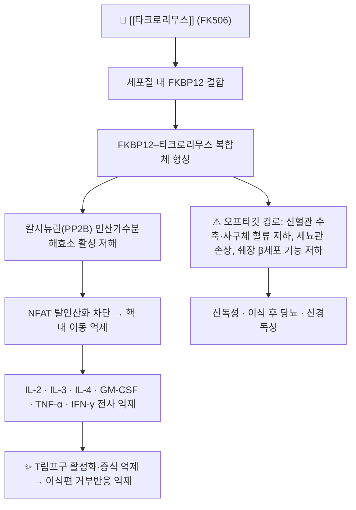

# 💊 [[타크로리무스]] (Tacrolimus, Prograf / 아드바그라프, ATC L04AD02)

![[타크로리무스_3_2.jpg|540]]
> [그림 1: ① 병태생리·영상 — Tacrolimus-3D-sticks.png]

![[타크로리무스_2_2.jpg|540]]
> [그림 1: ① 병태생리·영상 — Tacrolimus-3D-sticks.png]

> **핵심 3줄 요약 (Key Summary)**:
> 🧪 **주성분·제형**: [[타크로리무스]](Tacrolimus, 일명 FK506)는 일본 츠쿠바 인근 토양에서 분리된 방선균 *Streptomyces tsukubaensis*가 생산하는 23원환 마크로라이드 락톤계 면역억제제다(Jin & Lu, 2023, PMID: 37622350). 경구 즉방 캡슐(0.5·1·5 mg), 1일 1회 서방정, 정맥주사액(5 mg/mL), 그리고 아토피 피부염용 국소 연고(0.03%·0.1%)로 시판된다.
> 📍 **작용 기전**: 세포질 내 FKBP12(FK506-binding protein 12)와 결합한 복합체가 칼시뉴린(calcineurin, PP2B)의 인산가수분해효소 활성을 저해하여 NFAT의 탈인산화·핵 내 이동을 차단하고, 결과적으로 IL-2를 비롯한 T세포 활성화 사이토카인의 전사를 억제한다. 즉 **T림프구 매개 이식편 거부반응을 선택적으로 차단**하는 칼시뉴린억제제(CNI)다.
> 🎯 **임상 적응증**: 간·신장·심장·폐·골수 이식 후 거부반응 예방 및 치료, 이식편대숙주병(GVHD) 예방, 스테로이드 저항성 아토피 피부염(국소제) 등. 경구 초기 용량은 대략 0.075~0.2 mg/kg/day를 1일 2회 분할 투여하며, 전혈 최저혈중농도(TDM)를 보며 개별 적정한다.
> ⚠️ **주의사항**: 용량의존적 **신독성·신경독성**이 가장 대표적인 용량제한 독성이며, 이식 후 당뇨·고혈압·고칼륨혈증·저마그네슘혈증이 흔하다. CYP3A4/P-gp 기질이므로 아졸계 항진균제·마크로라이드·리토나비르 병용 시 농도가 폭증하고, 리팜핀·페니토인 등 유도제 병용 시 농도가 급감한다. 감염 및 림프종(PTLD) 위험 증가에 대한 블랙박스 경고가 있다.

---

## 1. 약물 기본 정보 및 시판 제품 (Brand Identification)

![[타크로리무스_낱알.jpg|540]]
> [그림 1: 식약처 의약품안전나라]

> [!abstract]+ 🧪 3D 약리 분자 구조 (Interactive 3D Viewer)
> <iframe src="https://molecule-viewer-rho.vercel.app/?cid=445643" width="100%" height="450px" frameborder="0" allow="webgl" style="border-radius: 8px;"></iframe>

| 항목 | 상세 정보 |
| :--- | :--- |
| **일반명 (Generic Name)** | 타크로리무스(타크로리무스수화물) / Tacrolimus (Tacrolimus hydrate) |
| **대표 상품명 (Brand Names)** | **프로그라프(Prograf)**, **아드바그라프 서방정(Advagraf)**, **프로토픽 연고(Protopic)** ※ YAML `aliases:`에 등록하여 위키링크 통합 |
| **ATC 코드 / 분류** | **ATC L04AD02** (면역억제제 → 칼시뉴린억제제) / 국내 식약처 분류상 '면역억제제'로 취급되나 세부 분류코드는 **근거 미확인(허가사항 원문 확인 필요)** |
| **PubChem CID** | [445643](https://pubchem.ncbi.nlm.nih.gov/compound/445643) |
| **화학식 / 분자량** | C₄₄H₆₉NO₁₂ / 약 804.0 g/mol (무수물 기준). 시판 원료는 수화물 형태 |
| **주요 제형 및 함량** | 경구 즉방 캡슐 0.5 mg·1 mg·5 mg, 서방정(1일 1회용), 주사농축액 5 mg/mL(1 mL 앰플, 정맥 지속주입용), 국소 연고 0.03%·0.1% |
| **식약처 허가 적응증** | 간이식·신이식·심이식·폐이식·췌장이식 등 고형장기 이식 후 거부반응의 예방 및 치료, 골수이식 후 이식편대숙주병 예방, 스테로이드 저항성 아토피 피부염(국소제). ※ 정확한 적응증 문구는 품목 허가사항 확인 필요 |

### 1.1 대표 시판 제품 및 함유 복합제 매핑 (Brand Identification & Combinations)

타크로리무스는 **다른 성분과 복합한 고정용량복합제가 사실상 존재하지 않는 단일성분 제제**다. 즉 이식 환자에서의 "성분 중복" 위험은 복합제가 아니라 *서로 다른 제형·제네릭 간 중복 투여* 또는 *국소제와 경구제의 동시 사용*에서 발생한다.

| 구분 | 대표 제품명 / 브랜드 | 함유 성분 및 1회당 함량 | 제형 및 특징 | 주요 적응증 및 복약 지도 핵심 |
| :--- | :--- | :--- | :--- | :--- |
| **경구 즉방제 (ETC)** | [[프로그라프]] 캡슐 | [[타크로리무스]] 단일 성분 0.5 mg / 1 mg / 5 mg | 즉방 경질캡슐, **1일 2회 12시간 간격** | 이식 면역억제의 표준 1차 제제. 식사와의 관계를 매일 동일하게 유지, TDM 필수 |
| **경구 서방제 (ETC)** | [[아드바그라프]] 서방정, 엔바서스(Envarsus) 등 | [[타크로리무스]] 단일 성분 서방정 | 1일 1회 아침 투여, 복약순응도 개선 | 즉방제에서 **1일 총용량 1:1 전환**이 원칙이나 전환 직후 TDM 재확인 필요 |
| **주사제 (ETC)** | 프로그라프 주사액 | [[타크로리무스]] 5 mg/mL (1 mL) | 정맥 지속주입(24시간 infusion) 또는 분할 정주 | 경구 섭취 불가 시 사용. **경구 용량의 약 1/3~1/4 수준**으로 시작. HCO-60(폴리옥실 60 수소화피마자유) 부형제에 의한 과민반응 보고 있음 |
| **국소제 (ETC)** | [[프로토픽]] 연고 | [[타크로리무스]] 0.03% / 0.1% | 연고 도포, 1일 2회 | 스테로이드 저항성 아토피 피부염. 도포 부위 작열감·소양감 흔함, 도포 후 햇빛 차단 권장 |
| **제네릭 다수** | "타크로리무스 ○○캡슐/서방정" | [[타크로리무스]] 단일 성분 | 즉방·서방 캡슐 및 정제 | **제품 간 전환 시 반드시 TDM 재측정** (제형 간 생체이용률 차이) |
| **감별 주의 대상** | [[사이클로스포린]], [[미코페놀레이트모페틸]], [[시롤리무스]] | 동일/인접 계열 면역억제제 | 캡슐, 정제, 서방정 | 기전·대사경로 일부 중복, **절대 임의 병용·중복 금지**, 병용 시 감염·신독성 상승 |

---

## 2. 분자 약리 기전 및 작용 경로 (Mechanism of Action)

* **주요 작용 기전 (Primary MoA)**:
  * 타크로리무스는 세포막을 통과한 뒤 세포질의 면역필린 계열 단백질인 **FKBP12**에 우선 결합한다. 이 약물–FKBP12 복합체가 칼슘/칼모듈린 의존성 세린-트레오닌 인산가수분해효소인 **칼시뉴린(calcineurin, PP2B)**의 활성 부위에 결합해 기질 접근을 입체적으로 방해한다.
  * 칼시뉴린이 억제되면 전사인자 **NFAT(nuclear factor of activated T cells)**의 탈인산화가 일어나지 않아 핵 내 이동이 차단된다. NFAT는 IL-2 유전자의 프로모터에 작용하므로, 결과적으로 T세포 수용체 자극 후의 **IL-2 전사가 억제**되고 T림프구의 클론성 증식과 효과기 T세포 분화가 멈춘다.
  * 이 기전은 칼슘 의존성 신호전달의 후반부를 공통 차단하기 때문에, 항원 특이성 없이 T세포 매개 면역을 광범위하게 억제한다. 사이클로스포린 A 역시 같은 칼시뉴린을 표적으로 하지만 결합 단백질이 사이클로필린(cyclophilin)이라는 점에서 구별되며, 시험관 내 역가는 사이클로스포린보다 수십 배 강력한 것으로 보고된다.
  * 국소 도포 시에는 랑게르한스세포 등 피부 내 T세포의 활성화를 국소적으로 억제하여 아토피 피부염의 염증을 완화한다(전신 흡수는 극히 적음).

* **하류 신호전달 및 생화학적 반응**:
  * 칼슘–칼시뉴린–NFAT 축이 차단되면 IL-2 수용체(CD25) 발현도 함께 감소하여 자기증폭(Self-amplification) 루프가 끊긴다.
  * 항체 생산 측면에서는 T세포 의존성 B세포 도움 신호가 줄어들어 체액성 동종항체 형성도 간접적으로 억제된다.
  * **부작용 발생은 치료 표적과 별개의 오프타깃 경로**에서 비롯된다. 칼시뉴린은 신장의 사구체 혈관 평활근·세뇨관 세포에도 발현되어 있는데, 약물에 의한 억제는 **구심성 소동맥 수축, 신혈류·사구체여과율 저하, 세뇨관 간질 섬유화**를 유발한다. 췌장 β세포에서는 인슐린 분비 및 전사 조절이 교란되어 이식 후 당뇨병 위험이 증가한다.

---

## 3. 약동학적 특성 (Pharmacokinetics: ADME)

타크로리무스는 **치료역이 좁고 환자 간 변동성이 극단적으로 큰 약물**이어서, 약동학 파라미터 자체가 TDM(target concentration) 운용의 근거가 된다(Venkataramanan & Swaminathan, 1995, PMID: 8787947; Schutte-Nutgen & Tholking, 2018, PMID: 29298646).

| 약동학 파라미터 | 수치 및 임상적 의미 |
| :--- | :--- |
| **생체이용률 (Bioavailability, F)** | 경구 즉방제 기준 대략 **20~25%** 수준. 장 상피의 P-gp와 CYP3A4에 의한 초회통과 손실이 커서 개인차가 매우 크다. 고지방 식사는 흡수 속도를 지연시키고 총 노출을 감소시킬 수 있어, 매일 일정한 조건(공복 또는 식후 고정)으로 복용하도록 지도한다 (PMID: 8787947, 29298646) |
| **최고혈중농도 도달시간 (Tmax)** | 즉방 캡슐 공복 투여 시 대략 **0.5~2시간**. 서방정은 방출 조절로 인해 Tmax가 더 지연(수 시간대)되어 1일 1회 투여를 가능하게 한다. 단, 정확한 서방정 Tmax 수치는 제형별로 다르므로 **제품 허가사항 확인 필요** |
| **혈장 단백결합률 (Protein Binding)** | 전혈 기준 **약 99% 이상**이 단백 및 적혈구에 결합(주로 알부민, α1-산성당단백). 약물이 적혈구 내에 상당량 분포하므로 **혈장이 아니라 전혈(whole blood)로 TDM**을 시행하는 것이 원칙이다 |
| **간 대사 효소 (Metabolism)** | **CYP3A4가 주 대사효소**, CYP3A5가 일부 관여. 위장관 상피와 간의 **P-당단백(P-gp)**이 능동적 유출을 담당하여 흡수와 배설을 함께 조절. 대사체는 탈메틸화·수산화 대사체로 전환되어 주로 담즙으로 배설 |
| **배설 반감기 (Elimination t1/2)** | 평균 대략 **12시간 전후**로 보고되나 환자 간 편차가 매우 크고(수 시간~수십 시간대), 특히 간이식 직후나 간기능 저하 시 연장된다 (PMID: 8787947) |
| **주요 배설 경로 (Excretion)** | **담즙 → 대변 배설이 주 경로**이며, 소변으로 배설되는 미변화체는 1% 미만이다. 따라서 신기능 저하 자체가 용량 조절을 크게 요구하지는 않으나, 약물 자체의 신독성 때문에 신기능 모니터링은 필수다 |
| **TDM (치료적 약물농도 모니터링)** | 전혈 최저혈중농도(trough, C₀)를 기준으로 감량·증량을 결정한다. 목표 범위는 **이식 장기, 이식 후 경과 시기, 병용 면역억제제(스테로이드·MMF 등), 거부반응 위험도**에 따라 달라지므로 문헌별·기관별 수치가 상이하다. **개별 기관 프로토콜 우선** 원칙으로 운용하며, 본 노트에서는 특정 수치를 확정치로 제시하지 않는다 |

---

## 4. 임상 용법·용량 및 처방 가이드 (Dosage & Administration)

> ※ 아래 용량은 문헌 및 일반적 허가사항에서 통용되는 **개략적 범위**이며, 실제 처방은 이식팀 프로토콜과 TDM 결과로 결정한다. 정확한 초기 용량·목표 농도는 **품목 허가사항 및 기관 지침 확인 필요**.

| 임상 적응증 | 성인 표준 용법·용량(개략) | 투여 조건 및 비고 |
| :--- | :--- | :--- |
| **신이식** | 경구 0.1~0.2 mg/kg/day를 1일 2회 분할(12시간 간격) | 스테로이드·미코페놀레이트 병용이 일반적. 초기에는 주 2~3회 TDM, 안정기에는 간격 확대 |
| **간이식** | 경구 0.10~0.15 mg/kg/day를 1일 2회 분할 | 간기능·빌리루빈 변동이 농도에 영향, 이식 직후 변동성 큼. 정맥 투여 시 지속주입(경구 용량의 약 1/3~1/4 수준으로 시작) |
| **심이식** | 경구 0.075 mg/kg/day 전후를 1일 2회 분할 | 상대적으로 낮은 초기 용량에서 시작, 신기능 저하 동반 환자에서 특히 주의 |
| **폐이식·췌장이식** | 경구 0.1~0.15 mg/kg/day 수준에서 시작, TDM 기반 적정 | 감염 위험이 높은 군으로 과면역억제 회피 |
| **골수이식(GVHD 예방)** | 경구 또는 정맥, 프로토콜별 상이 | 이식편대숙주병 예방 목적. 병용 약물(아졸계 항진균제)에 의한 농도 상승 빈번 |
| **즉방제 → 서방정 전환** | 기존 1일 총용량과 **1:1 전환**, 아침 1일 1회 | 전환 후 며칠 내 TDM 재측정. 제형 간 흡수 차이로 trough가 달라질 수 있음 |
| **국소제 (아토피 피부염)** | 0.03% 또는 0.1% 연고를 병변에 1일 2회 얇게 도포 | 연령·부위별 농도 제한이 있으므로 허가사항 확인. 장기간 광범위 도포 시 전신흡수·피부 악성종양 위험 고려 |

* **복약 지도 핵심**: ① 복용 시간을 매일 동일하게 유지(12시간 간격), ② 자몽주스·자몽 함유 음료 회피, ③ 설사·구토로 약을 토했을 때는 임의 보충하지 말고 의료진에게 연락, ④ 캡슐을 임의로 개봉·분할하지 않음.

---

## 5. 부작용, 경고 및 약물 상호작용 (Adverse Effects & Interactions)

### 5.1 주요 부작용 및 독성 경고 (Black Box Warnings)

* **블랙박스 경고 수준의 위험**:
  * **감염 위험 증가**: T세포 매개 면역이 차단되므로 세균·바이러스(특히 CMV, EBV, BK바이러스)·진균·원충 감염 위험이 유의하게 상승한다. 발열, 인후통, 상처 치유 지연 등은 즉시 평가 대상이다.
  * **림프종 및 기타 악성종양(특히 이식 후 림프증식성 질환, PTLD)**: EBV 연관 PTLD 위험이 있으며, 과도한 면역억제는 위험을 증가시킨다.
  * **전문가에 의한 사용 제한**: 이식 경험이 있는 전문의의 관리 하에만 사용해야 하며, 환자 자기판단에 의한 감량·중단은 거부반응을 유발한다.
* **신독성 (Nephrotoxicity)**:
  * 가장 흔하고 용량 제한적인 독성. 급성기에는 신혈관 수축에 의한 사구체여과율 저하(혈중 크레아티닌 상승, 고칼륨혈증, 핍뇨)로 나타나고, 만성기에는 세뇨관 위축과 간질 섬유화로 진행되어 비가역적 신손상에 이를 수 있다.
  * 고위험군: 이식 직후 고용량, 기존 신기능 저하, 병용 신독성 약물(NSAIDs·아미노글리코사이드·암포테리신 B·반코마이신·조영제), 탈수 상태.
* **신경독성 (Neurotoxicity)**:
  * 진전(tremor), 두통, 감각이상, 불면, 어지럼, 시야 이상이 흔하다. 드물게 발작, 가역적 후백질뇌병증(PRES)이 보고되며 이 경우 즉시 감량·중단 및 영상 평가가 필요하다.
* **대사·내분비 독성**:
  * **이식 후 당뇨병**, 고혈압, 고칼륨혈증, **저마그네슘혈증**, 고요산혈증, 고지혈증. 저마그네슘혈증은 신경독성·QT 연장과 연관될 수 있어 보충이 고려된다.
* **심혈관**:
  * QT 연장 가능성, 드물게 심근병증·심부전 악화 보고.
* **위장관 및 기타**:
  * 설사, 오심, 변비, 식욕부진, 복통, 탈모, 여드름, 빈혈, 혈소판 감소.
* **알레르기 및 과민반응**:
  * 정맥주사 제형의 부형제(HCO-60)와 관련된 아나필락시스성 반응이 보고되어 있다. 피부 발진, 가려움, 드물게 중증 피부 이상반응이 나타날 수 있다.
* **국소제 특유의 이상반응**:
  * 도포 부위 작열감·소양감·홍반, 모낭염, 바이러스성 피부감염(HSV 등) 악화 가능성.

### 5.2 주요 병용 금기 및 상호작용

| 상호작용 유형 | 대표 약물·물질 | 결과 및 대응 |
| :--- | :--- | :--- |
| **CYP3A4/P-gp 강력 저해 → 농도 상승** | 아졸계 항진균제(케토코나졸·이트라코나졸·보리코나졸), 마크로라이드(에리스로마이신·클래리트로마이신), **리토나비르 및 그 부스터 병용 요법**, 딜티아젬·베라파밀, 자몽주스 | 신독성·신경독성 급증 위험. 병용 시 감량 및 TDM 단축 필수 |
| **니르마트렐비르/리토나비르(Paxlovid™)** | COVID-19 치료제 | 리토나비르의 강력한 CYP3A 억제로 타크로리무스 노출이 급격히 상승한다. **임상 증례에서는 페니토인(효소 유도제)을 병용하여 농도를 관리**한 사례가 보고되었다(Sindelar & McCabe, 2023, PMID: 36536192). 자가 판단 금지, 반드시 이식팀과 상의 |
| **CYP3A4 유도 → 농도 저하** | 리팜핀, 페니토인, 카르바마제핀, 페노바르비탈, 세인트존스워트(관엽연교) | 혈중농도 저하로 **거부반응** 위험. 병용 시작·중단 시 TDM 재측정 |
| **스테로이드–타크로리무스 상호작용** | 프레드니솔론 등 부신피질호르몬 | 스테로이드가 CYP3A 및 P-gp를 유도하여 타크로리무스 농도를 낮출 수 있고, **CYP3A 유전자형(예: CYP3A5 발현형)** 에 따라 상호작용의 크기가 달라진다(Saqr & Al-Kofahi, 2024, PMID: 38994750). 스테로이드 감량 시기에는 농도가 오히려 상승할 수 있어 TDM이 필요 |
| **신독성 중복** | NSAIDs, 아미노글리코사이드, 암포테리신 B, 반코마이신, 조영제, 시스플라틴 | 급성 신손상 위험 상승. 가능하면 회피, 불가피하면 신기능·농도 집중 모니터링 |
| **고칼륨혈증 중복** | ACE 억제제, ARB, 스피로놀락톤, 칼륨 보충제 | 고칼륨혈증 악화. 정기 전해질 검사 |
| **기타 금기·주의** | 생백신(MMR·수두·황열 등), 자몽·석류 주스 | 면역억제 상태에서 생백신 금기. 음식–약물 상호작용 회피 교육 |

---

## 6. 한의 치료 연계 및 병용/테이퍼링 프로토콜 (Integrative Medicine)

> ⚠️ **전제**: 이식 환자에서 타크로리무스는 **거부반응을 억제하는 생명 유지 약물**이다. 한의 치료는 이식팀(이식외과·신장내과)과의 협진을 전제로 하며, 환자 단독 판단에 의한 감량·중단은 절대 금기다. 아래 내용 중 상호작용 관련 서술은 상당 부분 **in vitro 또는 이론적 수준의 근거**이며, 임상적 확정 근거는 **근거 미확인**임을 명시한다.

### 6.1 한약·양약 병용 투여 안전성 및 시너지 배오

* **간·신 대사 간섭 완충 처방**:
  * 타크로리무스는 CYP3A4와 P-gp 기질이므로, 이 두 경로에 영향을 주는 한약재·건강기능식품은 **성분 농도를 요동시킬 수 있다**. 원칙적으로 **복용 시간을 1~2시간 이상 분리**하고, 새로운 한약을 시작할 때는 반드시 이식팀에 고지한 뒤 TDM을 앞당겨 시행한다.
  * 특히 **[[감초]](glycyrrhizin)** 는 in vitro에서 CYP3A4 저해가 보고되어 있고, 동시에 가성알도스테론증을 유발하여 **고혈압·저칼륨혈증**을 일으킬 수 있어 타크로리무스 자체의 고혈압·고칼륨혈증·저마그네슘혈증과 임상상이 겹치거나 상쇄되어 감별을 어렵게 만든다. 이식 환자에서는 **감초 함유 처방(예: [[작약감초탕]], [[반하사심탕]] 등)의 장기 복용에 특히 주의**한다(임상 근거 수준: 제한적, **근거 미확인**).
  * **[[황금]]·[[황련]](베르베린 계열)** 은 in vitro에서 CYP3A4 및 P-gp를 저해한다는 보고가 있어 이론적으로 농도 상승 우려가 있다. 마찬가지로 **[[오미자]]·[[산사]]** 등도 대사효소에 영향을 줄 수 있다는 실험실 수준 보고가 있으나 임상적 유의성은 확립되지 않았다(근거 미확인).
  * 반대로 **관엽연교(세인트존스워트)** 는 대표적인 CYP3A4 유도제로 농도를 떨어뜨려 거부반응을 유발할 수 있으므로 **금기**로 취급한다.
* **면역 자극 본초의 이론적 우려**:
  * [[인삼]]·[[홍삼]]·[[동충하초]] 등 면역 활성 본초는 이론적으로 이식편 거부를 촉진할 우려가 제기되지만, 인체 임상 근거는 **근거 미확인**이다. 다만 이식 초기 안정화 이전(통상 6~12개월)에는 면역 자극 목적의 보기제 사용을 **회피하는 것이 보수적**이다.
* **상승 배오 (Synergy)의 방향 설정**:
  * 이식 환자에서 한의 치료의 목표는 면역억제제의 대체가 아니라 **① 소화기 부작용(설사·오심·식욕부진) 완화, ② 이식 후 불면·불안·피로 등 삶의 질 관리, ③ 신경병증성 통증·근감소 관리**로 설정하는 것이 안전하다. 예컨대 [[육군자탕]]·[[향사육군자탕]] 계열은 소화기 증상 관리 목적으로 검토될 수 있으나, 개별 본초의 대사효소 영향은 처방 단위로 재평가해야 한다(**근거 미확인**).

### 6.2 양약 감량 및 한의 전환(테이퍼링) 가이드

* **감량 프로토콜(일반 원칙)**:
  * 타크로리무스의 감량은 **이식 후 경과 시간, 거부반응 병력, 공여자·수혜자 특성, 동종항체 검사, TDM 추이**를 종합하여 이식팀이 결정한다. 한의 치료 병행을 이유로 한 임의 감량은 허용되지 않는다.
  * 한의 치료 개입 시점은 **이식 후 급성기(감염·거부반응 고위험기)를 지나 이식팀이 상태를 안정적이라고 판단한 시점 이후**를 원칙으로 하며, 개입 전후로 TDM 측정 간격을 좁힌다.
  * 스테로이드를 감량하는 시기에는 스테로이드 유도 효과가 줄어들어 **타크로리무스 농도가 예상과 다르게 변동**할 수 있으므로(PMID: 38994750), 이 시기의 한약 신규 도입은 가급적 피하고 안정 후로 미룬다.
* **모니터링 세트**:
  * 전혈 trough 농도, 혈중 크레아티닌·eGFR·전해질(K⁺, Mg²⁺), 공복혈당·HbA1c, 간기능, 혈압, 감염 증상(발열·설사·기침), 진전 등 신경학적 증상.

---

## 7. 💡 사용자 진료실 핵심 필기 & 실전 임상 체크리스트

### 7.1 진료실 3대 핵심 문진 체크리스트

1. **이식 정보 및 복용 이력 확인**: 이식 장기(간·신장·심장·폐·골수), 이식 후 경과 기간, 현재 제형(즉방 캡슐/서방정/주사), 1일 총용량과 복용 시각을 확인한다. **서로 다른 병원에서 처방받은 제네릭·서방정으로 이중 복용**하고 있지 않은지, 국소용 [[프로토픽]]까지 포함해 전체 목록을 청취한다.
2. **상호작용·자가요법 청취**: 최근 새로 시작한 약(항진균제, 항생제, COVID-19 치료제, 진통제), 건강기능식품, 한약, 자몽주스·석류주스 섭취 여부를 확인한다. **감기약·소염진통제(NSAIDs)** 를 임의 복용하면 신기능이 급격히 나빠질 수 있음을 반드시 짚는다.
3. **독성 및 감염 모니터링**: 진전·두통·손발 저림(신경독성), 소변량 감소·부종(신독성), 공복혈당 상승·다뇨(이식 후 당뇨), 발열·설사·상처 치유 지연(감염), 구내염·탈모·설사(일반 부작용) 여부를 매 방문 확인한다.

### 7.2 환자 티칭 스크립트

> *"환자분, 지금 드시는 [[타크로리무스]]는 이식받으신 장기를 면역세포가 공격하지 못하도록 막아주는 핵심 약입니다. 그래서 **임의로 줄이거나 끊으면 거부반응이 생길 수 있고, 반대로 농도가 너무 높아지면 신장과 신경에 독성이 나타납니다.** 그래서 정해진 시간에 정확히 복용하시고, 정기적인 혈중농도 검사와 혈액검사가 꼭 필요합니다. 자몽주스나 석류주스, 그리고 새로 드시는 한약·건강기능식품·감기약은 농도에 영향을 줄 수 있으니, 드시기 전에 저희 한의원과 이식 병원에 먼저 알려주세요. 저희는 이식팀과 함께 소화불량, 불면, 피로 같은 증상을 한약과 침 치료로 도우면서, 이식 약은 안전하게 유지하실 수 있도록 돕겠습니다."*

---

## 8. 출처 및 학술 참고 문헌 (References)

* Schutte-Nutgen K, Tholking G. Tacrolimus - Pharmacokinetic Considerations for Clinicians. *Curr Drug Metab*. 2018. PMID: 29298646
  * `[연구 요약]` 타크로리무스의 흡수·분포·대사·배설 특성과 환자 간 변동성, TDM 운용 및 제형 간 차이에 대한 임상약동학 관점 정리.
* Venkataramanan R, Swaminathan A. Clinical pharmacokinetics of tacrolimus. *Clin Pharmacokinet*. 1995. PMID: 8787947
  * `[연구 요약]` 경구 생체이용률, 단백결합, 반감기, 배설 경로 등 타크로리무스 약동학의 기초 파라미터를 정립한 고전적 리뷰.
* Uemoto S. [Tacrolimus]. *Nihon Rinsho*. 2005. PMID: 15954428
  * `[연구 요약]` 일본 임상 관점에서의 타크로리무스 개요(적응증·용법·이식 임상 적용) 해설.
* Jin L, Lu D. [Biosynthesis of immunosuppressant tacrolimus: a review]. *Sheng Wu Gong Cheng Xue Bao*. 2023. PMID: 37622350
  * `[연구 요약]` *Streptomyces tsukubaensis* 유래 마크로라이드 락톤계 면역억제제 타크로리무스의 생합성 경로 및 생산 연구 리뷰.
* Saqr A, Al-Kofahi M. Steroid-tacrolimus drug-drug interaction and the effect of CYP3A genotypes. *Br J Clin Pharmacol*. 2024. PMID: 38994750
  * `[연구 요약]` 스테로이드와 타크로리무스의 약물상호작용 및 CYP3A 유전자형이 상호작용 크기에 미치는 영향 분석.
* Sindelar M, McCabe D. Tacrolimus Drug-Drug Interaction with Nirmatrelvir/Ritonavir (Paxlovid™) Managed with Phenytoin. *J Med Toxicol*. 2023. PMID: 36536192
  * `[연구 요약]` 니르마트렐비르/리토나비르 병용 시 타크로리무스 농도 상승을 페니토인(효소 유도제)으로 관리한 증례 보고.
* 식품의약품안전처 의약품안전나라 의약품통합정보시스템 (https://nedrug.mfds.go.kr)
  * `[연구 요약]` 국내 허가 의약품의 품목기준코드, 허가사항, 용법용량 및 이상반응 안전성 정보. (※ 본 노트의 그림 1 출처)

> **작성 원칙 메모**: 본 노트의 수치 중 제형별 Tmax, 기관별 목표 trough 농도, 초기 용량의 세부값은 문헌·기관별로 차이가 있어 **확정치로 인용하지 않았으며**, 실제 처방 판단은 품목 허가사항 및 소속 이식팀 프로토콜을 우선한다. 한약–양약 상호작용 항목 중 대사효소 관련 서술은 in vitro 수준 근거로 **임상적 확정 근거 미확인**임을 명시한다.