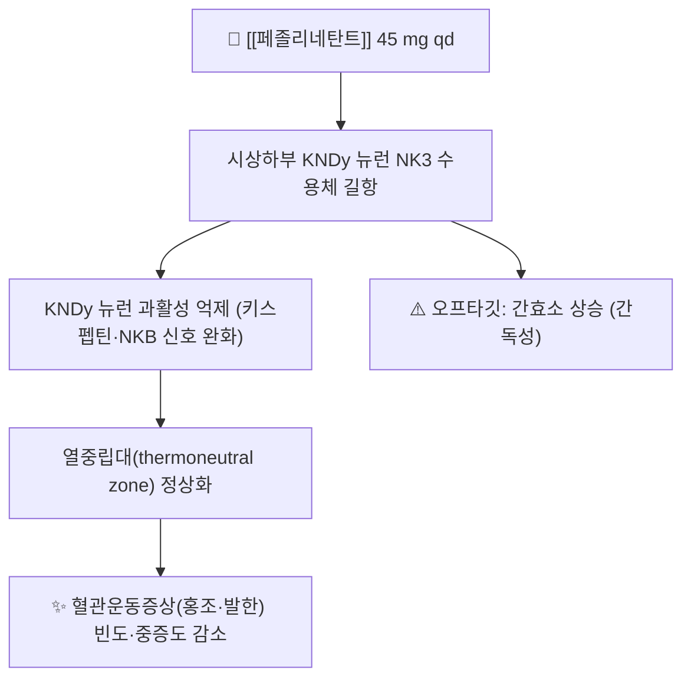

# 💊 페졸리네탄트 (Fezolinetant, VEOZAH, G02CX06)

> **핵심 요약 (Key Summary)**:
> 🧪 주성분·제형: [[페졸리네탄트]]는 비호르몬 경구제로, 시판 제품은 45 mg 1일 1회 필름코팅정이다.
> 📍 작용 기전: 시상하부의 KNDy 뉴런에 있는 **뉴로키닌 3 수용체(NK3R)** 길항제 — [[KNDy 뉴런]] 과활성을 억제해 열중립대를 정상화한다.
> 🎯 임상 적응증: 폐경 여성의 중등도~중증 혈관운동증상(안면홍조·발한) — 호르몬 요법이 금기·부적합한 환자의 비호르몬 대안이다.
> ⚠️ 주의사항: **간독성 박스 경고**. 기저 간기능 검사 후 시작, 첫 3개월 매월 추적. 심한 간질환·중증 신장애·CYP1A2 억제제 병용은 금기다.

---

## 📌 목차
1. [약물 기본 정보 및 시판 제품](#1-약물-기본-정보-및-시판-제품)
2. [분자 약리 기전 및 작용 경로](#2-분자-약리-기전-및-작용-경로)
3. [약동학적 특성](#3-약동학적-특성)
4. [용법·용량 및 처방 가이드](#4-용법용량-및-처방-가이드)
5. [부작용, 경고 및 약물 상호작용](#5-부작용-경고-및-약물-상호작용)
6. [한의 치료 연계 및 병용/테이퍼링 프로토콜](#6-한의-치료-연계-및-병용테이퍼링-프로토콜)
7. [💡 진료실 핵심 필기 & 실전 임상 체크리스트](#7--진료실-핵심-필기--실전-임상-체크리스트)
8. [출처 및 학술 참고 문헌 (References)](#8-출처-및-학술-참고-문헌-references)

---

## 1. 약물 기본 정보 및 시판 제품

> [!abstract]+ 🧪 3D 약리 분자 구조 (Interactive 3D Viewer)
> <iframe src="https://molecule-viewer-rho.vercel.app/?cid=117604931" width="100%" height="450px" frameborder="0" allow="webgl" style="border-radius: 8px;"></iframe>

![[페졸리네탄트_01_구조식2D.png|320]]
> [그림 1: 페졸리네탄트의 2D 화학 분자 구조식 — 4-플루오로벤조일 피페라진·트리아졸 고리와 메틸-티아디아졸 골격 (PubChem CID 117604931, PubChem PNG 정본)]

![[페졸리네탄트_02_3D구조.png|320]]
> [그림 2: 페졸리네탄트 3D 분자 구조 모델 (Wikimedia Commons, CC BY-SA 4.0)]

> 🖼️ 이미지 미확보 — 시판 패키지 실사·PTP 블리스터 알약 성상은 이번 회차에 확보하지 못했다(국내 허가·유통 여부 미확인). 다른 약 사진으로 대체하지 않고 사유를 남긴다.

| 항목 | 상세 정보 |
| :--- | :--- |
| **일반명 (Generic Name)** | [[페졸리네탄트]](한글) / Fezolinetant |
| **대표 상품명 (Brand Names)** | VEOZAH (미국) — 국내 허가·상품명은 확인되지 않음 |
| **ATC 코드 / 분류** | G02CX06 (Other gynecologicals) |
| **PubChem CID** | [117604931](https://pubchem.ncbi.nlm.nih.gov/compound/117604931) |
| **화학식 / 분자량** | C16H15FN6OS / 358.4 g/mol |
| **주요 제형 및 함량** | 필름코팅정 45 mg (원형, 연분홍색, Astellas 로고·"645" 각인) |
| **허가 적응증** | 폐경 여성의 중등도~중증 혈관운동증상 |

---

## 2. 분자 약리 기전 및 작용 경로

* **주요 작용 기전 (Primary MoA)**: 시상하부 궁상핵 KNDy 뉴런의 **뉴로키닌 3 수용체(NK3R, TACR3)** 를 차단한다. 폐경 후 스테로이드 탈억제로 과활성해진 KNDy 뉴런 신호를 억제해, 체온조절 중추의 열 방출 경로 과민성과 좁아진 열중립대를 정상화한다 → [[KNDy 뉴런]]
* **에스트로겐 비의존**: 호르몬 요법과 달리 에스트로겐을 보충하지 않으므로 유방암·혈전 위험 회피가 필요한 환자의 대안이 된다.
* **대사**: 주로 CYP1A2로 대사된다 → **CYP1A2 억제제 병용 금기**.

---

## 3. 약동학적 특성

| 약동학 파라미터 | 수치 및 임상적 의미 |
| :--- | :--- |
| **생체이용률 (Bioavailability, F)** | 대략 80%대 (경구, 식사 무관) — 허가사항 기준 |
| **최고혈중농도 도달시간 (Tmax)** | 약 1~2시간 (경구 45 mg) |
| **혈장 단백결합률 (Protein Binding)** | 90% 이상 |
| **간 대사 효소 (Metabolism)** | 주로 CYP1A2 (2차 경로 소량) |
| **배설 반감기 (Elimination t1/2)** | 약 9~10시간 |
| **주요 배설 경로 (Excretion)** | 소변·대변으로 대사체 배설 |

---

## 4. 용법·용량 및 처방 가이드

| 임상 적응증 | 표준 용법·용량 | 1일 최대 한도 용량 |
| :--- | :--- | :--- |
| 폐경 혈관운동증상 | 45 mg 1일 1회 경구(식사 무관) | 45 mg/day |
| 시작 전 모니터링 | ALT·AST·ALP·총/직접 빌리루빈 확인 | ALT 또는 AST ≥2×ULN, 총빌리루빈 ≥2×ULN이면 시작하지 않음 |
| 추적 검사 | 시작 후 첫 3개월 매월, 이후 6·9개월 | 이상 시 중단 기준 적용 |

---

## 5. 부작용, 경고 및 약물 상호작용

### 5.1 주요 부작용 및 독성 경고 (Black Box Warnings)
* **간독성(boxed warning)**: 3개 임상시험에서 transaminase >3×ULN이 2.3%(위약 0.9%)로 더 많았고, 시판 후 투여 40일 이내 약인성 간손상 사례가 보고됐다. 2026-10-04 리뷰 3번도 이 점을 근거로 **간기능 추적이 필수**임을 강조한다.
* **중단 기준**: transaminase >5×ULN, 또는 transaminase >3×ULN + 총빌리루빈 >2×ULN이면 즉시 중단. 새로 생긴 피로·식욕저하·오심·구토·소양감·황달·회색변·진한 소변·우상복부통 시 즉시 중단하고 간검사를 시행한다.
* **흔한 이상반응(≥2%)**: 복통, 설사, 불면, 요통, 홍조, transaminase 상승.

### 5.2 주요 병용 금기 및 상호작용
* **금기**: 간경변, 중증 신장애·말기신장병, **CYP1A2 억제제 병용**.
* **주의**: 한약·건강기능식품을 겹쳐 복용하는 환자에서 간수치 감시가 더 중요하다.

---

## 6. 한의 치료 연계 및 병용/테이퍼링 프로토콜

### 6.1 한약·양약 병용 투여 안전성
* 혈관운동증상 주증이면 補陰潛陽·調和營衛 축(當歸六黃湯·二仙湯·加減逍遙散類)에 이침(신문)·체침(삼음교·태계·신문·조해)을 조합하고, 4주간 반응을 본 뒤 약물 병용 여부를 결정하는 **순차 접근**이 안전하다.
* 간 대사가 CYP1A2 경로이므로 간부담이 큰 여러 제품을 동시에 시작하지 않도록 순차 조정한다.

### 6.2 병용 시 모니터링
* 한약·건강기능식품 병용 중 이 약을 시작하면 간수치 감시 간격을 좁힌다. 피로·식욕저하·황달 등 약인성 간손상 신호를 환자에게 교육한다.

---

## 7. 💡 진료실 핵심 필기 & 실전 임상 체크리스트

### 7.1 진료실 핵심 문진 체크리스트
1. **복용 여부·순응도**: 하루 1회(45 mg) 복용 여부와 부작용(복통·설사·불면) 확인.
2. **간기능 추적**: 기저 검사와 첫 3개월 매월 추적, 이후 6·9개월 일정 확인.
3. **감별 경고**: 폐경 후 출혈, 체중 감소, 국소화된 야간 발한은 자궁내막·혈액 종양을 먼저 감별한다. 갑상샘 항진·결핵·림프종도 홍조·발한의 원인이다.

### 7.2 환자 티칭 스크립트
> "폐경기 얼굴 홍조와 식은땀에 쓰는 비호르몬 약입니다. 하루 한 알로 홍조 횟수와 강도를 줄이는 것이 확인되었고, 효과는 1주부터 나타나 1년까지 유지되었습니다. 다만 드물게 간 수치가 오를 수 있어 시작 전과 치료 중 정기적으로 피검사를 합니다. 간경변이나 심한 신장 질환이 있는 분에게는 쓸 수 없습니다. 많이 피곤하거나 식욕이 떨어지고, 눈이나 피부가 노래지거나 소변이 진해지면 즉시 알려주세요."

---

## 8. 출처 및 학술 참고 문헌 (References)

1. **Yoon JA 등 (2023)**. *Efficacy and Safety of Fezolinetant in Moderate to Severe Vasomotor Symptoms Associated With Menopause: A Phase 3 RCT (SKYLIGHT 2)*. **J Clin Endocrinol Metab**, 108(8):1981-1997. [PMID 36734148](https://pubmed.ncbi.nlm.nih.gov/36734148/) · [PMC10348473](https://pmc.ncbi.nlm.nih.gov/articles/PMC10348473/)
   - **[연구 요약]** 페졸리네탄트 30·45 mg가 위약 대비 VMS 빈도·중증도를 유의하게 감소, 개선은 1주차부터 52주까지 유지.
2. **VEOZAH (fezolinetant) 처방정보** — DailyMed(NIH) — [링크](https://dailymed.nlm.nih.gov/dailymed/drugInfo.cfm?setid=cae9f798-24f9-4580-a4fc-e6c710cbda3c)
   - **[연구 요약]** 45 mg 1일 1회, 기저 간기능 검사와 첫 3개월 매월·6·9개월 추적, 중단 기준을 명시한 규제 문서.
3. **ATC/DDD Index — G02CX06 fezolinetant** — WHO Collaborating Centre — [링크](https://atcddd.fhi.no/atc_ddd_index/?code=G02CX06)
   - **[연구 요약]** 페졸리네탄트의 ATC 코드(G02CX06)와 DDD(45 mg, 경구) 등재 확인.
4. **PubChem Compound Summary — Fezolinetant (CID 117604931)** — [링크](https://pubchem.ncbi.nlm.nih.gov/compound/117604931)
   - **[연구 요약]** 분자식 C16H15FN6OS·분자량 358.4 g/mol·2D 구조식 확인.

## 함께 보기
- [[KNDy 뉴런]] · [[폐경전후증후군]] · [[에스트로겐]] · [[프로게스테론]] · [[에스트라디올]]
- [[시상하부-뇌하수체-난소축]] · [[다이노르핀]] · [[CYP3A4]]
- [[2026-10-04_부인과소아과_심층리뷰]] 3번
