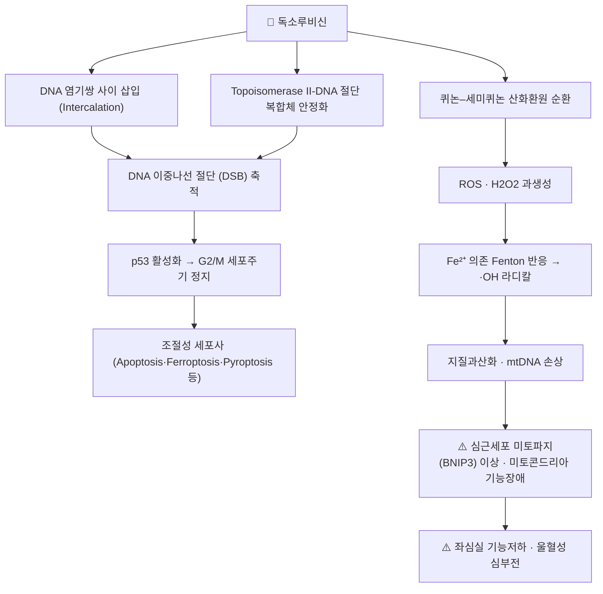

# 💊 [[독소루비신]] (Doxorubicin, Adriamycin, ATC L01DB01)

> **핵심 3줄 요약 (Key Summary)**:
> 🧪 주성분·제형: *Streptomyces peucetius* var. *caesius* 유래 안트라사이클린계 항생물질 항암제. 분자식 C₂₇H₂₉NO₁₁(유리염기, MW 543.52 g/mol)로 4개의 환원된 테트라센퀴논 골격과 다우노사민 아미노당이 결합한 구조이며, **경구 흡수가 되지 않아 전량 정맥주사(IV) 제형**으로만 사용된다. 통상 제형(독소루비신 염산염 주)과 리포좀 제형(페길화 리포좀·비페길화 리포좀)이 병존한다[3].
> 📍 작용 기전: ① DNA 염기쌍 사이 삽입(intercalation) ② **토포이소머라제 II(topoisomerase II) 안정화 복합체 형성 → DNA 이중나선 절단** ③ 퀴논–세미퀴논 산화환원 순환을 통한 **활성산소종(ROS) 대량 생성**의 삼중 기전. ROS는 심근세포 미토콘드리아 기능장애와 조절성 세포사(regulated cell death)를 유발하여 용량 누적형 심독성의 핵심 기전이 된다[2][4][5].
> 🎯 임상 적응증: 유방암(보조·전이), 연부조직육종 및 자궁평활근육종, 비호지킨 림프종·호지킨 림프종, 급성 백혈병, 소세포폐암, 난소암, 위암 등 광범위 고형암·혈액암. 통상 3주 간격 50~75 mg/m² IV, **누적 용량 450~550 mg/m²를 초과하면 심독성 위험이 급증**하므로 평생 누적 용량 관리가 필수다[2][4].
> ⚠️ 주의사항: 블랙박스 경고 대상인 **용량의존성 심근병증·울혈성 심부전**, 골수억제(호중구 감소), 구내염, 탈모, 혈관외유출(extravasation) 시 조직 괴사. 트라스투주맙·방사선요법 병용 시 심독성 상승. 심장 초음파(LVEF)·누적 용량 장부 관리가 필수이며, 한의 병용 시에는 항산화 한약재의 항암 효과 상쇄 가능성(근거 미확인)과 간대사 간섭을 반드시 상담해야 한다.

---

## 1. 약물 기본 정보 및 시판 제품 (Brand Identification)

![[독소루비신_낱알.jpg|540]]
> [그림 1: 식약처 의약품안전나라]
> [!abstract]+ 🧪 3D 약리 분자 구조 (Interactive 3D Viewer)
> <iframe src="https://molecule-viewer-rho.vercel.app/?cid=31703" width="100%" height="450px" frameborder="0" allow="webgl" style="border-radius: 8px;"></iframe>

| 항목 | 상세 정보 |
| :--- | :--- |
| **일반명 (Generic Name)** | [[독소루비신]](한글) / Doxorubicin (English Generic Name) |
| **대표 상품명 (Brand Names)** | **아드리아마이신(Adriamycin)**, 아드리블라스틴(Adriblastin), 독소루비신염산염주, **케릭스(Caelyx)**, 독실(Doxil), 마이오셋(Myocet) — ※ YAML `aliases:`에 필수 등록하여 위키링크 통합 |
| **ATC 코드 / 분류** | **L01DB01** (Antineoplastic agents → Cytotoxic antibiotics → Anthracyclines and related substances) / 식약처 분류: 421 항악성종양제 |
| **PubChem CID** | [31703](https://pubchem.ncbi.nlm.nih.gov/compound/31703) |
| **화학식 / 분자량** | C₂₇H₂₉NO₁₁ (유리염기) / 543.52 g/mol · 염산염 C₂₇H₂₉NO₁₁·HCl / 579.98 g/mol |
| **주요 제형 및 함량** | 주사용 분말·동결건조 분말(10 mg, 50 mg 바이알), 주사액(2 mg/mL), 페길화 리포좀 주사액(2 mg/mL, 20 mg/10 mL), 비페길화 리포좀 주사액 — **경구 제형 없음** |
| **식약처 허가 적응증** | 급성 백혈병, 악성 림프종, 유방암, 폐암(소세포·비소세포), 위암, 간암, 방광암, 골육종·연부조직육종, 난소암, 자궁암, 갑상선암, 신경모세포종, 윌름스종양 등 |

> ※ **제형 선택의 임상적 의미**: 전통적(비리포좀) 독소루비신은 심독성이 용량제한 독성(dose-limiting toxicity)인 반면, **리포좀 제형은 심근 조직 분포를 낮추고 종양 내 축적을 높여 심독성을 감소**시키는 것으로 정리되어 있다[3]. 다만 리포좀 제형에서는 수족증후군(hand-foot syndrome)과 주입반응이 상대적으로 증가하는 상반된 독성 프로파일을 보인다[3][2].

### 1.1 대표 시판 제품 및 함유 복합제 매핑 (Brand Identification & Combinations)

| 구분 | 대표 제품명 / 브랜드 | 함유 성분 및 1회당 함량 | 제형 및 특징 | 주요 적응증 및 복약 지도 핵심 |
| :--- | :--- | :--- | :--- | :--- |
| **단일제 (ETC, 원제)** | [[아드리아마이신]], 아드리블라스틴, 독소루비신염산염주 | [[독소루비신]] 염산염 단일 성분 10/50 mg | 동결건조 주사 분말 (적색) | 유방암·림프종·육종 표준, **누적 450~550 mg/m² 한도** 반드시 기록 |
| **페길화 리포좀 (ETC)** | [[케릭스]], 독실(Doxil) | 페길화 리포좀 독소루비신 20 mg/10 mL | PEG 코팅 리포좀 주사액 | 난소암·AIDS 관련 카포시육종, **심독성↓ / 수족증후군↑**[3] |
| **비페길화 리포좀 (ETC)** | 마이오셋(Myocet) | 비페길화 리포좀 독소루비신 | 리포좀 주사액 | 전이성 유방암 병용, 심독성 감소 목적[3] |
| **복합 항암 요법 (ETC)** | **AC / FAC / TAC** | [[독소루비신]] + [[사이클로포스파미드]] (± [[5-FU]] / [[도세탁셀]]) | IV 점적 병용 | 유방암 보조·전이, 골수억제 중첩 주의 |
| **복합 항암 요법 (ETC)** | **ABVD / CHOP** | [[독소루비신]] + [[블레오마이신]]·[[빈블라스틴]]·[[다카르바진]] / + [[빈크리스틴]]·[[프레드니솔론]] | IV 점적 병용 | 호지킨·비호지킨 림프종, 폐독성(블레오마이신)·신경독성 중첩 감시 |
| **복합 항암 요법 (ETC)** | **독소루비신 + 트라베테딘** | [[독소루비신]] + [[트라베테딘]] | IV 점적 병용 | 전이성/절제불가 자궁평활근육종 1차(3상 LMS-04)[1] |
| **감별 다빈도 일반약** | [[타이레놀]], [[부루펜]] | [[아세트아미노펜]], [[이부프로펜]] | 정제 | 항암 중 발열 감별 필수 — **호중구 감소성 발열은 해열진통제로 덮지 말 것** |

---

## 2. 분자 약리 기전 및 작용 경로 (Mechanism of Action)

* **주요 작용 기전 (Primary MoA)**:
  * **① DNA 삽입(intercalation)**: 평면적인 테트라센퀴논 부분이 DNA 이중나선의 인접 염기쌍 사이에 끼어들어 나선 구조를 국소적으로 변형시키고, DNA 중합효소와 RNA 중합효소의 진행을 물리적으로 차단한다. 이는 전사·복제 억제로 직결된다[2].
  * **② 토포이소머라제 II 독성(toPoison)**: 독소루비신은 토포이소머라제 II의 촉매 활성만 저해하는 것이 아니라, 효소가 DNA를 절단한 상태의 **삼원 복합체(ternary complex)를 안정화**시켜 재결합을 막는다. 그 결과 효소 매개성 DNA 이중나선 절단이 축적되며, 이 기전이 세포독성의 가장 중요한 축으로 정리된다[2][5].
  * **③ 산화환원 순환과 ROS 폭주**: 퀴논 구조가 세미퀴논 라디칼로 환원되었다가 재산화되는 과정에서 전자가 산소로 넘어가 슈퍼옥사이드·과산화수소가 대량 생성된다. 심근세포는 카탈라아제·글루타티온 과산화효소 등 **항산화 방어 효소 발현이 상대적으로 낮아** 이 산화 스트레스에 특히 취약하다[4][5].
* **하류 신호전달 및 생화학적 반응**:
  * DNA 손상 신호(ATM/ATR–CHK2–p53 축) 활성화 → G2/M 정지 → 손상이 회복 불가능하면 세포자멸사로 전환.
  * 심근세포에서는 **BNIP3 매개 미토파지(mitophagy) 및 미토콘드리아 기능장애**가 심장 리모델링의 핵심 축으로 보고되었으며, 세마글루타이드가 이 경로를 개선하여 심독성을 완화한다는 전임상 근거가 제시되었다[6].
  * 독소루비신 유발 심독성에서 세포자멸사 외에 **철 의존성 세포사(ferroptosis), 괴사성 세포사(necroptosis), 파이롭토시스(pyroptosis), 자가포식(autophagy)** 등 여러 조절성 세포사 경로가 복합적으로 관여한다는 것이 정리되어 있다[5].
  * 심독성은 단순 세포사가 아니라 **심장 리모델링(섬유화, 좌심실 확장, 심근 벽 두께 변화)** 으로 진행하며, 이를 완화하기 위한 전략(용량 제한, 리포좀 제형, 심장보호제, 대사조절 약물 등)이 연구되고 있다[4][6].

---

## 3. 약동학적 특성 (Pharmacokinetics: ADME)

> ※ 아래 수치는 일반 약리학 교과서 및 허가사항 기준의 **대표값**이다. 제공된 참고 문헌[1–6]이 약동학 파라미터를 직접 보고한 논문이 아니므로, 개별 항목은 문헌·제품 간 변동이 있을 수 있다(정밀 수치 필요 시 원문·허가사항 확인).

| 약동학 파라미터 | 수치 및 임상적 의미 |
| :--- | :--- |
| **생체이용률 (Bioavailability, F)** | **경구 투여 불가** — 위장관 흡수가 극히 낮고 점막 독성이 커서 전량 정맥주사(IV)로 투여한다. 즉 경구 생체이용률은 임상적으로 규정되지 않음 |
| **최고혈중농도 도달시간 (Tmax)** | IV 볼루스 주입 직후(수 분 내) 최고 혈중농도 도달. **중심정맥관 또는 확보된 말초혈관으로 서서히 점적**하여 혈관외유출을 방지한다 |
| **혈장 단백결합률 (Protein Binding)** | 약 **75%** 수준(주로 알부민 결합). 저알부민혈증 환자에서는 유리형 약물 비율이 증가할 수 있음 |
| **간 대사 효소 (Metabolism)** | 간에서 **알도케토환원효소(aldoketoreductase, AKR 계열)** 에 의해 측쇄 케톤이 환원되어 **독소루비시놀(doxorubicinol)** 로 대사된다. 독소루비시놀은 활성 대사체이자 심독성 기여 물질로 알려져 있다. CYP3A4·CYP2D6도 일부 관여하며, 담즙 배설 전 포합반응이 일어난다 |
| **배설 반감기 (Elimination t1/2)** | 삼상성(三相反) 소실: 초기 α상 약 0.5시간, β상 약 3시간, **말기 γ상 24~48시간**. 페길화 리포좀 제형은 리포좀에서 서서히 방출되어 말기 반감기가 수십 시간대로 연장(대표적으로 약 50~80시간대) |
| **주요 배설 경로 (Excretion)** | **담즙–분변 배설이 주 경로(약 40~50%)**, 신장 요 배설은 소량(약 5~10%). → **담도폐쇄·중증 간기능 저하 시 용량 감량 필수**, 소변 착색(적색~주황색)은 정상 소견 |

---

## 의학/04_임상 용법·용량 및 처방 가이드 (Dosage & Administration)

| 임상 적응증 | 성인 표준 용법·용량 | 1일 최대 한도 용량 |
| :--- | :--- | :--- |
| **유방암 (보조·전이)** | 단독 60~75 mg/m² IV, 3주 간격 / 병용요법(AC, FAC, TAC 등)에서는 50~60 mg/m² IV, 3주 간격[2] | 사이클당 체표면적 기준 용량 (누적 450~550 mg/m² 한도) |
| **전이성·절제불가 자궁평활근육종 (1차)** | 독소루비신 단독 vs **독소루비신 + 트라베테딘 병용 후 트라베테딘 단독 유지**를 비교한 무작위 배정 3상(LMS-04)[1] — 정확한 mg/m² 및 주기별 수치는 원문 확인 필요(근거 미확인) | - |
| **연부조직육종·골육종** | 60~75 mg/m² IV, 3주 간격 (병용 시 감량) | 누적 450~550 mg/m² |
| **악성 림프종 (ABVD, CHOP)** | 25~50 mg/m² IV, 2~3주 간격으로 병용 프로토콜에 따라 조정 | 누적 한도 동일 적용 |
| **페길화 리포좀 독소루비신** | 40~50 mg/m² IV, **4주 간격** (용량제한 독성이 골수억제·점막염에서 수족증후군으로 이동)[3] | 누적 한도는 통상 제형보다 완화 적용되나 기관 프로토콜 준수 |

> **투여 원칙 실전 메모**
> 1. **누적 용량 장부(cumulative dose log)** 를 반드시 별도 관리한다. 이전 병원에서 투여받은 이력까지 소급 확인해야 한다.
> 2. 투여 전 **심장 초음파 LVEF** 및 심전도 확인, 필요 시 심장바이오마커(트로포닌) 추적.
> 3. **혈관외유출은 응급상황**이다. 투여 중 통증·작열감 호소 시 즉시 중단하고 냉찜질·국소 해독 프로토콜을 시행한다.
> 4. 담즙 배설 의존적이므로 **빌리루빈 상승 시 감량**(통상 빌리루빈 1.2~3.0 mg/dL에서 50%, 3 mg/dL 초과 시 75% 감량)한다.

---

## 5. 부작용, 경고 및 약물 상호작용 (Adverse Effects & Interactions)

### 5.1 주요 부작용 및 독성 경고 (Black Box Warnings)
* **심독성 (Cardiotoxicity) — 최대 경고 대상**:
  * 급성(투여 수일 내 심전도 변화·부정맥), 조기(투여 후 1년 내), 만기(수년 후 지연성 심근병증)로 구분되며, **누적 용량 의존성**이 가장 확실한 위험인자다[2][4].
  * 기전은 ROS 과생성 → 미토콘드리아 기능장애 → **BNIP3 매개 미토파지 이상** → 심근세포 사멸 및 심장 리모델링이며, 세포자멸사·ferroptosis·necroptosis 등 복합적 조절성 세포사 경로가 관여한다[4][5][6].
  * 전임상 연구에서 **세마글루타이드가 BNIP3 매개 미토콘드리아 기능장애를 개선하여 심독성을 완화**한 결과가 보고되었으나, 이는 아직 임상 적용 근거가 아니다(연구 단계)[6].
  * 고위험군: 고령, 기존 심질환, 고혈압, 흉부 방사선 조사 이력, 트라스투주맙 병용, 누적 용량 초과.
* **골수억제 (Myelosuppression)**:
  * 호중구 감소가 주요 용량제한 독성이며 nadir는 투여 후 약 10~14일경. 호중구 감소성 발열은 응급으로 취급한다.
* **혈관외유출 (Extravasation) 및 조직 괴사**:
  * 강력한 발포성(vesicant) 약물. 유출 시 광범위 조직 괴사·궤양이 발생하므로 반드시 확보된 혈관으로 투여한다.
* **점막·소화기 독성**:
  * 구내염·식도염(투여 후 5~10일경), 오심·구토, 설사.
* **탈모 (Alopecia)**:
  * 거의 전 환자에서 발생하나 투여 종료 후 대개 재생된다(가역적).
* **알레르기 및 과민반응**:
  * 발진, 발열, 드물게 아나필락시스. 리포좀 제형에서는 주입 관련 반응(infusion-related reaction)이 상대적으로 흔하다[3].
* **기타**:
  * 방사선 리콜(radiation recall) 피부염, 소변·체액의 적색 착색(정상), 이차성 악성종양(치료 관련 AML/MDS), 생식독성 및 기형유발성.
* **리포좀 제형 특이 독성**:
  * 페길화 리포좀 제형에서는 **수족증후군(hand-foot syndrome)** 과 점막염이 상대적으로 증가하고 심독성은 감소하는 상반된 프로파일을 보인다[3].

### 5.2 주요 병용 금기 및 상호작용
* **심독성 상승 병용**: [[트라스투주맙]], [[트라스투주맙 엠탄신]], 다른 안트라사이클린([[다우노루비신]], [[에피루비신]], [[미톡산트론]]), 흉부 방사선요법, [[파클리탁셀]](대사·배설 간섭으로 심독성 상승 보고).
* **대사 간섭**: 독소루비신은 CYP3A4·CYP2D6 및 알도케토환원효소 경로와 겹치므로, **CYP3A4 저해제(아졸계 항진균제, 일부 마크로라이드, 일부 칼슘채널차단제)는 노출을 증가**시킬 수 있고, 강력한 유도제(리팜핀, 카르바마제핀, 세인트존스워트)는 노출을 감소시킬 수 있다.
* **심장보호 목적 병용**: [[덱스라족산]](dexrazoxane)은 철 킬레이트 작용으로 심독성을 감소시키기 위해 사용된다.
* **중복 골수억제**: 다른 세포독성 항암제와 병용 시 골수억제가 상가적으로 나타난다.
* **약물과용두통·자가 진통제 복용 주의**: 항암 치료 중 발생하는 발열을 자가 해열진통제로 덮으면 호중구 감소성 발열을 놓칠 수 있다.

---

## 6. 한의 치료 연계 및 병용/테이퍼링 프로토콜 (Integrative Medicine)

> ⚠️ **선행 고지**: 제공된 참고 문헌[1–6]은 모두 양방 약리·임상 연구로, **독소루비신과 한약·침 치료의 병용에 대한 임상 근거는 이 노트의 자료 범위 내에서 확인되지 않았다(근거 미확인)**. 아래 내용은 한의 임상에서 통용되는 원칙과 안전성 중심의 일반론이며, 처방 선택은 반드시 담당 종양내과 전문의와 협진 하에 개별화해야 한다.

### 6.1 한약·양약 병용 투여 안전성 및 시너지 배오
* **간 대사 간섭 완충 원칙**:
  * 독소루비신은 **담즙 배설 의존적**이고 알도케토환원효소·CYP3A4 경로를 이용하므로, 간 대사·담즙 배설에 영향을 주는 한약재(예: 강력한 CYP3A4 유도/저해 작용이 보고된 본초)와의 병용은 시간차 투여(1~2시간 간격)만으로 해결되지 않는다. **간기능 수치(ALT/AST/빌리루빈)를 주기적으로 추적**하며 병용해야 한다.
* **항산화 한약재 병용의 이론적 논란**:
  * ROS 생성이 독소루비신의 항암 세포독성과 심독성에 동시에 기여한다는 이중성이 핵심이다[2][4]. 따라서 강력한 항산화 작용을 가진 본초를 고용량 병용할 경우 **항암 효과를 상쇄할 이론적 우려**가 제기될 수 있으나, 실제 임상적 유의성은 확인되지 않았다(**근거 미확인**). 고용량 단일 항산화제 투여는 피하고, 복합 처방 형태로 저용량·단기 사용을 원칙으로 한다.
* **보익(補益) 계열 처방의 지지요법적 접근(경험적, 근거 미확인)**:
  * 항암 치료 중 기혈양허(氣血兩虛)·비위허약(脾胃虛弱) 상태에 대한 보조적 접근으로 [[보중익기탕]], [[귀비탕]], [[십전대보탕]], [[사군자탕]], [[육군자탕]], 기음양허(氣陰兩虛)에 [[생맥산]] 등이 한의 임상에서 활용되어 왔다. 다만 **이 처방들이 독소루비신의 심독성이나 골수억제를 직접 감소시킨다는 임상 근거는 본 노트의 자료 범위에서 확인되지 않는다**.
  * 구내염·식욕부진 등 소화기 독성에는 자윤(滋潤)·건비(健脾) 중심의 접근이 시도되나, 역시 근거 미확인이며 구내염이 심한 시기에는 자극성 본초를 피한다.
* **상승 배오 (Synergy)**:
  * 항암제 병용 시너지에 대한 논의는 주로 **양방 병용요법 및 나노제형** 영역에서 이루어지고 있다(예: 유방암에서의 병용요법·나노제형 전략)[2]. 한약–항암제 시너지에 대한 확인된 배오 조합은 본 자료에서 제시할 수 없다(근거 미확인).

### 6.2 양약 감량 및 한의 전환(테이퍼링) 가이드
* **감량 프로토콜**:
  * **독소루비신은 환자 임의로 감량·중단이 절대 불가한 세포독성 항암제**다. 한의 치료를 병행하더라도 용량 결정권은 종양내과 프로토콜에 있으며, 한의 측은 **삶의 질 관리·부작용 완화·체력 지지**를 담당하는 역할 분담이 원칙이다.
  * 심독성 신호(LVEF 저하, 트로포닌 상승, 심전도 이상)가 나타나면 종양내과가 **용량 감량 또는 리포좀 제형 전환, 덱스라족산 추가** 등을 결정한다[3][4]. 이는 한의적 판단으로 대체할 수 없다.
  * 치료 종료 후 **만기 심독성(수년 후 지연성 심근병증)** 감시가 필요하므로, 항암 종결 이후에도 정기 심장 평가와 한의 심계(心系) 관리(심혈허·기음양허 변증 접근)를 장기 계획에 포함한다[4].
* **환자 상담 시 금기 사항**:
  * 민간요법·건강기능식품(특히 고용량 항산화제, 녹차추출물, 세인트존스워트 등)을 자가 복용하도록 권하지 않는다. CYP3A4 유도/저해 및 항산화 상쇄 가능성 때문이다.

---

## 7. 💡 사용자 진료실 핵심 필기 & 실전 임상 체크리스트

### 7.1 진료실 3대 핵심 문진 체크리스트
1. **누적 용량 및 투여 이력 확인**: 총 누적 mg/m², 최근 투여일, 마지막 심장 초음파(LVEF) 결과 및 시행 시점을 반드시 청취·기록. 타 병원 투여분까지 합산한다. **450~550 mg/m² 접근 여부**가 심독성 위험의 분기점이다[2][4].
2. **기저 질환 및 심·간 기능 청취**: 고혈압, 관상동맥질환, 부정맥, 흉부 방사선 조사 이력, B형/C형 간염, 음주력, 빌리루빈·간수치 이상 여부. 트라스투주맙 병용 여부도 확인한다.
3. **증상 호전도 및 부작용 모니터링**: **체중 증가·하지 부종·야간 기좌호흡·운동 시 호흡곤란(심부전 적신호)**, 발열(호중구 감소성 발열 감별), 구내염·식욕부진, 수족 피부 변화, 주사 부위 통증·발적 여부를 매 방문 확인한다.

### 7.2 환자 티칭 스크립트
> *"환자분, 지금 맞고 계신 독소루비신은 암세포의 DNA를 끊어버리는 강력한 항암 주사제입니다. 다만 이 약은 심장 근육에도 부담을 줄 수 있어서, 총 누적 용량이 일정 수준을 넘으면 심장 기능이 떨어질 위험이 커집니다. 그래서 저희는 매 주기마다 누적 용량을 장부처럼 기록하고, 심장 초음파로 심장의 펌프 기능을 확인하면서 진행합니다.*
> *만약 계단을 오를 때 숨이 차거나, 누워 있으면 숨쉬기 힘들어지거나, 발목이 붓는 느낌, 또는 주사 맞은 팔에 통증이나 부종이 생기면 그 자리에서 바로 연락 주십시오. 특히 발열이 나면 절대 해열제로 넘기지 마시고 즉시 연락하셔야 합니다.*
> *저희 한의원에서는 항암 치료를 대신하는 것이 아니라, 구내염·식욕부진·피로·불면 같은 부작용을 줄이고 체력을 지지하는 역할을 맡습니다. 다만 몸에 좋다는 항산화 건강기능식품이나 민간요법을 임의로 드시면 항암 효과를 떨어뜨릴 수 있어(근거는 아직 확실하지 않습니다), 드시기 전에 꼭 저희와 종양내과 선생님께 먼저 말씀해 주십시오."*

---

## 8. 출처 및 학술 참고 문헌 (References)

* **Pautier P, Italiano A, et al.** Doxorubicin alone versus doxorubicin with trabectedin followed by trabectedin alone as first-line therapy for metastatic or unresectable leiomyosarcoma (LMS-04): a randomised, multicentre, open-label phase 3 trial. *Lancet Oncol.* 2022. **PMID: 35835135**
  * `[연구 요약]` 전이성 또는 절제불가 자궁평활근육종의 1차 치료에서 독소루비신 단독 요법과 독소루비신+트라베테딘 병용 후 트라베테딘 단독 유지 요법을 비교한 무작위 배정·다기관·공개표지 3상 시험. 본 노트에서는 해당 적응증에서의 독소루비신 기반 병용 전략의 임상적 위치를 뒷받침하는 근거로 인용하였다(구체적 mg/m² 및 생존지표 수치는 원문 확인 필요).
* **Bisht A, Avinash D, et al.** A comprehensive review on doxorubicin: mechanisms, toxicity, clinical trials, combination therapies and nanoformulations in breast cancer. *Drug Deliv Transl Res.* 2025. **PMID: 38884850**
  * `[연구 요약]` 유방암을 중심으로 독소루비신의 작용 기전(DNA 삽입, 토포이소머라제 II 저해, ROS 생성), 독성 프로파일, 임상시험, 병용요법 및 나노제형 전략을 포괄적으로 정리한 총설. 본 노트의 기전·적응증·독성 항목 전반의 핵심 근거.
* **Rivankar S.** An overview of doxorubicin formulations in cancer therapy. *J Cancer Res Ther.* 2014. **PMID: 25579518**
  * `[연구 요약]` 통상 제형과 리포좀 제형(페길화·비페길화)의 특성 차이, 즉 리포좀화를 통한 심독성 저감과 수족증후군 등 독성 프로파일 변화를 정리한 총설. 제형 선택 항목의 근거.
* **Sun Y, Xiao L, et al.** Doxorubicin-Induced Cardiac Remodeling: Mechanisms and Mitigation Strategies. *Cardiovasc Drugs Ther.* 2026. **PMID: 40009315**
  * `[연구 요약]` 독소루비신이 유발하는 심장 리모델링(심근 섬유화, 좌심실 기능저하)의 기전과 이를 완화하기 위한 전략을 정리한 총설. 누적 용량 의존성 심독성 및 만기 심독성 감시 항목의 근거.
* **Christidi E, Brunham LR.** Regulated cell death pathways in doxorubicin-induced cardiotoxicity. *Cell Death Dis.* 2021. **PMID: 33795647**
  * `[연구 요약]` 독소루비신 심독성에서 세포자멸사, ferroptosis, necroptosis, pyroptosis, autophagy 등 조절성 세포사 경로가 어떻게 관여하는지를 정리한 리뷰. 심독성 기전 항목의 근거.
* **Li X, Luo W, et al.** Semaglutide attenuates doxorubicin-induced cardiotoxicity by ameliorating BNIP3-Mediated mitochondrial dysfunction. *Redox Biol.* 2024. **PMID: 38574433**
  * `[연구 요약]` 세마글루타이드가 BNIP3 매개 미토파지·미토콘드리아 기능장애를 개선하여 독소루비신 심독성을 완화함을 보고한 연구. 본 노트에서는 BNIP3-미토파지 축이 심독성의 핵심 기전이라는 근거로 인용하였으며, **임상 적용은 아직 확립되지 않음(연구 단계)**.

* **Goodman & Gilman's The Pharmacological Basis of Therapeutics** (Brunton LL, Hilal-Dandan R, Knollmann BC, eds. McGraw-Hill)
  * `[연구 요약]` 안트라사이클린 계열의 분자 약리학, 약동학(단백결합률, 삼상성 반감기, 담즙 배설), 용량 및 누적 용량 한도, 병용 상호작용에 관한 교과서 수준 총람. 본 노트의 약동학·용량 항목은 이 계열 표준 교과 지식을 따랐다.
* **식품의약품안전처 의약품안전나라 의약품통합정보시스템** (https://nedrug.mfds.go.kr)
  * `[연구 요약]` 국내 허가 의약품(독소루비신염산염 주, 리포좀 제형 등)의 품목기준코드, 허가사항, 용법·용량 및 부작용 안전성 정보. 본 노트 그림 1의 출처.
  * `[연구 요약]` 국내 허가 의약품의 품목 기준코드, 허가사항, 용법용량 및 부작용 안전성 정보.

<!-- 보관 태그(1회용·링크오류, 필요시 복원): 항암제, 안트라사이클린, 미토파지, 토포이소머라제억제제 -->
