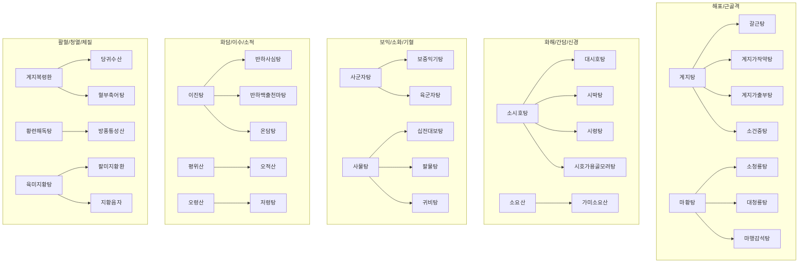

# 🗺️ Simbio 한의 처방 마스터 MOC (Prescription Master MOC)

> **핵심 요약 (Key Summary)**:
> Simbio 볼트 내 총 218종 한의 처방을 방제학(方劑學) 8대 기능별 치법과 12대 중심 허브 처방으로 전수 계통화한 마스터 MOC입니다.
> [[상한론]], [[동의보감]], [[동의수세보원]] 원전과 현대 분자약리학, 임상 팁 및 가감법을 상호 연결합니다.
> 모든 처방 노트는 사용자 작성 내용 100% 보존 원칙과 [[obsidian-note-standards]]를 준수합니다.
---
## 📌 목차
1. [🌟 12대 중심 처방 & 파생 계통수 (Core Tree)](#1--12대-중심-처방--파생-계통수-core-tree)
2. [🏛️ 방제학(方劑學) 9대 기능별 전수 분류](#2-️-방제학方劑學-9대-기능별-전수-분류)
   - [1. 해표제 (解表劑)](#1-해표제-解表劑)
   - [2. 보익제 (補益劑: 기·혈·음·양)](#2-보익제-補益劑-기혈음양)
   - [3. 화담·거습·이수제 (祛痰·祛濕·利水劑)](#3-화담거습이수제-祛痰祛濕利水劑)
   - [4. 이기·화해제 (理氣·和解劑)](#4-이기화해제-理氣和解劑)
   - [5. 활혈거어·지혈제 (活血祛瘀·止血劑)](#5-활혈거어지혈제-活血祛瘀止血劑)
   - [6. 청열·해독·사화제 (淸熱·解毒·瀉火劑)](#6-청열해독사화제-淸熱解毒瀉火劑)
   - [7. 사하·온리·고삽제 (瀉下·溫裏·固澀劑)](#7-사하온리고삽제-瀉下溫裏固澀劑)
   - [8. 치풍·안신·개규제 (治風·安神·開竅劑)](#8-치풍안신개규제-治風안신개규제)
   - [9. 사상체질방 (四象體質方)](#9-사상체질방-四象體質方)
3. [🧬 사상체질의학(四象體質) 처방 매핑](#3--사상체질의학四象體質-처방-매핑)
4. [💡 진료실 실전 가이드 & 특수 메모](#4--진료실-실전-가이드--특수-메모)
---
## 1. 🌟 12대 중심 처방 & 파생 계통수 (Core Tree)

임상에서 가장 다용되는 12대 처방을 중심으로 파생·가감 처방들이 방사형으로 뻗어 나가는 핵심 구조도입니다.

| No | 중심 처방 | 주요 병증 및 표적 | 핵심 파생 처방군 | 상태 |
| :---: | :--- | :--- | :--- | :---: |
| 1 | [[갈근탕]] | 항배강수수, 오한무한, 승모근/판상근 젖산 산화, 냉방병 | [[갈근가반하탕]], [[갈근탕가천궁신이]], [[갈근해기탕]], [[승마갈근탕]] | 🎯 표준화 중 |
| 2 | [[계지탕]] | 태양병 중풍, 영위부조, 소음인 추위 및 근육 위축 | [[계지가작약탕]], [[계지가출부탕]], [[계마각반탕]], [[소건중탕]], [[황기건중탕]] | 대기 |
| 3 | [[보중익기탕]] | 기허하함, 블루칼라 탈진, 자한, 만성피로, NK 세포 증강 | [[보중익기탕(사상)]], [[승마부자탕]], [[청서익기탕]] | 대기 |
| 4 | [[오적산]] | 한·습·기·혈·담 5적, 복압 상승 요통, 백돼지 태음인 | [[평위산]], [[이진탕]], [[당귀수산]], [[분신기음]] | 대기 |
| 5 | [[소시호탕]] | 한열왕래, 흉협고만, 인대감증+반하생강증, GERD, 간기능 | [[대시호탕]], [[시박탕]], [[시령탕]], [[시호청간탕]], [[시호소간탕]], [[시호가용골모려탕]] | 대기 |
| 6 | [[가미소요산]] | 간울혈허화왕, 갱년기 상열감, GABA BZp 작용, 월경전증후군 | [[소요산]], [[억간산]], [[온청음]], [[단치소요산]] | 대기 |
| 7 | [[계지복령환]] | 하초 어혈, 골반강 미세순환 저하, CGRP 안면홍조, 자궁근종 | [[계지복령환가의이인]], [[당귀작약산]], [[도핵승기탕]], [[온경탕]] | 대기 |
| 8 | [[반하사심탕]] | 심하비만, 한열착잡성 위장염, 위식도역류, 구역·구토 | [[생강사심탕]], [[감초사심탕]], [[황련사심탕]], [[이진탕]] | 대기 |
| 9 | [[소청룡탕]] | 외한내음, 알레르기 비염, 수양성 담음, 천식, 폐표한 | [[소청룡가석고탕]], [[영감강미신하인탕]], [[마황탕]], [[소청룡탕]] | 대기 |
| 10 | [[육미지황탕]] | 신음부족, 요슬산연, 골대사, 소아 발육, 체액 고갈 | [[팔미지황환]], [[신기환]], [[우차신기환]], [[지황음자]], [[자음강화탕]] | 대기 |
| 11 | [[당귀수산]] | 타박염좌, 외상성 어혈, 종창 동통, 혈액응고 억제 | [[혈부축어탕]], [[치타박일방]], [[회수산]], [[격하축어탕]], [[소복축어탕]] | 대기 |
| 12 | [[방풍통성산]] | 표리구실, 복부 비만, 변비, 뇌혈관 고혈압 체질, 대사증후군 | [[대시호탕]], [[황련해독탕]], [[구미강활탕]], [[태음조위탕]] | 대기 |

---
## 2. 🏛️ 방제학(方劑學) 8대 기능별 전수 분류

### 1. 해표제 (解表劑)
* **신온해표 (辛溫解表)**:
  * [[01_해표제/계지탕|계지탕]], [[01_해표제/갈근탕|갈근탕]], [[01_해표제/갈근가반하탕|갈근가반하탕]], [[01_해표제/갈근탕가천궁신이|갈근탕가천궁신이]], [[01_해표제/마황탕|마황탕]], [[01_해표제/대청룡탕|대청룡탕]], [[01_해표제/소청룡탕|소청룡탕]], [[01_해표제/소청룡가석고탕|소청룡가석고탕]], [[01_해표제/마행의감탕|마행의감탕]], [[01_해표제/마황가출탕|마황가출탕]], [[09_사상체질방/마황발표탕|마황발표탕]], [[01_해표제/마황부자세신탕|마황부자세신탕]], [[01_해표제/마황감초부자탕|마황감초부자탕]], [[01_해표제/마황감초탕|마황감초탕]], [[01_해표제/계마각반탕|계마각반탕]], [[01_해표제/계이월일탕|계이월일탕]], [[01_해표제/계강조초황신부탕|계강조초황신부탕]], [[01_해표제/구미강활탕|구미강활탕]], [[01_해표제/십신탕|십신탕]], [[01_해표제/향소산|향소산]], [[01_해표제/인삼패독산|인삼패독산]], [[01_해표제/형개연교탕|형개연교탕]], [[01_해표제/지해산|지해산]], [[01_해표제/총두탕|총두탕]], [[01_해표제/마황연교적소두탕|마황연교적소두탕]]
* **신량해표 (辛涼解表)**:
  * [[01_해표제/은교산|은교산]], [[01_해표제/상국음|상국음]], [[01_해표제/승마갈근탕|승마갈근탕]], [[01_해표제/시갈해기탕|시갈해기탕]], [[01_해표제/갈근해기탕|갈근해기탕]], [[01_해표제/마행감석탕|마행감석탕]], [[01_해표제/월비탕|월비탕]], [[01_해표제/월비가출탕|월비가출탕]], [[01_해표제/월비가반하탕|월비가반하탕]]
### 2. 보익제 (補益劑: 기·혈·음·양)
* **보기제 (補氣劑)**:
  * [[02_보익제/사군자탕|사군자탕]], [[02_보익제/보중익기탕|보중익기탕]], [[09_사상체질방/보중익기탕(사상)|보중익기탕(사상)]], [[02_보익제/육군자탕|육군자탕]], [[02_보익제/향사육군자탕|향사육군자탕]], [[02_보익제/삼령백출산|삼령백출산]], [[02_보익제/보비위탕|보비위탕]], [[02_보익제/보폐원탕|보폐원탕]], [[02_보익제/청서익기탕|청서익기탕]], [[02_보익제/생맥산|생맥산]], [[02_보익제/옥병풍산|옥병풍산]]
* **보혈제 (補血劑)**:
  * [[02_보익제/사물탕|사물탕]], [[02_보익제/당귀작약산|당귀작약산]], [[02_보익제/귀비탕|귀비탕]], [[02_보익제/가미귀비탕|가미귀비탕]], [[02_보익제/조경종옥탕|조경종옥탕]], [[02_보익제/생혈윤부음|생혈윤부음]], [[02_보익제/인숙산|인숙산]], [[02_보익제/하유용천산|하유용천산]], [[02_보익제/통유탕|통유탕]]
* **기혈쌍보제 (氣血雙補劑)**:
  * [[02_보익제/팔물탕|팔물탕]], [[09_사상체질방/팔물군자탕|팔물군자탕]], [[02_보익제/십전대보탕|십전대보탕]], [[02_보익제/인삼양영탕|인삼양영탕]], [[02_보익제/쌍화탕|쌍화탕]], [[02_보익제/경옥고|경옥고]], [[02_보익제/공진단|공진단]], [[02_보익제/녹용대보탕|녹용대보탕]], [[02_보익제/음양쌍보탕|음양쌍보탕]], [[02_보익제/소건중탕|소건중탕]], [[02_보익제/황기건중탕|황기건중탕]], [[02_보익제/당귀음자|당귀음자]]
* **보음·보양제 (補陰·補陽劑)**:
  * [[02_보익제/육미지황탕|육미지황탕]], [[02_보익제/팔미지황환|팔미지황환]], [[02_보익제/신기환|신기환]], [[02_보익제/우차신기환|우차신기환]], [[02_보익제/지황음자|지황음자]], [[02_보익제/자음강화탕|자음강화탕]], [[02_보익제/자음건비탕|자음건비탕]], [[02_보익제/자감초탕|자감초탕]], [[02_보익제/지백지황환|지백지황환]], [[02_보익제/오자연종환|오자연종환]], [[02_보익제/오자환|오자환]], [[02_보익제/대방풍탕|대방풍탕]], [[02_보익제/독활기생탕|독활기생탕]], [[02_보익제/한보환|한보환]], [[02_보익제/익위탕|익위탕]], [[02_보익제/파극천환|파극천환]]
### 3. 화담·거습·이수제 (祛痰·祛濕·利水劑)
* **조습화담·윤폐화담 (燥濕化痰·潤肺化痰)**:
  * [[03_화담·거습·이수제/이진탕|이진탕]], [[03_화담·거습·이수제/반하후박탕|반하후박탕]], [[03_화담·거습·이수제/반하백출천마탕|반하백출천마탕]], [[03_화담·거습·이수제/도담탕|도담탕]], [[03_화담·거습·이수제/창부도담탕|창부도담탕]], [[03_화담·거습·이수제/궁하탕|궁하탕]], [[03_화담·거습·이수제/청훈화담탕|청훈화담탕]], [[03_화담·거습·이수제/청폐탕|청폐탕]], [[03_화담·거습·이수제/패모괄루산|패모괄루산]], [[03_화담·거습·이수제/소력환|소력환]], [[03_화담·거습·이수제/맥문동탕|맥문동탕]], [[03_화담·거습·이수제/후박마황탕|후박마황탕]], [[03_화담·거습·이수제/금수육군전|금수육군전]], [[03_화담·거습·이수제/온폐탕|온폐탕]], [[03_화담·거습·이수제/청상보화환|청상보화환]], [[03_화담·거습·이수제/보화환|보화환]], [[03_화담·거습·이수제/삼자양친탕|삼자양친탕]], [[03_화담·거습·이수제/정력대조사폐탕|정력대조사폐탕]], [[03_화담·거습·이수제/소반하탕|소반하탕]], [[03_화담·거습·이수제/조협환|조협환]], [[03_화담·거습·이수제/죽력달담환|죽력달담환]], [[03_화담·거습·이수제/곤담환|곤담환]], [[03_화담·거습·이수제/해조옥호탕|해조옥호탕]]
* **건비화습·청열거습 (健脾化濕·淸熱祛濕)**:
  * [[03_화담·거습·이수제/평위산|평위산]], [[03_화담·거습·이수제/향사평위산|향사평위산]], [[03_화담·거습·이수제/불환금정기산|불환금정기산]], [[03_화담·거습·이수제/대금음자|대금음자]], [[03_화담·거습·이수제/곽향정기산|곽향정기산]], [[03_화담·거습·이수제/이묘환|이묘환]], [[03_화담·거습·이수제/간담습열방|간담습열방]], [[03_화담·거습·이수제/삼출건비탕|삼출건비탕]], [[03_화담·거습·이수제/소달건비탕|소달건비탕]], [[03_화담·거습·이수제/선비탕|선비탕]], [[03_화담·거습·이수제/초두구산|초두구산]], [[03_화담·거습·이수제/제습위령탕|제습위령탕]]
* **이수삼습 (利水滲濕)**:
  * [[03_화담·거습·이수제/오령산|오령산]], [[03_화담·거습·이수제/인진오령탕|인진오령탕]], [[03_화담·거습·이수제/저령탕|저령탕]], [[03_화담·거습·이수제/영계출감탕|영계출감탕]], [[03_화담·거습·이수제/시령탕|시령탕]], [[03_화담·거습·이수제/방기황기탕|방기황기탕]], [[03_화담·거습·이수제/방기복령탕|방기복령탕]], [[03_화담·거습·이수제/청기삼습탕|청기삼습탕]], [[03_화담·거습·이수제/의이인탕|의이인탕]], [[03_화담·거습·이수제/경신의이인탕|경신의이인탕]], [[03_화담·거습·이수제/진무탕|진무탕]], [[03_화담·거습·이수제/팔정산|팔정산]], [[03_화담·거습·이수제/육일산|육일산]], [[01_해표제/가감위령탕|가감위령탕]], [[03_화담·거습·이수제/지부자탕|지부자탕]], [[03_화담·거습·이수제/해금사산|해금사산]]
### 4. 이기·화해제 (理氣·和解劑)
* **화해소양·조화간비 (和解少陽·調和肝脾)**:
  * [[04_이기·화해제/소시호탕|소시호탕]], [[04_이기·화해제/대시호탕|대시호탕]], [[04_이기·화해제/시박탕|시박탕]], [[04_이기·화해제/시호가용골모려탕|시호가용골모려탕]], [[04_이기·화해제/시호소간탕|시호소간탕]], [[04_이기·화해제/시호소간음|시호소간음]], [[04_이기·화해제/시호청간탕|시호청간탕]], [[04_이기·화해제/사역산|사역산]], [[04_이기·화해제/소요산|소요산]], [[04_이기·화해제/가미소요산|가미소요산]], [[04_이기·화해제/반하사심탕|반하사심탕]], [[04_이기·화해제/생강사심탕|생강사심탕]]
* **행기·강기 (行氣·降氣)**:
  * [[04_이기·화해제/오약순기산|오약순기산]], [[04_이기·화해제/천태오약산|천태오약산]], [[03_화담·거습·이수제/분신기음|분신기음]], [[03_화담·거습·이수제/개울화담전|개울화담전]], [[03_화담·거습·이수제/비화음|비화음]], [[04_이기·화해제/귤피일물탕|귤피일물탕]], [[03_화담·거습·이수제/반하탕|반하탕]], [[04_이기·화해제/청목향산|청목향산]], [[04_이기·화해제/침향사마탕|침향사마탕]]
### 5. 활혈거어·지혈제 (活血祛瘀·止血劑)
* **활혈거어 (活血祛瘀)**:
  * [[05_활혈거어·지혈제/당귀수산|당귀수산]], [[05_활혈거어·지혈제/혈부축어탕|혈부축어탕]], [[05_활혈거어·지혈제/격하축어탕|격하축어탕]], [[05_활혈거어·지혈제/소복축어탕|소복축어탕]], [[05_활혈거어·지혈제/축어탕|축어탕]], [[05_활혈거어·지혈제/계지복령환|계지복령환]], [[05_활혈거어·지혈제/계지복령환가의이인|계지복령환가의이인]], [[05_활혈거어·지혈제/온경탕|온경탕]], [[05_활혈거어·지혈제/통경탕|통경탕]], [[05_활혈거어·지혈제/통경환|통경환]], [[05_활혈거어·지혈제/현부리경탕|현부리경탕]], [[05_활혈거어·지혈제/현부이경탕|현부이경탕]], [[05_활혈거어·지혈제/치타박일방|치타박일방]], [[05_활혈거어·지혈제/회수산|회수산]], [[05_활혈거어·지혈제/칠리산|칠리산]], [[05_활혈거어·지혈제/도핵승기탕|도핵승기탕]], [[05_활혈거어·지혈제/생기옥홍고|생기옥홍고]], [[05_활혈거어·지혈제/삼릉봉출산|삼릉봉출산]], [[05_활혈거어·지혈제/익모초고|익모초고]], [[05_활혈거어·지혈제/적소두당귀산|적소두당귀산]], [[05_활혈거어·지혈제/택란탕|택란탕]]
* **지혈제 (止血劑)**:
  * [[05_활혈거어·지혈제/십회산|십회산]], [[05_활혈거어·지혈제/사생환|사생환]], [[05_활혈거어·지혈제/괴화산|괴화산]], [[05_활혈거어·지혈제/지유탕|지유탕]]
### 6. 청열·해독·사화제 (淸熱·解毒·瀉火劑)
* **청열사화·청열해서 (淸熱瀉火·淸熱解暑)**:
  * [[06_청열·해독·사화제/백호탕|백호탕]], [[06_청열·해독·사화제/백호가인삼탕|백호가인삼탕]], [[06_청열·해독·사화제/치자시탕|치자시탕]], [[06_청열·해독·사화제/주증황련환|주증황련환]], [[06_청열·해독·사화제/도적산|도적산]], [[06_청열·해독·사화제/사백산|사백산]], [[06_청열·해독·사화제/죽엽석고탕|죽엽석고탕]], [[06_청열·해독·사화제/황련아교탕|황련아교탕]], [[06_청열·해독·사화제/사묘환|사묘환]]
* **청열해독 (淸熱解毒)**:
  * [[06_청열·해독·사화제/황련해독탕|황련해독탕]], [[06_청열·해독·사화제/삼황사심탕|삼황사심탕]], [[06_청열·해독·사화제/오미소독음|오미소독음]], [[06_청열·해독·사화제/선방활명음|선방활명음]], [[06_청열·해독·사화제/용담사간탕|용담사간탕]], [[06_청열·해독·사화제/청상방풍탕|청상방풍탕]], [[06_청열·해독·사화제/청상사화탕|청상사화탕]], [[06_청열·해독·사화제/청심연자음|청심연자음]], [[06_청열·해독·사화제/청심연자탕|청심연자탕]], [[06_청열·해독·사화제/인진호탕|인진호탕]], [[06_청열·해독·사화제/십미패독탕|십미패독탕]], [[06_청열·해독·사화제/배농산|배농산]], [[06_청열·해독·사화제/배농탕|배농탕]], [[06_청열·해독·사화제/배농산급탕|배농산급탕]], [[06_청열·해독·사화제/탁리소독음|탁리소독음]], [[06_청열·해독·사화제/백두옹탕|백두옹탕]], [[06_청열·해독·사화제/투농산|투농산]], [[06_청열·해독·사화제/포공영탕|포공영탕]]
* **청열양혈 (淸熱涼血)**:
  * [[06_청열·해독·사화제/온청음|온청음]], [[06_청열·해독·사화제/옥지산|옥지산]], [[06_청열·해독·사화제/자신환|자신환]], [[06_청열·해독·사화제/청영탕|청영탕]], [[06_청열·해독·사화제/청골산|청골산]], [[06_청열·해독·사화제/서각지황탕|서각지황탕]], [[06_청열·해독·사화제/진교별갑탕|진교별갑탕]]
### 7. 사하·온리·고삽제 (瀉下·溫裏·固澀劑)
* **공하·윤하 (攻下·潤下)**:
  * [[07_사하·온리·고삽제/대승기탕|대승기탕]], [[07_사하·온리·고삽제/소승기탕|소승기탕]], [[07_사하·온리·고삽제/조위승기탕|조위승기탕]], [[07_사하·온리·고삽제/대황감초탕|대황감초탕]], [[07_사하·온리·고삽제/마자인환|마자인환]], [[07_사하·온리·고삽제/윤장탕|윤장탕]], [[07_사하·온리·고삽제/윤장환|윤장환]], [[07_사하·온리·고삽제/오인환|오인환]], [[07_사하·온리·고삽제/삼물백산|삼물백산]]
* **온중거한·회양구역 (溫中祛寒·回陽救逆)**:
  * [[07_사하·온리·고삽제/이중탕|이중탕]], [[07_사하·온리·고삽제/부자이중탕|부자이중탕]], [[07_사하·온리·고삽제/대건중탕|대건중탕]], [[07_사하·온리·고삽제/사역탕|사역탕]], [[07_사하·온리·고삽제/오수유탕|오수유탕]], [[07_사하·온리·고삽제/당귀사역탕|당귀사역탕]], [[07_사하·온리·고삽제/당귀사역가오수유생강탕|당귀사역가오수유생강탕]], [[07_사하·온리·고삽제/난간전|난간전]], [[07_사하·온리·고삽제/부자말|부자말]], [[07_사하·온리·고삽제/정향시체탕|정향시체탕]], [[07_사하·온리·고삽제/오두탕|오두탕]], [[07_사하·온리·고삽제/백통탕|백통탕]], [[07_사하·온리·고삽제/필발산|필발산]], [[07_사하·온리·고삽제/필징가산|필징가산]], [[07_사하·온리·고삽제/호초산|호초산]]
* **고삽제 (固澀劑)**:
  * [[02_보익제/안태음|안태음]], [[02_보익제/보생탕|보생탕]], [[02_보익제/당귀백하오관중탕|당귀백하오관중탕]], [[07_사하·온리·고삽제/오미자탕|오미자탕]], [[07_사하·온리·고삽제/오패산|오패산]]
### 8. 치풍·안신·개규제 (治風·安神·開竅劑)
* **소산외풍·평식내풍 (疏散外風·平熄內風)**:
  * [[08_치풍·안신·개규제/소풍산|소풍산]], [[08_치풍·안신·개규제/소풍산(피부외)|소풍산(피부외)]], [[08_치풍·안신·개규제/소풍탕|소풍탕]], [[08_치풍·안신·개규제/소속명탕|소속명탕]], [[08_치풍·안신·개규제/이기거풍산|이기거풍산]], [[08_치풍·안신·개규제/승마유풍탕|승마유풍탕]], [[08_치풍·안신·개규제/조등산|조등산]], [[08_치풍·안신·개규제/고본지붕탕|고본지붕탕]], [[08_치풍·안신·개규제/견정산|견정산]], [[08_치풍·안신·개규제/대진교탕|대진교탕]], [[08_치풍·안신·개규제/서경탕|서경탕]], [[08_치풍·안신·개규제/소활락단|소활락단]], [[08_치풍·안신·개규제/옥진산|옥진산]], [[08_치풍·안신·개규제/영각구등탕|영각구등탕]], [[08_치풍·안신·개규제/진간식풍탕|진간식풍탕]], [[08_치풍·안신·개규제/천궁다조산|천궁다조산]], [[08_치풍·안신·개규제/해동피산|해동피산]], [[08_치풍·안신·개규제/희렴환|희렴환]], [[08_치풍·안신·개규제/희동환|희동환]]
* **진정안신·청심개규 (鎭靜安神·淸心開竅)**:
  * [[04_이기·화해제/온담탕|온담탕]], [[04_이기·화해제/가미온담탕|가미온담탕]], [[04_이기·화해제/죽여온담탕|죽여온담탕]], [[08_치풍·안신·개규제/계지가용골모려탕|계지가용골모려탕]], [[08_치풍·안신·개규제/천왕보심단|천왕보심단]], [[08_치풍·안신·개규제/억간산|억간산]], [[08_치풍·안신·개규제/총명탕|총명탕]], [[08_치풍·안신·개규제/통규탕|통규탕]], [[08_치풍·안신·개규제/여택통기탕|여택통기탕]], [[08_치풍·안신·개규제/길경탕|길경탕]], [[08_치풍·안신·개규제/신력탕|신력탕]], [[08_치풍·안신·개규제/우황청심원|우황청심원]], [[08_치풍·안신·개규제/소합향원|소합향원]], [[08_치풍·안신·개규제/백금환|백금환]], [[08_치풍·안신·개규제/주사안신환|주사안신환]], [[08_치풍·안신·개규제/안궁우황환|안궁우황환]], [[08_치풍·안신·개규제/포룡환|포룡환]], [[08_치풍·안신·개규제/관심소합환|관심소합환]], [[08_치풍·안신·개규제/호박포룡환|호박포룡환]]
### 9. 사상체질방 (四象體質方)
* **소양인 (少陽人: 비대신소)**:
  * [[09_사상체질방/양격산화탕|양격산화탕]], [[09_사상체질방/형방패독산|형방패독산]], [[09_사상체질방/형방사백산|형방사백산]], [[09_사상체질방/독활지황탕|독활지황탕]], [[09_사상체질방/형방지황탕|형방지황탕]], [[09_사상체질방/지황백호탕|지황백호탕]]
* **태음인 (太陰人: 간대폐소)**:
  * [[09_사상체질방/열다한소탕|열다한소탕]], [[09_사상체질방/태음조위탕|태음조위탕]], [[09_사상체질방/조위승청탕|조위승청탕]], [[09_사상체질방/마황발표탕|마황발표탕]], [[09_사상체질방/마황정통탕|마황정통탕]], [[09_사상체질방/한다열소탕|한다열소탕]]
* **소음인 (少陰人: 신대비소)**:
  * [[09_사상체질방/팔물군자탕|팔물군자탕]], [[09_사상체질방/보중익기탕(사상)|보중익기탕(사상)]]
* **태양인 (太陽人: 폐대간소)**:
  * [[09_사상체질방/오가피장척탕|오가피장척탕]]
---
## 3. 🧬 사상체질의학(四象體質) 처방 매핑

[[사상체질 처방|사상체질 처방]]에 정리된 체질별 병리와 용약 패턴 연계:

| 체질          | 체형 및 생리·병리 특성                | 핵심 구성 약재                                                                | 대표 표준 처방                |                                  |                                      |                           |        |
| :---------- | :--------------------------- | :---------------------------------------------------------------------- | :---------------------- | -------------------------------- | ------------------------------------ | ------------------------- | ------ |
| [[소음인]] | 마르고 허하며 근육 적음, 소화기 냉증, 기혈 부족 | [[감초]], [[적작약]], [[생강]], [[대추]], [[인삼]], [[진피]], [[백출]], [[당귀]], [[황기]] | [[ 팔물군자탕]], [[ 보중익기탕(사상)]], [[ 향사양위탕]], [[ 소건중탕]] |
| [[소양인]] | 상체 발달, 뇌혈관·심혈관 화열, 혈압 변동, 음허 | [[방풍]], [[형개]], [[복령]], [[택사]], [[숙지황]], [[강활]], [[독활]], [[지모]], [[황백]] | [[ 형방사백산]], [[ 독활지황탕]], [[ 형방지황탕]], [[양격산화탕]], [[지황백호탕]] |        |
| [[태음인]] | 골격 크고 살찌기 쉬움, 호흡기·폐국 취약, 간열  | [[마황]], [[맥문동]], [[길경]], [[황금]], [[대황]], [[의이인]], [[갈근]]                | [[ 태음조위탕]], [[ 조위승청탕]], [[ 갈근해기탕]], [[청폐사간탕]]        |        |
| [[태양인]] | 기운 상충, 흡해·격식, 간음 부족          | [[오가피]], [[모과]], [[미후도]], [[송절]]                                        | [[오가피장척탕]], [[미후도식장탕]]  |                                  |                                      |                           |        |
|             |                              |                                                                         |                         |                                  |                                      |                           |        |

---
## 4. 💡 진료실 실전 가이드 & 특수 메모

* [[처방 사이드 대처밥|처방 사이드 대처밥]] : [[마황]], [[인삼]] 등 부작용 발생 시 용량 감량법(½~¼), 텀블러 희석 복용법, 비만약 복용 시간대 조절(오후 5시 이전 복용, 반감기 4시간), 컴플레인 대처 원칙.
* [[08_치풍·안신·개규제/소아 처방 용량|소아 처방 용량]] : 연령/체중별 소아 탕약 전탕 및 분복 가이드.
* [[06_청열·해독·사화제/생간건비탕|생간건비탕]] : 만성 간질환 및 알코올성 간손상 임상 운용법.

---

## 🔗 관련 허브
* [[00_약리_공부_MOC|⚗️ 약리 공부 MOC]] — 본초 252 · 약리성분 91 · 양방 약 16 총괄
* [[00_이론_공부_MOC|🩺 이론 공부 MOC]] · [[00_임상_MOC|🏥 임상 종합 MOC]]
* [[00_처방_양방_약리_로드맵_기록|📋 처방 현대화 로드맵]]
