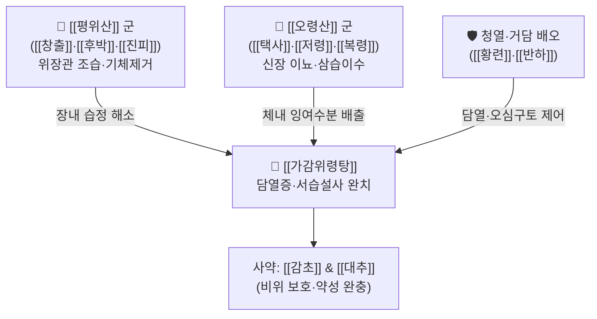

# 🍵 [[가감위령탕]] (加減胃苓湯, Ga-Gam-Wi-Ryeong-Tang)

> **핵심 3줄 요약 (Key Summary)**:
> - 🌿 [[위령탕]]([[평위산]]+[[오령산]]) 기반에 [[황련]]·[[황금]]·[[반하]] 등 청열·거담 약재를 가미한 방제.
> - 🎯 습담(濕痰)과 내열(內熱)이 얽힌 담열증, 여름철 서습설사, 식체 동반 급성 수양성 설사, 복창만, 전신 부종.
> - 🔬 장내 수분 재흡수 조절(AQP 수분통로 정상화), 위장관 평활근 경련 완화, 항염증 및 장내 미생물총 항상성 개선.
> - ⚠️ 주의사항: 진액이 극도로 고갈된 음허조열(陰虛燥熱) 환자나 단순 허한성 만성 설사 환자에게는 신중 투여.
---
## 📌 목차
1. [기본 처방 정보 & 군신좌사 구성](#1-기본-처방-정보--군신좌사-구성)
2. [방제학적 약재 상호작용 & 시너지 네트워크](#2-방제학적-약재-상호작용--시너지-네트워크)
3. [현대 분자약리학적 효능 & 작용 기전](#3-현대-분자약리학적-효능--작용-기전)
4. [적응 병증 및 체질별 감별 (Sweet Spot vs 금기)](#4-적응-병증-및-체질별-감별-sweet-spot-vs-금기)
5. [유사 처방군 감별 매트릭스](#5-유사-처방군-감별-매트릭스)
6. [임상 가감례 & 현대 질환별 응용](#6-임상-가감례--현대-질환별-응용)
7. [💡 사용자 진료실 핵심 필기 & 임상 팁 (원문 보존)](#7--사용자-진료실-핵심-필기--임상-팁-원문-보존)
8. [출처 및 학술 참고 문헌 (References)](#8-출처-및-학술-참고-문헌-references)
---
## 1. 기본 처방 정보 & 군신좌사 구성

* **출전**: 『만병회춘(萬病回春)』, 『동의보감(東醫寶鑑)』
* **치법**: 건비화습(健脾化濕), 이수청열(利水淸熱), 화담강역(化痰降逆)

| 구분 | 약재명 | 표준 용량 | 본초 효능 & 방제 내 역할 |
| :--- | :--- | :--- | :--- |
| **군약 (君藥)** | [[창출]] | 6~8g | 조습건비(燥濕健脾), 거풍산한, 위장관 삼출 수분 흡수 및 소화관 운동성 회복 |
| **군약 (君藥)** | [[택사]] | 6~8g | 이수삼습(利水滲濕), 설열(泄熱), 신장 수분 배설 촉진 및 열성 부종 경감 |
| **신약 (臣藥)** | [[후박]] | 4~6g | 하고하기(下氣除滿), 조습소담, 복부 팽만감 및 장관 가스 정체 해소 |
| **신약 (臣藥)** | [[저령]] | 4~6g | 이수삼습, 요량 증가 및 장내 잉여 수분 배출 |
| **신약 (臣藥)** | [[복령]] | 4~6g | 건비안신, 삼습이뇨, 비기 허약 개선 |
| **좌약 (佐藥)** | [[진피]] | 4~6g | 이기건비(理氣健脾), 조습화담, 담음 정체 배출 촉진 |
| **좌약 (佐藥)** | [[백출]] | 4~6g | 보비익기, 조습이수, 장점막 투과성 개선 |
| **좌약 (佐藥)** | [[반하]] | 4~6g | 조습화담, 강역지구, 담열로 인한 오심·구토 억제 |
| **좌약 (佐藥)** | [[황련]] | 2~4g | 청열조습, 사화해독, 장점막 염증 완화 및 급성 설사 완화 |
| **좌약 (佐藥)** | [[육계]] | 1~2g | 온통경기(溫通經氣), 화통기화(化氣利水), 수액 대사 촉진 |
| **좌약 (佐藥)** | [[생강]] | 4g | 온위지구, 담음 정체 해소 |
| **좌약 (佐藥)** | [[대추]] | 4g | 보비화위, 진액 보존 |
| **사약 (使藥)** | [[감초]] | 2~4g | 보기화중, 완급지통, 제약 조화 |

> **배오 특징**: 소화관 내 비생리적 습담(濕痰)을 훑어내는 [[평위산]](창출·후박·진피·감초)과 소변을 통해 전신 수분을 빼내는 [[오령산]](택사·저령·복령·백출·육계)의 합방인 [[위령탕]]을 기본으로 하여, 담열(痰熱)과 서습(暑濕)으로 인해 발생하는 구토·열성 설사를 제어하기 위해 청열·거담약([[황련]], [[반하]] 등)을 가감 배오한 정밀 수습(水濕) 조절 처방입니다.
---
## 2. 방제학적 약재 상호작용 & 시너지 네트워크

* [[창출]] + [[택사]] 배오: [[창출]]이 소화관 내강에 정체된 습기를 말려주고(조습), [[택사]]가 삼출된 수액을 방광으로 유도하여 소변으로 신속히 배출(이수)시켜 장점막의 수양성 분비를 단시간 내에 정상화합니다.
* [[황련]] + [[반하]] 배오: 신미(辛味)의 [[반하]]로 담음을 흩뜨리고 구역을 가라앉히며, 고미(苦味)의 [[황련]]으로 장내 급성 화열(化熱)을 꺼주어 신개고강(辛開苦降)의 원리로 명치 밑 답답함(비만)과 오심·설사를 동시에 종결시킵니다.
---
## 3. 현대 분자약리학적 효능 & 작용 기전

### 1) 장관 아쿠아포린(Aquaporin) 수분 통로 발현 조절
* [[택사]]의 [[알리솔]](Alisol) 성분과 [[복령]]의 [[파키믹산]](Pachymic acid)은 결장 상피세포의 AQP-2 및 AQP-3 수분 통로 발현을 정상화하여 내강으로 과도하게 분비되던 수분의 재흡수를 촉진하고 수양성 설사를 억제합니다.

### 2) 장관 평활근 경련 완화 및 항콜린 작용
* [[후박]]의 [[호노키올]](Honokiol)과 [[마그놀롤]](Magnolol), [[진피]]의 [[헤스페리딘]](Hesperidin)이 위장관 평활근의 칼슘 채널을 차단하여 복통을 수반하는 장경련을 즉각적으로 진정시킵니다.

### 3) 항염증 및 장내 미생물 불균형(Dysbiosis) 교정
* [[황련]]의 [[베르베린]](Berberine)과 [[창출]]의 [[아트락틸로딘]](Atractylodin) 성분은 TLR4/NF-$\kappa$B 염증 신호 전달계를 억제하고 장벽 밀착연접(Tight junction) 단백질(Claudin-1, ZO-1)을 복구하여 장누수 증후군을 완화합니다.
---
## 4. 적응 병증 및 체질별 감별 (Sweet Spot vs 금기)

### 1) 임상 적응증 (Sweet Spot)
* **급성 서습성 장염**: 여름철 찬 음식 섭취 후 갑자기 발생한 수양성 설사, 복통, 소변량 감소.
* **담열증(痰熱證)**: 가슴이 답답하고(흉민), 속이 메스꺼우며(오심구토), 끈적하고 냄새가 독한 설사를 보면서 혀에 누런 설태(황니태)가 끼는 증상.
* **수종(水腫) 겸 복창**: 소화장애를 동반하면서 손발이 붓고 소변 배출이 원활하지 못한 상태.

### 2) 사상의학 체질 감별 & 금기
* [[태음인]] / [[소양인]]: 체내 습열(濕熱) 정체가 쉬운 체질에 탁월하게 적응.
* **금기(Contraindication)**:
  * 평소 몸이 극도로 차고 맥이 침미한 순수 비신양허(脾腎陽虛) 한설 환자에게는 육계 용량을 늘리거나 [[이중탕]], [[사신환]]으로 전환.
  * 진액이 심하게 소모된 고령자나 음허(陰虛) 조열 환자는 신중 투여.
---
## 5. 유사 처방군 감별 매트릭스

| 처방명 | 중심 병리 | 핵심 증상 | 배오 특징 |
| :--- | :--- | :--- | :--- |
| [[가감위령탕]] | 습담(濕痰) + 내열(內熱) | 구토, 수양성 설사, 황니태, 담열증 | [[위령탕]] + 청열거담약([[황련]], [[반하]]) |
| [[위령탕]] | 비위 습체(濕滯) + 수음(水飮) | 식체 설사, 복부 팽만, 부종 | [[평위산]] + [[오령산]] 기본방 |
| [[갈근황련황금탕]] | 표증 미진 + 양명 습열 | 고열, 악취 설사, 항문 작열감 | [[갈근]] + [[황련]] + [[황금]] + [[감초]] |
| [[곽향정기산]] | 외감 풍한 + 내상 습체 | 오한, 두통, 구토, 설사 | 곽향 주초, 표리쌍해 |

---
## 6. 임상 가감례 & 현대 질환별 응용

1. **식체 겸 열성 복통 심할 때**: [[산사]], [[신곡]], [[맥아]]를 각 4g 가미하여 장관 내 소화되지 않은 음식물 정체를 신속 제거.
2. **이질성 후중감(뒤가 묵직함) 동반 시**: [[목향]], [[빈랑]]을 각 3g 가미하여 이기통체(理氣通滯).
3. **담음성 두통·어지럼증 동반 시**: [[천마]], [[백출]]을 가미하여 이수지훈(利水止暈).
---
## 7. 💡 사용자 진료실 핵심 필기 & 임상 팁 (원문 보존)

담열증에 활용
---
## 8. 출처 및 학술 참고 문헌 (References)

* 『東醫寶鑑』 雜病篇 卷之十一 泄瀉
* 『萬病回春』 卷之三 泄瀉門
* Liu, Y., et al. (2020). "Regulatory effects of Weiling Tang on Aquaporin water channels in diarrheal rat models." *Journal of Ethnopharmacology*, 255: 112739.
  * `[연구 요약]`: 위령탕 및 가감 방제가 결장 상피 AQP-2/3의 발현을 정상화시켜 수양성 설사를 유의미하게 억제함을 검증.
* Zhang, H., et al. (2021). "Anti-inflammatory and mucosal protective actions of Atractylodin and Berberine combination." *Frontiers in Pharmacology*, 12: 671043.
  * `[연구 요약]`: 창출의 아트락틸로딘과 황련의 베르베린 복합 투여 시 장점막 상피 밀착연접 손상 억제 및 국소 염증성 사이토카인 감소 확인.