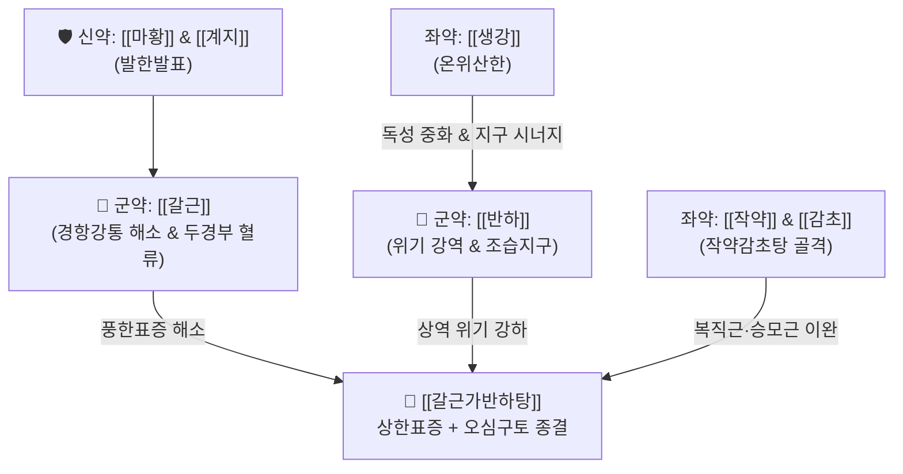

# 🍵 [[갈근가반하탕]] (葛根加半夏湯, Ge-Gen-Jia-Ban-Xia-Tang / Kakkontokahange)

> **핵심 3줄 요약 (Key Summary)**:
> - 🌿 [[갈근탕]]([[갈근]]·[[마황]]·[[계지]]·[[작약]]·[[생강]]·[[대추]]·[[감초]]) + [[반하]](강역지구·화담).
> - 🎯 감기 초기 오한·발열·항배강(목과 등의 뻣뻣함)과 함께 오심·구토가 두드러지는 태양·양명 합병, 급성 위장염형 감기, 편두통 동반 구역.
> - 🔬 비점막·말초 혈관 확장 및 해열 진통, CTZ 및 위장관 세로토닌 5-HT3 수용체 신호 차단을 통한 강력한 구토 반사 억제.
> - ⚠️ 주의사항: [[마황]] 함유로 심계항진·고혈압·불면 환자 주의, 구토 후 심한 탈수·진액 고갈 환자는 수액 보충 병행 필요.
---
## 📌 목차
1. [기본 처방 정보 & 군신좌사 구성](#1-기본-처방-정보--군신좌사-구성)
2. [방제학적 약재 상호작용 & 시너지 네트워크](#2-방제학적-약재-상호작용--시너지-네트워크)
3. [현대 분자약리학적 효능 & 작용 기전](#3-현대-분자약리학적-효능--작용-기전)
4. [적응 병증 및 체질별 감별 (Sweet Spot vs 금기)](#4-적응-병증-및-체질별-감별-sweet-spot-vs-금기)
5. [유사 처방군 감별 매트릭스](#5-유사-처방군-감별-매트릭스)
6. [임상 가감례 & 현대 질환별 응용](#6-임상-가감례--현대-질환별-응용)
7. [💡 사용자 진료실 핵심 필기 & 임상 팁 (원문 보존)](#7--사용자-진료실-핵심-필기--임상-팁-원문-보존)
8. [출처 및 학술 참고 문헌 (References)](#8-출처-및-학술-참고-문헌-references)
---
## 1. 기본 처방 정보 & 군신좌사 구성

* **출전**: 한대(漢代) 장중경(張仲景) 『상한론(傷寒論)』
  * "太陽與陽明合病, 不下利, 但嘔者, 葛根加半夏湯主之." (태양병과 양명병이 합병하여 설사는 하지 않고 오직 구역질만 하는 자는 갈근가반하탕이 주치한다.)
* **치법**: 해기발한(解肌發汗), 화위강역(和胃降逆), 조습화담(燥濕化痰)

| 구분 | 약재명 | 표준 용량 | 본초 효능 & 방제 내 역할 |
| :--- | :--- | :--- | :--- |
| **군약 (君藥)** | [[갈근]] | 8~12g | 해기퇴열, 승양생진, 경항부 근육 경직 완화 및 두부 혈류 개선 |
| **군약 (君藥)** | [[반하]] | 8~10g | 조습화담, 강역지구(降逆止嘔), 상역하는 위기를 내려 구토와 오심을 즉각 차단 |
| **신약 (臣藥)** | [[마황]] | 4~6g | 발한선폐, 표한 발산, 기관지 확장 |
| **신약 (臣藥)** | [[계지]] | 4~6g | 온통경맥, 영위 조화, 혈행 순환 보조 |
| **좌약 (佐藥)** | [[작약]] | 4~6g | 양혈유간, 완급지통, 근경련 완화 |
| **좌약 (佐藥)** | [[생강]] | 6~8g | 온위지구, [[반하]]의 독성을 포제·완화하고 온중산한 시너지 발휘 |
| **좌약 (佐藥)** | [[대추]] | 4g | 보비화위, 영위 조화 보조 |
| **사약 (使藥)** | [[감초]] | 2~4g | 조화제약, 완급지통 |

> **배오 특징**: [[갈근탕]]의 전형적인 해기표한(풍한 감모 및 뒷목 뻣뻣함 해소) 골격에, 강역지구의 성약(聖藥)인 [[반하]]를 군약급으로 증량 배오하고, [[반하]]의 자극성을 중화하는 [[생강]]을 대량 배오하여 감기 초기 상부 위장관 역류 증상(구역·구토)을 완벽히 소퇴시킵니다.
---
## 2. 방제학적 약재 상호작용 & 시너지 네트워크

* [[반하]] + [[생강]] 배오: 생강반하탕(生薑半夏湯)의 핵심 구조를 내포하여, [[생강]]의 [[진저롤]]이 [[반하]]의 옥살산칼슘 바늘형 결정을 화학적으로 중화하면서 미주신경 구토 반사를 차단하여 가장 안전하고 강력한 진토 시너지를 창출합니다.
* [[갈근]] + [[작약]] 배오: [[갈근]]의 [[푸에라린]]과 [[작약]]의 [[페오니플로린]]이 뒷목과 등의 [[승모근]], [[판상근]] 긴장을 풀어줌과 동시에 위장관 평활근의 과긴장 상태를 안정시킵니다.
---
## 3. 현대 분자약리학적 효능 & 작용 기전

### 1) 중추성 화학수용체 유발대(CTZ) 및 세로토닌 5-HT3 수용체 길항 작용
* [[반하]]와 [[생강]]의 복합 추출물은 연수의 화학수용체 유발대(Chemoreceptor Trigger Zone)와 위점막 미주신경 말단의 Serotonin 5-HT3 수용체 결합을 차단하여 오심과 구토 반사를 강력히 억제합니다.

### 2) 소화관 운동성 정상화 (Gastric Motility Normalization)
* [[생강]]의 [[쇼가올]](Shogaol)과 [[반하]] 알칼로이드 성분이 위배출능(Gastric emptying)을 촉진하고 위 전정부의 역방향 연동운동을 억제하여 위 내용물이 식도로 역류하는 것을 방지합니다.

### 3) 경배부 근육 혈류 개선 및 교감신경 긴장 완화
* [[갈근]]의 [[푸에라린]](Puerarin) 성분이 추골동맥(Vertebral artery) 및 외경동맥 혈류를 증진시키고, 근육 내 젖산 축적을 억제하여 목과 어깨의 극심한 근육통을 해소합니다.
---
## 4. 적응 병증 및 체질별 감별 (Sweet Spot vs 금기)

### 1) 임상 적응증 (Sweet Spot)
* **위장형 감모**: 감기 몸살과 함께 뒷목이 뻣뻣하고 속이 심하게 울렁거리며 구토가 올라오는 상태.
* **소아 급성 위장염 초기**: 발열과 함께 헛구역질을 심하게 하고 물만 마셔도 토하는 소아 환자.
* **편두통 및 전정신경염**: 목어깨 결림과 두통을 동반하면서 오심·구토, 현기증이 동반되는 급성기.

### 2) 사상의학 체질 감별 & 금기
* [[태음인]]: 조습(燥濕)을 돕고 표한을 풀어주는 데 적합.
* **금기(Contraindication)**:
  * 땀을 비 오듯 흘리는 자한(自汗) 환자, 진액이 바닥난 음허(陰虛) 환자.
  * 구토가 너무 심해 전해질 불균형과 탈수가 발생한 경우 수액 치료 우선.
---
## 5. 유사 처방군 감별 매트릭스

| 처방명 | 중심 병증 | 구토 유무 | 뒷목 결림 | 처방 구성 차이 |
| :--- | :--- | :--- | :--- | :--- |
| [[갈근가반하탕]] | 태양·양명 합병 (풍한+상역) | 뚜렷한 구토·오심 (+++) | 극심 (+++) | [[갈근탕]] + [[반하]] |
| [[갈근탕]] | 태양병 표실증 (풍한표실) | 구토 없음 (-) | 극심 (+++) | [[갈근탕]] 기본방 |
| [[소시호탕]] | 소양병 반표반리 (한열왕래) | 흉협고만 동반 구역 (++) | 없음/경미 (+) | 시호·황금·반하·인삼 |
| [[오령산]] | 축수증 (수역) | 물 마시면 즉시 토함 (+++) | 없음 (-) | 저령·복령·백출·택사·계지 |

---
## 6. 임상 가감례 & 현대 질환별 응용

1. **구토가 그치지 않고 심한 경우**: [[생강]]을 10g으로 증량하거나 생즙(생강즙)을 조금씩 타서 복용.
2. **소화불량과 흉복부 팽만 동반 시**: [[후박]], [[진피]]를 각 4g 가미.
3. **인후통 및 열감 동반 시**: [[석고]] 12g, [[길경]] 4g 가미.
---
## 7. 💡 사용자 진료실 핵심 필기 & 임상 팁 (원문 보존)

# 구성
- [[계지탕]]+[[마황]] [[갈근]] [[반하]]

# 적응증
- 태양병과 양명병이 합병하여 설사는 하지 않고 오직 구역질만 하는 증상.
---
## 8. 출처 및 학술 참고 문헌 (References)

* 『傷寒論』 辨太陽病脈證幷治: "太陽與陽明合病, 不下利, 但嘔者, 葛根加半夏湯主之."
