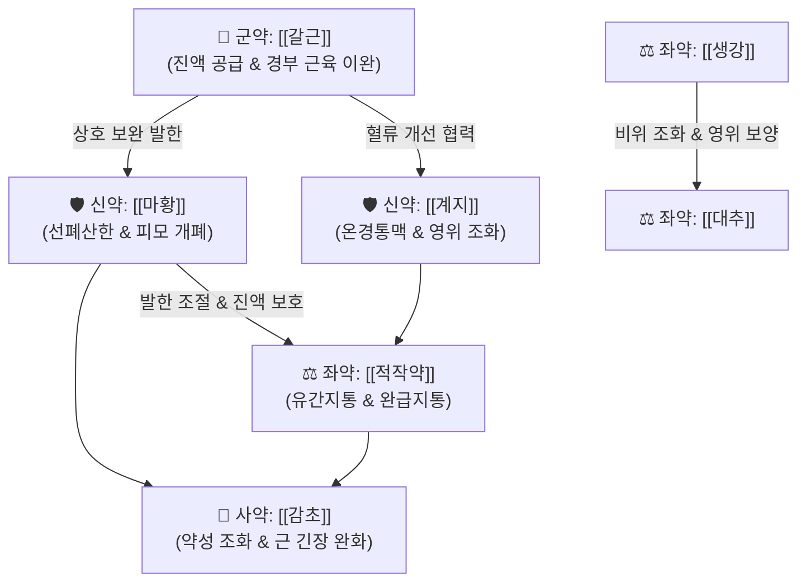

# 🍵 [[갈근탕]] (葛根湯, Ge-Gen-Tang / Kakkonto)

> **핵심 3줄 요약 (Key Summary)**:
> - 🌿 [[계지탕]] + [[갈근]], [[마황]] ([[계지]]·[[작약]]·[[생강]]·[[대추]]·[[감초]] 베이스에 목·어깨를 푸는 [[갈근]]과 발한시키는 [[마황]] 결합).
> - 🎯 태음인·소음인 근육 위축형 스트레스 체질, 으슬으슬 춥고 밥은 잘 먹는데 몸이 무거운 만성피로, 목·어깨 결림(항배강), 에어컨 냉방병, 긴장성 [[두통]].
> - 🔬 자세근 젖산 축적 억제 및 지방산 산화 대사 촉진, IL-1α 억제.
> - ⚠️ 주의사항: 땀이 이미 나거나 열 많고 술 자주 마시는 환자, 고혈압·심혈관 질환자 신중.
---
## 📌 목차
1. [기본 처방 정보 & 군신좌사 구성](#1-기본-처방-정보--군신좌사-구성)
2. [방제학적 약재 상호작용 & 시너지 네트워크](#2-방제학적-약재-상호작용--시너지-네트워크)
3. [현대 분자약리학적 효능 & 작용 기전](#3-현대-분자약리학적-효능--작용-기전)
4. [적응 병증 및 체질별 감별 (Sweet Spot vs 금기)](#4-적응-병증-및-체질별-감별-sweet-spot-vs-금기)
5. [유사 처방군 감별 매트릭스](#5-유사-처방군-감별-매트릭스)
6. [임상 가감례 & 현대 질환별 응용](#6-임상-가감례--현대-질환별-응용)
7. [💡 사용자 진료실 핵심 필기 & 임상 팁 (원문 보존)](#7--사용자-진료실-핵심-필기--임상-팁-원문-보존)
8. [출처 및 학술 참고 문헌 (References)](#8-출처-및-학술-참고-문헌-references)
---
## 1. 기본 처방 정보 & 군신좌사 구성
* **출전**: 장중경(張仲景) 『[[상한론]]』 태양병편(太陽病篇)
* **치법**: 신온해표(辛溫解表), 발한해서(發汗解肌), 승양통비(升陽通痺), 서근활락(舒筋活絡)

| 구분 | 약재명 | 표준 용량 | 본초 효능 & 방제 내 역할 |
| :--- | :--- | :--- | :--- |
| **군약 (君藥)** | [[갈근]] | 8~12g | 해기퇴열(解肌退熱), 생진지갈(生津止渴), 항배부 경련 해소, 경동맥 및 말초 혈관 확장 |
| **신약 (臣藥)** | [[마황]] | 4~6g | 발한해표(發汗解表), 선폐평천(宣肺平喘), [[갈근]]을 도와 한사(寒邪)를 체표 밖으로 배출 |
| **신약 (臣藥)** | [[계지]] | 4~6g | 온통경맥(溫通經脈), 조양화영(助陽和營), [[마황]]과 협력하여 표한(表寒) 해소 |
| **좌약 (佐藥)** | [[적작약]] | 4~6g | 양혈렴음(養血斂陰), 유간지통(柔肝止痛), [[계지]]와 짝을 이루어 영위(營衛) 조화 및 근육 경련 억제 |
| **좌약 (佐藥)** | [[생강]] | 4~6g | 온위산한(溫胃散寒), 해표화중(解表和中), [[마황]]·[[계지]]의 발한 작용 촉진 및 위장 보호 |
| **좌약 (佐藥)** | [[대추]] | 4~6g | 보중익기(補中益氣), 양혈안신(養血安神), [[작약]]과 협력하여 진액(津液) 공급 |
| **사약 (使藥)** | [[감초]] | 2~4g | 조화제약(調和諸藥), 익기화중(益氣和中), [[마황]]·[[갈근]]의 급성(急性)을 완충 |

> **배오 특징**: [[계지탕]]([[계지]]·[[작약]]·[[생강]]·[[대추]]·[[감초]])의 영위 조화 베이스에 투표발한(透表發汗)하는 [[마황]]과 진액을 올리며 근육을 이완시키는 [[갈근]]을 결합한 방제입니다. 땀이 나지 않는 실증 표한(表寒)에 땀을 내면서도 근육 내 진액 고갈을 막아줍니다.
---
## 2. 방제학적 약재 상호작용 & 시너지 네트워크

* [[갈근]] + [[마황]] 배오: [[갈근]]의 진액 상승 및 기육(肌肉) 이완 작용과 [[마황]]의 발한산한 작용이 결합되어, 땀구멍을 열어 체표 사기를 몰아내는 동시에 목과 어깨의 뻣뻣함을 즉각 해소합니다.
* [[작약]] + [[감초]] 배오: [[작약감초탕]](芍藥甘草湯) 구조가 내재되어 있어, 골격근의 근방추 과흥분과 혈관 평활근의 경련을 직접 진정시킵니다.
---
## 3. 현대 분자약리학적 효능 & 작용 기전

### 1) 항바이러스 및 전신 면역 조절 작용
* **바이러스 증식 억제**: 인플루엔자 바이러스 감염 모델에서 바이러스 복제를 억제하고 폐 조직 손상을 경감합니다.
* **사이토카인 네트워크 리밸런싱**:
  * 염증 유발 및 발열 매개체인 **IL-1α 생산을 억제**하여 체온 상승과 전신 염증 반응을 진정시킵니다.
  * Th1 면역 반응 지표인 **IL-12와 IFN-γ 생산을 촉진**하여 자연살해세포(NK cell) 및 세포독성 T세포의 항바이러스 방어 면역을 강화합니다.

> 🧬 **현대 학술 근거 (2026-09-07 B-7 패치)**
> - COVID-19 임상 근거: 경도~중등도 COVID-19 환자 무작위 대조 시험의 사후 분석에서, 대증 요법에 [[갈근탕]](1회 2.5g)과 시호계가길경석고를 병용 추가한 캄포군이 무재발 증상 소실에 더 기여하는 결과가 보고됨(PMID 37507087).

### 2) 골격근 대사 개선 (자세근 대사 전환 및 피로 해소)
* **혐기성 해당계(Anaerobic Glycolysis) $\rightarrow$ 호기성 지방산 산화(Fatty Acid Oxidation) 전환**:
  * 후경부 및 견갑대의 등척성 수축을 담당하는 지근(Slow-twitch fibers, Type I 자세유지근: [[승모근]], [[두판상근]], [[경판상근]], [[견갑거근]] 등)은 평상시 유산소 대사를 위주로 작동합니다.
  * 지속적인 스트레스, 한랭 노출(에어컨 바람), 불량한 자세가 지속되면 혈관 수축으로 국소 저산소증이 유발되어 혐기성 대사로 전환되고, **젖산(Lactate) 축적 $\rightarrow$ 근막 통각수용기(Nociceptor) 감작 $\rightarrow$ 항배강 통증** 악순환이 발생합니다.
  * [[갈근탕]]은 [[푸에라린]]과 [[계지]]정유 성분을 통해 미세순환을 뚫어주고 포도당 대신 지방산을 산화할 수 있도록 미토콘드리아 대사 환경을 정상화하여 근육 뭉침과 만성 피로를 해소합니다.

![[Pasted image 20240502204013.png|359]]
> [그림 설명: [[갈근탕]] 투여에 따른 세포 내 대사 경로 조절 기전]

![[Pasted image 20240502204155.png|268]]
> [그림 설명: 근육 대사계에서의 젖산 축적 억제 및 지방산 대사 활성화 도해]

### 3) 뇌경동맥 및 말초 혈류량 증가
* [[푸에라린]](Puerarin) 성분의 혈관내피 의존성 이완 작용(eNOS 발현 촉진)을 통해 척추-기저동맥(Vertebrobasilar artery) 및 외경동맥 분지의 혈류 저항을 낮추어 **긴장성 두통**과 **경추성 어지럼증**을 완화합니다.
> 🧬 **현대 학술 근거 (2026-09-07 B-7 패치)** — PubChem 실측 분자 앵커: [[푸에라린]](Puerarin) CID **5281807** · 분자식 C₂₁H₂₀O₉ · MW 416.4

🔬 **분자 구조** (Wikimedia Commons, Public Domain)

![[Puerarin_구조.png|430]]
> [그림] 푸에라린(Puerarin, C₂₁H₂₀O₉) 분자 구조 — 출처: Wikimedia Commons (Puerarin.svg)

---
## 4. 적응 병증 및 체질별 감별 (Sweet Spot vs 금기)

[✅ 최적 적응증 (Sweet Spot)]
• 상한론 조문: "태양병, 항배강수수(項背强幾幾), 무한(無汗), 오풍(惡風)"
• 임상 주치: 감기 초기 오한·발열·두통이 있으면서 땀이 나지 않고 목덜미와 등이 뻣뻣할 때
• 냉방병: 여름철 과도한 에어컨 노출로 체표가 냉각되고 어깨가 굳으며 으슬으슬할 때
• 근골격계: 승모근·판상근 증후군, 근막통증증후군(MPS), 경추 추간판 장애 초기 견배통
• 체질 소견: 평소 소화기는 비교적 양호하나 추위를 잘 타고 스트레스를 받으면 목·어깨로 긴장이 몰리는 태음인 및 체력 있는 소음인
• 설진/맥진: 설담홍(舌淡紅), 박백태(薄白苔), 맥부긴(脈浮緊) 또는 맥부유력(脈浮有力)

[⚠️ 신중 투여 및 금기 (Caution / Contraindication)]
• 표허자한(表虛自汗): 이미 땀이 송골송골 나고 있는 환자에게 투여하면 진액 탈루 유발 ([[계지탕]] 적응증)
• 음허화왕(陰虛火旺) 및 열증(熱證): 평소 체질적으로 열이 많고 술을 과음하며 얼굴이 붉은 환자에게는 상열감 악화
• 심혈관 질환자: [[마황]]([[에페드린]]) 함유로 인해 고혈압 환자, 중증 부정맥, 협심증 환자 신중 투여
• 임산부: 발한 파혈 작용에 주의하여 신중 투여

> 🧬 **현대 학술 근거 (2026-09-07 B-7 패치)**
> - 안전성 주의 근거: 76세 여성이 예방 목적으로 [[갈근탕]]을 4.5개월간 자가 복용한 뒤 약인성 폐렴(kakkonto-induced pneumonitis)으로 진행, 중단과 전신 스테로이드로 호전된 증례 보고 — 장기 복용 환자의 호흡기 증상에서 약인성 폐렴 감별 필요(PMID 42437236).

---
## 5. 유사 처방군 감별 매트릭스

| 처방명 | 핵심 구성 차이 | 주치 및 체질 차이 | 맥진/설진 차이 |
| :--- | :--- | :--- | :--- |
| [[갈근탕]] | [[계지탕]] + [[갈근]], [[마황]] | **목·어깨 뻣뻣(항배강), 땀 안 남, 오한, 근육 젖산통** | 맥부긴(浮緊), 박백태 |
| [[계지탕]] | [[계지]], [[작약]], [[생강]], [[대추]], [[감초]] | **땀이 저절로 남(자한), 오풍, 기허형 감모초기** | 맥부완(浮緩), 박백태 |
| [[마황탕]] | [[마황]], [[계지]], [[행인]], [[감초]] | **극심한 오한·고열, 골절통, 천해(기침), 무한** | 맥부긴유력(浮緊有力) |
| [[갈근가반하탕]] | [[갈근탕]] + [[반하]] | [[갈근탕]]증 + 구역(噁心), 위내정수, 입덧, 위식도역류 | 맥부긴, 백활태 |
| [[갈근탕가천궁신이]] | [[갈근탕]] + [[천궁]], [[신이]] | [[갈근탕]]증 + 비폐색(코막힘), 부비동염, 축농증 두통 | 맥부긴, 박백태 |
| [[승마갈근탕]] | 승마, [[갈근]], [[작약]], [[감초]] | **풍열표증, 발진, 홍역 초기, 두면부 염증** | 맥부삭(浮數), 박황태 |
| [[시갈해기탕]] | 시호, [[갈근]], [[황금]], [[백지]] 등 | **태양양명합병, 몸에 열이 성하고 입이 마르며 안구통** | 맥부홍(浮洪), 황태 |
---
## 6. 임상 가감례 & 현대 질환별 응용

* **수반 증상별 가감법**:
  * 코막힘, 맑은 콧물, 알레르기 비염 동반 시 $\rightarrow$ + [[천궁]], [[신이]] ([[갈근탕가천궁신이]])
  * 오심, 구역질, 속쓰림, 소화불량 동반 시 $\rightarrow$ + [[반하]] ([[갈근가반하탕]])
  * 발열이 심하고 열감이 두면부로 치솟을 때 $\rightarrow$ + [[석고]], [[황금]] 또는 [[시갈해기탕]], [[갈근승마탕]]으로 전환
  * 견배부 결림 및 어혈성 자통(刺痛)이 심할 때 $\rightarrow$ + [[강활]], [[독활]], [[단삼]]
* **현대 질환별 임상 매핑**:
  * **호흡기계**: 초기 감모(감기), 유행성 인플루엔자 초기, 에어컨 냉방병, 초기 비염
  * **근골격계**: 경추 염좌, 긴장성 경항통, 상부 교차 증후군(Upper Crossed Syndrome) 환자의 [[승모근]] 과긴장, 동결견(오십견) 초기 통증기
  * **신경계**: 긴장성 두통, 후두신경통, 턱관절 장애로 인한 경부 방사통

> 🧬 **현대 학술 근거 (2026-09-07 B-7 패치)**
> - 긴장성 두통 임상 근거: 근골격계 통증으로 진통제를 상용 중인 환자의 긴장성 두통(TTH) 급성기 치료제로서 [[갈근탕]]의 효능을 평가한 임상 연구가 보고됨(PMID 36725011).

---

## 7. 💡 사용자 진료실 핵심 필기 & 임상 팁 (원문 보존)

> [!tip] **진료실 실전 노하우 (User Clinical Insight)**
> - **항배강수수에 사용하며, 추위를 타며([[계지탕]]), 태음인이나 소음인에게 주로 사용(스트레스 아줌마)**
> - 몸이 으슬으슬 춥고 밥은 잘 먹는데 몸이 너무 무거운 만성피로에 활용
> - 심하게 술 많이 먹고 열많은 경우에 별로임
> - 겨울철 추우면서 목 뻣뻣한 현대인에게 활용 (에어컨 냉방병)
> - 후경부 결림, 어깨 결림, [[두통]], 발열, 오한, 관절통, 근육통, 사지권태감 등에 활용
> - 몸에 열이 나면 [[갈근승마탕]], [[시갈해기탕]]을 활용한다.
> - 등척성 근육인 자세근은 평상시에 aerobic 대사를 하여 스트레스가 발생하면 anaerobic 대사가 발생하여 젖산이 축적되어 통증으로 이어진다.
> - 이를 완화하기 위해 포도당 대사가 아닌 지방산 대사를 할 수 있도록 도와주는 역할을 한다.
---
## 8. 출처 및 학술 참고 문헌 (References)

1. **Kurokawa, M. et al. (1998)**. *Efficacy of Kakkonto, a traditional herbal medicine, on influenza virus infection in mice*. **European Journal of Pharmacology**, 348(1), 45-51.
   - **[연구 요약]**: [[갈근탕]] 투여 시 인플루엔자 바이러스 감염 쥐 모델에서 폐 병변 형성과 바이러스 증식을 억제하였으며, IL-1α 발현 저하 및 생존율 유의적 증가를 확인.
2. **Kawakita, T. et al. (1990)**. *Augmentation of cell-mediated immunity by Kakkon-to*. **International Journal of Immunopharmacology**, 12(3), 267-275.
   - **[연구 요약]**: [[갈근탕]]이 세포 매개성 면역(Cell-mediated immunity)을 증강시키며, IL-12 및 IFN-γ 유도를 통해 바이러스 감염 저항성을 향상시킴을 규명.
3. **장중경 (200년경)**. 『상한론(傷寒論)』.
   - **[고전 원전]**: "太陽病, 項背强幾幾, 無汗, 惡風, 葛根湯主之." (태양병에 목과 등이 뻣뻣하고 땀이 안 나며 바람을 싫어할 때 [[갈근탕]]으로 다스린다.)
4. **허준 (1613)**. 『동의보감(東醫寶鑑)』.
   - **[임상 문헌]**: 한기(寒氣)가 침범하여 목과 어깨가 굳고 두통 발열하는 병증의 치료 처방으로 수록.