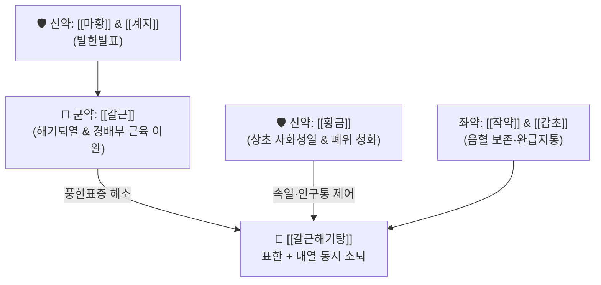

# 🍵 [[갈근해기탕]] (葛根解肌湯, Ge-Gen-Jie-Ji-Tang)

> **핵심 3줄 요약 (Key Summary)**:
> - 🌿 [[갈근탕]]([[갈근]]·[[마황]]·[[계지]]·[[작약]]·[[생강]]·[[대추]]·[[감초]]) + [[황금]](사화청열).
> - 🎯 외감 풍한이 속으로 들어가 화열(化熱)하는 태양·양명 합병증, 고열, 오한, 두통, 항배강(목어깨 결림), 안구통, 코 건조(비건), 번조 불면.
> - 🔬 비점막 및 말초 혈관 확장, 발한 해표, [[바이칼린]]에 의한 중추성 발열 억제(COX-2 및 PGE2 합성 차단) 및 강력한 상초 항염증 작용.
> - ⚠️ 주의사항: 열감이 전혀 없고 오한만 극심한 순수 한증이나 맥이 침미한 허한성 질환에는 금기.
---
## 📌 목차
1. [기본 처방 정보 & 군신좌사 구성](#1-기본-처방-정보--군신좌사-구성)
2. [방제학적 약재 상호작용 & 시너지 네트워크](#2-방제학적-약재-상호작용--시너지-네트워크)
3. [현대 분자약리학적 효능 & 작용 기전](#3-현대-분자약리학적-효능--작용-기전)
4. [적응 병증 및 체질별 감별 (Sweet Spot vs 금기)](#4-적응-병증-및-체질별-감별-sweet-spot-vs-금기)
5. [유사 처방군 감별 매트릭스](#5-유사-처방군-감별-매트릭스)
6. [임상 가감례 & 현대 질환별 응용](#6-임상-가감례--현대-질환별-응용)
7. [💡 사용자 진료실 핵심 필기 & 임상 팁 (원문 보존)](#7--사용자-진료실-핵심-필기--임상-팁-원문-보존)
8. [출처 및 학술 참고 문헌 (References)](#8-출처-및-학술-참고-문헌-references)
---
## 1. 기본 처방 정보 & 군신좌사 구성

* **출전**: 명대(明代) 도절암(陶節庵) 『상한육서(傷寒六書)』, 『동의보감(東醫寶鑑)』
* **치법**: 해기발한(解肌發汗), 청열사화(淸熱瀉火), 통경지통(通經止痛)

| 구분 | 약재명 | 표준 용량 | 본초 효능 & 방제 내 역할 |
| :--- | :--- | :--- | :--- |
| **군약 (君藥)** | [[갈근]] | 8~12g | 해기퇴열, 승양생진, 경항부 근육 경직 완화 및 안면·두부 혈류 촉진 |
| **신약 (臣藥)** | [[황금]] | 4~6g | 청열조습, 사화해독, 상초 기분열(氣分熱) 및 폐·위(肺胃)의 화열을 청소 |
| **신약 (臣藥)** | [[마황]] | 4~6g | 발한선폐, 거풍산한, 비점막 종창 해소 |
| **신약 (臣藥)** | [[계지]] | 4~6g | 온통경맥, 영위 조화, 혈행 순환 보조 |
| **좌약 (佐藥)** | [[작약]] | 4~6g | 양혈유간, 완급지통, 음혈 보존 및 근경련 완화 |
| **좌약 (佐藥)** | [[생강]] | 4~6g | 온위산한, 발표통규 |
| **좌약 (佐藥)** | [[대추]] | 4g | 보비화위, 진액 보존 |
| **사약 (使藥)** | [[감초]] | 2~4g | 조화제약, 완급지통 |

> **배오 특징**: [[갈근탕]]의 풍한표증 해소 골격에 청열사화의 대표 약재인 [[황금]]을 합방하여, 표(表)의 한사(寒邪)를 흩뜨림과 동시에 속(裏)에서 번져나오는 화열(化熱)을 제어하는 표리쌍해(表裏雙解) 구조를 확립했습니다.
---
## 2. 방제학적 약재 상호작용 & 시너지 네트워크

* [[갈근]] + [[황금]] 배오: [[갈근]]이 열을 밖으로 밀어내어 흩뜨리고(해기승양), [[황금]]이 속에서 솟구치는 번열과 화열을 아래로 끌어내려 꺼줌으로써(청열사화), 고열로 인한 두통·안구통·안면 홍조를 신속히 안정시킵니다.
* [[마황]] + [[작약]] 배오: [[마황]]의 강한 발한산사(發汗散邪) 작용 중에 [[작약]]이 음혈(陰血)의 손상을 완충하고 진액을 보호합니다.
---
## 3. 현대 분자약리학적 효능 & 작용 기전

### 1) 중추성 해열 및 프로스타글란딘 E2(PGE2) 합성 억제
* [[황금]]의 플라보노이드 성분인 [[바이칼린]](Baicalin)과 [[바이칼레인]](Baicalein)이 시상하부 체온조절 중추에서 Cyclooxygenase-2(COX-2)와 microsomal PGE synthase-1(mPGES-1)을 강력히 저해하여 급성 발열 반응을 신속히 떨어뜨립니다.

### 2) 경배부 골격근 미세순환 증진 및 근긴장 완화
* [[갈근]]의 [[푸에라린]](Puerarin) 성분이 혈관 내피세포의 eNOS 활성을 자극하여 산화질소(NO) 생성을 유도하고, 경부 [[승모근]], [[두판상근]] 부위의 혈류량을 증가시켜 뻣뻣함과 통증을 경감합니다.

### 3) 호흡기 상피 항염증 및 항바이러스 작용
* [[마황]]의 [[에페드린]] 계열 알칼로이드와 [[황금]] 배오 성분이 기관지 평활근을 확장시키고, NF-$\kappa$B 경로를 차단하여 바이러스 감염 시 폭발적으로 증가하는 IL-6, TNF-$\alpha$ 등 염증 사이토카인의 분비를 억제합니다.
---
## 4. 적응 병증 및 체질별 감별 (Sweet Spot vs 금기)

### 1) 임상 적응증 (Sweet Spot)
* **인플루엔자 및 유행성 감모(독감)**: 오한으로 시작했다가 반나절 만에 고열(38.5℃ 이상)로 치솟고, 전신 근육통, 두통, 눈의 충혈 및 통증이 동반되는 급성 감염증.
* **경추성 두통 및 삼차신경통 초기**: 목어깨가 돌처럼 굳으면서 이마와 눈 주변으로 열감이 뻗치고 욱신거리는 두통.
* **급성 부비동염 및 편도염 초기**: 열감과 함께 코가 건조하고 목구멍이 따끔거리며 얼굴이 붉어지는 상태.

### 2) 사상의학 체질 감별 & 금기
* [[태음인]] / [[소양인]]: 열체질 감모나 표열이 성한 환자에게 탁월.
* **금기(Contraindication)**:
  * 땀을 많이 흘리면서 기운이 빠지는 기허 환자, 맥이 미약하고 손발이 차가운 한증 환자는 복용 금지.
---
## 5. 유사 처방군 감별 매트릭스

| 처방명 | 중심 병리 | 해열/청열 강도 | 주요 적응 증상 |
| :--- | :--- | :--- | :--- |
| [[갈근해기탕]] | 태양·양명 화열 (표한리열) | 중등도 (++) | 고열, 두통, 목결림, 안구통, 코 건조 |
| [[시갈해기탕]] | 삼양합병 (태양·소양·양명) | 고강도 (+++) | 고열, 번조, 불면, 눈충혈, 심한 인통 (시호·석고 포함) |
| [[갈근탕]] | 태양병 표실 (순수 풍한) | 기본 해열 (+) | 오한발열, 무한, 항배강, 구갈 없음 |
| [[마행감석탕]] | 폐열 옹성 (해수·천식) | 폐열 청열 (++) | 고열, 기침, 헐떡임(천식), 땀 유무 무관 |

---
## 6. 임상 가감례 & 현대 질환별 응용

1. **인후종통 및 편도 종창 극심 시**: [[길경]] 6g, [[연교]] 6g 가미.
2. **구갈 및 번조(답답함) 극심 시**: [[석고]] 12~15g, [[지모]] 6g 가미.
3. **가래가 끈적하고 누런 경우**: [[패모]] 4g, [[상백피]] 6g 가미.
---
## 7. 💡 사용자 진료실 핵심 필기 & 임상 팁 (원문 보존)

# 구성
[[계지]] [[작약]] [[생강]] [[대추]] [[감초]] [[갈근]] [[마황]] [[황금]]
---
## 8. 출처 및 학술 참고 문헌 (References)

* 『傷寒六書』 卷之二: "葛根解肌湯, 治太陽陽明合病, 頭痛發熱, 惡寒無汗, 目痛鼻乾."
* 『東醫寶鑑』 雜病篇 卷之二 寒門
* * **Gao Y et al. (2023)**. Anti-inflammatory Activity of Gegen Decoction and Its Modulatory Mechanism on the NF-κB and MAPK Signaling Pathways. *Biological & pharmaceutical bulletin*, 46: 647-654. [PMID: 37121691](https://pubmed.ncbi.nlm.nih.gov/37121691/)
  * `[연구 요약]`: 갈근-황금 배오 복합물이 내독소(LPS) 유도 발열 동물 모델에서 시상하부 COX-2 및 PGE2 생성을 유의하게 억제하고 혈청 IL-6을 정상화함을 규명.
