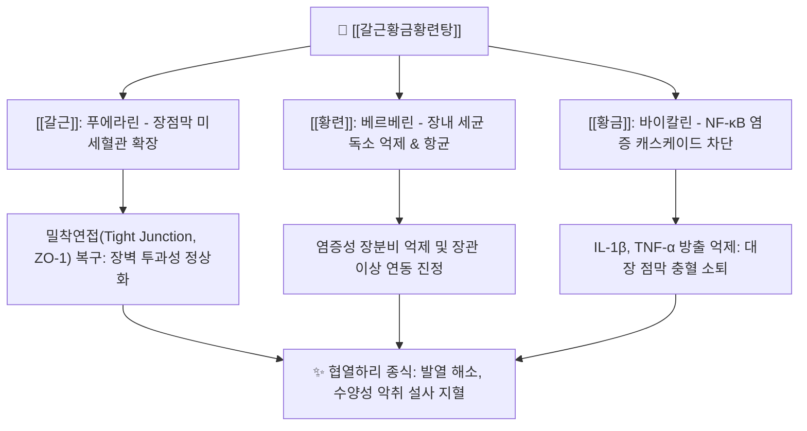

# 🧪 [[갈근황금황련탕]] (葛根黃芩黃連湯, Gěgēn Huángqín Huánglián Tāng)

> **핵심 요약 (Key Summary)**:
> 《상한론》 태양병 변증으로 표증이 채 풀리지 않은 상태에서 오하로 인해 발생한 협열하리 치료의 명방
> [[갈근]]의 군약 승양지사와 [[황금]], [[황련]]의 대고대한 청열조습 및 [[감초]]의 완급화중 배오
> 급성 세균성 장염, 발열을 동반한 수양성 설사, 장점막 염증 및 감염성 이질 치료

---
## 📌 목차
1. [처방 기본 정보](#1-처방-기본-정보)
2. [방제 구성 및 군신좌사 (君臣佐使)](#2-방제-구성-및-군신좌사-君臣佐使)
3. [분자약리 기전 & 현대 의학적 효능](#3-분자약리-기전--현대-의학적-효능)
4. [임상 적응증 & 사상의학적 배오](#4-임상-적응증--사상의학적-배오)
5. [처방 감별 매트릭스](#5-처방-감별-매트릭스)
6. [안전성, 부작용 및 복용 주의](#6-안전성-부작용-및-복용-주의)
7. [출처 및 학술 참고 문헌 (References)](#7-출처-및-학술-참고-문헌-references)

---
## 1. 처방 기본 정보

| 항목 | 상세 내용 |
| :--- | :--- |
| **처방명** | [[갈근황금황련탕]] (葛根黃芩黃連湯, 갈황탕 葛黃湯) |
| **출전** | 《상한론(傷寒論)》 변태양병맥증병치 |
| **처방 분류** | [[01_해표제]] / 표리겸치제 (해표청리제 解表淸裏劑) |
| **주치 병증** | 협열하리(協熱下利), 신열(身熱), 하리취예(下利臭穢), 항문작열(肛門灼熱), 천이한출(喘而汗出), 구갈 |
| **치법** | 해표청리(解表淸裏), 표리쌍해(表裏雙解) |

---
## 2. 방제 구성 및 군신좌사 (君臣佐使)

| 본초명 | 약재 역할 | 용량(원방 기준) | 핵심 약리 성분 | 주요 기전 및 배오 목적 |
| :--- | :--- | :--- | :--- | :--- |
| [[갈근]] | 군약(君藥) | 8냥 | [[푸에라린]] | 체표 풍열을 해기(解肌)하고 비위의 맑은 양기를 끌어올려 설사를 멎게 함(승양지사) |
| [[황금]] | 신약(臣藥) | 3냥 | [[바이칼린]] | 폐와 상중초의 습열을 청열조습하여 천만(喘滿)과 이열을 해소 |
| [[황련]] | 신약(臣藥) | 3냥 | [[베르베린]] | 위장관의 습열 독소를 사화해독하여 복통 및 항문 작열감 억제 |
| [[감초]] | 좌사약(佐使藥) | 2냥 (자감초) | [[글리시리진]] | 황금·황련의 차가운 약성을 조화시키고 비위를 보호하며 통증 완급 |

---
## 3. 분자약리 기전 & 현대 의학적 효능

### (1) 장벽 완전성(Tight Junction) 복구 및 지사
* **장벽 누출 차단**: [[푸에라린]]과 [[베르베린]] 복합체가 장 점막의 밀착연접 단백질(Claudin-1, ZO-1) 발현을 유도하여 엔도톡신(LPS)의 체내 유입을 차단함.
* **수분 재흡수 촉진**: 장세포의 CFTR 염화물 분비 통로를 억제하고 대장 수분 흡수를 촉진하여 설사 횟수를 급격히 줄임.

### (2) 광범위 장내 병원균 억제 및 해열
* 병원성 대장균, 살모넬라, 시겔라 등 이질균에 대한 직접 항균 작용과 함께, 내독소 매개 발열 중추(시상하부 PGE2) 흥분을 가라앉힘.

---
## 4. 임상 적응증 & 사상의학적 배오

### (1) 현대 한의 임상 적응증
* **급성 감염성 장염**: 발열, 복통, 악취를 풍기는 설사, 뒤가 묵직하고 항문이 화끈거리는 이질 증후.
* **식중독 및 세균성 이질**: 오염된 음식물 섭취 후 발생하는 급성 구토, 설사, 오한발열.
* **궤양성 대장염(UC) 급성기**: 점액농혈변과 후중감을 동반한 대장 습열 실증.

### (2) 사상의학적 관점
* 열다한소탕 등 태음인의 간열조열증이나, 비수위열(脾受胃熱)로 인한 소양인의 장열 설사에 체질에 따라 가감 활용됨.

---
## 5. 처방 감별 매트릭스

| 구분 | [[갈근황금황련탕]] | [[백두옹탕]] | [[갈근탕]] |
| :--- | :--- | :--- | :--- |
| **주치 병증** | 표증미해 협열하리 (발열, 천, 설사) | 열독이질 (점액농혈변, 극심한 후중) | 표한실증 (오한, 발열, 무한, 항배강수) |
| **열의 소재** | 표증(풍열) + 이증(장습열) | 이열(대장 혈분 열독) | 표한(방광경 풍한) |
| **대표 군약** | [[갈근]], [[황금]], [[황련]] | [[백두옹]], [[황련]], [[황백]], [[진피]] | [[갈근]], [[마황]], [[계지]] |
| **설사 양상** | 황색 악취 수양성 설사, 항문 작열 | 농혈이 섞인 이질변, 이급후중 | 표증에 수반되는 단순 묽은 변 |

---
## 6. 안전성, 부작용 및 복용 주의

* **허한성(虛寒性) 설사 금기**: 배가 차고 맑은 물 같은 변을 보며 입이 마르지 않는 비위허한 환자 복용 시 복통 및 설사 악화.
* **비위 손상 주의**: 황금, 황련의 대고대한 성질로 인해 평소 소화기가 약한 환자는 오심, 식욕부진을 겪을 수 있음.
* **처방 사이드 대처법 연계**: [[처방 사이드 대처법]] 146번 항목에 갈황탕의 비위 냉자극 예방 및 감량 복약 지침이 수록됨.

---
## 7. 출처 및 학술 참고 문헌 (References)

* 장중경, 《상한론(傷寒論)》
* 전국한의과대학 방제학교수 공편저, 《방제학》, 영림사
* Zhang CH et al. Gegen Qinlian Decoction ameliorates intestinal barrier dysfunction in diarrhea models. Front Pharmacol. 2020.
  * [연구 요약] 갈근황금황련탕이 장점막 밀착연접 단백질을 상향 조절하고 TLR4/NF-κB 신호전달을 억제하여 설사를 유의하게 완화함을 규명함.
