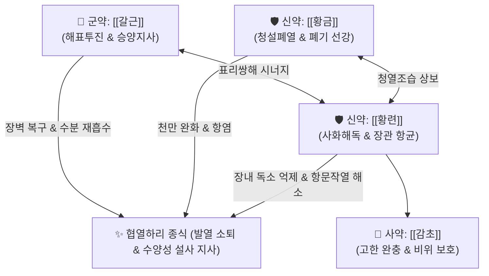

# 🍵 [[갈근황금황련탕]] (葛根黃芩黃連湯, Ge-Gen-Huang-Qin-Huang-Lian-Tang / Gegen Qinlian Decoction)

> **핵심 3줄 요약 (Key Summary)**:
> - 🌿 [[갈근]], [[황금]], [[황련]], [[감초]] 배오 (체표 풍열을 푸는 승양지사의 [[갈근]]과 장위의 습열을 식히는 [[황금]]·[[황련]]을 결합한 대표 표리쌍해·해표청리 방제).
> - 🎯 외감 표증이 채 풀리지 않은 상태에서 오하(誤下)로 인해 발생한 협열하리(協熱下利), 발열과 함께 악취 나는 물설사, 항문 작열감, 숨참(천 喘)을 동반한 급성 장염·세균성 이질.
> - 🔬 [[푸에라린]]·[[베르베린]]의 장점막 밀착연접(Tight Junction, ZO-1) 복구 및 장벽 투과성 정상화, [[바이칼린]]의 TLR4/NF-κB 염증 캐스케이드 차단.
> - ⚠️ 주의사항: 배가 차고 소화되지 않은 묽은 변을 보는 비위허한(脾胃虛寒) 설사 금기, 장기 복용 시 황금·황련의 고한(苦寒)성으로 인한 비위 손상 주의.
---
## 📌 목차
1. [기본 처방 정보 & 군신좌사 구성](#1-기본-처방-정보--군신좌사-구성)
2. [방제학적 약재 상호작용 & 시너지 네트워크](#2-방제학적-약재-상호작용--시너지-네트워크)
3. [현대 분자약리학적 효능 & 작용 기전](#3-현대-분자약리학적-효능--작용-기전)
4. [적응 병증 및 체질별 감별 (Sweet Spot vs 금기)](#4-적응-병증-및-체질별-감별-sweet-spot-vs-금기)
5. [유사 처방군 감별 매트릭스](#5-유사-처방군-감별-매트릭스)
6. [임상 가감례 & 현대 질환별 응용](#6-임상-가감례--현대-질환별-응용)
7. [💡 사용자 진료실 핵심 필기 & 임상 팁 (원문 보존)](#7--사용자-진료실-핵심-필기--임상-팁-원문-보존)
8. [출처 및 학술 참고 문헌 (References)](#8-출처-및-학술-참고-문헌-references)
---
## 1. 기본 처방 정보 & 군신좌사 구성

* **출전**: 장중경(張仲景) 『[[상한론]]』 변태양병맥증병치(辨太陽病脈證竝治)
* **치법**: 해표청리(解表淸裏), 표리쌍해(表裏雙解), 청열조습(淸熱燥濕), 승양지사(升陽止瀉)

| 구분 | 약재명 | 표준 용량 | 본초 효능 & 방제 내 역할 |
| :--- | :--- | :--- | :--- |
| **군약 (君藥)** | [[갈근]] | 15~24g (원방 8냥) | 해기퇴열(解肌退熱), 승양지사(升陽止瀉), 체표 풍열을 흩고 맑은 양기를 올려 설사를 멎게 함 |
| **신약 (臣藥)** | [[황금]] | 9~12g (원방 3냥) | 청열조습(淸熱燥濕), 사폐열, 폐와 상·중초의 습열을 꺼서 천만(喘滿)과 이열을 해소 |
| **신약 (臣藥)** | [[황련]] | 9~12g (원방 3냥) | 사화해독(瀉火解毒), 조습지리(燥濕止痢), 위장관의 습열 독소를 청설하여 복통·항문작열감 차단 |
| **사약 (使藥)** | [[감초]] | 6g (자감초) | 완급화중(緩急和中), 조화제약, 황금·황련의 맹렬한 고한성을 완충하고 비위 손상 방지 |

> **배오 특징**: 표증(表證)의 열을 푸는 [[갈근]]을 군약으로 삼아 대량 사용하면서, 이열(裏熱)을 끄는 고한약인 [[황금]]과 [[황련]]을 신약으로 배오하여 **"겉의 표열과 안의 장열을 동시에 한 번에 털어내는 표리쌍해(表裏雙解)"**의 방제학적 금자탑입니다.
---
## 2. 방제학적 약재 상호작용 & 시너지 네트워크

* [[갈근]] + [[황련]] 배오: 갈근의 승양(위로 올림)과 황련의 강심사화(아래로 내림)가 결합되어 장관의 수액 승강 실조를 바로잡습니다.
* [[황금]] + [[황련]] 배오: 대소장을 아우르는 습열 청설의 절대 배오입니다.
---
## 3. 현대 분자약리학적 효능 & 작용 기전

### 1) 장점막 밀착연접(Tight Junction) 복구 및 장벽 완전성 정상화
* [[푸에라린]](Puerarin)과 [[베르베린]](Berberine) 복합물이 장 점막 상피세포의 Claudin-1, ZO-1 단백질 발현을 촉진하여 장 누수 증후군(Leaky Gut)을 차단하고 LPS 엔도톡신의 체내 유입을 방어합니다.

### 2) 대장 수분 분비 억제 및 항균 지사 작용
* 장세포의 CFTR 염화물 분비 통로를 억제하고 수분 흡수를 촉진하여 수양성 설사 횟수를 급감시킵니다.
* 병원성 대장균, 살모넬라균, 이질균(Shigella) 증식을 직접 억제합니다.

### 3) TLR4/NF-κB 염증 캐스케이드 차단
* [[황금]]의 [[바이칼린]](Baicalin)이 대식세포의 TLR4 신호전달을 차단하여 염증성 사이토카인(TNF-α, IL-1β, IL-6) 방출을 억제합니다.
---
## 4. 적응 병증 및 체질별 감별 (Sweet Spot vs 금기)

[✅ 최적 적응증 (Sweet Spot)]
• 상한론 조문: "태양병, 계지증, 의반하지, 이기불해, 맥촉자, 표미해야, 천이한출자, 갈근황금황련탕주지."
• 체질 소견: 평소 몸에 열이 많고 건실하며 기름진 음식을 즐기는 태음인(열다한소탕 체질) 및 소양인
• 임상 주치: 감기 초기 땀을 내지 않고 설사약을 잘못 써서 표열이 속으로 기어들어가, 몸에 미열이 지속되면서 냄새가 고약한 황색 물설사를 쏟아내고 땀이 나면서 숨이 찰 때
• 급성 세균성 감염성 장염, 식중독 초기, 장형 감모(Summer Cold with Diarrhea)
• 설진/맥진: 설홍(舌紅), 황니태(黃膩苔), 맥촉(脈促) 또는 맥활삭(脈滑數)

[⚠️ 신중 투여 및 금기 (Caution / Contraindication)]
• 비위허한(脾胃虛寒)성 설사: 배가 얼음장처럼 차고 맑은 물설사를 쏟으며 갈증이 없는 환자 금기 ([[이중탕]], [[사역탕]] 적용)
• 만성 쇠약자: 고한약인 황금, 황련이 비위를 상하게 할 수 있으므로 장기 연복 금지
---
## 5. 유사 처방군 감별 매트릭스

| 처방명 | 핵심 구성 차이 | 열의 소재 및 주치 | 설사 및 대변 양상 | 맥진/설진 차이 |
| :--- | :--- | :--- | :--- | :--- |
| [[갈근황금황련탕]] | [[갈근]], [[황금]], [[황련]], [[감초]] | **표열 + 장습열 (협열하리, 발열, 숨참)** | **악취 나는 황색 물설사, 항문 작열감** | 맥촉(促) 또는 활삭, 황니태 |
| [[백두옹탕]] | [[백두옹]], [[황련]], [[황백]], [[진피]] | **대장 혈분 열독 (이질 실증)** | **고름과 피가 섞인 농혈변, 극심한 뒤묵직함(이급후중)** | 맥현삭(弦數), 설홍강황조태 |
| [[갈근탕]] | [[계지탕]] + [[갈근]], [[마황]] | **표한실증 (항배강수, 무한, 오한)** | **설사 없음 (또는 표증 초기 묽은 변)** | 맥부긴(浮緊), 박백태 |
| [[황련해독탕]] | [[황련]], [[황금]], [[황백]], [[치자]] | **삼초 대열 (설사 없음, 구갈, 섬어)** | **변비 또는 단순 열성 변** | 맥삭유력(數有力), 설홍황태 |
---
## 6. 임상 가감례 & 현대 질환별 응용

* **수반 증상별 가감법**:
  * 복통이 극심하고 장경련이 심할 때 $\rightarrow$ + [[백작약]], [[목향]]
  * 오심, 구토가 동반될 때 $\rightarrow$ + [[반하]], [[생강]]
  * 열독이 심하여 혈변 기운이 보일 때 $\rightarrow$ + [[백두옹]], [[지유]]
* **현대 질환 매핑**:
  * **급성 세균성 장염 및 식중독**: 살모넬라, 병원성 대장균 감염성 설사
  * **로타바이러스/노로바이러스 장염**: 발열과 설사가 동반되는 바이러스성 장염
  * **궤양성 대장염(UC) 급성 악화기**: 대장 점막 염증과 뒤묵직함 완화
---
## 7. 💡 사용자 진료실 핵심 필기 & 임상 팁 (원문 보존)

> [!tip] **진료실 실전 노하우 (User Clinical Insight)**
> - **"열나고 땀 흘리며 숨차고 똥 냄새가 진동하는 설사를 좍좍 쏟을 때" 쓰는 표리쌍해의 절대 표준방**
> - 감기 초기에 사하제를 잘못 썼거나, 여름철 상한 음식을 먹고 열과 함께 쏟아지는 설사에 즉효
> - 탕전 시 비위 손상을 막기 위해 감초를 반드시 자감초로 배오하며, 속이 찰 경우 복용 후 따뜻한 생강차를 곁들임
> - 처방 부작용 상세 대처는 [[처방 사이드 대처법]] 146번 항목을 참조한다.
---
## 8. 출처 및 학술 참고 문헌 (References)

1. **Zhang, C. H. et al. (2020)**. *Gegen Qinlian Decoction ameliorates intestinal barrier dysfunction in diarrhea models*. **Frontiers in Pharmacology**, 11, 580.
   - **[연구 요약]**: 갈근황금황련탕이 장점막 밀착연접 단백질 발현을 상향 조절하고 TLR4/NF-κB 염증 신호를 차단하여 감염성 설사 및 장벽 누수를 유의하게 완화함을 규명.
2. **장중경 (200년경)**. 『[[상한론]]』.
   - **[고전 원전]**: "太陽病, 桂枝證, 醫反下之, 利遂不止, 脈促者, 表未解也, 喘而汗出者, 葛根黃芩黃連湯主之." (태양병 계지증에 의사가 반대로 사하하여 설사가 멎지 않고 맥이 촉하며 표증이 풀리지 않고 땀이 나며 숨이 찰 때 갈근황금황련탕으로 다스린다.)
3. **허준 (1613)**. 『[[동의보감]]』.
   - **[임상 문헌]**: 협열하리(協熱下利) 문(門)에서 표열과 이열이 겹친 급성 설사의 대표 치방으로 수록.