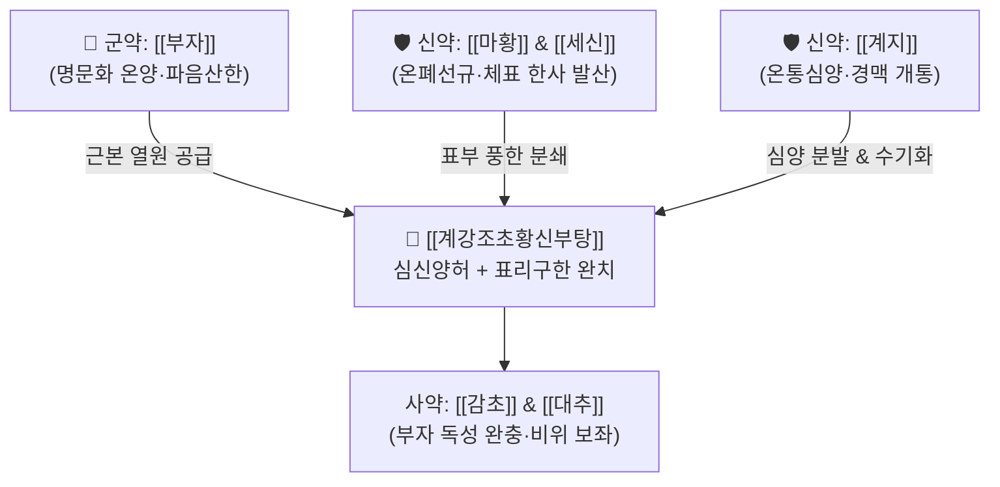

# 🍵 [[계강조초황신부탕]] (桂薑棗草黃辛附湯, Gui-Jiang-Zao-Cao-Huang-Xin-Fu-Tang)

> **핵심 3줄 요약 (Key Summary)**:
> - 🌿 [[계지탕]] 거작약([[계지]]·[[생강]]·[[대추]]·[[감초]]) + [[마황부자세신탕]]([[마황]]·[[부자]]·[[세신]]).
> - 🎯 심신양허(心腎陽虛) 환자의 외감 풍한, 표리구한증(表裏俱寒), 극심한 오한, 사지 냉통, 명치 밑 팽만·경결(심하견), 고령자 저체온 감모.
> - 🔬 심근 수축력 강화, 말초 미세순환 급속 회복, 교감신경계 활성화 및 체온 상승 유도, 중추·말초 신경병증 통증 차단.
> - ⚠️ 주의사항: [[부자]] 함유로 반드시 1시간 이상 선전(先煎)하여 독성을 가수분해해야 하며, 음허화왕(陰虛火旺) 및 진성 고혈압 환자는 금기.
---
## 📌 목차
1. [기본 처방 정보 & 군신좌사 구성](#1-기본-처방-정보--군신좌사-구성)
2. [방제학적 약재 상호작용 & 시너지 네트워크](#2-방제학적-약재-상호작용--시너지-네트워크)
3. [현대 분자약리학적 효능 & 작용 기전](#3-현대-분자약리학적-효능--작용-기전)
4. [적응 병증 및 체질별 감별 (Sweet Spot vs 금기)](#4-적응-병증-및-체질별-감별-sweet-spot-vs-금기)
5. [유사 처방군 감별 매트릭스](#5-유사-처방군-감별-매트릭스)
6. [임상 가감례 & 현대 질환별 응용](#6-임상-가감례--현대-질환별-응용)
7. [💡 사용자 진료실 핵심 필기 & 임상 팁 (원문 보존)](#7--사용자-진료실-핵심-필기--임상-팁-원문-보존)
8. [출처 및 학술 참고 문헌 (References)](#8-출처-및-학술-참고-문헌-references)
---
## 1. 기본 처방 정보 & 군신좌사 구성

* **출전**: 한대(漢代) 장중경(張仲景) 『금궤요략(金匱要略)』 수기병맥증병치(水氣病脈證幷治) (동의어: 계지거작약가마황부자세신탕 桂枝去芍藥加麻黃附子細辛湯)
  * "氣分, 心下堅, 大如盤, 邊如旋盤, 水飲所作, 桂枝去芍藥加麻黃附子細辛湯主之." (기분에 명치 밑이 단단하여 큰 쟁반만 하고 가장자리가 똬리를 튼 것 같은 것은 수음이 만든 것이니 계지거작약가마황부자세신탕이 주치한다.)
* **치법**: 온양보화(溫陽補火), 발한산한(發汗散寒), 온통경맥(溫通經脈), 화음소음(化飲消陰)

| 구분 | 약재명 | 표준 용량 | 본초 효능 & 방제 내 역할 |
| :--- | :--- | :--- | :--- |
| **군약 (君藥)** | [[부자]](포) | 4~6g | 온신회양(溫腎回陽), 파음산한, 명문화 쇠약 구제 및 전신 대사 열원 공급 |
| **신약 (臣藥)** | [[마황]] | 4~6g | 발한산한, 선폐이기, 체표의 한사를 밖으로 몰아냄 |
| **신약 (臣藥)** | [[세신]] | 2~4g | 온폐화음(溫肺化飲), 통규지통, 신양을 도와 경락 깊은 곳의 한음 제거 |
| **신약 (臣藥)** | [[계지]] | 6~9g | 온통심양(溫通心陽), 온경통맥, 기화수액 촉진 (작약의 수렴 방해 배제) |
| **좌약 (佐藥)** | [[생강]] | 6~9g | 온위화중, 발표산한, 수음 역류 억제 |
| **좌약 (佐藥)** | [[대추]] | 4~6g | 보비화위, 영위 조화, 진액 손상 방지 |
| **사약 (使藥)** | [[감초]] | 4~6g | 익기보중, [[부자]]·[[마황]]의 독성 및 급박성을 완충 조화 |

> **배오 특징**: 소음병 한증의 최고봉인 [[마황부자세신탕]](마황·부자·세신)에 [[계지탕]]에서 음혈을 수렴하는 작약을 뺀 '계강조초(계지·생강·대추·감초)'를 결합한 방제입니다. 작약을 뺌으로써 양기를 사방으로 뻗치게 하여 심양(心陽)과 신양(腎陽)을 동시 회복시키고, 명치 밑에 쟁반처럼 굳어진 냉적(冷積)과 수음을 분쇄합니다.
---
## 2. 방제학적 약재 상호작용 & 시너지 네트워크

* [[부자]] + [[마황]] + [[세신]] 배오: 소음병 표리구한을 다스리는 삼총사로, [[부자]]가 안에서 근본 열기를 돋우고, [[세신]]이 안팎을 매개하며, [[마황]]이 겉의 땀구멍을 열어 체내외에 갇힌 한습을 일거에 몰아냅니다.
* [[계지]] + [[생강]] 배오 (거작약): [[작약]]의 음성 수렴 작용을 배제하여 [[계지]]의 온통(溫通) 발산 기운을 극대화하고, [[생강]]과 함께 상초와 중초의 기기(氣機)를 소통시켜 명치 밑 묵직한 수음(심하견)을 해소합니다.
---
## 3. 현대 분자약리학적 효능 & 작용 기전

### 1) 심박출량 증가 및 심근 수축력 강화
* 포부자의 [[히게나민]](Higenamine) 및 벤조일아코닌 성분이 심근세포의 $\beta_1$-아드레날린 수용체를 활성화하여 심박출량을 증대시키고, 저체온 상태의 환자 순환계를 정상화합니다.

### 2) 말초 미세혈관 확장 및 체온 조절 중추 자극
* [[계지]]의 [[신남알데하이드]](Cinnamaldehyde)와 [[마황]]의 [[에페드린]] 성분이 교감신경 말단 노르에피네프린 분비를 조절하여 갈색지방세포의 열생성(Thermogenesis)을 자극하고 사지 말단 혈류를 재관류시킵니다.

### 3) 중추 및 말초 신경병증성 진통 억제
* [[세신]]의 메틸유제놀(Methyleugenol)과 [[부자]] 성분이 척수 후각 신경세포의 전압의존성 나트륨 통로를 차단하고, Substance P의 방출을 억제하여 극심한 냉통(Cold allodynia) 및 관절통을 진정시킵니다.
---
## 4. 적응 병증 및 체질별 감별 (Sweet Spot vs 금기)

### 1) 임상 적응증 (Sweet Spot)
* **고령자·만성 쇠약자의 감기**: 열은 높지 않은데 오한이 뼈속까지 파고들고, 손발이 얼음장 같으며, 기운이 하나도 없고 맥이 가라앉아 희미한 상태.
* **심하견(心下堅) 및 수기증**: 명치 밑이 단단하고 더부룩하여 소화가 전혀 안 되고, 가슴이 답답하며 가슴 아래에 물 차 있는 느낌이 드는 병증.
* **만성 한랭성 관절염 및 좌골신경통**: 찬바람을 쐬거나 날씨가 흐려지면 관절이 쑤시고 굳어 움직이기 힘든 중증 퇴행성 질환.

### 2) 사상의학 체질 감별 & 금기
* [[소음인]]: 선천적으로 양기가 허약하고 비신이 차가운 소음인에게 최고의 구급 방제.
* **금기(Contraindication)**:
  * 열증(얼굴 붉고, 갈증이 심하며, 혀가 붉고 태가 노란 환자)에는 절대 금기.
  * [[부자]] 독성 중독 우려가 있으므로 부정맥, 중증 간질환자는 극도로 주의.
---
## 5. 유사 처방군 감별 매트릭스

| 처방명 | 중심 병리 | 온양/발표 비율 | 핵심 적응증 |
| :--- | :--- | :--- | :--- |
| [[계강조초황신부탕]] | 심신양허 + 심하 수음 | 온양 6 : 발표 4 | 양허 감모, 심하견(명치 밑 쟁반 같은 경결), 전신 냉통 |
| [[마황부자세신탕]] | 소음병 표리구한 | 온양 5 : 발표 5 | 양허 환자의 급성 감기, 극심한 오한, 맥침미 |
| [[계지가출부탕]] | 표허 풍한습비 | 온양 4 : 거습 6 | 풍습비통, 관절 부종, 땀이 나면서 시린 관절통 |
| [[사역탕]] | 소음병 궐역 (망양) | 온양 10 : 발표 0 | 극심한 손발 차가움, 맥미욕절, 설사 (발표약 전혀 없음) |

---
## 6. 임상 가감례 & 현대 질환별 응용

1. **관절통 및 굴신불리가 극심한 경우**: [[창출]] 6g, [[우슬]] 6g을 가미하여 관절 수습을 몰아내고 활혈지통.
2. **복부 냉통 및 만성 설사 동반 시**: [[건강]] 4g, [[백출]] 6g 가미.
3. **만성 비염 및 맑은 콧물 과다 시**: [[신이]] 4g, [[백지]] 4g 가미.
---
## 7. 💡 사용자 진료실 핵심 필기 & 임상 팁 (원문 보존)

# 구성
[[마황]] [[부자]] [[세신]]/ [[계지]]

# 적응증
- 소음병 표리구한, 심신양허 환자의 외감 풍한.
---
## 8. 출처 및 학술 참고 문헌 (References)

* 『金匱要略』 水氣病脈證幷治: "氣分, 心下堅, 大如盤, 邊如旋盤, 水飲所作, 桂枝去芍藥加麻黃附子細辛湯主之."
