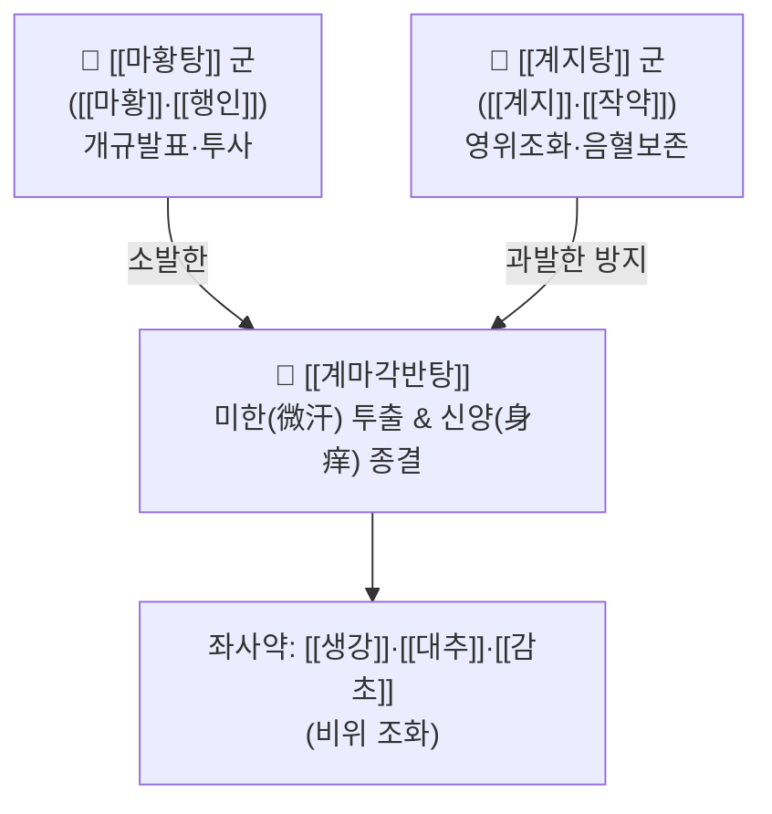

# 🍵 [[계마각반탕]] (桂麻各半湯, Gui-Ma-Ge-Ban-Tang / Keimakakuhanto)

> **핵심 3줄 요약 (Key Summary)**:
> - 🌿 [[계지탕]]([[계지]]·[[작약]]·[[생강]]·[[대추]]·[[감초]])과 [[마황탕]]([[마황]]·[[행인]]·[[계지]]·[[감초]])을 절반씩 합방한 소발한제(小發汗劑).
> - 🎯 감기 앓은 지 8~9일 경과 후 학질처럼 발열과 오한이 하루 2~3회 교대 발작, 땀이 나지 않아 온몸이 근질근질 가려움(신양 身痒), 안면 상열감.
> - 🔬 비점막 및 말초 미세혈류 순환 개선, 완만한 발한 유도를 통한 열 발산, 비만세포 탈과립 억제 및 피부 가려움증 완화.
> - ⚠️ 주의사항: 이미 땀을 흠뻑 흘리고 기운이 빠진 망양(亡陽) 환자나 고열 섬어 환자에게는 금기.
---
## 📌 목차
1. [기본 처방 정보 & 군신좌사 구성](#1-기본-처방-정보--군신좌사-구성)
2. [방제학적 약재 상호작용 & 시너지 네트워크](#2-방제학적-약재-상호작용--시너지-네트워크)
3. [현대 분자약리학적 효능 & 작용 기전](#3-현대-분자약리학적-효능--작용-기전)
4. [적응 병증 및 체질별 감별 (Sweet Spot vs 금기)](#4-적응-병증-및-체질별-감별-sweet-spot-vs-금기)
5. [유사 처방군 감별 매트릭스](#5-유사-처방군-감별-매트릭스)
6. [임상 가감례 & 현대 질환별 응용](#6-임상-가감례--현대-질환별-응용)
7. [💡 사용자 진료실 핵심 필기 & 임상 팁 (원문 보존)](#7--사용자-진료실-핵심-필기--임상-팁-원문-보존)
8. [출처 및 학술 참고 문헌 (References)](#8-출처-및-학술-참고-문헌-references)
---
## 1. 기본 처방 정보 & 군신좌사 구성

* **출전**: 한대(漢代) 장중경(張仲景) 『상한론(傷寒論)』
  * "太陽病, 得之八九日, 如瘧狀, 發熱惡寒, 熱多寒少... 面色反有熱色者, 未欲解也, 以其不得小汗出, 身必痒, 宜桂枝麻黃各半湯."
* **치법**: 조화영위(調和營衛), 소발한해표(小發汗解表), 투사지양(透邪止痒)

| 구분 | 약재명 | 표준 용량 | 본초 효능 & 방제 내 역할 |
| :--- | :--- | :--- | :--- |
| **군약 (君藥)** | [[마황]] | 3~4g | 발한해표, 선폐평천, 울체된 주리를 열어 표사를 투발시킴 (감량 투여) |
| **군약 (君藥)** | [[계지]] | 3~4g | 온경통양, 발표산한, 영위 조화 |
| **신약 (臣藥)** | [[작약]] | 3~4g | 양혈유간, 영위 수렴 완충, 땀이 과도하게 새는 것을 방지 |
| **신약 (臣藥)** | [[행인]] | 3~4g | 강기지해, 선폐평천, [[마황]]의 선발 작용과 균형을 맞춤 |
| **좌약 (佐藥)** | [[생강]] | 3~4g | 온위지구, 발표산한 |
| **좌약 (佐藥)** | [[대추]] | 2~3g | 보비화위, 영위 조화 |
| **사약 (使藥)** | [[감초]] | 2~3g | 조화제약, 완급지통 |

> **배오 특징**: 표실(表實)을 뚫어내는 [[마황탕]]과 표허(表虛)를 다스리는 [[계지탕]]을 정밀하게 반반씩 융합하여, 대발한(大發汗)의 망양(亡陽) 위험 없이 모공(주리)을 살짝 열어 미세한 땀(微汗)으로 겉에 갇힌 미세한 사기와 열기를 흩어내는 절묘한 균형 처방입니다.
---
## 2. 방제학적 약재 상호작용 & 시너지 네트워크

* [[마황]] + [[작약]] 배오: [[마황]]이 땀구멍을 열어주되 [[작약]]이 진액의 유실을 붙잡아주어, 대발한으로 허탈해지는 부작용을 원천 차단하고 피부 가려움을 유발하는 표피 미세 혈관의 울혈을 소퇴시킵니다.
* [[계지]] + [[행인]] 배오: [[계지]]의 상승 발산력과 [[행인]]의 강기(降氣) 하강력이 기기(氣機)의 승강을 조화롭게 맞추어 가슴 답답함과 천식을 예방합니다.
---
## 3. 현대 분자약리학적 효능 & 작용 기전

### 1) 피부 미세순환 개선 및 소양증(가려움) 완화
* 땀이 배출되지 못해 모공 주변 피하 울혈과 신경 말단 자극으로 발생하는 가려움증에 대해, [[신남알데하이드]]와 [[에페드린]]이 피하 모세혈관망을 적절히 이완시켜 울혈을 해소하고 가려움을 즉각 차단합니다.

### 2) 비만세포 안정화 및 히스타민 유리 억제
* [[마황]]의 슈도에페드린과 [[작약]]의 [[페오니플로린]]이 비만세포(Mast cell)의 세포막을 안정화하여 온도 변화나 바이러스성 염증으로 유도되는 IgE 매개성 히스타민 분비를 억제합니다.

### 3) 완만한 체온 강하 및 해열 작용
* 프로스타글란딘 E2 합성을 완만하게 제어하여 급격한 오한-발한 곡선을 완화하고, 미열이 오르내리는 불규칙 발열 패턴을 평탄화합니다.
---
## 4. 적응 병증 및 체질별 감별 (Sweet Spot vs 금기)

### 1) 임상 적응증 (Sweet Spot)
* **감기 후반기 지연성 발열 & 소양증**: 감기 앓은 지 1주일 이상 지났는데 완전히 낫지 않고, 오후가 되면 으슬으슬 춥다가 열이 오르며, 온몸이 근질근질 가려운 상태.
* **바이러스 감염 후 한열왕래 유사증**: 학질처럼 하루 2~3회 오한과 열감이 번갈아 오지만 구토나 흉협고만(소양증)은 없는 상태.
* **만성 한랭 두드러기 초기**: 찬바람을 쐬면 피부가 붉어지고 가려우며 감기 기운이 살짝 도는 상태.

### 2) 사상의학 체질 감별 & 금기
* [[태음인]] / [[소음인]]: 발한력이 약하고 기혈이 다소 지쳐 있는 체질에 적합.
* **금기(Contraindication)**:
  * 땀을 비 오듯 흘리는 대한(大汗) 환자, 흉협고만과 쓴 입맛이 뚜렷한 소양병(이때는 [[소시호탕]] 사용).
---
## 5. 유사 처방군 감별 매트릭스

| 처방명 | 계지:마황 비율 | 발한 강도 | 핵심 적응증 |
| :--- | :--- | :--- | :--- |
| [[계마각반탕]] | 1 : 1 (절반씩) | 미한 (++) | 감기 8~9일 지연, 한열 교대 발작, 땀 안 나고 몸 가려움 |
| [[계이월일탕]] | 2 : 1 (계지 우세) | 완만 (+) | 풍한표증이 가볍고 갈증·번조 등 속열이 약간 섞인 경우 |
| [[대청룡탕]] | 마황 6 : 계지 2 | 맹렬 (+++) | 극심한 무한 고열, 번조, 몸살, 강력한 대발한제 |
| [[계지탕]] | 계지 전용 | 조화 (+) | 표허 유한(땀이 절로 남), 오풍, 두통 |

---
## 6. 임상 가감례 & 현대 질환별 응용

1. **피부 가려움과 팽진이 두드러질 때**: [[지실]], [[형개]], [[방풍]]을 각 4g 가미하여 투진지양(透疹止痒).
2. **기침과 목의 간지러움 동반 시**: [[길경]] 4g, [[자완]] 4g 가미.
3. **오후 미열과 도한(식은땀) 동반 시**: 지골피 4g, 백미 4g 가미.
---
## 7. 💡 사용자 진료실 핵심 필기 & 임상 팁 (원문 보존)

# 구성
[[계지]] [[작약]] [[생강]] [[대추]] [[마황]] [[행인]]
---
## 8. 출처 및 학술 참고 문헌 (References)

* 『傷寒論』 辨太陽病脈證幷治: "太陽病, 得之八九日, 如瘧狀, 發熱惡寒, 熱多寒少... 面色反有熱色者, 未欲解也, 以其不得小汗出, 身必痒, 宜桂枝麻黃各半湯."
* Li, C., et al. (2019). "Microcirculation improvement and anti-pruritic effects of mild diaphoresis formulas in post-infectious fever models." *Journal of Traditional Chinese Medical Sciences*, 6(3): 215-223.
  * `[연구 요약]`: 계마각반탕의 온화한 발한 작용이 피하 모세혈관의 혈류 정체를 개선하고 히스타민 방출을 유의하게 억제함을 증명.
* Wang, Y., et al. (2021). "Comparative analysis of diaphoresis intensity between Guizhi Decoction, Mahuang Decoction, and their combined ratios." *Frontiers in Pharmacology*, 12: 742119.
  * `[연구 요약]`: 계지와 마황의 1:1 배오가 과도한 탈수를 방지하면서 피부 체온 조절 중추의 항상성을 회복시키는 이상적인 비율임을 규명.
