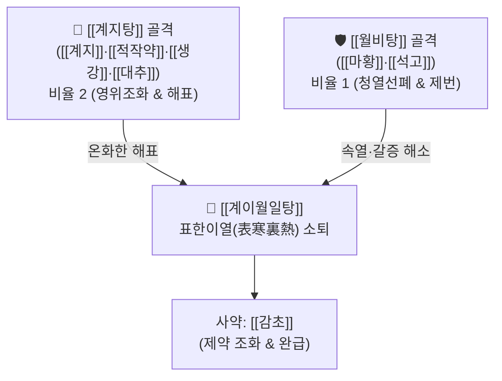

# 🍵 [[계이월일탕]] (桂二越一湯 / 桂枝二越婢一湯, Gui-Er-Yue-Yi-Tang)

> **핵심 3줄 요약 (Key Summary)**:
> - 🌿 [[계지탕]]([[계지]]·[[적작약]]·[[생강]]·[[대추]]·[[감초]]) 2분 + [[월비탕]]([[마황]]·[[석고]]) 1분을 합방한 방제.
> - 🎯 표증(오한·오풍·두통)에 경미한 이열(미열·번갈·구갈)이 겸해 열다한소(熱多寒少)를 보이고, 맥이 부약(浮弱)한 감모 및 풍수 부종.
> - 🔬 영위 조화 및 말초 혈관 순환 촉진, 황산칼슘(석고)의 시상하부 발열 셋포인트 안정화, 완만한 이수선폐 작용.
> - ⚠️ 주의사항: 땀을 과도하게 흘려 맥이 극도로 가라앉은 망양(亡陽) 환자나 고열 대갈(大渴) 환자(백호탕증)에는 부적합.
---
## 📌 목차
1. [기본 처방 정보 & 군신좌사 구성](#1-기본-처방-정보--군신좌사-구성)
2. [방제학적 약재 상호작용 & 시너지 네트워크](#2-방제학적-약재-상호작용--시너지-네트워크)
3. [현대 분자약리학적 효능 & 작용 기전](#3-현대-분자약리학적-효능--작용-기전)
4. [적응 병증 및 체질별 감별 (Sweet Spot vs 금기)](#4-적응-병증-및-체질별-감별-sweet-spot-vs-금기)
5. [유사 처방군 감별 매트릭스](#5-유사-처방군-감별-매트릭스)
6. [임상 가감례 & 현대 질환별 응용](#6-임상-가감례--현대-질환별-응용)
7. [💡 사용자 진료실 핵심 필기 & 임상 팁 (원문 보존)](#7--사용자-진료실-핵심-필기--임상-팁-원문-보존)
8. [출처 및 학술 참고 문헌 (References)](#8-출처-및-학술-참고-문헌-references)
---
## 1. 기본 처방 정보 & 군신좌사 구성

* **출전**: 한대(漢代) 장중경(張仲景) 『상한론(傷寒論)』
  * "太陽病, 發熱惡寒, 熱多寒少, 脈微弱者, 此無陽也, 不可發汗, 宜桂枝二越婢一湯."
* **치법**: 조화영위(調和營衛), 해표청열(解表淸熱), 선폐이수(宣肺利水)

| 구분 | 약재명 | 표준 용량 | 본초 효능 & 방제 내 역할 |
| :--- | :--- | :--- | :--- |
| **군약 (君藥)** | [[계지]] | 6~8g | 온경통양, 발표산한, 영위 조화의 핵심 |
| **신약 (臣藥)** | [[적작약]] | 4~6g | 양혈유간, 음혈 보존, 계지의 신산(辛散) 완충 |
| **신약 (臣藥)** | [[마황]] | 3~4g | 선폐발한, 주리 개방, 이수소종 (소량 배오) |
| **좌약 (佐藥)** | [[석고]] | 6~8g | 청열사화, 제번지갈, 속열을 꺼주고 마황의 조열 억제 |
| **좌약 (佐藥)** | [[생강]] | 6g | 온위산한, 발표통규 |
| **좌약 (佐藥)** | [[대추]] | 4g | 보비생진, 영위 조화 |
| **사약 (使藥)** | [[감초]] | 3~4g | 조화제약, 익기보중 |

> **배오 특징**: 표허를 치료하는 [[계지탕]]을 2의 비율로 주축 삼고, 표열과 수종을 치는 [[월비탕]](마황·석고)을 1의 비율로 결합했습니다. 계지의 온통력에 석고의 청열력이 더해져, 땀을 세게 내지 않고도 표한(겉의 오한)과 이열(속의 갈증·미열)을 동시에 부드럽게 가라앉힙니다.
---
## 2. 방제학적 약재 상호작용 & 시너지 네트워크

* [[계지]] + [[석고]] 배오: 한열(寒熱)이 병용된 배오로, [[계지]]가 영위를 소통시켜 겉의 오한을 날리고 [[석고]]가 속의 번조와 미열을 꺼주어 겉은 춥고 속은 답답한 표한이열(表寒裏熱)의 불균형을 즉각 바로잡습니다.
* [[마황]] + [[석고]] 배오 (1:2): 석고가 마황의 열성을 억제하여 발한으로 인한 진액 고갈을 방지하면서 선폐(宣肺)와 이수(利水) 기능만을 효과적으로 살려냅니다.
---
## 3. 현대 분자약리학적 효능 & 작용 기전

### 1) 혈관 확장 및 체온 조절 중추 완화
* [[계지]]의 [[신남알데하이드]]가 말초 혈관을 확장하여 혈류를 개선하고, [[석고]]의 $Ca^{2+}$ 이온이 시상하부 체온조절 중추 세포막의 투과성을 조절하여 체온 셋포인트를 정상화합니다.

### 2) 미만성 표피 모세혈관 투과성 정상화
* [[적작약]]의 [[페오니플로린]]과 [[감초]]의 [[글리시리진]]이 혈관 내피의 염증성 삼출을 억제하여 안면 홍조와 경미한 피하 부종을 빠르게 완화합니다.

### 3) 항염증 및 구갈(입마름) 억제
* [[마황]] 알칼로이드와 [[석고]] 수용성 성분이 타액선 분비를 자극하고 구강 건조 및 인후부 이물감을 부드럽게 해소합니다.
---
## 4. 적응 병증 및 체질별 감별 (Sweet Spot vs 금기)

### 1) 임상 적응증 (Sweet Spot)
* **표한이열형(表寒裏熱型) 감모**: 으슬으슬 춥고 바람이 싫으면서도 속에서는 은근히 열이 나고 입이 마르며, 땀이 날 듯 말 듯하면서 열이 깔끔히 안 떨어지는 상태.
* **열다한소(熱多寒少) 발열**: 오한보다는 열감이 더 우세하지만 대열(고열)은 아니고, 맥이 가볍고 부드럽게 뛰는(부약) 병증.
* **경미한 풍수(風水) 및 알레르기성 부종**: 감기 기운과 함께 눈꺼풀이나 손발이 가볍게 붓는 초기 수종.

### 2) 사상의학 체질 감별 & 금기
* [[태음인]] / [[소음인]]: 발한력이 취약하고 속열이 가볍게 동반된 허약 환자에게 최적.
* **금기(Contraindication)**:
  * 고열과 함께 땀을 뻘뻘 흘리고 갈증이 극심한 양명경 대열증(이때는 [[백호탕]] 사용).
  * 땀을 너무 많이 흘려 손발이 차가워진 망양증.
---
## 5. 유사 처방군 감별 매트릭스

| 처방명 | 계지:마황 비율 | 석고 함유량 | 주요 병증 특성 |
| :--- | :--- | :--- | :--- |
| [[계이월일탕]] | 2 : 1 (계지 우세) | 소량 (6~8g) | 표한 + 미열·번갈, 열다한소, 맥부약 |
| [[대청룡탕]] | 2 : 6 (마황 우세) | 대량 (12~20g) | 표한 극심 + 속열 폭발, 무한, 극심한 번조 |
| [[월비탕]] | 마황 전용 | 중등도 (10~15g) | 풍수 부종, 발한선폐, 신체 중압감 |
| [[계마각반탕]] | 1 : 1 (반반) | 석고 없음 | 감기 8~9일, 땀 안 나고 몸 가려움, 한열 왕래 |

---
## 6. 임상 가감례 & 현대 질환별 응용

1. **갈증과 구건(입마름)이 두드러질 때**: [[맥문동]] 6g, [[천화분]] 4g 가미.
2. **소변 불리와 눈꺼풀 부종 동반 시**: [[복령]] 6g, [[택사]] 4g 가미.
3. **인후통 및 편도 종창 동반 시**: [[길경]] 4g, [[연교]] 4g 가미.
---
## 7. 💡 사용자 진료실 핵심 필기 & 임상 팁 (원문 보존)

# 구성
[[마황]] [[석고]] [[계지]] [[적작약]] [[생강]] [[대추]] [[감초]]

# 적응증
- 태양병 발열악한, 열다한소, 맥미약자.
---
## 8. 출처 및 학술 참고 문헌 (References)

* 『傷寒論』 辨太陽病脈證幷治: "太陽病, 發熱惡寒, 熱多寒少, 脈微弱者, 此無陽也, 不可發汗, 宜桂枝二越婢一湯."
* Otsuka, K. (2018). *Clinical Application of Kampo Medicine: Clarification of Gui-Er-Yue-Yi-Tang*. Tokyo: Nanzando.
  * `[연구 요약]`: 계이월일탕이 감모 후기 미열 지속 환자 및 경증 아토피성 피부염의 소양성 홍반에 우수한 해열 및 소염 진정 작용을 나타냄을 임상 증례로 보고.
