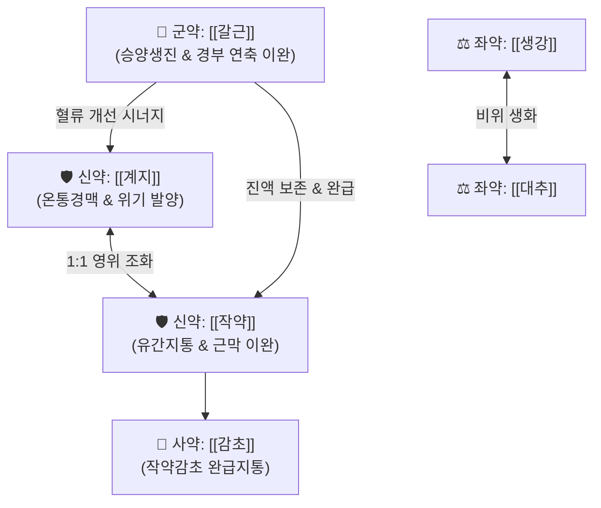

# 🍵 [[계지가갈근탕]] (桂枝加葛根湯, Gyeji-ga-galgeun-tang / Keishikakakkonto)

> **핵심 3줄 요약 (Key Summary)**:
> - 🌿 [[계지탕]]([[계지]]·[[작약]]·[[생강]]·[[대추]]·[[감초]]) + [[갈근]] 배오 (영위 조화 베이스에 비위의 진액을 목·어깨로 끌어올리는 승양생진·해표진경 방제).
> - 🎯 체력 약한 소음인·허약자, 땀이 송골송골 배어나오고 바람을 싫어하면서(표허자한) 뒷목과 어깨가 뻣뻣하게 굳는 항배강(項背强), 경추 디스크, 긴장성 두통.
> - 🔬 [[푸에라린]]·[[페오니플로린]]의 경추부 골격근 근소포체 칼슘 유출 억제 및 연축 완화, [[신남알데하이드]]의 척추-기저동맥 미세순환 증대.
> - ⚠️ 주의사항: 땀이 전혀 나지 않고 뼈마디가 쑤시는 상한 실증에는 마황이 든 갈근탕을 적용, 소화력 극도로 약한 소음인은 생강 증량.
---
## 📌 목차
1. [기본 처방 정보 & 군신좌사 구성](#1-기본-처방-정보--군신좌사-구성)
2. [방제학적 약재 상호작용 & 시너지 네트워크](#2-방제학적-약재-상호작용--시너지-네트워크)
3. [현대 분자약리학적 효능 & 작용 기전](#3-현대-분자약리학적-효능--작용-기전)
4. [적응 병증 및 체질별 감별 (Sweet Spot vs 금기)](#4-적응-병증-및-체질별-감별-sweet-spot-vs-금기)
5. [유사 처방군 감별 매트릭스](#5-유사-처방군-감별-매트릭스)
6. [임상 가감례 & 현대 질환별 응용](#6-임상-가감례--현대-질환별-응용)
7. [💡 사용자 진료실 핵심 필기 & 임상 팁 (원문 보존)](#7--사용자-진료실-핵심-필기--임상-팁-원문-보존)
8. [출처 및 학술 참고 문헌 (References)](#8-출처-및-학술-참고-문헌-references)
---
## 1. 기본 처방 정보 & 군신좌사 구성

* **출전**: 장중경(張仲景) 『[[상한론]]』 태양병편(太陽病篇)
* **치법**: 해표진경(解表鎭痙), 승양생진(升陽生津), 조화영위(調和營衛), 서근통락(舒筋通絡)

| 구분 | 약재명 | 표준 용량 | 본초 효능 & 방제 내 역할 |
| :--- | :--- | :--- | :--- |
| **군약 (君藥)** | [[갈근]] | 12g | 승양생진(升陽生津), 서근지통, 비위의 맑은 진액을 경추 기립근과 판상근으로 상승시켜 연축 완화 |
| **신약 (臣藥)** | [[계지]] | 9g | 온통경맥(溫通經脈), 조양화영(助陽和營), 말초혈관 확장 및 체표 표한 해소 |
| **신약 (臣藥)** | [[작약]] | 9g | 양혈렴음(養血斂陰), 유간지통(柔肝止痛), [[갈근]]과 협력하여 근막 연축 완급지통 |
| **좌약 (佐藥)** | [[생강]] | 9g | 온위화중(溫胃和中), 해표산한, 비위 보호 및 발표 |
| **좌약 (佐藥)** | [[대추]] | 12개 | 보비익기(補脾益氣), 양혈생진(養血生津), 영기 보양 |
| **사약 (使藥)** | [[감초]] | 6g | 익기화중(益氣和中), 조화제약(調和諸藥), 완급지통 |

> **배오 특징**: [[갈근탕]]과의 결정적 차이는 [[마황]]의 유무입니다. 마황이 빠져 있어 심계항진이나 불면증, 교감신경 흥분의 부작용이 전혀 없으며, 땀이 이미 배어 나오는 유한(有汗) 상태에서 진액 고갈을 막으며 목과 어깨의 근육을 부드럽게 이완시킵니다.
---
## 2. 방제학적 약재 상호작용 & 시너지 네트워크

* [[갈근]] + [[작약]] 배오: 갈근의 승양생진과 작약의 양혈렴음이 결합되어, 진액 부족으로 바싹 말라 굳어버린 경추 기립근([[두판상근]], [[경판상근]], [[승모근]], [[견갑거근]])에 수분을 공급하고 연축을 즉각 해소합니다.
* [[계지]] + [[작약]] 배오: 1:1 동량 배오로 주리(땀구멍)의 개합을 조절하여 영위를 조화시킵니다.
---
## 3. 현대 분자약리학적 효능 & 작용 기전

### 1) 경추 골격근 연축 억제 (진경·근이완)
* 갈근의 [[푸에라린]](Puerarin)과 작약의 [[페오니플로린]](Paeoniflorin) 복합물이 근소포체 칼슘 유출을 조절하고 신경근 접합부 과흥분을 억제하여 [[승모근]]과 [[판상근]]의 긴장성 연축을 신속히 이완시킵니다.

### 2) 척추동맥 및 뇌혈류 미세순환 증대
* 계지의 [[신남알데하이드]]가 말초 혈관을 확장시키고, 갈근 플라보노이드가 척추-기저동맥 순환을 개선하여 목 결림에 동반되는 뒷머리 무거움과 긴장성 어지럼증을 해소합니다.

### 3) 신경 염증성 통증 매개체 억제
* 경추 분절 주위의 염증성 사이토카인(TNF-α, IL-6) 분비를 억제하여 후두신경통 및 방사통을 경감합니다.
---
## 4. 적응 병증 및 체질별 감별 (Sweet Spot vs 금기)

[✅ 최적 적응증 (Sweet Spot)]
• 상한론 조문: "태양병, 항배강수수(項背强幾幾), 반한출악풍자(反汗出惡風者), 계지가갈근탕주지."
• 체질 소견: 평소 마르고 근육량이 적으며, 추위를 타고 소화력이 약한 소음인(少陰人) 및 노인, 소아
• 임상 주치: 땀이 송골송골 나면서(유한 有汗) 바람을 싫어하고 목덜미와 어깨가 굳어 돌아가지 않을 때
• 근골격계: 경추 추간판 탈출증(목 디스크), 일자목·거북목 증후군, 만성 경견완 증후군
• 설진/맥진: 설담홍(淡紅), 박백태(薄白苔), 맥부완(浮緩) 또는 맥약(弱)

[⚠️ 신중 투여 및 금기 (Caution / Contraindication)]
• 상한 표실증(表實證): 땀이 전혀 안 나고(무한) 뼈마디가 쑤시는 고열 환자에는 [[갈근탕]]이나 [[마황탕]] 적용
• 소화기 허약: 갈근의 서늘하고 끈끈한 진액 성분으로 소음인 허약 환자에게 묽은 변이나 복부 팽만이 발생할 수 있음 $\rightarrow$ 생강 증량 또는 미음 티칭
---
## 5. 유사 처방군 감별 매트릭스

| 처방명 | 핵심 구성 차이 | 땀의 유무 | 마황 유무 및 안전성 | 맥진/설진 차이 |
| :--- | :--- | :--- | :--- | :--- |
| [[계지가갈근탕]] | [[계지탕]] + [[갈근]] | **땀이 송골송골 남(유한)** | **마황 없음 (노인·고혈압 안심)** | 맥부완(浮緩), 박백태 |
| [[갈근탕]] | [[계지탕]] + [[갈근]], [[마황]] | **땀이 전혀 안 남(무한)** | **마황 함유 (강한 발한, 심계 주의)** | 맥부긴(浮緊), 박백태 |
| [[계지탕]] | [[계지]], [[작약]], [[생강]], [[대추]], [[감초]] | **땀이 저절로 남(자한)** | **마황 없음 (기혈허약 감모 기본방)** | 맥부완(浮緩), 박백태 |
| [[계지가작약탕]] | [[계지탕]] [[작약]] 2배 증량 | 땀 유무 무관 | **마황 없음 (복통·과민성 장질환 특화)** | 맥침현(沈弦), 백태 |
| [[갈근가반하탕]] | [[갈근탕]] + [[반하]] | **땀 안 남** | **마황 함유 (항강 + 구역·입덧 특화)** | 맥부긴, 백활태 |
---
## 6. 임상 가감례 & 현대 질환별 응용

* **수반 증상별 가감법**:
  * 소화기 부담 및 묽은 변 유발 시 $\rightarrow$ + [[생강]]을 12g으로 증량 (따뜻한 미음 병용)
  * 어혈성 경추 찌르는 통증 동반 시 $\rightarrow$ + [[단삼]], [[천궁]]
  * 팔저림 및 상지 방사통 동반 시 $\rightarrow$ + [[강활]], [[위령선]]
* **현대 질환별 임상 매핑**:
  * **경추성 질환**: 목 디스크, 거북목 증후군, 후경부 근막통증증후군(MPS)
  * **신경계 질환**: 긴장성 두통, 후두신경통, 경추성 어지럼증
  * **심혈관 안전 환자군**: 고혈압, 협심증, 부정맥, 불면증 환자의 안심 경견통 처방
---
## 7. 💡 사용자 진료실 핵심 필기 & 임상 팁 (원문 보존)

> [!tip] **진료실 실전 노하우 (User Clinical Insight)**
> - **갈근탕과 증상이 거의 똑같으나 마황을 쓸 수 없는 환자(고혈압, 심계항진, 불면증, 고령자)나 이미 땀이 송골송골 배어 나오는 표허 환자에게 갈근탕 대신 투여하는 최고의 안전 카드**
> - 땀이 나면서 목과 등이 굳는 "반한출악풍(反汗出惡風)" 병리가 핵심 열쇠
> - 장시간 컴퓨터 사용이나 스마트폰 과사용으로 판상근과 승모근이 바싹 말라 굳어버린 현대인의 일자목 통증에 탁효
> - 갈근의 찬 성질로 소화기가 극도로 약한 소음인이 설사를 할 경우 [[생강]]을 증량하고 따뜻한 죽을 먹여 복용 유도
---
## 8. 출처 및 학술 참고 문헌 (References)

3. **장중경 (200년경)**. 『[[상한론]]』.
   - **[고전 원전]**: "太陽病, 項背强幾幾, 反汗出惡風者, 桂枝加葛根湯主之." (태양병에 목과 등이 뻣뻣하면서도 도리어 땀이 나고 바람을 싫어할 때 계지가갈근탕으로 다스린다.)
