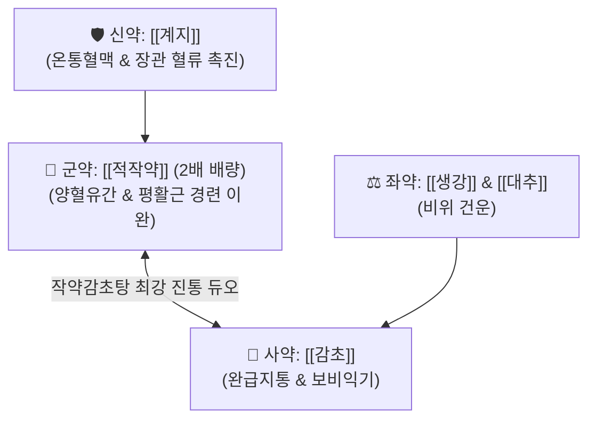

# 🍵 [[계지가작약탕]] (桂枝加芍藥湯, Gui-Zhi-Jia-Shao-Yao-Tang / Keishikashakuyakuto)

> **핵심 3줄 요약 (Key Summary)**:
> - 🌿 [[계지탕]] 베이스에 [[적작약]](배량, 2배 증량) 배오 ([[계지]], [[적작약]], [[생강]], [[대추]], [[감초]]).
> - 🎯 생대감증(소음인 허약 체질) 환자가 몸을 잔뜩 웅크리고 결실(結實)되어 소화불량, 쥐어짜는 복통, 얇은 변, 과민성 장 증후군(설사·변비 혼합형)을 호소할 때.
> - 🔬 [[페오니플로린]]의 장관 평활근 $Ca^{2+}$ 채널 차단 및 경련 완화, 내장 감각 과민성 억제.
> - <font color="#fa7e7e">⚠️ 주의사항: 대변이 굳어 며칠씩 못 보고 복부가 단단하고 누르면 극통을 느끼는 양명부실증(조열 변비)에는 대황제([[계지가대황탕]], [[조위승기탕]]) 적용.</font>
---
## 📌 목차
1. [기본 처방 정보 & 군신좌사 구성](#1-기본-처방-정보--군신좌사-구성)
2. [방제학적 약재 상호작용 & 시너지 네트워크](#2-방제학적-약재-상호작용--시너지-네트워크)
3. [현대 분자약리학적 효능 & 작용 기전](#3-현대-분자약리학적-효능--작용-기전)
4. [적응 병증 및 체질별 감별 (Sweet Spot vs 금기)](#4-적응-병증-및-체질별-감별-sweet-spot-vs-금기)
5. [유사 처방군 감별 매트릭스](#5-유사-처방군-감별-매트릭스)
6. [임상 가감례 & 현대 질환별 응용](#6-임상-가감례--현대-질환별-응용)
7. [💡 사용자 진료실 핵심 필기 & 임상 팁 (원문 보존)](#7--사용자-진료실-핵심-필기--임상-팁-원문-보존)
8. [출처 및 학술 참고 문헌 (References)](#8-출처-및-학술-참고-문헌-references)
---
## 1. 기본 처방 정보 & 군신좌사 구성

* **출전**: 장중경(張仲景) 『[[상한론]]』 태양병편(太陽病篇)
* **치법**: 온통영위(溫通營衛), 유간완급(柔肝緩急), 조리비위(調理脾胃)

| 구분 | 약재명 | 표준 용량 | 본초 효능 & 방제 내 역할 |
| :--- | :--- | :--- | :--- |
| **군약 (君藥)** | [[적작약]] | 10~12g | 양혈유간(養血柔肝), 완급지통(緩急止痛), 계지탕 용량의 2배로 증량하여 장관 경련을 즉각 해제 |
| **신약 (臣藥)** | [[계지]] | 6g | 온통경맥(溫通經脈), 양기를 돋워 장관의 한랭성 마비와 혈류 정체를 풀어줌 |
| **좌약 (佐藥)** | [[생강]] | 6g | 온중지구, 비위 기운을 순환시킴 |
| **좌약 (佐藥)** | [[대추]] | 6g | 보비익기, 진액을 자양 |
| **사약 (使藥)** | [[감초]] | 4~6g | 보비화중, 작약과 짝을 이루어 작약감초탕의 완급지통 극대화 |

> **배오 특징**: 계지탕에서 작약의 용량을 **2배로 대폭 증량**한 것입니다. 작약은 사이드 이펙트가 적으면서도 장관 평활근의 경련을 풀어주는 최고의 약재로, 허약하고 위축된 장관의 혈류를 돌리면서 쥐어짜는 복통을 멎게 합니다.
---
## 2. 방제학적 약재 상호작용 & 시너지 네트워크



* **작약 배량의 의미**: 계지탕의 '표증 해열' 목표에서 $\rightarrow$ '복강 내 평활근 이완과 혈류 개선'이라는 **소화기 내과 질환 처방으로 무게 중심이 완전히 이동**합니다.
---
## 3. 현대 분자약리학적 효능 & 작용 기전

### 1) 장관 평활근 연축 해제 & $Ca^{2+}$ 유입 차단
* 작약의 [[페오니플로린]](Paeoniflorin)과 감초의 [[글리시리진]](Glycyrrhizin)이 장관 평활근 세포막의 전압 의존성 칼슘 채널을 억제하여 불규칙한 이상 수축을 막고 장관 연동 운동을 정상화합니다.
### 2) 내장 감각 과민성(Visceral Hypersensitivity) 완화
* 장신경총(ENS)의 과도한 통각 전달을 억제하여 뇌-장 축(Brain-Gut Axis)의 스트레스성 복통과 변의(Tenismus)를 차단합니다.
---
## 4. 적응 병증 및 체질별 감별 (Sweet Spot vs 금기)

```
[✅ 최적 적응증 (Sweet Spot)]
• 상한론 조문: "태양병(太陽病), 의반하지(醫反下之)... 인복만시통자(因腹滿時痛者), 계지가작약탕주지"
• 임상 핵심: 체구가 왜소하고 마른 체형의 소음인이 배가 살살 아프면서 팽만감이 있고, 대변이 가늘고 얇게 나오며 설사와 변비가 교대로 반복될 때
• 물리치료/추나 연계: 몸이 잔뜩 위축되어 있어 추나, 침 치료, 마사지로도 근육과 긴장이 잘 안 풀리는 환자에게 복약 병용
• 맥진/설진: 설담태백(舌淡苔白), 맥침현(脈沈弦) 또는 맥세약(細弱)

[⚠️ 신중 투여 및 금기 (Caution / Contraindication)]
• 대황증 변비: 변을 3~5일 이상 못 보고 배가 북처럼 빵빵하고 단단하며 통증이 심한 실열성 변비에는 대황을 가한 계지가대황탕 또는 승기탕류 사용
```
---
## 5. 유사 처방군 감별 매트릭스

| 처방명 | 핵심 구성 차이 | 주치 복통 양상 | 대변 상태 및 장관 상태 |
| :--- | :--- | :--- | :--- |
| [[계지가작약탕]] | 계지탕 + [[적작약]] 2배 | **복통이 있으면서 시원하게 배변 못함** | **위장관 위축, 대변이 길고 얇음** |
| [[대건중탕]] | 산초, 건강, 인삼, 교이 | **하복통 극심, 배에서 꾸룩꾸룩 소리(장명)** | **장관 연동 운동 마비 및 한랭** |
| [[소建중탕]] | 계지가작약탕 + 교이(조청) | **소아 배앓이, 성장통, 만성 피로** | **허약 체질의 허통(虛痛)** |
| [[계지가대황탕]] | 계지가작약탕 + 대황 | **극심한 복통, 누르면 단단함** | **단단한 변비, 실열 정체** |
---
## 6. 임상 가감례 & 현대 질환별 응용

* **수반 증상별 가감법**:
  * 복통이 특히 심하고 쥐어짤 때 $\rightarrow$ + [[백작약]], [[감초]] 용량 추가
  * 대변이 굳어 며칠째 전혀 나오지 않을 때 $\rightarrow$ + [[대황]] ([[계지가대황탕]])
  * 소화불량과 헛배 부름이 심할 때 $\rightarrow$ + [[목향]], [[사인의]]
* **현대 질환 매핑**:
  * 과민성 대장 증후군(IBS, 혼합형/복통형), 만성 경련성 변비, 소아 야간 복통
---
## 7. 💡 사용자 진료실 핵심 필기 & 임상 팁 (원문 보존)

> [!tip] **진료실 실전 노하우 (User Clinical Insight)**
> - **구성**: [[계지]], [[적작약]] 2배 증량 / [[생강]], [[대추]], [[감초]]
>   - [[계지탕]]에 [[적작약]]의 용량을 늘린 것 ([[적작약]]은 사이드가 적음)
> - **적응증**:
>   - **<font color="#fa7e7e">생대감증에 몸이 쪼그라드는 증상(결실)이 심한 경우에 사용</font>**
>   - **몸을 웅크리고, 위축되어 있어 소화도 잘 안되고, 똥도 얇은 증상에 사용**
>   - **추나, 침 치료, 마사지도 잘 안되는 경우에 함께 병용**
>   - 소화관 평활근이 긴장, 수축되어 있어서 변비, 설사를 유발하는 상태, 복통, 복부 팽만감을 유발하는 상태에 활용 ([[과민성 장 증후군]]의 혼합형)
>   - **대변이 길고 얇게 나오는 경우에 활용** (위장관 위축으로 인한 듯)
> - **약리 작용**: 지사, 장관 수송능 개선, 장관 평활근 이완 작용
> - [[대건중탕]] VS [[계지가작약탕]] 감별:
>   - [[계지가작약탕]]: 복통이 있으면서 시원하게 배변하지 못하여 설사를 하는 경우
>   - [[대건중탕]]: 하복통이 있으면서 장명(꼬르륵 소리), 장관 연동 운동에 장애가 있는 경우에 적합
> - **태그**: #생대감증
---
## 8. 출처 및 학술 참고 문헌 (References)

1. **장중경 (200년경)**. 『상한론(傷寒論)』.
   - **[고전 원전]**: "本太陽病, 醫反下之, 因爾腹滿時痛者, 屬太陰也, 桂枝加芍藥湯主之." (본래 태양병인데 의사가 도리어 하법을 써서 배가 더부룩하고 때때로 아픈 것은 태음병에 속하니 계지가작약탕으로 치료한다.)
2. **Sasaki, D. et al. (2009)**. *Keishikashakuyakuto improves visceral hypersensitivity in a rat model of irritable bowel syndrome*. **Neurogastroenterology & Motility**, 21(9), 980-e79.
   - **[연구 요약]**: 과민성 대장 증후군 래트 모델에서 계지가작약탕이 직장 팽창에 의한 내장 통각 과민 반응을 유의하게 억제함을 규명.
