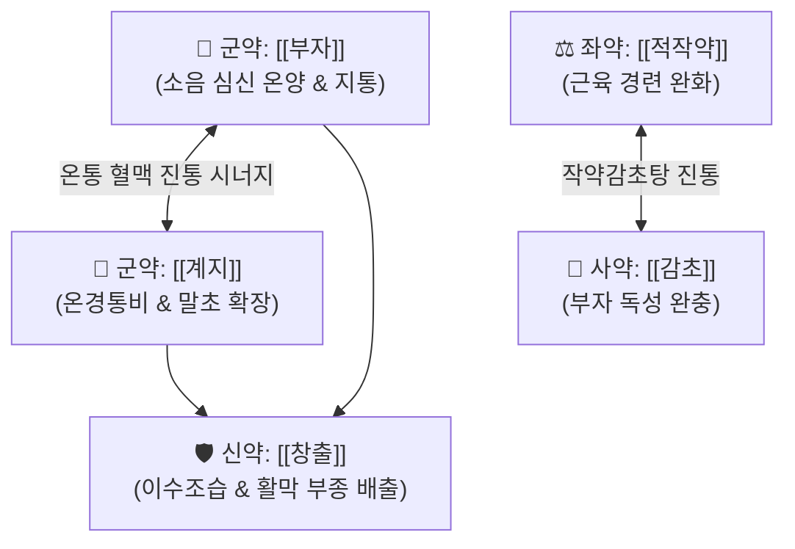

# 🍵 [[계지가출부탕]] (桂枝加朮附湯, Gui-Zhi-Jia-Zhu-Fu-Tang / Keishikajutsubuto)

> **핵심 3줄 요약 (Key Summary)**:
> - 🌿 [[계지탕]](계지·작약·생강·대추·감초) + [[창출]](이수제습), [[부자]](온양산한지통) 배오.
> - 🎯 팔다리가 시리고 찬(수족냉) 환자의 관절통, 종창, 류마티스 관절염, 신경병증성 통증, 따뜻한 물에 담그면 통증이 줄어드는 한비(寒痺) 환자.
> - 🔬 [[페오니플로린]]·[[아코니틴]]의 척수 반사 진통 및 말초 미세혈관 확장, 관절 활막 삼출물 흡수 촉진.
> - <font color="#fa7e7e">⚠️ 주의사항: 부자 독성 주의(충분히 전탕), 관절이 벌겋게 붓고 열감이 있는 열성 관절염(통풍 급성기, 봉와직염 등)에는 금기.</font>
---
## 📌 목차
1. [기본 처방 정보 & 군신좌사 구성](#1-기본-처방-정보--군신좌사-구성)
2. [방제학적 약재 상호작용 & 시너지 네트워크](#2-방제학적-약재-상호작용--시너지-네트워크)
3. [현대 분자약리학적 효능 & 작용 기전](#3-현대-분자약리학적-효능--작용-기전)
4. [적응 병증 및 체질별 감별 (Sweet Spot vs 금기)](#4-적응-병증-및-체질별-감별-sweet-spot-vs-금기)
5. [유사 처방군 감별 매트릭스](#5-유사-처방군-감별-매트릭스)
6. [임상 가감례 & 현대 질환별 응용](#6-임상-가감례--현대-질환별-응용)
7. [💡 사용자 진료실 핵심 필기 & 임상 팁 (원문 보존)](#7--사용자-진료실-핵심-필기--임상-팁-원문-보존)
8. [출처 및 학술 참고 문헌 (References)](#8-출처-및-학술-참고-문헌-references)
---
## 1. 기본 처방 정보 & 군신좌사 구성

* **출전**: 장중경(張仲景) 『[[상한론]]』 태양병편(太陽病篇)
* **치법**: 온경산한(溫經散寒), 거풍제습(祛風除濕), 온양지통(溫陽止痛)

| 구분 | 약재명 | 표준 용량 | 본초 효능 & 방제 내 역할 |
| :--- | :--- | :--- | :--- |
| **군약 (君藥)** | [[부자]](포부자) | 3~6g | 온비산한, 신양 온보, 뼛속 깊은 한습과 냉통을 뿌리 뽑는 제1약 |
| **군약 (君藥)** | [[계지]] | 6~8g | 온통경맥(溫通經脈), 관절 혈류를 통하게 하고 부자의 온양 작용 보조 |
| **신약 (臣藥)** | [[창출]](또는 [[백출]]) | 6~8g | 조습건비(燥濕健脾), 거풍제습, 관절 주위 수습 정체와 부종을 제거 |
| **좌약 (佐藥)** | [[적작약]] | 6~8g | 양혈유간, 완급지통, 감초와 함께 작약감초탕을 이루어 근육 연축 완화 |
| **좌약 (佐藥)** | [[생강]] | 4~6g | 온중화위, 온산표한 |
| **좌약 (佐藥)** | [[대추]] | 4~6g | 보비익기, 자양진액 |
| **사약 (使藥)** | [[감초]] | 3~4g | 조화제약, 익기보중, 부자의 독성을 완충 |

> **배오 특징**: **"작약감초탕 + 강력한 온열지제(계지·부자) + 수습 배출제(창출)"**의 절묘한 결합입니다. 차가운 기운과 습기로 인해 관절과 근육이 굳고 쑤시는 풍한습비(風寒濕痺)를 따뜻하게 덥혀 통증을 진정시킵니다.
---
## 2. 방제학적 약재 상호작용 & 시너지 네트워크



* **부자 + 계지 + 창출 배오**: 부자가 깊은 곳의 냉기를 몰아내고, 계지가 혈관을 열어 약효를 관절 말초까지 전달하며, 창출이 관절강 내 정체된 수분을 체외로 배출하여 관절 가동 범위를 즉각 회복시킵니다.
---
## 3. 현대 분자약리학적 효능 & 작용 기전

### 1) 신경병증성 통증 억제 & 하행 통증 억제계 활성화
* 부자의 [[아코니틴]] 대사물질이 말초 신경의 비정상적 자발 방전을 차단하고, 척수 수준에서 $\alpha_2$-아드레날린 수용체를 자극하여 대상포진 후 신경통(PHN) 및 척추관 협착증의 방사통을 강력히 완화합니다.
### 2) 류마티스 활막 염증 및 관절 종창 억제
* 창출의 아트락틸로딘(Atractylodin)과 작약의 [[페오니플로린]]이 활막 세포의 전염증성 사이토카인(TNF-$\alpha$, IL-1$\beta$) 발현을 억제하여 관절의 삼출성 종창을 흡수합니다.
---
## 4. 적응 병증 및 체질별 감별 (Sweet Spot vs 금기)

```
[✅ 최적 적응증 (Sweet Spot)]
• 상한론 조문: "태양병(太陽病)... 한출오풍(汗出惡風), 소변불리(小便不利), 사지미급(四肢微急), 난이굴신자(難以屈伸者), 계지가부자탕주지. 약풍습상박(若風濕相搏), 신체동통(身體疼痛), 가출(加朮)"
• 임상 핵심: 환자가 "비가 오거나 날이 궂으면 온몸이 쑤시고, 뜨거운 탕이나 온찜질을 하면 통증이 훨씬 덜하다"고 호소할 때
• 질환: 만성 류마티스 관절염, 퇴행성 관절염(골관절염), 대상포진 후 신경통(PHN), 개흉수술 후 늑간신경통, 안면신경마비 후유증
• 맥진/설진: 설담태백(舌淡苔白), 맥침현유력(脈沈弦有力) 또는 맥침지(沈遲)

[⚠️ 신중 투여 및 금기 (Caution / Contraindication)]
• 열비(熱痺): 관절이 벌겋게 부어오르고 만지면 불덩이처럼 뜨거운 급성 통풍 발작, 화농성 관절염 환자 금기
• 부자 과민 환자: 구강 마목감이나 두근거림 발생 시 복용 중단
```
---
## 5. 유사 처방군 감별 매트릭스

| 처방명 | 핵심 구성 차이 | 주치 통증 양상 | 냉온감 감별 |
| :--- | :--- | :--- | :--- |
| [[계지가출부탕]] | 계지탕 + 창출, 부자 | **팔다리 관절통, 신경통, 붓고 저림** | **따뜻하게 하면 통증 완화 (한비)** |
| [[백호가계지탕]] | 백호탕 + 계지 | **관절이 붉고 뜨거우며 붓는 통증** | **차갑게 해야 편안함 (열비)** |
| [[작약감초탕]] | 작약, 감초 | **단순 골격근·비복근 급성 쥐남(경련)** | **한열 편중 없음** |
| [[의이인탕]] | 마황, 당귀, 창출, 의이인 등 | **관절이 무겁고 붓는 습비(濕痺) 위주** | **부종·관절 무거움 위주** |
---
## 6. 임상 가감례 & 현대 질환별 응용

* **수반 증상별 가감법**:
  * 저림과 감각 이상이 심할 때 $\rightarrow$ + [[천궁]], [[당귀]] (혈허 순환장애 개선)
  * 하지 부종과 무거움이 극심할 때 $\rightarrow$ + [[의이인]], [[방기]]
* **현대 질환 매핑**:
  * 류마티스 관절염, 대상포진 후 신경통, 만성 늑간신경통, 수술 후 절개부 난치성 통증
---
## 7. 💡 사용자 진료실 핵심 필기 & 임상 팁 (원문 보존)

> [!tip] **진료실 실전 노하우 (User Clinical Insight)**
> - **구성**: [[계피]], [[적작약]], [[창출]], [[대추|대조]], [[감초]], [[생강]], [[부자]]
>   - [[계지]]: 온열, 발한, 평활근 이완
>   - [[창출]]: 이수
>   - [[부자]]: 온열, 발한, 진통
>   - [[작약감초탕]] + 온열지제
> - **적응증**:
>   - **몸이 차면서(팔다리) 관절의 통증, 종창, 근육통, 마비, 저림 증상에 사용**
>   - 류마티스 관절염, 신경근 질환, 근골격계 질환의 통증에 활용
>   - **환자가 뜨거운 날이나 뜨거운 물에 몸을 담그면 통증이 줄어든다고 할 때 활용**
>   - 대상포진 후 신경통, 악안면부 통증, 개흉수술 후 절개부 통증에서 진통제 사용량을 줄일 때 활용
> - **약리 작용**:
>   - 각종 신경병증성 통증 개선, 만성 류마티스 관절염 경감, 대상포진 후 신경통 완화 작용
---
## 8. 출처 및 학술 참고 문헌 (References)

1. **장중경 (200년경)**. 『상한론(傷寒論)』.
   - **[고전 원전]**: "若風濕相搏, 身體疼煩, 不能自轉側, 不嘔不渴, 脈浮虛而澁者, 桂枝附子湯主之... 若大便堅, 小便自利者, 去桂加白朮湯主之."
2. **Kogure, T. et al. (2004)**. *Clinical evaluation of Keishikajutsubuto (Gui-Zhi-Jia-Shu-Fu-Tang) for the treatment of neuropathic pain*. **Journal of Alternative and Complementary Medicine**, 10(4), 685-689.
   - **[연구 요약]**: 대상포진 후 신경통 및 난치성 만성 통증 환자 대상 임상 시험에서 계지가출부탕이 유의한 진통제 감량 및 통증 강도(VAS) 감소를 입증.
