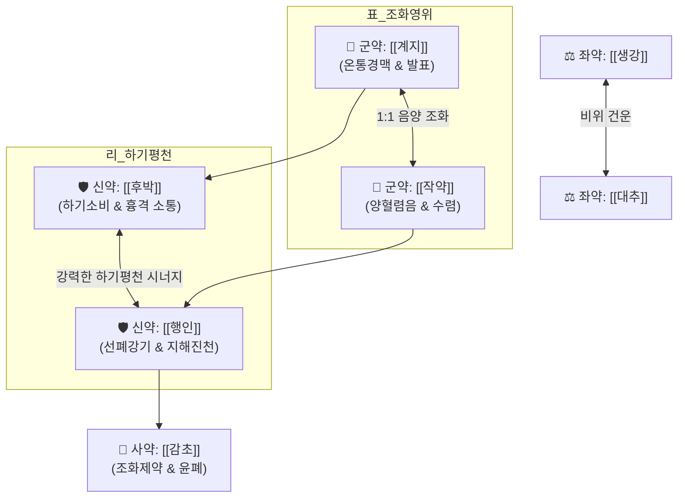

# 🍵 [[계지가후박행자탕]] (桂枝加厚朴杏子湯, Keishikakohokukyototo)

> **핵심 3줄 요약 (Key Summary)**:
> - 🌿 [[계지탕]]([[계지]]·[[작약]]·[[생강]]·[[대추]]·[[감초]]) + [[후박]], [[행인]] 배오 (영위 조화 베이스에 폐기 상역을 아래로 내리는 하기평천·해표화위 방제).
> - 🎯 평소 기관지가 약한 천가(喘家)의 감모 또는 감기 치료 중 폐기가 치받쳐 가벼운 천식·기침(微喘)이 동반된 환자, 식은땀 나면서 숨찬 허증성 기침.
> - 🔬 [[마그놀롤]]의 기도 평활근 수축 억제 및 [[아미그달린]]의 호흡 중추 진해 작용, 비만세포 탈과립 차단.
> - ⚠️ 주의사항: 누런 가래와 고열이 동반되는 폐열 실증 천식에는 금기([[마행감석탕]] 적용).
---
## 📌 목차
1. [기본 처방 정보 & 군신좌사 구성](#1-기본-처방-정보--군신좌사-구성)
2. [방제학적 약재 상호작용 & 시너지 네트워크](#2-방제학적-약재-상호작용--시너지-네트워크)
3. [현대 분자약리학적 효능 & 작용 기전](#3-현대-분자약리학적-효능--작용-기전)
4. [적응 병증 및 체질별 감별 (Sweet Spot vs 금기)](#4-적응-병증-및-체질별-감별-sweet-spot-vs-금기)
5. [유사 처방군 감별 매트릭스](#5-유사-처방군-감별-매트릭스)
6. [임상 가감례 & 현대 질환별 응용](#6-임상-가감례--현대-질환별-응용)
7. [💡 사용자 진료실 핵심 필기 & 임상 팁 (원문 보존)](#7--사용자-진료실-핵심-필기--임상-팁-원문-보존)
8. [출처 및 학술 참고 문헌 (References)](#8-출처-및-학술-참고-문헌-references)
---
## 1. 기본 처방 정보 & 군신좌사 구성

* **출전**: 장중경(張仲景) 『[[상한론]]』 태양병편(太陽病篇)
* **치법**: 해표화위(解表和胃), 하기평천(下氣平喘), 선폐지해(宣肺止咳)

| 구분 | 약재명 | 표준 용량 | 본초 효능 & 방제 내 역할 |
| :--- | :--- | :--- | :--- |
| **군약 (君藥)** | [[계지]] | 9g | 온통경맥(溫通經脈), 조양화영(助陽和營), 체표 풍한 해소 및 위기 발양 |
| **군약 (君藥)** | [[작약]] | 9g | 양혈렴음(養血斂陰), 유간지통, 영기 수렴 및 근막 완급지통 |
| **신약 (臣藥)** | [[후박]] | 6g | 하기소비(下氣消痞), 조습화담, 흉격의 막힌 기운을 내리고 기관지 평활근 이완 |
| **신약 (臣藥)** | [[행인]] | 6g | 강기지해(降氣止咳), 선폐평천, 상역한 폐기를 숙강(肅降)시켜 천식 진정 |
| **좌약 (佐藥)** | [[생강]] | 9g | 온위화중(溫胃和中), 발산표한, 비위 보호 및 발표 보조 |
| **좌약 (佐藥)** | [[대추]] | 12개 | 보비익기(補脾益氣), 양혈생진, 비위 진액 공급 |
| **사약 (使藥)** | [[감초]] | 6g | 조화제약(調和諸藥), 윤폐지해, 약성 조화 및 완충 |

> **배오 특징**: [[계지탕]]으로 표(表)의 영위를 조화시키는 동시에, [[후박]]과 [[행인]]의 강력한 하기(下氣: 기운을 내림) 배오로 리(裏)의 상역하는 폐기를 아래로 끌어내려 표리(表裏)와 승강(升降)을 동시에 바로잡는 절묘한 방제입니다.
---
## 2. 방제학적 약재 상호작용 & 시너지 네트워크

* [[후박]] + [[행인]] 배오: [[후박]]의 비위·흉격 하기 작용과 [[행인]]의 폐기 강기 작용이 합쳐져 상역하는 기침과 호흡 곤란을 단번에 아래로 가라앉힙니다.
* [[계지탕]] + [[후박]]·[[행인]] 배오: [[마황]] 없이 [[계지]]만으로 체표의 풍한을 풀면서도 기관지를 부드럽게 확장시켜 기허 환자나 만성 천식 환자에게 체력 손상 없이 기침을 멈추게 합니다.
---
## 3. 현대 분자약리학적 효능 & 작용 기전

### 1) 기도 평활근 연축 억제 및 항경련
* 후박의 [[마그놀롤]](Magnolol) 성분이 아세틸콜린 및 히스타민 유도 기도 평활근의 경련성 수축을 차단하여 기도 개방성을 확보합니다.

### 2) 호흡 중추 기침 반사 진정
* 행인의 [[아미그달린]](Amygdalin)이 호흡 중추의 과도한 흥분성을 억제하여 발작적 기침 빈도를 줄이고 기침 반사 역치를 정상화합니다.

### 3) 기도 과민성 및 비만세포 탈과립 차단
* 염증성 매개 물질 유리 억제와 호산구 침윤 억제를 통해 알레르기 및 한랭 자극에 의한 기관지 과민 반응을 차단합니다.
---
## 4. 적응 병증 및 체질별 감별 (Sweet Spot vs 금기)

[✅ 최적 적응증 (Sweet Spot)]
• 상한론 조문: "태양병, 하후미천자(下後微喘者), 표미해고야(表未解故也), 계지가후박행자탕주지." 및 "천가(喘家), 작계지가후박행자탕."
• 체질 소견: 평소 기관지가 약하고 알레르기 소인이 있으며 마르고 추위를 타는 소음인 천가(喘家)
• 임상 주치: 감기 초기 땀이 약간 배어 나오면서 바람을 싫어하고 기침과 숨찬 증세가 동반될 때
• 오하 후 미천: 감기에 설사제를 잘못 써서 비위가 상하고 표증이 남은 채 가벼운 천식이 올 때
• 설진/맥진: 설담홍(淡紅), 박백태(薄白苔), 맥부완(浮緩) 또는 맥부약(浮弱)

[⚠️ 신중 투여 및 금기 (Caution / Contraindication)]
• 폐열 실증 천식: 고열이 나고 누런 가래가 끓으며 입이 바싹 마르고 갈증이 심한 열성 천식 환자에게는 온열성 약성이므로 금기 ([[마행감석탕]], [[정천탕]] 적용)
• 무한 고열 실증: 땀이 전혀 안 나고 극심한 오한과 골절통이 수반되는 상한 표실증에는 [[마황탕]] 적용
---
## 5. 유사 처방군 감별 매트릭스

| 처방명 | 핵심 구성 차이 | 가래 및 기침 양상 | 열감 및 땀 유무 | 맥진/설진 차이 |
| :--- | :--- | :--- | :--- | :--- |
| [[계지가후박행자탕]] | [[계지탕]] + [[후박]], [[행인]] | **기침과 숨참(미천), 맑은 가래** | **오풍, 땀이 남(자한), 표허** | 맥부완(浮緩), 박백태 |
| [[마행감석탕]] | [[마황]], [[행인]], [[석고]], [[감초]] | **누렇고 끈끈한 가래, 쌕쌕거림** | **폐열 뚜렷, 땀 흘림, 체표 열감** | 맥활삭(滑數), 설홍황태 |
| [[소청룡탕]] | [[마황탕]] + [[건강]], [[세신]], [[반하]], [[오미자]] | **묽은 거품 가래, 줄줄 흐르는 콧물** | **오한 극심, 속이 몹시 참(수음)** | 맥현긴(弦緊), 백활태 |
| [[계지탕]] | 기준 구성 | **기침은 없고 오풍·발열 위주** | **땀이 저절로 남(자한)** | 맥부완(浮緩), 박백태 |
| [[지해산]] | [[자완]], [[백부]], [[길경]], [[백전]], [[형개]] | **목 간질거림 위주의 잔기침** | **열 없음, 감기 뒤끝 회복기** | 맥부완(浮緩), 박백태 |
---
## 6. 임상 가감례 & 현대 질환별 응용

* **수반 증상별 가감법**:
  * 폐열 소견(미열, 누런 가래 약간)이 보이기 시작할 때 $\rightarrow$ + [[황금]], [[상백피]]
  * 가슴 답답함과 소화장애가 극심할 때 $\rightarrow$ + [[지각]], [[반하]]
  * 가래가 묽고 추위를 심하게 탈 때 $\rightarrow$ + [[세신]], [[건강]]
* **현대 질환 매핑**:
  * **기관지 천식 초기 악화기**: 평소 천식 환자가 감기에 걸려 기침과 숨참이 유발될 때
  * **만성 폐쇄성 폐질환(COPD) 경증 환자의 감모**: 허약자의 호흡기 감염
  * **감염 후 잔여 해수 및 천명**: 기관지 과민성으로 숨소리가 거칠어질 때
---
## 7. 💡 사용자 진료실 핵심 필기 & 임상 팁 (원문 보존)

> [!tip] **진료실 실전 노하우 (User Clinical Insight)**
> - **평소 천식을 앓고 있거나 기관지가 약한 소음인 환자가 감기에 걸려 기침과 가쁜 숨을 몰아쉴 때 마황의 심계항진 부담 없이 쓰는 1순위 천식 감기약**
> - "천가(喘家)는 [[마황탕]]을 쓰지 말고 계지가후박행자탕을 쓰라"는 상한론 원칙 준수
> - 마황제 투여 시 가슴이 두근거리고 잠을 못 자는 예민한 천식 환자에게 최적의 대안
> - 복용 후 따뜻한 죽을 마셔 촉촉하게 땀을 내도록 티칭
---
## 8. 출처 및 학술 참고 문헌 (References)

1. **Lee, M. Y. et al. (2015)**. *Anti-asthmatic effects of Keishikakohokukyototo in an ovalbumin-induced asthma model*. **BMC Complementary and Alternative Medicine**, 15, 241.
   - **[연구 요약]**: 계지가후박행자탕이 알레르기 천식 동물 모델에서 기도 과민성을 완화하고 Th2 사이토카인 및 호산구 침윤을 유의하게 억제함을 규명.
2. **장중경 (200년경)**. 『[[상한론]]』.
   - **[고전 원전]**: "太陽病, 下後微喘者, 表未解故也, 桂枝加厚朴杏子湯主之." 및 "喘家作, 桂枝加厚朴杏子湯." (태양병을 사하한 뒤 약간 숨이 찬 것은 표증이 아직 풀리지 않았기 때문이니 계지가후박행자탕으로 다스리며, 평소 천식 환자의 감모에도 쓴다.)
3. **허준 (1613)**. 『[[동의보감]]』.
   - **[임상 문헌]**: 천식(喘息) 및 상한천(傷寒喘) 항목에서 기허 표한 환자의 하기평천 명방으로 수록.
