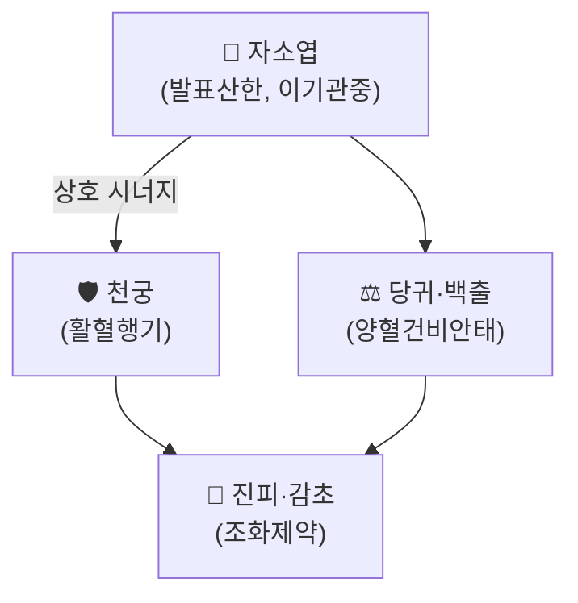

---
aliases:
  - 芎蘇散
  - Gung-so-san
tags:
  - 처방
  - 해표제
  - 안태
  - 임신부처방
---

# 🍵 궁소산 (芎蘇散)

> **핵심 3줄 요약 (Key Summary)**:
> - 🌿 기본 구성: [[천궁]]·[[자소엽]]·[[당귀]]·[[백출]]·[[진피]]·[[감초]]로 구성된 소방(小方). [[자소엽]]을 군약으로 하는 [[향소산]](香蘇散) 계열에서 파생된 임신부 전용 변방.
> - 🎯 임상 적응증: 임신부의 감기(태아 손상 위험 없이 안전하게 치료) — 몸살 기운, 으슬으슬한 오한, 코막힘, [[발열]], [[두통]]. 입덧으로 헛구역질하며 음식을 못 먹는 임신부에게도 응용되는 대표적인 안태방(安胎方).
> - 🔬 배오 특징: 발표산한(發表散寒) 작용의 자소엽·천궁에 당귀(양혈)·백출(건비안태)을 더해 표를 풀면서도 기혈과 태아를 함께 보호하도록 설계된 것이 핵심.
> - ⚠️ 주의사항: 임신 중 처방이므로 반드시 한의사의 임신주수·태아상태 평가 하에 사용해야 하며, 고열·심한 탈수 등 응급 소견이 있는 경우 산과적 평가를 우선해야 함.

---

## 📌 목차
1. [기본 처방 정보 & 구성](#1-기본-처방-정보--구성)
2. [방제학적 약재 상호작용 & 시너지 네트워크](#2-방제학적-약재-상호작용--시너지-네트워크)
3. [현대 분자약리학적 효능 & 작용 기전](#3-현대-분자약리학적-효능--작용-기전)
4. [적응 병증 및 체질별 감별 (Sweet Spot vs 금기)](#4-적응-병증-및-체질별-감별-sweet-spot-vs-금기)
5. [유사 처방군 감별 매트릭스](#5-유사-처방군-감별-매트릭스)
6. [임상 가감례 & 현대 질환별 응용](#6-임상-가감례--현대-질환별-응용)
7. [💡 사용자 진료실 핵심 필기 & 임상 팁 (원문 보존)](#7--사용자-진료실-핵심-필기--임상-팁-원문-보존)
8. [출처 및 학술 참고 문헌 (References)](#8-출처-및-학술-참고-문헌-references)

---

## 1. 기본 처방 정보 & 구성

* **치법**: 발표산한(發表散寒), 이기화중(理氣和中), 안태(安胎).

| 구분 | 약재명 | 방제 내 역할 |
| :--- | :--- | :--- |
| **군약** | [[자소엽]] | 발표산한, 이기관중(理氣寬中) — 감기와 입덧의 헛구역질을 함께 완화 |
| **신약** | [[천궁]] | 활혈행기(活血行氣), [[두통]] 완화 |
| **좌약** | [[당귀]], [[백출]] | 양혈(養血)·건비안태(健脾安胎) — 태아를 보호하며 기혈을 보충 |
| **사약** | [[진피]], [[감초]] | 이기화위(理氣和胃), 조화제약 |

> **배오 특징**: [[자소엽]] + [[천궁]] + [[당귀]] + [[백출]]의 조합이 핵심으로, 발표(表를 풀어 감기를 치료)하면서도 당귀·백출로 기혈과 태아를 함께 보호하는 것이 이 처방의 요체입니다.

---

## 2. 방제학적 약재 상호작용 & 시너지 네트워크

* 자소엽과 천궁의 배오는 표를 풀면서 기혈 순환을 함께 도모하는 상승 작용을 나타냅니다.
* 당귀·백출의 가미는 임신부에게 흔히 사용되는 안태방의 전형적 구조로, 발표제의 발산 작용이 태아에 부담을 주지 않도록 균형을 잡아줍니다.

---

## 3. 현대 분자약리학적 효능 & 작용 기전

### 1) 발표산한 및 항산화 네트워크
* [[자소엽]]의 지표성분 [[페릴알데히드]](Perillaldehyde)와 항산화 폴리페놀 [[로즈마린산]](Rosmarinic acid)이 발한·해열 및 항염증 작용을 나타냅니다.
* [[천궁]]의 [[테트라메틸피라진]](TMP)과 [[리구스틸라이드]](Ligustilide)는 뇌혈관 확장 및 혈소판 응집 억제를 통해 [[두통]]·몸살 기운을 완화합니다.

### 2) 양혈건비안태 네트워크
* [[당귀]]의 [[데커신]](Decursin) 계열 성분이 미세순환 개통 및 조혈 관련 작용을 나타내어 양혈(養血) 효능을 뒷받침합니다.
* [[백출]]의 [[아트락틸레노라이드]](Atractylenolide) 및 다당체 성분이 위장관 기능 조절과 면역 증강에 관여하여 건비안태(健脾安胎) 효능을 뒷받침합니다.

---

## 4. 적응 병증 및 체질별 감별 (Sweet Spot vs 금기)

[✅ 최적 적응증 (Sweet Spot)]
* 임신부 감기: 오한 [[발열]], 코막힘, [[두통]], 몸살 기운.
* 임신부 입덧: 헛구역질로 음식을 못 먹는 경우.

[⚠️ 신중 투여 및 금기]
* 고열이 심하거나 탈수·전신 쇠약이 동반된 경우 산과적 평가 우선.
* 개별 약재(특히 천궁 등 활혈 작용 약재)의 용량은 임신주수와 태아 상태를 고려해 한의사가 조절해야 함.

---

## 5. 유사 처방군 감별 매트릭스

| 처방명 | 핵심 구성 차이 | 주치 및 특징 |
| :--- | :--- | :--- |
| [[궁소산]] (본 처방) | [[향소산]] + [[천궁]]·[[당귀]]·[[백출]] | 임신부 감기·입덧 전용 안태방 |
| [[향소산]](香蘇散) | [[향부자]]·[[자소엽]]·[[진피]]·[[감초]] | 일반 외감풍한·기체(氣滯) 감기 |
| 행소산(杏蘇散) | [[행인]]·[[자소엽]] 등 | 외감풍한 겸 기침·가래 |

---

## 6. 임상 가감례 & 현대 질환별 응용

* **현대 질환별 임상 매핑**:
  * 임신 중 상기도감염(감기), 임신오조(입덧)로 인한 식욕부진·헛구역질.
* 원문에 구체적인 가감(加減) 사례는 별도로 기재되어 있지 않습니다.

---

## 7. 💡 사용자 진료실 핵심 필기 & 임상 팁 (원문 보존)

> [!tip] **진료실 실전 노하우 (User Clinical Insight)**
> - 현재 별도로 기록된 원장님 임상 필기가 없습니다. 추후 실전 진료 경험이 누적되면 이 섹션에 추가합니다.

---

## 8. 출처 및 학술 참고 문헌 (References)

1. **허준 (1613)**. 『[[동의보감]]』.
   - **[임상 문헌]**: 임신부 감기·안태방으로서의 궁소산 배오 원문.
2. [[자소엽]] 노트 — 궁소산 배오 구조 및 임상 적응증 정리 (본 볼트 내부 참고).
