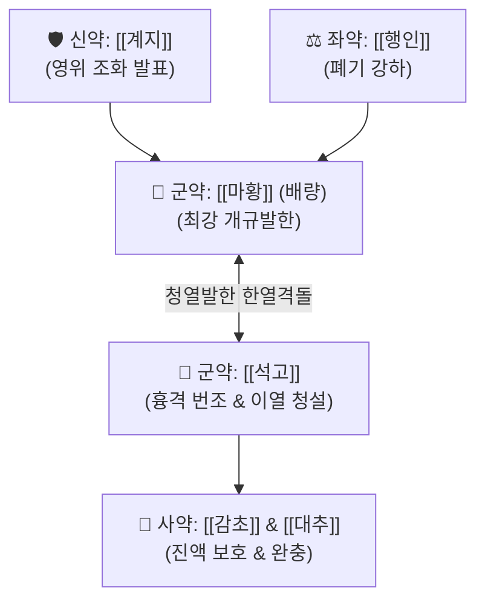

# 🍵 [[대청룡탕]] (大靑龍湯, Da-Qing-Long-Tang / Daiseiryuto)

> **핵심 3줄 요약 (Key Summary)**:
> - 🌿 [[마황탕]](마황 배량, 행인·감초) + [[계지탕]](계지·작약·생강·대추) + [[석고]] 배오.
> - 🎯 겉으로는 추위를 타서 이불을 뒤집어쓰고 있으면서도 이마에는 찬물수건을 올릴 정도로 가슴이 답답하고(번조), 찬물·찬음식을 찾으며 땀이 전혀 나지 않는(무한) 표한이열(表寒裏熱) 환자.
> - 🔬 [[에페드린]]의 강력한 대사 촉진·발한력과 [[석고]]의 중추성 고열 청해 및 탈수 방지.
> - <font color="#fa7e7e">⚠️ 주의사항: 한의학 최강의 발표청열제이므로 땀이 송골송골 나기 시작하면 즉시 복용을 중단(망양 亡陽 방지), 맥미약자(脈微弱)·자한 환자 절대 금기.</font>
---
## 📌 목차
1. [기본 처방 정보 & 군신좌사 구성](#1-기본-처방-정보--군신좌사-구성)
2. [방제학적 약재 상호작용 & 시너지 네트워크](#2-방제학적-약재-상호작용--시너지-네트워크)
3. [현대 분자약리학적 효능 & 작용 기전](#3-현대-분자약리학적-효능--작용-기전)
4. [적응 병증 및 체질별 감별 (Sweet Spot vs 금기)](#4-적응-병증-및-체질별-감별-sweet-spot-vs-금기)
5. [유사 처방군 감별 매트릭스](#5-유사-처방군-감별-매트릭스)
6. [임상 가감례 & 현대 질환별 응용](#6-임상-가감례--현대-질환별-응용)
7. [💡 사용자 진료실 핵심 필기 & 임상 팁 (원문 보존)](#7--사용자-진료실-핵심-필기--임상-팁-원문-보존)
8. [출처 및 학술 참고 문헌 (References)](#8-출처-및-학술-참고-문헌-references)
---
## 1. 기본 처방 정보 & 군신좌사 구성

* **출전**: 장중경(張仲景) 『[[상한론]]』 태양병편(太陽病篇)
* **치법**: 발한해표(發汗解表), 청열제번(淸熱除煩)

| 구분 | 약재명 | 표준 용량 | 본초 효능 & 방제 내 역할 |
| :--- | :--- | :--- | :--- |
| **군약 (君藥)** | [[마황]] | 10~12g | 마황탕의 2배 용량으로 대량 배오, 굳게 닫힌 땀구멍을 뚫어 풍한 표사를 강력 발한 |
| **군약 (君藥)** | [[석고]] | 16~24g | 청열사화(淸熱瀉火), 제번지갈(除煩止渴), 흉격에 갇힌 극심한 화열과 번조를 청해 |
| **신약 (臣藥)** | [[계지]] | 6~8g | 온통경맥, 조양화영, 마황을 도와 강력하게 한사를 몰아냄 |
| **좌약 (佐藥)** | [[행인]] | 6~8g | 강기지해, 선폐평천, 상충하는 폐기를 내림 |
| **좌약 (佐藥)** | [[생강]] | 6~8g | 온위산한, 발표통규 |
| **좌약 (佐藥)** | [[대추]] | 6~8g | 보비생진, 진액 고갈 방지 |
| **사약 (使藥)** | [[감초]] | 4~6g | 보비화중, 조화제약, 마황의 강력한 신산을 완충 |

> **방제 합방 구조**: [[마황탕]] + [[계지탕]] + [[마행감석탕]] + [[월비탕]]의 특성이 하나로 융합된 상한론 최강의 대발한·대청열 방제입니다.
---
## 2. 방제학적 약재 상호작용 & 시너지 네트워크



* **마황 6량 + 석고 여계자대(달걀 크기) 배오**: 안에서는 불이 훨훨 타고(이열), 밖은 꽁꽁 얼어붙어 땀구멍이 닫힌(표한) '빙산 속의 화산' 상태를 일거에 해소합니다.
---
## 3. 현대 분자약리학적 효능 & 작용 기전

### 1) 신속한 체온 리셋 & 대사성 과열 차단
* 마황의 [[에페드린]]이 말초 혈관을 열고 땀샘 분비를 강제 촉진하여 체열을 기화열로 방출시키고, 석고의 칼슘 이온이 시상하부 열조절 중추를 억제하여 40도에 육박하는 급성 고열을 신속히 떨어뜨립니다.
### 2) 기도 점막 부종 해소 & 급성 천명 개선
* 기관지 평활근을 급격히 확장하고 기도 내 혈관 투과성을 억제하여, 숨이 차고 쌕쌕거리는 급성 천식 및 호흡 곤란을 즉시 호전시킵니다.
---
## 4. 적응 병증 및 체질별 감별 (Sweet Spot vs 금기)

```
[✅ 최적 적응증 (Sweet Spot)]
• 상한론 조문: "태양중풍(太陽中風), 맥부긴(脈浮緊), 발열오한(發熱惡寒), 신통불한출이번조자(身疼痛不汗出而煩躁者), 대청룡탕주지"
• 임상 핵심: 환자가 "추워서 이불을 뒤집어쓰고 벌벌 떠는데, 가슴은 터질 듯이 답답하고 머리는 깨질 것 같아 이마에 찬 물수건을 대고 있다"고 할 때
• 신체 소견: 추위는 타는데 이마, 손발바닥, 입안은 후끈후끈하고 찬물만 찾는 호흡기·피부 질환
• 맥진/설진: 설홍(舌紅), 황백상간태(黃白相間苔), 맥부긴유력(浮緊有力)

[⚠️ 신중 투여 및 금기 (Caution / Contraindication)]
• 한출자(汗出者) 금기: 땀이 조금이라도 나고 있는 환자에게 쓰면 망양(탈수성 쇼크)을 유발하므로 절대 금기
• 맥미약자(脈微弱者) 금기: 기운이 없고 맥이 가늘고 힘이 없는 환자에게 투약 금지
```
---
## 5. 유사 처방군 감별 매트릭스

| 처방명 | 핵심 구성 차이 | 주치 증상 감별 | 땀 유무 및 가슴 답답함 |
| :--- | :--- | :--- | :--- |
| [[대청룡탕]] | 마황탕 + 석고, 생강, 대추 | **오한발열, 신체통, 극심한 가슴 답답함(번조)** | **무한(無汗) + 번조 극심** |
| [[마행감석탕]] | 계지 빠지고 석고 배오 | **땀이 나면서 기침하고 숨참, 큰 열은 없음** | **한출(汗出) + 호흡기 위주** |
| [[소청룡탕]] | 마황탕 + 건강, 세신, 오미자 | **찬바람 쐬면 맑은 콧물 줄줄, 거품 가래** | **무번조(속이 참)** |
| [[마황탕]] | 석고 없음 | **인플루엔자 고열, 뼈마디 관절통** | **무한 + 번조 없음** |
---
## 6. 임상 가감례 & 현대 질환별 응용

* **수반 증상별 가감법**:
  * 번조와 구갈이 극심할 때 $\rightarrow$ 석고 용량을 30g 이상으로 증량
  * 피부 발진과 가려움이 심할 때 $\rightarrow$ + [[선태]], [[연교]]
* **현대 질환 매핑**:
  * 급성 인플루엔자(독감) 초기고열기, 급성 대두창(급성 두드러기), 중증 알레르기 비염의 발열 번조기
---
## 7. 💡 사용자 진료실 핵심 필기 & 임상 팁 (원문 보존)

> [!tip] **진료실 실전 노하우 (User Clinical Insight)**
> - **구성**: [[계지]], [[적작약]], [[생강]], [[대추]], [[감초]] / [[마황]], [[행인]] / [[석고]]
>   - [[계지탕]] + [[마황탕]] + [[마행감석탕]] + [[월비탕]]의 결합
> - **적응증**:
>   - **<font color="#fa7e7e">추위를 탄다고 호소하고, 찬물·찬음식을 좋아하고 흉부 답답함, 낮은 정도의 숨참을 호소하는 호흡기 질환, 피부 질환에 사용</font>**
>   - **추워서 이불은 푹 뒤집어쓰고 이마에 찬 물수건 올린 사람**
>   - **추위는 타는데 이마와 손발, 입안은 후끈후끈한 상태에 활용**
> - [[대청룡탕]]과 [[마행감석탕]] 감별:
>   - [[대청룡탕]]: [[계지]], [[적작약]]이 들어가기에 오한발열, 불한출이번조(땀이 안 나면서 번조), 단신중에 사용
>   - [[마행감석탕]]: 한출이천(땀이 나면서 숨참), 무대열의 호흡기 증상에 사용
---
## 8. 출처 및 학술 참고 문헌 (References)

1. **장중경 (200년경)**. 『상한론(傷寒論)』.
   - **[고전 원전]**: "太陽中風, 脈浮緊, 發熱惡寒, 身疼痛, 不汗出而煩躁者, 大靑龍湯主之." (태양병에 열이 나고 오한하며 온몸이 아프고 땀이 안 나면서 번조한 자는 대청룡탕으로 치료한다.)
2. **Kim, S. Y. et al. (2015)**. *Protective effects of Daiseiryuto on influenza virus infection in mice*. **Evidence-Based Complementary and Alternative Medicine**, 2015, 627194.
   - **[연구 요약]**: 대청룡탕이 인플루엔자 바이러스 감염 모델에서 강력한 항바이러스 활성과 함께 과도한 염증성 폐 손상을 유의하게 억제함을 증명.