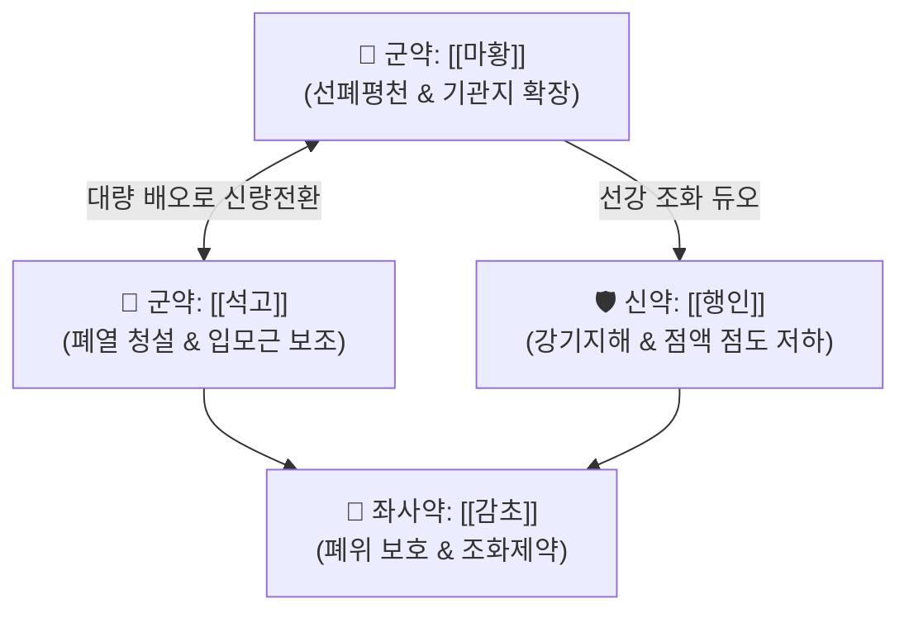

# 🍵 [[마행감석탕]] (麻杏甘石湯, Ma-Xing-Gan-Shi-Tang / Makkyokansekito)

> **핵심 3줄 요약 (Key Summary)**:
> - 🌿 [[마황]], [[행인]], [[감초]], [[석고]] 배오 ([[마황탕]]에서 계지를 빼고 석고를 대량 배오).
> - 🎯 뚱뚱하고 하얀 태음인 체형의 발열 후 열이 폐에 몰려 발생하는 마른 기침·천명, 소아 천식 발작기, 황색 가래가 보이고 호흡 곤란이 있는 환자.
> - 🔬 [[에페드린]]·[[아미그달린]]의 강력한 기관지 평활근 이완 및 [[석고]]의 기도 염증성 혈관 이완 억제와 중추성 해열.
> - <font color="#fa7e7e">⚠️ 주의사항: 맑은 콧물과 오한이 뚜렷한 한음(寒飮)성 기침에는 금기([[소청룡탕]] 적용), 땀을 과도하게 흘리는 허약자 주의.</font>
---
## 📌 목차
1. [기본 처방 정보 & 군신좌사 구성](#1-기본-처방-정보--군신좌사-구성)
2. [방제학적 약재 상호작용 & 시너지 네트워크](#2-방제학적-약재-상호작용--시너지-네트워크)
3. [현대 분자약리학적 효능 & 작용 기전](#3-현대-분자약리학적-효능--작용-기전)
4. [적응 병증 및 체질별 감별 (Sweet Spot vs 금기)](#4-적응-병증-및-체질별-감별-sweet-spot-vs-금기)
5. [유사 처방군 감별 매트릭스](#5-유사-처방군-감별-매트릭스)
6. [임상 가감례 & 현대 질환별 응용](#6-임상-가감례--현대-질환별-응용)
7. [💡 사용자 진료실 핵심 필기 & 임상 팁 (원문 보존)](#7--사용자-진료실-핵심-필기--임상-팁-원문-보존)
8. [출처 및 학술 참고 문헌 (References)](#8-출처-및-학술-참고-문헌-references)
---
## 1. 기본 처방 정보 & 군신좌사 구성

* **출전**: 장중경(張仲景) 『[[상한론]]』 태양병편(太陽病篇)
* **치법**: 신량선폐(辛涼宣肺), 청폐평천(淸肺平喘)

| 구분 | 약재명 | 표준 용량 | 본초 효능 & 방제 내 역할 |
| :--- | :--- | :--- | :--- |
| **군약 (君藥)** | [[마황]] | 6~8g | 선폐평천(宣肺平喘), 기관지 연축을 풀고 폐기를 선통 |
| **군약 (君藥)** | [[석고]] | 16~24g | 청설폐열(淸洩肺熱), 마황 용량의 2~3배를 사용하여 마황의 온성을 제어하고 신량(辛涼)으로 전환 |
| **신약 (臣藥)** | [[행인]] | 6~9g | 강기지해(降氣止咳), 마황과 짝을 이루어 선강(宣降)의 균형을 맞추고 가래 점도를 낮춤 |
| **좌사약 (佐使藥)** | [[감초]] | 3~6g | 보비익기, 완급지통, 약성 조화 및 마황의 심계 자극 완충 |

> **배오 특징**: 마황과 석고의 비율이 핵심입니다. 석고를 마황의 2~3배 이상 대량 사용하여 마황의 발한열성을 완전히 꺾고 **"폐의 열을 식히며 숨찬 것을 가라앉히는 신량청폐(辛涼淸肺)"**의 작용으로 환골탈태시켰습니다.
---
## 2. 방제학적 약재 상호작용 & 시너지 네트워크



* **마황 + 석고 분자 배오**: 석고의 칼슘 이온($Ca^{2+}$)이 모세혈관의 투과성 항진을 억제하여 점막 부종을 가라앉히고, 마황의 [[에페드린]]이 기관지 평활근을 이완시켜 호흡 통로를 단번에 확보합니다.
---
## 3. 현대 분자약리학적 효능 & 작용 기전

### 1) 기관지 확장 & 호흡 곤란 대사성 산·알칼리증 완화
* 마황의 교감신경계 자극으로 혈류 순환을 촉진하고 기관지를 확장하며, 석고(황산칼슘)가 칼슘을 보충하고 체온 조절 중추의 과열을 식혀 빠른 호흡으로 인한 전해질 불균형을 안정화합니다.
### 2) 기도 점액 점도 저하 & 배출 촉진
* 행인의 [[아미그달린]] 및 지방유 성분이 끈적끈적하게 달라붙은 황색 분비물의 점도를 떨어뜨려 객담 배출을 원활하게 돕습니다.
---
## 4. 적응 병증 및 체질별 감별 (Sweet Spot vs 금기)

```
[✅ 최적 적응증 (Sweet Spot)]
• 상한론 조문: "발한후(發汗後), 불가경행계지탕(不可更行桂枝湯), 한출이천(汗出而喘), 무대열자(無大熱者), 가여마황행인감석탕"
• 임상 핵심: 감기나 폐렴 초기 열이 난 뒤, 열이 완전히 빠지지 않고 폐로 기어들어가 땀을 삐질삐질 흘리면서 쌕쌕거리고 기침하는 상태
• 체질 소견: 태음인 체형(뚱뚱하고 살결이 하얀 편)의 폐열 기침·천명
• 질환: 소아 천식 발작기, 급성 세기관지염, 마이코플라즈마 폐렴, 백일해, 급성 후두염(크룹)
• 맥진/설진: 설홍(舌紅), 황태(黃苔), 맥활삭(滑數) 또는 부삭(浮數)

[⚠️ 신중 투여 및 금기 (Caution / Contraindication)]
• 한음천식: 찬바람 맞으면 기침하고 맑은 가래가 나오는 환자에게 쓰면 폐가 더 차가워져 악화 ([[소청룡탕]] 적용)
• 허천(虛喘): 숨을 들이쉬지 못하고 땀을 줄줄 흘리는 폐신양허 환자 금기
```
---
## 5. 유사 처방군 감별 매트릭스

| 처방명 | 핵심 구성 차이 | 가래 및 기침 양상 | 열감 및 땀 유무 |
| :--- | :--- | :--- | :--- |
| [[마행감석탕]] | 마황, 행인, 감초, 석고 | **끈적하고 누런 가래, 거친 숨소리(천명)** | **폐열 뚜렷, 땀이 남(汗出)** |
| [[마황탕]] | 마황, 계지, 행인, 감초 | **기침은 있으나 고열과 관절통 위주** | **오한 극심, 땀 전혀 안 남(無汗)** |
| [[소청룡탕]] | 마황탕 + 건강, 세신, 반하, 오미자 | **맑은 거품 가래, 맑은 콧물, 재채기** | **오한 위주, 속이 참(寒飮)** |
| [[패독산]] | 시호, 전호, 길경, 지각, 복령 등 | **가래 끓는 기침, 전신 몸살, 담음** | **기허자 감기** |
---
## 6. 임상 가감례 & 현대 질환별 응용

* **수반 증상별 가감법**:
  * 가래가 몹시 끈적하고 누런색이 짙을 때 $\rightarrow$ + [[상백피]], [[황금]], [[어성초]]
  * 목구멍이 심하게 붓고 쉰 목소리가 날 때 $\rightarrow$ + [[길경]], [[사간]]
* **현대 질환 매핑**:
  * 소아 기관지 천식, 급성 폐렴, 급성 기관지염, 폐쇄성 후두염
---
## 7. 💡 사용자 진료실 핵심 필기 & 임상 팁 (원문 보존)

> [!tip] **진료실 실전 노하우 (User Clinical Insight)**
> - **구성**: [[마황]], [[행인]], [[감초]], [[석고]]
>   - [[마황]]: 교감신경 활성으로 한출, 혈류 순환 증진, 기관지 확장
>   - [[석고]]: 황산칼슘으로 칼슘을 보충하고 [[마황]]의 입모근 수축을 보조하며, 호흡 곤란으로 인한 대사성 알칼리증 완화
> - **적응증**:
>   - **<font color="#fa7e7e">태음인 체형(뚱뚱하고 하얗고)에 마른 기침 증상, 발열 후 열이 폐에 몰려 발생하는 기침, 천명에 사용</font>**
>   - 소아 천식 발작기에 활용하며, 기도 분비물이 많고 기침, 황색 가래가 보일 경우에 활용
>   - 추가로 열이 발생하여 인체에선 체온을 원활히 내리지 못하고 있는 상태에 열을 내려줄 때, 혈관이 이완되어 느슨한 상태에 활용
> - **약리 작용**:
>   - 항알레르기 작용
>   - [[마황]]-[[행인]]으로 기관지 확장과 점액 점도 감소, [[석고]]를 통해 기관지 확장을 원활하게 하며 신경전달물질의 활성을 조절함
> - **태그**: #태음인증
---
## 8. 출처 및 학술 참고 문헌 (References)

1. **장중경 (200년경)**. 『상한론(傷寒論)』.
   - **[고전 원전]**: "發汗後, 汗出而喘, 無大熱者, 可與麻黃杏仁甘草石膏湯." (땀을 낸 뒤에도 땀이 나면서 숨이 차고 큰 열이 없을 때 마행감석탕을 준다.)
2. **Li, C. et al. (2019)**. *Maxing Shigan Decoction attenuates influenza A virus-induced lung injury via regulating cytokine storm and protecting alveolar epithelial barrier*. **Frontiers in Pharmacology**, 10, 1500.
   - **[연구 요약]**: 마행감석탕이 인플루엔자 A 바이러스 감염 모델에서 염증성 사이토카인 폭풍을 완화하고 폐포 상피 장벽을 강력하게 보호함을 확인.
