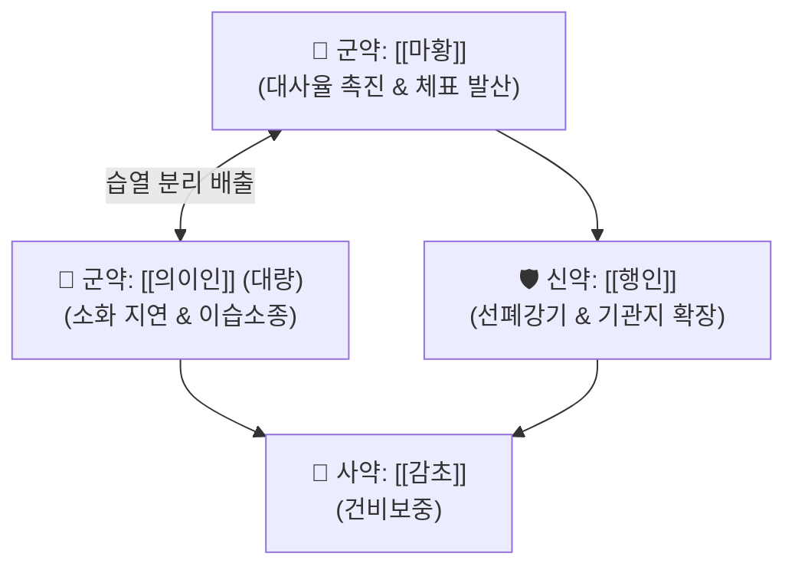

# 🍵 [[마행의감탕]] (麻杏薏甘湯, Ma-Xing-Yi-Gan-Tang / Makkyoyokukanto)

> **핵심 3줄 요약 (Key Summary)**:
> - 🌿 [[마황]], [[행인]], [[의이인]], [[감초]] 배오 ([[마황탕]]에서 계지를 빼고 의이인을 대량 배오).
> - 🎯 태음인 체형의 신체 관절통, 부종, 소변불리, 기관지 수축(호흡 곤란), 오후에 심해지는 미열과 전신 권태감, 피부 사마귀 환자.
> - 🔬 [[에페드린]]의 대사율 항진 및 [[의이인]](Coixol)의 소화 흡수 속도 지연·항알레르기·항바이러스 면역 활성.
> - <font color="#fa7e7e">⚠️ 주의사항: 땀이 비 오듯 쏟아지는 극심한 허약자 주의, 임산부에게는 의이인 대량 투여 신중.</font>
---
## 📌 목차
1. [기본 처방 정보 & 군신좌사 구성](#1-기본-처방-정보--군신좌사-구성)
2. [방제학적 약재 상호작용 & 시너지 네트워크](#2-방제학적-약재-상호작용--시너지-네트워크)
3. [현대 분자약리학적 효능 & 작용 기전](#3-현대-분자약리학적-효능--작용-기전)
4. [적응 병증 및 체질별 감별 (Sweet Spot vs 금기)](#4-적응-병증-및-체질별-감별-sweet-spot-vs-금기)
5. [유사 처방군 감별 매트릭스](#5-유사-처방군-감별-매트릭스)
6. [임상 가감례 & 현대 질환별 응용](#6-임상-가감례--현대-질환별-응용)
7. [💡 사용자 진료실 핵심 필기 & 임상 팁 (원문 보존)](#7--사용자-진료실-핵심-필기--임상-팁-원문-보존)
8. [출처 및 학술 참고 문헌 (References)](#8-출처-및-학술-참고-문헌-references)
---
## 1. 기본 처방 정보 & 군신좌사 구성

* **출전**: 장중경(張仲景) 『[[금궤요략(金匱要略)]]』 경습갈병맥증병치(痙濕暍病脈證幷治)
* **치법**: 해표거습(解表祛濕), 청열배농(淸熱排膿), 통락지통(通絡止痛)

| 구분 | 약재명 | 표준 용량 | 본초 효능 & 방제 내 역할 |
| :--- | :--- | :--- | :--- |
| **군약 (君藥)** | [[마황]] | 4~6g | 선폐발한(宣肺發汗), 이수소종, 체표의 풍습사를 열어줌 |
| **군약 (君藥)** | [[의이인]] | 16~24g | 건비보폐, 청열이습, 배농산결, 마황의 3~4배 대량 사용하여 관절의 습열과 군살을 뺌 |
| **신약 (臣藥)** | [[행인]] | 6~8g | 강기지해, 선폐강기, 마황의 선발을 조화롭게 이끌어 호흡 통로를 틔움 |
| **사약 (使藥)** | [[감초]] | 3~4g | 조화제약, 건비익기 |

> **배오 특징**: **"마황으로 대사율을 올리고 의이인으로 소화 속도를 늦추는 태음인 최적화 방제"**입니다. 계지의 매운 열성을 빼고 성질이 서늘하고 담담한 [[의이인]]을 대량 배오하여, 땀을 지나치게 내지 않으면서도 관절과 피부에 낀 습열(濕熱)을 소변으로 안전하게 빼냅니다.
---
## 2. 방제학적 약재 상호작용 & 시너지 네트워크



* **마황 + 의이인 시너지**: 마황의 교감신경 흥분 작용이 체지방 연소와 에너지 대사를 높이고, 의이인이 위장관 내 음식물의 통과 속도를 완만하게 늦추어 인슐린 스파이크를 막고 만성 염증을 완화합니다.
---
## 3. 현대 분자약리학적 효능 & 작용 기전

### 1) 당 흡수 지연 & 지질 대사 개선
* 의이인의 코익세놀라이드(Coixenolide) 성분이 소장의 탄수화물 흡수 속도를 완만하게 지연시키고 지방 세포의 유리지방산 방출을 촉진하여, 태음인의 비만 및 대사 증후군을 개선합니다.
### 2) 인유두종바이러스(HPV) 억제 & 피부 사마귀 제거
* 대식세포와 NK 세포 활성화를 통해 세포 매개성 면역을 끌어올려 편평사마귀, 물사마귀, 지루성 피부염의 각질 증식을 억제합니다.
---
## 4. 적응 병증 및 체질별 감별 (Sweet Spot vs 금기)

```
[✅ 최적 적응증 (Sweet Spot)]
• 금궤요략 조문: "풍습(風濕), 신체번동(身體煩疼), 일포소발열(日晡所發熱), 오한(惡寒), 마행의감탕주지"
• 임상 핵심: 오후만 되면 몸이 무겁게 가라앉으면서 미열이 뜨고, 손발 관절이 뻑뻑하며 붓고, 피부에 사마귀나 트러블이 잘 생기는 환자
• 체질 소견: 살집이 있고 체격이 좋은 전형적인 태음인 환자
• 질환: 류마티스 초기, 피부 사마귀(편평사마귀/보통사마귀), 관절통을 동반한 비만, 천식성 기관지염
• 맥진/설진: 설태백활(白滑) 또는 백미황(白微黃), 맥부완(浮緩) 또는 맥활(滑)

[⚠️ 신중 투여 및 금기 (Caution / Contraindication)]
• 임산부 신중: 의이인의 자궁 평활근 수축 유발 가능성 고려
• 심한 음허증: 피부가 몹시 건조하고 각질만 일어나는 환자에게 장복 주의
```
---
## 5. 유사 처방군 감별 매트릭스

| 처방명 | 핵심 구성 차이 | 주치 병증 차이 | 피부 및 대사 적응증 |
| :--- | :--- | :--- | :--- |
| [[마행의감탕]] | 마황, 행인, 의이인, 감초 | **오후 발열, 관절통, 호흡 곤란, 부종** | **태음인 대사 촉진, 피부 사마귀** |
| [[마황가출탕]] | 마황탕 + 백출 | **비 맞은 후 전신 관절통, 극심한 무한** | **급성 한습 관절 부종** |
| [[의이인탕]] | 당귀, 작약, 창출, 마황, 계지 등 | **만성 관절 류마티스, 냉증, 빈혈 동반** | **기혈 허약 동반 만성 관절염** |
| [[마행감석탕]] | 의이인 대신 석고 | **폐열 마른 기침, 천명, 땀이 남** | **호흡기 급성 열증** |
---
## 6. 임상 가감례 & 현대 질환별 응용

* **수반 증상별 가감법**:
  * 소화 속도를 더 늦추고 포만감을 높이고자 할 때 $\rightarrow$ + [[건율]](밤)
  * 관절통이 심하고 쑤실 때 $\rightarrow$ + [[강활]], [[독활]]
  * 사마귀와 피부 염증이 번질 때 $\rightarrow$ + [[금은화]], [[포공영]]
* **태음인 관련 처방군 연계**:
  * [[마황정통탕]], [[한다열소탕]], [[녹용대보탕]]과 함께 태음인 대사 질환에 상용
* **현대 질환 매핑**:
  * 바이러스성 사마귀, 초기 관절염, 비만 동반 수분 정체, 기관지 과민증
---
## 7. 💡 사용자 진료실 핵심 필기 & 임상 팁 (원문 보존)

> [!tip] **진료실 실전 노하우 (User Clinical Insight)**
> - **구성**: [[마황]], [[감초]], [[행인]], [[의이인]]
> - **적응증**:
>   - **태음인 체형의 신체 관절통, 부종, 소변불리, 기관지 수축(호흡 곤란) 증상에 사용**
>   - **태음인에게 쓰기 좋은 처방으로 호흡을 원활하게 하고 소화 속도도 늦추어 대사율을 높이는 용도의 처방**
>   - [[건율]]을 함께 처방하여 소화 속도 늦추는 효과를 높일 수 있음
>   - **관련 처방**: [[마황정통탕]], [[한다열소탕]], [[녹용대보탕]]
> - **태그**: #태음인증
---
## 8. 출처 및 학술 참고 문헌 (References)

1. **장중경 (200년경)**. 『금궤요략(金匱要略)』.
   - **[고전 원전]**: "病者一身盡疼, 發熱, 日晡所劇者, 名曰風濕... 此病傷於汗出當風, 或久傷取冷所致也, 可與麻黃杏仁薏苡甘草湯."
2. **Kawakita, T. et al. (1990)**. *Induction of interferon-gamma and activation of natural killer cells by Makkyoyokukanto*. **International Journal of Immunopharmacology**, 12(4), 389-396.
   - **[연구 요약]**: 마행의감탕 투여가 인터페론-감마 생성을 유도하고 NK 세포 활성을 현저히 증강시켜 바이러스성 피부 질환(사마귀 등)을 억제함을 확인.