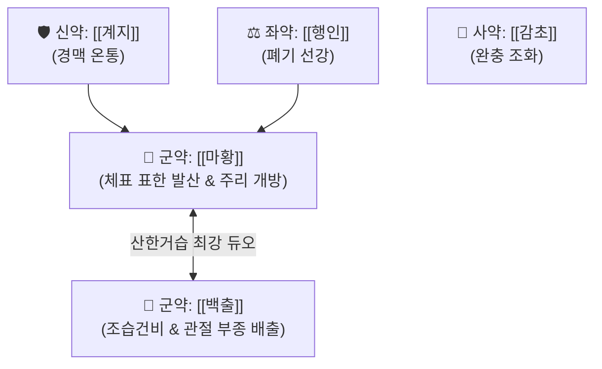

# 🍵 [[마황가출탕]] (麻黃加朮湯, Ma-Huang-Jia-Zhu-Tang / Mahokajutsuto)

> **핵심 3줄 요약 (Key Summary)**:
> - 🌿 [[마황탕]](마황·계지·행인·감초) + [[백출]](건비조습·이수) 배오.
> - 🎯 체격이 건실한 태음인·실증 환자가 감기 기운과 함께 비를 맞거나 습한 환경에 노출되어 온몸이 무겁고 관절이 붓고 쑤시며 땀이 나지 않을 때.
> - 🔬 [[에페드린]]의 교감신경 흥분 및 혈관 수축 + 백출의 아쿠아포린(AQP) 수분 통로 조절을 통한 관절 간질액 부종 배출.
> - <font color="#fa7e7e">⚠️ 주의사항: 땀이 이미 나고 있는 표허(表虛) 환자나 고혈압 환자 금기, 발한 시 미한(微汗)을 목표로 복용 조절.</font>
---
## 📌 목차
1. [기본 처방 정보 & 군신좌사 구성](#1-기본-처방-정보--군신좌사-구성)
2. [방제학적 약재 상호작용 & 시너지 네트워크](#2-방제학적-약재-상호작용--시너지-네트워크)
3. [현대 분자약리학적 효능 & 작용 기전](#3-현대-분자약리학적-효능--작용-기전)
4. [적응 병증 및 체질별 감별 (Sweet Spot vs 금기)](#4-적응-병증-및-체질별-감별-sweet-spot-vs-금기)
5. [유사 처방군 감별 매트릭스](#5-유사-처방군-감별-매트릭스)
6. [임상 가감례 & 현대 질환별 응용](#6-임상-가감례--현대-질환별-응용)
7. [💡 사용자 진료실 핵심 필기 & 임상 팁 (원문 보존)](#7--사용자-진료실-핵심-필기--임상-팁-원문-보존)
8. [출처 및 학술 참고 문헌 (References)](#8-출처-및-학술-참고-문헌-references)
---
## 1. 기본 처방 정보 & 군신좌사 구성

* **출전**: 장중경(張仲景) 『[[금궤요략(金匱要略)]]』 경습갈병맥증병치(痙濕暍病脈證幷治)
* **치법**: 발한산한(發汗散寒), 거습통비(祛濕通痺)

| 구분 | 약재명 | 표준 용량 | 본초 효능 & 방제 내 역할 |
| :--- | :--- | :--- | :--- |
| **군약 (君藥)** | [[마황]] | 6~8g | 개규발한, 선폐평천, 강력한 발표력으로 체표의 풍한습사를 흩음 |
| **군약 (君藥)** | [[백출]](또는 [[창출]]) | 8~12g | 조습건비(燥濕健脾), 이수소종, 마황을 도와 근육과 관절 사이의 수습을 흡수·배출 |
| **신약 (臣藥)** | [[계지]] | 6~8g | 온통경맥, 양기를 북돋워 혈맥을 통하게 하고 한사를 몰아냄 |
| **좌약 (佐藥)** | [[행인]] | 6~8g | 강기지해, 선강폐기 |
| **사약 (使藥)** | [[감초]] | 3~4g | 조화제약, 완급지통 |

> **배오 특징**: 마황탕의 강력한 발한력에 [[백출]]을 결합하여, 단순히 땀만 내는 것이 아니라 **몸속에 고여 있는 무거운 물(습사 濕邪)을 쥐어짜서 소변과 땀으로 함께 빼내는 방제**입니다. 백출이 마황의 과도한 발한을 제어하여 땀을 알맞게 내도록 조절합니다.
---
## 2. 방제학적 약재 상호작용 & 시너지 네트워크



* **마황 + 백출 배오 (습가 발한의 묘법)**: 습병(濕病)에는 본래 땀을 지나치게 많이 내면 습은 그대로 남고 진액만 빠져나가는데, 백출이 수분을 붙잡아 안으로 말려주고 마황이 겉의 찬 기운을 흩어주어 완벽한 수습 평형을 이룹니다.
---
## 3. 현대 분자약리학적 효능 & 작용 기전

### 1) 관절강 내 수분 저류 완화 & 아쿠아포린 조절
* 백출의 아트락틸레놀라이드(Atractylenolide) 성분이 신장 및 세포막의 아쿠아포린(AQP-2) 통로를 조절하여 관절 활막 주변의 삼출성 부종을 체외로 원활히 배설시킵니다.
### 2) 골격근 젖산 대사 촉진 & 지절통 경감
* 마황의 [[에페드린]] 성분이 골격근 혈류를 증가시키고 대사를 항진시켜, 비를 맞거나 습한 환경에서 근막 사이에 엉겨 붙은 염증성 노폐물과 젖산을 신속히 제거합니다.
---
## 4. 적응 병증 및 체질별 감별 (Sweet Spot vs 금기)

```
[✅ 최적 적응증 (Sweet Spot)]
• 금궤요략 조문: "습가(濕家), 신번통(身煩疼), 가여마황가출탕(可與麻黃加朮湯), 발기한위윤(發其汗爲潤), 신복취냉수체(愼腹聚冷水體)"
• 임상 핵심: 체격이 좋고 튼튼한 환자가 비를 맞았거나 물속에서 작업한 후 온몸이 천근만근 무겁고 쑤시며 땀이 나지 않을 때
• 질환: 급성 관절류마티스 초기, 감기 몸살을 동반한 전신 부종, 외상 후 급성 염좌 종창
• 맥진/설진: 설태백니(白膩, 백태가 두껍고 미끈거림), 맥부완(浮緩) 또는 맥부긴(浮緊)

[⚠️ 신중 투여 및 금기 (Caution / Contraindication)]
• 허약자 표허자: 평소 땀을 많이 흘리고 기운이 없는 환자에게 투약 시 허탈 위험
• 음허화왕자: 몸에 진액이 말라 있는 환자에게 쓰면 백출의 조습성이 건조감을 심화시킴
```
---
## 5. 유사 처방군 감별 매트릭스

| 처방명 | 핵심 구성 차이 | 주치 병증 차이 | 수습 및 부종 양상 |
| :--- | :--- | :--- | :--- |
| [[마황가출탕]] | 마황탕 + 백출 | **전신 관절통, 몸이 무거움, 무한, 비 맞은 후 몸살** | **실증 체질 전신 부종** |
| [[마황탕]] | 백출 없음 | **인플루엔자 고열, 뼈마디 통증 위주** | **부종 없음, 순수 풍한** |
| [[마행의감탕]] | 계지 빠지고 의이인 배오 | **오후에 심해지는 열감, 관절통, 피부 사마귀** | **풍습 울열 위주** |
| [[월비가출탕]] | 마황, 석고, 생강, 대추, 백출 | **열감이 심한 급성 신염 부종, 땀이 나면서 부음** | **열성 부종 위주** |
---
## 6. 임상 가감례 & 현대 질환별 응용

* **수반 증상별 가감법**:
  * 부종과 요량 감소가 극심할 때 $\rightarrow$ + [[복령]], [[택사]]
  * 관절의 열감이 올라올 때 $\rightarrow$ + [[석고]] ([[월비가출탕]]으로 전방)
* **현대 질환 매핑**:
  * 급성 류마티스성 관절염, 외상성 연부조직 급성 종창, 한랭 노출 후 급성 근육통
---
## 7. 💡 사용자 진료실 핵심 필기 & 임상 팁 (원문 보존)

> [!tip] **진료실 실전 노하우 (User Clinical Insight)**
> - **구성**: [[마황]], [[감초]], [[행인]], [[계지]], [[백출]](출)
> - **적응증**: 수습이 정체되어 관절 종창이 심하고 온몸이 무거우면서 땀이 나지 않는 한습성 몸살 및 관절통에 활용
---
## 8. 출처 및 학술 참고 문헌 (References)

1. **장중경 (200년경)**. 『금궤요략(金匱要略)』.
   - **[고전 원전]**: "濕家, 身煩疼, 可與麻黃加朮湯, 發其汗爲潤, 愼腹聚冷水體." (습병에 몸이 번거롭고 아플 때 마황가출탕을 주어 축축하게 땀을 내준다.)
2. **Morinobu, A. et al. (2005)**. *Inhibitory effects of Mahokajutsuto on inflammatory arthritis in animal models*. **Modern Rheumatology**, 15(4), 268-273.
   - **[연구 요약]**: 관절염 동물 모델에서 마황가출탕이 활막 부종을 신속히 완화하고 염증성 연골 손상을 보호함을 입증.
