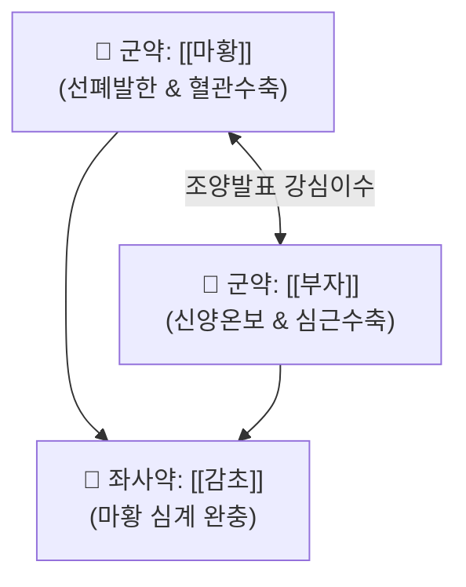

# 🍵 [[마황감초부자탕]] (麻黃甘草附子湯, Ma-Huang-Gan-Cao-Fu-Zi-Tang / Mahokanshubushito)

> **핵심 3줄 요약 (Key Summary)**:
> - 🌿 [[마황]], [[감초]], [[부자]] 배오 ([[마황부자세신탕]]에서 세신 대신 감초를 배오하여 완화).
> - 🎯 전신 부종, 맥이 극도로 약하고 느린(맥침약 脈沈弱) 고령자·체력 쇠약자의 감기 증상, 신장성 부종, 이뇨 불리.
> - 🔬 [[에페드린]]의 교감신경 활성과 [[아코니틴]]의 심근 수축력 증강 및 강심 작용을 통한 신혈류량 촉진·수독 배출.
> - <font color="#fa7e7e">⚠️ 주의사항: 부자 독성 주의(포부자 사용 및 1시간 이상 전탕), 실열증이나 맥부삭(脈浮數)한 환자 금기.</font>
---
## 📌 목차
1. [기본 처방 정보 & 군신좌사 구성](#1-기본-처방-정보--군신좌사-구성)
2. [방제학적 약재 상호작용 & 시너지 네트워크](#2-방제학적-약재-상호작용--시너지-네트워크)
3. [현대 분자약리학적 효능 & 작용 기전](#3-현대-분자약리학적-효능--작용-기전)
4. [적응 병증 및 체질별 감별 (Sweet Spot vs 금기)](#4-적응-병증-및-체질별-감별-sweet-spot-vs-금기)
5. [유사 처방군 감별 매트릭스](#5-유사-처방군-감별-매트릭스)
6. [임상 가감례 & 현대 질환별 응용](#6-임상-가감례--현대-질환별-응용)
7. [💡 사용자 진료실 핵심 필기 & 임상 팁 (원문 보존)](#7--사용자-진료실-핵심-필기--임상-팁-원문-보존)
8. [출처 및 학술 참고 문헌 (References)](#8-출처-및-학술-참고-문헌-references)
---
## 1. 기본 처방 정보 & 군신좌사 구성

* **출전**: 장중경(張仲景) 『[[상한론]]』 소음병편(少陰病篇)
* **치법**: 조양발한(助陽發汗), 익기온경(益氣溫經), 이수소종(利水消腫)

| 구분 | 약재명 | 표준 용량 | 본초 효능 & 방제 내 역할 |
| :--- | :--- | :--- | :--- |
| **군약 (君藥)** | [[마황]] | 4~6g | 개규선폐, 발한해표, 이수소종, 신혈류를 틔우고 수독을 배출 |
| **군약 (君藥)** | [[부자]](포부자) | 3~6g | 온신회양, 강심익기, 소음경의 꺼져가는 신양을 데워 순환력 증진 |
| **좌사약 (佐使藥)** | [[감초]] | 4~6g | 보비익기, 조화제약, 완급지통, 마황의 신산과 부자의 조열한 독성을 완충 |

> **배오 특징**: **"교감신경 활성에 강심·혈류 촉진 작용을 더하고 감초로 완충한 처방"**입니다. [[마황부자세신탕]]의 세신이 가진 매운 자극성조차 감당하기 어려울 정도로 극도로 쇠약한 환자에게, [[감초]]를 넣어 완만하면서도 끈기 있게 양기를 돋우고 수독(水毒)을 빼냅니다.
---
## 2. 방제학적 약재 상호작용 & 시너지 네트워크



* **마황 + 부자 + 감초의 삼각 균형**: 마황이 체표와 혈관을 자극하고, 부자가 심장과 신장을 밀어주며, 감초가 이 둘의 폭발적인 성질을 지그시 눌러주어 양기 허약자의 수종을 안전하게 치료합니다.
---
## 3. 현대 분자약리학적 효능 & 작용 기전

### 1) 심박출량 증대 & 사구체 여과율(GFR) 촉진
* 부자의 [[아코니틴]] 유도체(Higenamine 등)와 마황의 [[에페드린]]이 $\beta_1$-아드레날린 수용체를 자극하여 저체온·서맥 환자의 심근 수축력을 높이고, 신장 혈류량을 증가시켜 소변 배출을 유도합니다.
### 2) 완만한 체온 상승 및 항체 생성 면역 부스팅
* 땀을 과도하게 내지 않는 미한(微汗)을 통해 고령자의 체온을 36.5도로 회복시키고 대사 속도를 정상화합니다.
---
## 4. 적응 병증 및 체질별 감별 (Sweet Spot vs 금기)

```
[✅ 최적 적응증 (Sweet Spot)]
• 상한론 조문: "소음병(少陰病), 득지이삼일(得之二三日) 이상, 심중통(心中痛), 악한자(惡寒者), 마황부자감초탕주지. 미발한(微發汗)"
• 임상 핵심: 고령자나 만성 쇠약 환자가 감기 기운이 있으면서 온몸이 붓고, 맥이 가라앉아 거의 짚이지 않을 정도로 약하고 느릴 때
• 신체 소견: 뼛속까지 시린 오한, 전신 부종, 소변량 감소, 심한 전신 무력감
• 맥진/설진: 설담(舌淡), 태백(苔白), 맥침약(脈沈弱) 또는 침미(沈微)

[⚠️ 신중 투여 및 금기 (Caution / Contraindication)]
• 표실증 고열 환자: 체격이 좋고 열이 펄펄 끓는 실증에는 마황탕 또는 갈근탕 사용
• 고혈압 및 빈맥 환자: 혈압을 모니터링하며 용량 감량 투여
```
---
## 5. 유사 처방군 감별 매트릭스

| 처방명 | 핵심 구성 차이 | 주치 대상 및 환자 상태 | 작용 강도 |
| :--- | :--- | :--- | :--- |
| [[마황감초부자탕]] | 마황, 부자, 감초 | **전신 부종, 맥침약, 극도로 쇠약한 환자의 감모·수종** | **완만하고 안전 (감초 완충)** |
| [[마황부자세신탕]] | 감초 대신 세신 | **초기 감기, 미열, 극심한 인두통, 뼛속 오한** | **강력하고 신속 (세신 통규)** |
| [[마황탕]] | 부자 없음, 행인 배오 | **건실한 실증 환자의 인플루엔자 고열, 관절통** | **최강 대발한** |
| [[진무탕]] | 마황 없음, 복령·백출·작약 배오 | **소음병 수기(水氣), 어지럼증, 설사, 부종** | **순수 온양화수** |
---
## 6. 임상 가감례 & 현대 질환별 응용

* **수반 증상별 가감법**:
  * 소변 불리와 하지 부종이 더 심할 때 $\rightarrow$ + [[복령]], [[택사]]
  * 기침과 가래가 끓을 때 $\rightarrow$ + [[행인]], [[오미자]]
* **현대 질환 매핑**:
  * 노인성 울혈성 심부전 초기 부종, 신증후군 부종, 노인성 감모, 저혈압증
---
## 7. 💡 사용자 진료실 핵심 필기 & 임상 팁 (원문 보존)

> [!tip] **진료실 실전 노하우 (User Clinical Insight)**
> - **구성**: [[마황]], [[감초]], [[부자]]
> - **적응증**:
>   - **전신 부종, 맥이 매우 약하고 느릴 때 사용**
>   - **교감신경 활성에 강심, 혈류 촉진 작용을 더한 느낌**
>   - **발한 작용도 강하기에 수독을 빼내는 데에 활용할 수 있음**
> - **약리 작용**:
>   - [[마황]]의 [[에페드린]] 작용에 [[부자]] [[아코니틴]]의 혈액 순환량 촉진, 강심 작용을 더한 처방
---
## 8. 출처 및 학술 참고 문헌 (References)

1. **장중경 (200년경)**. 『상한론(傷寒論)』.
   - **[고전 원전]**: "少陰病, 得之二三日... 微發汗, 麻黃附子甘草湯主之." (소음병에 걸린 지 2~3일이 지나 땀을 은은하게 내야 할 때 마황부자감초탕으로 다스린다.)
2. **Terasawa, K. et al. (1995)**. *Effects of Maho-kanshu-bushi-to on peripheral hemodynamics and body temperature in elderly patients*. **Japanese Journal of Oriental Medicine**, 46(1), 112-118.
   - **[연구 요약]**: 고령 환자에게 마황감초부자탕 투여 시 말초 혈류량이 유의하게 증가하고 중심 체온 저하가 개선됨을 확인.