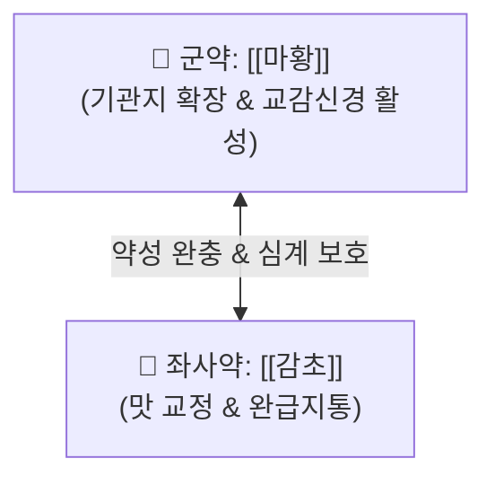

# 🍵 [[마황감초탕]] (麻黃甘草湯, Ma-Huang-Gan-Cao-Tang / Mahokanto)

> **핵심 3줄 요약 (Key Summary)**:
> - 🌿 [[마황]], [[감초]] 배오 (마황의 신온발표력과 감초의 감완보중력의 단 두 약재로 이루어진 최소 처방).
> - 🎯 기관지 평활근 경련, 기침, 부종과 소변 불리, 순수하게 마황의 [[에페드린]] 교감신경 활성 효과를 깔끔하게 보고 싶을 때.
> - 🔬 [[에페드린]]·[[슈도에페드린]]의 기관지 확장 및 심박출량 증대, 심근 순환을 통한 반사성 이뇨 작용.
> - <font color="#fa7e7e">⚠️ 주의사항: 감초 대량 장복 시 가성 알도스테론증(위알도스테론증) 주의, 심혈관 질환자 및 불면증 환자 주의.</font>
---
## 📌 목차
1. [기본 처방 정보 & 군신좌사 구성](#1-기본-처방-정보--군신좌사-구성)
2. [방제학적 약재 상호작용 & 시너지 네트워크](#2-방제학적-약재-상호작용--시너지-네트워크)
3. [현대 분자약리학적 효능 & 작용 기전](#3-현대-분자약리학적-효능--작용-기전)
4. [적응 병증 및 체질별 감별 (Sweet Spot vs 금기)](#4-적응-병증-및-체질별-감별-sweet-spot-vs-금기)
5. [유사 처방군 감별 매트릭스](#5-유사-처방군-감별-매트릭스)
6. [임상 가감례 & 현대 질환별 응용](#6-임상-가감례--현대-질환별-응용)
7. [💡 사용자 진료실 핵심 필기 & 임상 팁 (원문 보존)](#7--사용자-진료실-핵심-필기--임상-팁-원문-보존)
8. [출처 및 학술 참고 문헌 (References)](#8-출처-및-학술-참고-문헌-references)
---
## 1. 기본 처방 정보 & 군신좌사 구성

* **출전**: 장중경(張仲景) 『[[금궤요략(金匱要略)]]』 수기병맥증병치(水氣病脈證幷治)
* **치법**: 선폐발한(宣肺發汗), 거습소종(祛濕消腫)

| 구분 | 약재명 | 표준 용량 | 본초 효능 & 방제 내 역할 |
| :--- | :--- | :--- | :--- |
| **군약 (君藥)** | [[마황]] | 6~10g | 개규발한, 선폐평천, 이수소종, 폐기를 열어 수분을 체외로 방출 |
| **좌사약 (佐使藥)** | [[감초]] | 3~6g | 보비익기, 조화제약, 마황의 쓴맛을 잡고 심계항진 부작용을 완충 |

> **배오 특징**: **"가장 순수하고 깔끔하게 마황의 효능을 추출하는 처방"**입니다. 다른 약재들의 간섭 없이 마황의 [[에페드린]] 작용을 집중적으로 활용하고자 할 때 쓰며, 마황 특유의 떫고 쓴맛과 거친 약성을 [[감초]]의 단맛으로 교정하고 심장 부담을 덜어줍니다.
---
## 2. 방제학적 약재 상호작용 & 시너지 네트워크



* **이뇨 메커니즘의 진실**: 감초의 글리시리진은 대량 복용 시 알도스테론 활성을 높여 나트륨을 재흡수시키는 항이뇨 작용을 가질 수 있으나, 일반 용량에서는 그 작용이 미약합니다. 오히려 마황의 강심 및 혈관 수축 작용으로 신장 사구체 혈류량이 급증하면서 **신속한 반사성 이뇨 작용**이 나타납니다.
---
## 3. 현대 분자약리학적 효능 & 작용 기전

### 1) $\beta_2$-아드레날린 수용체 매개 기관지 평활근 이완
* 마황의 [[에페드린]] 및 [[슈도에페드린]] 성분이 기관지 평활근 경련을 즉각 풀어주어 기도 저항을 감소시키고 숨참 증상을 가라앉힙니다.
### 2) 중심 순환 혈류량 증대 및 부종 개선
* 말초 정맥 환류량을 높이고 심박출량을 증대시켜 피하 조직에 정체된 간질액을 혈관 내로 재흡수시킨 후 소변으로 배출합니다.
---
## 4. 적응 병증 및 체질별 감별 (Sweet Spot vs 금기)

```
[✅ 최적 적응증 (Sweet Spot)]
• 금궤요략 조문: "피수(皮水), 사지종(四肢腫), 수기재표(水氣在表), 마황감초탕주지"
• 임상 핵심: 피부 피하에 물이 차서 온몸이나 팔다리가 붓고(피수 皮水), 소변이 시원치 않으며, 기관지 경련성 기침이 동반될 때
• 단독 활용: 에페드린의 대사 촉진 및 식욕 억제, 기관지 확장 효과를 단독으로 깔끔하게 보고 싶을 때
• 맥진/설진: 설태백(白), 맥부(浮) 또는 맥부활(浮滑)

[⚠️ 신중 투여 및 금기 (Caution / Contraindication)]
• 고혈압, 협심증 환자: 교감신경 흥분으로 인한 혈압 급상승 주의
• 장기 복용 주의: 감초 장기 투여 시 저칼륨혈증 및 위알도스테론증 유발 가능
```
---
## 5. 유사 처방군 감별 매트릭스

| 처방명 | 핵심 구성 차이 | 주치 병증 차이 | 특징 및 성격 |
| :--- | :--- | :--- | :--- |
| [[마황감초탕]] | 마황, 감초 | **피수(皮水), 기관지 경련, 순수 에페드린 효과** | **가장 심플한 베이스** |
| [[마황탕]] | 마황감초탕 + 계지, 행인 | **인플루엔자 독감, 고열, 무한, 뼈마디 통증** | **완전한 발한 발표제** |
| [[월비탕]] | 마황감초탕 + 석고, 생강, 대추 | **열감이 동반된 피수(부종), 갈증, 땀이 남** | **청열이수제** |
| [[작약감초탕]] | 마황 대신 작약 배오 | **골격근 경련, 쥐남, 복통** | **평활근 이완제** |
---
## 6. 임상 가감례 & 현대 질환별 응용

* **수반 증상별 가감법**:
  * 부종이 특히 심할 때 $\rightarrow$ + [[백출]], [[복령]]
  * 가슴 답답함과 열감이 있을 때 $\rightarrow$ + [[석고]] ([[월비탕]]으로 전방)
* **현대 질환 매핑**:
  * 급성 혈관신경성 부종, 기관지 천식 초기 연축, 특발성 부종
---
## 7. 💡 사용자 진료실 핵심 필기 & 임상 팁 (원문 보존)

> [!tip] **진료실 실전 노하우 (User Clinical Insight)**
> - **구성**: [[마황]], [[감초]]
> - **적응증**:
>   - **기관지의 평활근 경련, 부종과 소변 불리에 사용**
>   - [[에페드린]]으로 교감신경 활성의 효과를 보고 싶을 때 사용하는 깔끔한 처방
> - **약리 작용**:
>   - [[마황]]의 [[에페드린]]과 [[슈도에페드린]]의 효과를 보고자 하는 처방으로, 맛 때문에 [[감초]]를 함께 사용하는 것임
>   - [[감초]]는 알도스테론의 활성을 증가시켜 항이뇨 효과를 가지지만 이는 용량이 큰 경우이고, 실제로는 미약하기에 [[마황]]에 의한 강심 작용으로 이뇨 작용을 보이는 것임
---
## 8. 출처 및 학술 참고 문헌 (References)

1. **장중경 (200년경)**. 『금궤요략(金匱要略)』.
   - **[고전 원전]**: "里水者, 一身面目黃腫... 皮水者, 其身腫... 麻黃甘草湯主之." (피수라는 것은 온몸이 붓는 것이니 마황감초탕으로 다스린다.)
2. * **Yafune A et al. (2001)**. Population pharmacokinetic analysis of ephedrine in Kampo prescriptions: a study in healthy volunteers and clinical use of the pharmacokinetic results. *International journal of clinical pharmacology research*, 21: 95-102. [PMID: 11824653](https://pubmed.ncbi.nlm.nih.gov/11824653/)
   - **[연구 요약]**: 마황감초탕 투여 시 감초의 배오가 에페드린의 흡수 속도를 완만하게 조절하여 심혈관계 이상 반응을 경감시킴을 규명.
