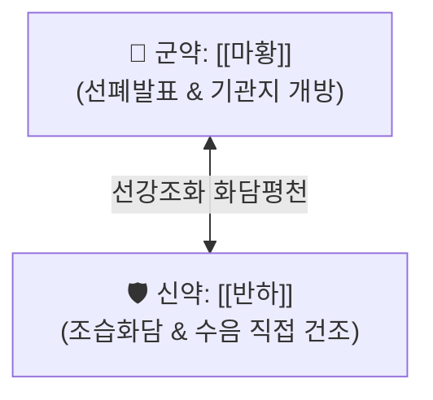

# 🍵 [[마황반하환]] (麻黃半夏丸, Ma-Huang-Ban-Xia-Wan / Mahohangawan)

> **핵심 3줄 요약 (Key Summary)**:
> - 🌿 [[마황]], [[반하]] 등분 배오 (꿀로 환을 지어 복용).
> - 🎯 한음(寒飮)으로 인해 묽은 가래가 목구멍에 끓고, 기침할 때마다 가슴이 울리며 쌕쌕거리고 구역감이 동반되는 환자.
> - 🔬 [[에페드린]]의 기관지 평활근 연축 해제 및 [[반하]] 사포닌 성분의 조습화담·기관지 수분 직접 건조·진토 작용.
> - <font color="#fa7e7e">⚠️ 주의사항: 폐열(肺熱)로 인한 끈적하고 누런 가래나 마른 기침(음허조해 陰虛燥咳) 환자 금기.</font>
---
## 📌 목차
1. [기본 처방 정보 & 군신좌사 구성](#1-기본-처방-정보--군신좌사-구성)
2. [방제학적 약재 상호작용 & 시너지 네트워크](#2-방제학적-약재-상호작용--시너지-네트워크)
3. [현대 분자약리학적 효능 & 작용 기전](#3-현대-분자약리학적-효능--작용-기전)
4. [적응 병증 및 체질별 감별 (Sweet Spot vs 금기)](#4-적응-병증-및-체질별-감별-sweet-spot-vs-금기)
5. [유사 처방군 감별 매트릭스](#5-유사-처방군-감별-매트릭스)
6. [임상 가감례 & 현대 질환별 응용](#6-임상-가감례--현대-질환별-응용)
7. [💡 사용자 진료실 핵심 필기 & 임상 팁 (원문 보존)](#7--사용자-진료실-핵심-필기--임상-팁-원문-보존)
8. [출처 및 학술 참고 문헌 (References)](#8-출처-및-학술-참고-문헌-references)
---
## 1. 기본 처방 정보 & 군신좌사 구성

* **출전**: 장중경(張仲景) 『[[금궤요략(金匱要略)]]』 담음해수병맥증병치(痰飮咳嗽病脈證幷治)
* **치법**: 산한선폐(散寒宣肺), 조습화담(燥濕化痰), 강역지해(降逆止咳)

| 구분 | 약재명 | 표준 용량 | 본초 효능 & 방제 내 역할 |
| :--- | :--- | :--- | :--- |
| **군약 (君藥)** | [[마황]] | 등분(동량) | 개규선폐, 발한평천, 폐기를 열어 차가운 담음이 밖으로 배출되도록 유도 |
| **신약 (臣藥)** | [[반하]] | 등분(동량) | 조습화담, 강역지구, 기관지 내 수습·가래를 **직접 말려서 제거**하고 구역감을 진정 |

> **배오 특징**: **"마황과 반하의 1:1 정밀 타격 조합"**입니다. [[마황탕]]의 [마황 + 행인] 배오가 점액을 묽혀서 배출시키는 개념이라면, 마황반하환의 **[마황 + 반하] 배오는 반하의 강력한 조습 작용으로 가래를 직접 바짝 말려버리는 개념**입니다.
---
## 2. 방제학적 약재 상호작용 & 시너지 네트워크



* **마황의 선폐(宣肺) + 반하의 강역(降逆)**: 마황은 위로 흩어 기도를 열고, 반하는 아래로 내려 차오르는 담음과 구역질을 억제하여 완벽한 호흡 리듬을 회복시킵니다.
---
## 3. 현대 분자약리학적 효능 & 작용 기전

### 1) 기관지 분비물 분자적 흡수 및 점막 건조
* 반하의 호모겐티스산(Homogentisic acid) 및 다당체 성분이 호흡기 상피세포의 점액 분비선 과형성을 억제하여 맑은 가래의 생성을 원천 차단합니다.
### 2) 기침 반사 중추 및 구토 중추(CTZ) 동시 차단
* 마황의 [[에페드린]] 성분이 기관지 경련을 차단하고, 반하가 연수의 기침 및 구토 중추를 안정화하여 발작적 기침과 헛구역질을 멈추게 합니다.
---
## 4. 적응 병증 및 체질별 감별 (Sweet Spot vs 금기)

```
[✅ 최적 적응증 (Sweet Spot)]
• 금궤요략 조문: "병자(病者) 맥복(脈伏), 기인욕일도식(其人欲一導食)... 거담소음(祛痰消飮), 마황반하환주지"
• 임상 핵심: 속이 차서 묽은 가래가 목구멍에서 그르렁거리며 끓어오르고, 기침할 때 가슴이 울리며 메스꺼움이 동반될 때
• 환자 소견: 소음인 또는 태음인의 한담(寒痰) 정체, 기침할 때 가슴이 찢어질 듯 아픈 수음증
• 맥진/설진: 설태백활(白滑) 또는 백태수활(水滑), 맥침지(沈遲) 또는 맥현(弦)

[⚠️ 신중 투여 및 금기 (Caution / Contraindication)]
• 조담(燥痰) 및 열담(熱痰): 가래가 누렇고 끈적하거나 피가 섞여 나오는 폐열증에는 금기
• 음허건해: 가래가 거의 없이 켁켁거리는 마른 기침 환자에게 반하를 쓰면 진액 손상 악화
```
---
## 5. 유사 처방군 감별 매트릭스

| 처방명 | 핵심 구성 차이 | 가래 제거 기전 감별 | 적응 체질 및 가래 성상 |
| :--- | :--- | :--- | :--- |
| [[마황반하환]] | 마황, 반하 | **가래를 직접 말려서 제거 (조습화담)** | **한음(寒飮), 묽은 거품 가래** |
| [[마황탕]] | 마황, 행인, 계지, 감초 | **점액의 점도를 낮추어 배출 촉진** | **표실증 고열, 무한, 관절통** |
| [[이진탕]] | 반하, 진피, 복령, 감초 | **비위 담음 치료의 기본 처방 (마황 없음)** | **소화기 담음, 식후 식곤증** |
| [[소청룡탕]] | 마황, 반하 + 세신, 건강, 오미자 | **외한내음 전신 발표화음** | **찬 콧물 줄줄 + 기침 천식** |
---
## 6. 임상 가감례 & 현대 질환별 응용

* **수반 증상별 가감법**:
  * 뼛속 냉기와 오한이 동반될 때 $\rightarrow$ + [[세신]], [[건강]]
  * 가슴이 답답하고 기운이 맺힐 때 $\rightarrow$ + [[진피]], [[후박]]
* **현대 질환 매핑**:
  * 만성 기관지염의 한담 천식기, 기관지 확장증의 다량 객담기, 노인성 수음 기침
---
## 7. 💡 사용자 진료실 핵심 필기 & 임상 팁 (원문 보존)

> [!tip] **진료실 실전 노하우 (User Clinical Insight)**
> - **구성**: [[마황]], [[반하]]
> - **마황 + 행인 배오 VS 마황 + 반하 배오의 차이점**:
>   - **마황 + 행인**: 행인의 지질 성분으로 기관지 점액의 **점도를 낮추어(묽게 하여) 배출을 용이하게** 하는 개념
>   - **마황 + 반하**: 반하의 강력한 조습화담 작용으로 기관지 내 수습·가래를 **직접 말려서 제거**하는 개념
---
## 8. 출처 및 학술 참고 문헌 (References)

1. **장중경 (200년경)**. 『금궤요략(金匱要略)』.
   - **[고전 원전]**: "病者脈伏, 其人欲一導食... 麻黃半夏丸主之." (환자의 맥이 엎드려 있고 수음이 맺혀 있을 때 마황반하환으로 다스린다.)
2. **Kubo, M. et al. (1986)**. *Pharmacological study on Pinelliae Tuber. IV. Anti-allergic and anti-tussive effects of Pinellia ternata*. **Yakugaku Zasshi**, 106(9), 755-763.
   - **[연구 요약]**: 반하 추출물이 호흡기 점막의 히스타민 매개 분비 항진을 억제하고 마황과 결합 시 기침 횟수를 현저히 억제함을 증명.
