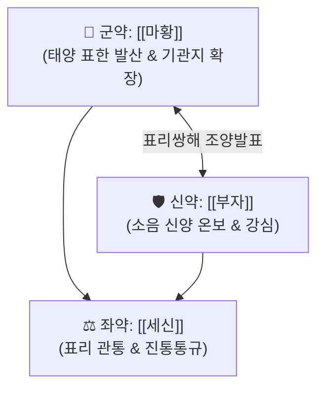

# 🍵 [[마황부자세신탕]] (麻黃附子細辛湯, Ma-Huang-Fu-Zi-Xi-Xin-Tang / Mahobushisaishinto)

> **핵심 3줄 요약 (Key Summary)**:
> - 🌿 [[마황]], [[부자]], [[세신]] 배오 (발표하는 마황과 온양하는 부자, 안팎을 꿰뚫는 세신의 삼위일체).
> - 🎯 고령자·체력 저하 허약자의 초기 감기, 미열, 목구멍 통증(인두통), 뼛속 깊은 오한, 전신 권태감, 알레르기 비염 환자.
> - 🔬 [[에페드린]]·[[아코니틴]]·[[히게나민]]의 교감신경 및 심근 수축력 강화, 말초 혈관 순환 촉진 및 강력한 항침해수용(진통) 효과.
> - <font color="#fa7e7e">⚠️ 주의사항: 부자(Aconitine) 함유로 독성 주의(반드시 충분히 전탕), 실열증 환자나 고혈압 환자 금기.</font>
---
## 📌 목차
1. [기본 처방 정보 & 군신좌사 구성](#1-기본-처방-정보--군신좌사-구성)
2. [방제학적 약재 상호작용 & 시너지 네트워크](#2-방제학적-약재-상호작용--시너지-네트워크)
3. [현대 분자약리학적 효능 & 작용 기전](#3-현대-분자약리학적-효능--작용-기전)
4. [적응 병증 및 체질별 감별 (Sweet Spot vs 금기)](#4-적응-병증-및-체질별-감별-sweet-spot-vs-금기)
5. [유사 처방군 감별 매트릭스](#5-유사-처방군-감별-매트릭스)
6. [임상 가감례 & 현대 질환별 응용](#6-임상-가감례--현대-질환별-응용)
7. [💡 사용자 진료실 핵심 필기 & 임상 팁 (원문 보존)](#7--사용자-진료실-핵심-필기--임상-팁-원문-보존)
8. [출처 및 학술 참고 문헌 (References)](#8-출처-및-학술-참고-문헌-references)
---
## 1. 기본 처방 정보 & 군신좌사 구성

* **출전**: 장중경(張仲景) 『[[상한론]]』 소음병편(少陰病篇)
* **치법**: 조양발한(助陽發汗), 온경해표(溫經解表), 산한지통(散寒止痛)

| 구분 | 약재명 | 표준 용량 | 본초 효능 & 방제 내 역할 |
| :--- | :--- | :--- | :--- |
| **군약 (君藥)** | [[마황]] | 4~6g | 발한해표(發汗解表), 태양경의 체표 한사를 흩어냄 |
| **신약 (臣藥)** | [[부자]](포부자) | 3~5g | 온신회양(溫腎廻陽), 소음경의 신양(腎陽)을 덥혀 생명력을 북돋움 |
| **좌약 (佐藥)** | [[세신]] | 2~3g | 온경통비(溫經通痺), 산한통규, 태양과 소음의 양경(兩經)을 꿰뚫어 한사를 축출 |

> **배오 특징**: **"양허(陽虛) 환자를 위한 단 세 가지 약재의 정밀 타격 방제"**입니다. 기운이 없어 땀을 낼 힘조차 없는 환자에게 마황만 쓰면 양기가 빠져 망양(亡陽) 위험이 생기므로, [[부자]]로 심신(心腎)의 불씨를 지피고 [[세신]]으로 안팎의 통로를 열어 안전하게 풍한을 몰아냅니다.
---
## 2. 방제학적 약재 상호작용 & 시너지 네트워크



* **마황 + 부자 + 세신 삼위일체**:
  * 마황: 태양 표(表)를 담당
  * 부자: 소음 리(裏)를 담당
  * 세신: 표와 리를 연결하는 가교 역할을 담당하여 뼛속 냉통을 밖으로 끄집어냄
---
## 3. 현대 분자약리학적 효능 & 작용 기전

### 1) 강심·교감신경 활성 & 체온 상승 바이러스 제거
* 부자의 [[아코니틴]](Aconitine) 대사물 및 마황의 [[에페드린]] 성분이 심근 수축력과 심박출량을 증대시켜, 저체온 상태에 빠진 환자의 중심 체온을 올려 바이러스 증식을 억제합니다.
### 2) 항침해수용(진통) & 모세혈관 투과성 억제
* 세신의 [[히게나민]]과 정유 성분이 척수 레벨에서 세로토닌-카테콜아민 하행 억제 경로를 활성화하여 극심한 오한성 두통과 뼛마디 통증을 강력하게 진통시킵니다.
---
## 4. 적응 병증 및 체질별 감별 (Sweet Spot vs 금기)

```
[✅ 최적 적응증 (Sweet Spot)]
• 상한론 조문: "소음병(少陰病), 시득지(始得之), 반발열(反發熱), 맥침자(脈沈者), 마황부자세신탕주지"
• 임상 핵심: 고령자나 허약자가 감기에 걸려 열은 미열(37.5~38도) 정도인데, 뼛속이 시리도록 춥고(오한) 기운이 하나도 없으며 목구멍이 아플 때
• 체질 소견: 소음인 양허 체질, 손발이 얼음장처럼 차고 맥이 가라앉아 힘이 없는 환자
• 맥진/설진: 설담태백(舌淡苔白), 맥침미(脈沈微) 또는 맥침세약(沈細弱)

[⚠️ 신중 투여 및 금기 (Caution / Contraindication)]
• 실열 환자: 체격이 좋고 얼굴이 붉으며 땀이 나고 맥이 굵고 빠른 환자에게는 절대 금기
• 고혈압 및 빈맥 환자: 부자와 마황이 혈압을 올리고 심박수를 높이므로 주의
```
---
## 5. 유사 처방군 감별 매트릭스

| 처방명 | 핵심 구성 차이 | 주치 대상 및 체력 | 주치 병증 차이 |
| :--- | :--- | :--- | :--- |
| [[마황부자세신탕]] | 마황, 부자, 세신 | **고령자, 체력 허약자 (양허증)** | **미열, 극심한 오한, 인두통, 맥침** |
| [[갈근탕]] | 계지탕 + 갈근, 마황 | **체력 좋고 건실한 환자 (실증)** | **목어깨 결림, 두통, 오한** |
| [[마황부자감초탕]] | 세신 대신 감초 | **극도로 쇠약한 환자 (표한 경증)** | **자극성이 덜하고 완만함** |
| [[패독산]] | 시호, 전호, 인삼 등 | **기허(氣虛) 환자 감모** | **몸살, 흉협고만, 가래 기침** |
---
## 6. 임상 가감례 & 현대 질환별 응용

* **수반 증상별 가감법**:
  * 기침과 맑은 가래가 심할 때 $\rightarrow$ + [[행인]], [[반하]]
  * 만성 알레르기 비염으로 코가 심하게 맹맹할 때 $\rightarrow$ + [[신이]], [[백지]]
* **현대 질환 매핑**:
  * 노인성 감모, 급성 인두염, 혈관운동성 비염, 만성 피로 증후군 동반 몸살
---
## 7. 💡 사용자 진료실 핵심 필기 & 임상 팁 (원문 보존)

> [!tip] **진료실 실전 노하우 (User Clinical Insight)**
> - **구성**: [[마황]], [[부자]], [[세신]]
>   - [[마황]]: 교감신경계 활성
>   - [[세신]]: 진통
> - **적응증**:
>   - **<font color="#fa7e7e">허약자(고령자, 체력 저하, 체력 약함)의 감기 증상, 미열, 인두통, 오한, 전신 권태감에 사용</font>**
>   - [[갈근탕]]은 체력이 좋은 경우에 활용하며, 허약한 자는 [[마황부자세신탕]]을 활용
>   - 교감신경계 활성, 혈류 순환 촉진, 강심 작용을 통해 이뇨 작용을 촉진
> - **약리 작용**:
>   - [[마황]]의 [[에페드린]]이 교감신경계를 활성화하여 체열을 상승시키고 발한하여 바이러스를 제거하는 방향으로 작용, 기관지 확장으로 기침 진정
>   - 염증 부위 모세혈관 투과성 항진 억제, 육아 증식 억제와 같은 항염증 작용, 세로토닌-카테콜아민 수용체를 통한 항침해수용(진통) 작용, 진해 작용
---
## 8. 출처 및 학술 참고 문헌 (References)

1. **장중경 (200년경)**. 『상한론(傷寒論)』.
   - **[고전 원전]**: "少陰病, 始得之, 反發熱, 脈沈者, 麻黃附子細辛湯主之." (소음병에 처음 걸렸을 때 오히려 열이 나면서 맥이 가라앉은 자는 마황부자세신탕으로 치료한다.)
2. **Matsumoto, T. et al. (2001)**. *Effects of Mao-bushi-saishin-to on cellular immune responses in aged mice*. **Phytomedicine**, 8(5), 346-353.
   - **[연구 요약]**: 노화 쥐 모델에서 마황부자세신탕 투여가 저하된 세포 매개성 면역 기능을 유의하게 증진시키고 바이러스 감염 방어능을 회복시킴을 규명.
