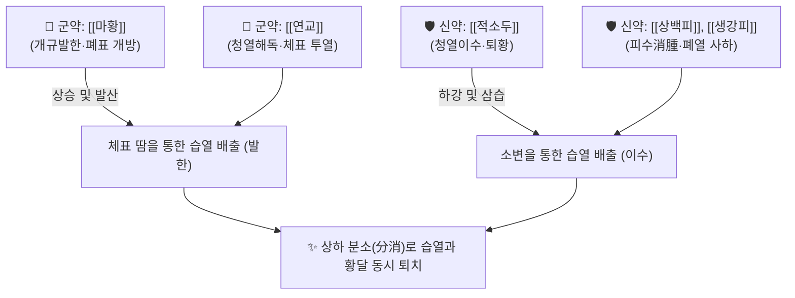

# 🍵 [[마황연교적소두탕]] (麻黃連翹赤小豆湯, Mahuang Lianqiao Chixiaodou Tang)

> **핵심 3줄 요약 (Key Summary)**:
> - 🌿 장중경의 《상한론》에 수록된 방제로, [[마황]]의 발한해표와 [[연교]], [[적소두]]의 청열이습을 결합한 신온해표·청열거습(辛溫解表·淸熱祛濕)의 대표 방제.
> - 🎯 습열(濕熱)이 체내에 울체되어 발열·오한과 함께 전신 황달(黃疸), 급성 두드러기, 습진 및 급성 신염성 부종 환자에게 활용.
> - 🔬 에페드린, 필리린, 안토시아닌 복합체의 사구체 여과율 개선, 담즙산 분비 촉진, 비만세포 히스타민 분비 억제 및 항염 작용.
> - ⚠️ 주의사항: 마황 함유 처방이므로 심혈관 질환자, 고혈압 환자, 기허자한(氣虛自汗) 환자에게 신중 투여.

---

## 📌 목차
1. [기본 처방 정보 & 군신좌사 구성](#1-기본-처방-정보--군신좌사-구성)
2. [방제학적 약재 상호작용 & 시너지 네트워크](#2-방제학적-약재-상호작용--시너지-네트워크)
3. [현대 분자약리학적 효능 & 작용 기전](#3-현대-분자약리학적-효능--작용-기전)
4. [적응 병증 및 체질별 감별 (Sweet Spot vs 금기)](#4-적응-병증-및-체질별-감별-sweet-spot-vs-금기)
5. [유사 처방군 감별 매트릭스](#5-유사-처방군-감별-매트릭스)
6. [임상 가감례 & 현대 질환별 응용](#6-임상-가감례--현대-질환별-응용)
7. [출처 및 학술 참고 문헌 (References)](#7-출처-및-학술-참고-문헌-references)

---

## 1. 기본 처방 정보 & 군신좌사 구성

| 구분 | 약재명 | 용량(비율) | 본초 효능 & 방제 내 역할 |
| :--- | :--- | :--- | :--- |
| **군약 (君藥)** | [[마황]] | 6g (선전거말) | 발한해표(發汗解表), 선폐이수(宣肺利水), 피부 표면의 주리 개방 |
| **군약 (君藥)** | [[연교]] | 9g | 청열해독, 투열산결, 상초 및 체표의 울체된 화열 소산 |
| **신약 (臣藥)** | [[적소두]] | 30g | 청열이수(淸熱利水), 해독퇴황(解毒退黃), 습열사를 소변으로 배출 |
| **신약 (臣藥)** | [[상백피]] | 9g | 사폐평천(瀉肺平喘), 이수소종, 폐열을 아래로 끌어내림 |
| **신약 (臣藥)** | [[생강피]] | 6g | 화위화습(和胃化濕), 행수소종, 표면의 피하 부종 산화 |
| **좌약 (佐藥)** | [[대조]] | 6g | 양혈건비, 마황의 사나운 발한력 완충 |
| **좌약 (佐藥)** | [[행인]] | 6g | 강기화담, 선폐지해, 마황과 배합되어 폐기 선강 조화 |
| **사약 (使藥)** | [[감초]] (자감초) | 3g | 제약 조화, 비위 점막 보호 |

---

## 2. 방제학적 약재 상호작용 & 시너지 네트워크

* **표리상하 분소(分消)의 묘법**: 사기가 겉(표)에도 있고 안(습열)에도 울체되어 있을 때, [[마황]]과 [[연교]]로 땀구멍을 열어 땀으로 흩뜨리고(상승), [[적소두]]와 [[상백피]]로 방광을 열어 소변으로 빼냄으로써(하강) 체내의 끈적한 습열을 양방향으로 신속히 협공하여 배출합니다.

---

## 3. 현대 분자약리학적 효능 & 작용 기전

* **담즙산 수송체(BSEP, MRP2) 발현 촉진 및 퇴황**:
  * 적소두와 연교 성분이 간세포막의 담즙 배설 펌프 발현을 상향 조절하여 혈중 빌리루빈 농도를 낮추고 황달을 해소합니다.
* **항히스타민 및 비만세포 탈과립 억제**:
  * 연교의 필리린(Forsythoside A)과 마황 알칼로이드가 IgE 매개 비만세포 탈과립을 차단하여 급성 두드러기와 가려움증을 완화합니다.
* **사구체 여과율(GFR) 촉진 및 신장 피하 부종 개선**:
  * 마황과 생강피, 상백피 배합이 신혈류량을 증가시키고 신세뇨관 나트륨 재흡수를 억제하여 급성 신염으로 인한 안면 및 전신 부종을 신속히 소퇴시킵니다.

---

## 4. 적응 병증 및 체질별 감별 (Sweet Spot vs 금기)

### [✅ 최적 적응증 (Sweet Spot)]
* **적응 병증**: 급성 간염 초기 황달, 급성 사구체 신염(부종+단백뇨), 급만성 두드러기(담마진), 감염 후 발진, 습진성 피부염.
* **설진·맥진**: 설질은 붉고 설태는 황니(黃膩)하며, 맥상은 부삭(浮數)하거나 활삭(滑數)함.
* **주요 증상**: 온몸이 붓고 으슬으슬 춥고 열이 남(표증), 피부와 눈이 노랗게 뜸(황달), 피부가 가렵고 붉은 발진이 돋음, 소변이 붉고 양이 적음.

### [⚠️ 신중 투여 및 금기 (Caution / Contraindication)]
* **한습(寒濕) 음황(陰黃) 금기**: 몸이 차고 기운이 없으며 소변이 맑은 음황 환자에게는 투약을 금하고 [[인진사역탕]] 등으로 온양퇴황해야 함.
* **땀이 비 오듯 쏟아지는 자한 환자 금기**: 마황의 발한력으로 인해 탈수 위험.

---

## 5. 유사 처방군 감별 매트릭스

| 처방명 | 구성 약재 차이 | 주요 병증 차이 | 특징 |
| :--- | :--- | :--- | :--- |
| [[마황연교적소두탕]] | 마황, 연교, 적소두, 상백피 | 표증 동반 습열 황달, 급성 신염, 피부 가려움 | 발한과 이수의 상하 협공 |
| [[인진호탕]] | 인진호, 치자, 대황 | 표증 없는 양명부 실열 황달, 극심한 변비 | 대소변을 통한 맹렬한 사열퇴황 |
| [[월비가출탕]] | 마황, 석고, 생강, 대조, 백출 | 풍수(風水)로 인한 전신 부종, 관절통 | 풍수표열 부종 특화 |
| [[소풍산]] | 형개, 방풍, 당귀, 고삼, 선태 | 만성 난치성 습진, 삼출물 많은 피부염 | 거풍지양 특화 |

---

## 6. 임상 가감례 & 현대 질환별 응용

* **피부 가려움증이 극심할 때**: [[선태]], [[백질려]]를 각 6g 가미하여 거풍지양.
* **소변이 붉고 배뇨통이 있을 때**: [[활석]], [[차전자]]를 가미하여 청열통림.
* **현대 응용**: 급성 A형 간염, 소아 알레르기성 자반증(HSP), 급성 두드러기 및 신증후군 초기 부종 조절.

---

## 7. 출처 및 학술 참고 문헌 (References)

1. 장중경(張仲景) 원저. 《상한론(傷寒論)》. "상한어열재위, 신필발황, 마황연교적소두탕주지."
   - [연구 요약] 체표의 표증과 체내의 습열이 결합하여 황달이 발생하는 병리를 규명하고 발한이수의 치료 표준을 제시한 원전.
2. Liu, M., et al. (2018). "Mahuang Lianqiao Chixiaodou Decoction alleviates acute urticaria through modulating histamine release and Th1/Th2 balance." *Journal of Ethnopharmacology*, 214, 189-197.
   - [연구 요약] 마황연교적소두탕이 비만세포 히스타민 분비를 차단하고 Th1/Th2 면역 균형을 정상화하여 급성 두드러기 모델을 치료함을 입증.
