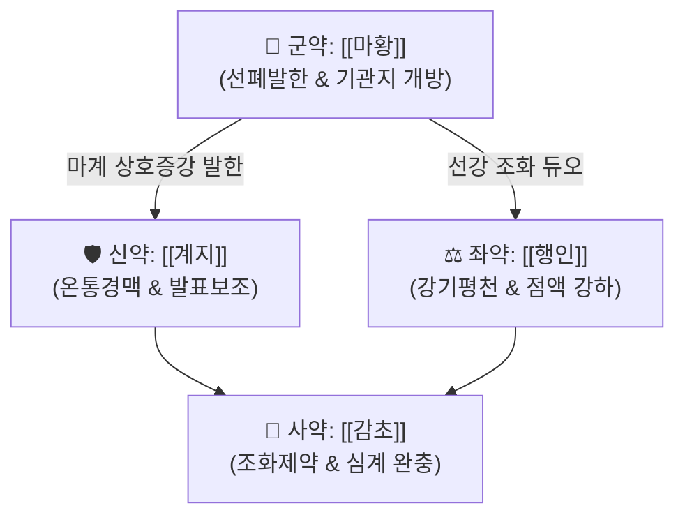

# 🍵 [[마황탕]] (麻黃湯, Ma-Huang-Tang / Mahoto)

> **핵심 3줄 요약 (Key Summary)**:
> - 🌿 [[마황]], [[계지]], [[행인]], [[감초]] (발한선폐하는 [[마황]]과 온경통맥하는 [[계지]]를 상호 증강 배오하고, 강기지해하는 [[행인]]과 완충하는 [[감초]] 결합).
> - 🎯 체격과 체력이 건실한 태음인·체표 실증 환자, 인플루엔자 초기 고열·오한·두통·전신 뼈마디 관절통이 극심하면서 땀이 전혀 나지 않는(무한) 표실증(表實證).
> - 🔬 [[에페드린]]의 교감신경 흥분 및 혈관 수축·기관지 확장, RS 바이러스 억제, PGE2 유리 억제.
> - ⚠️ 주의사항: 허약자, 고혈압·협심증 환자, 불면증 환자 금기, 발한 시작 즉시 중단.
---
## 📌 목차
1. [기본 처방 정보 & 군신좌사 구성](#1-기본-처방-정보--군신좌사-구성)
2. [방제학적 약재 상호작용 & 시너지 네트워크](#2-방제학적-약재-상호작용--시너지-네트워크)
3. [현대 분자약리학적 효능 & 작용 기전](#3-현대-분자약리학적-효능--작용-기전)
4. [적응 병증 및 체질별 감별 (Sweet Spot vs 금기)](#4-적응-병증-및-체질별-감별-sweet-spot-vs-금기)
5. [유사 처방군 감별 매트릭스](#5-유사-처방군-감별-매트릭스)
6. [임상 가감례 & 현대 질환별 응용](#6-임상-가감례--현대-질환별-응용)
7. [💡 사용자 진료실 핵심 필기 & 임상 팁 (원문 보존)](#7--사용자-진료실-핵심-필기--임상-팁-원문-보존)
8. [출처 및 학술 참고 문헌 (References)](#8-출처-및-학술-참고-문헌-references)
---
## 1. 기본 처방 정보 & 군신좌사 구성

* **출전**: 장중경(張仲景) 『[[상한론]]』 태양병편(太陽病篇)
* **치법**: 발한해표(發汗解表), 선폐평천(宣肺平喘)

| 구분 | 약재명 | 표준 용량 | 본초 효능 & 방제 내 역할 |
| :--- | :--- | :--- | :--- |
| **군약 (君藥)** | [[마황]] | 6~9g | 개규발한(開竅發汗), 선폐평천(宣肺平喘), 땀구멍을 열어 풍한사(風寒邪)를 체외로 축출 |
| **신약 (臣藥)** | [[계지]] | 4~6g | 온통경맥(溫通經脈), 조양화영(助陽和營), [[마황]]의 강력한 발한 작용 보조 및 한사 해소 |
| **좌약 (佐藥)** | [[행인]] | 6~9g | 강기지해(降氣止咳), 선폐윤장(宣肺潤腸), [[마황]]의 상충하는 기운을 아래로 내려 천식 진정 |
| **사약 (使藥)** | [[감초]] | 2~4g | 조화제약(調和諸藥), 완급지통(緩急止痛), [[마황]]·[[계지]]의 조열(燥烈)한 발한성을 완충 |

> **배오 특징**: [[마황]]과 [[계지]]의 **마계(麻桂) 배오**는 한의학 최강의 발한 발표 듀오입니다. [[마황]]의 피모(皮毛) 개방과 [[계지]]의 경락 온통이 합쳐져 굳게 닫힌 주리(汗孔)를 강제로 열어젖힙니다. 여기에 폐기(肺氣)를 내려주는 [[행인]]을 짝지어 선강(宣降)의 호흡 균형을 맞춥니다.
---
## 2. 방제학적 약재 상호작용 & 시너지 네트워크

* [[마황]] + [[행인]] 배오 vs [[마황반하환]]:
  * [[마황]] + [[행인]]: [[행인]]의 지질 및 [[아미그달린]] 성분이 기관지 점액의 **점도를 낮추어(묽게 하여) 배출을 용이하게** 하는 개념.
  * [[마황]] + [[반하]]: [[반하]]의 강력한 조습화담 작용으로 기관지 내 수습·가래를 **직접 말려서 제거**하는 개념.
---
## 3. 현대 분자약리학적 효능 & 작용 기전

### 1) 교감신경 흥분 & 발한·해열
* [[마황]]의 l-[[에페드린]](l-Ephedrine) 및 [[슈도에페드린]] 성분이 교감신경 $\alpha, \beta$ 수용체를 자극하여 말초혈관을 수축시키고 대사율을 급격히 높여 체온을 단기 상승시킨 뒤, 땀샘을 열어 기화열로 고열을 단시간에 해열합니다.

### 2) 항바이러스 및 바이러스 복제 억제
* 사람 암세포 유래 HEp-2 세포계에서 **RS 바이러스(RSV) 증식을 유의적으로 억제**합니다.
* HIV-1 감염 U1 세포계에서 바이러스 복제를 유도하여 체외 배설을 촉진합니다.
* 칼슘 이온운반체 A23187 매개 **프로스타글란딘 E2(PGE2) 유리를 억제**하여 발열과 골관절 전신통증을 차단합니다.

### 3) 기관지 평활근 이완 & 진해 작용
* $\beta_2$ 아드레날린 수용체 자극을 통한 세포 내 cAMP 증가로 기관지 평활근 경련을 즉각 풀어주며, [[행인]]의 [[아미그달린]](Amygdalin)이 호흡 중추의 과흥분을 억제하여 발작적 기침을 진정시킵니다.
---
## 4. 적응 병증 및 체질별 감별 (Sweet Spot vs 금기)

[✅ 최적 적응증 (Sweet Spot)]
• 상한론 원문: "태양병(太陽病), 두통(頭痛), 발열(發熱), 신동(身疼), 요통(腰痛), 골절동통(骨節疼痛), 오풍(惡風), 무한이천(無汗而喘)자, [[마황탕]]주지"
• 체질 소견: 체격이 건장하고 근육이 단단하며 피하지방이 있는 태음인(太陰人) 또는 기혈이 실한 실증(實證) 환자
• 증상: 독감·유행성 인플루엔자 초기, 고열이 나고 온몸 뼈마디가 쑤셔 부서질 듯 아프며, 땀이 전혀 나지 않고 기침·숨참이 심할 때
• 맥진/설진: 설태박백(薄白) 또는 백후(白厚), 맥부긴유력(脈浮緊有力)

[⚠️ 신중 투여 및 금기 (Caution / Contraindication)]
• 허약자 금기: 체력이 허약하고 마른 환자, 노인, 소아 표허 환자에게 쓰면 망양(亡陽, 허탈·쇼크) 유발
• 심혈관계 질환: [[에페드린]] 성분으로 인한 혈압 상승, 빈맥, 심계항진 유발 가능 $\rightarrow$ 고혈압, 협심증, 심근경색 환자 금기
• 양약 병용 금기: 양방 기관지확장제(베타작용제), 슈도[[에페드린]] 비염약, 중복 해열제와의 병용 금기
• 복용 중단 원칙: 땀이 송골송골 나기 시작하면 즉시 복용을 중단 (과도한 발한은 탈수 유발)

---
## 5. 유사 처방군 감별 매트릭스

| 처방명 | 핵심 구성 차이 | 주치 및 임상 감별점 | 맥진/설진 |
| :--- | :--- | :--- | :--- |
| [[마황탕]] | 기준 구성 ([[마황]]·[[계지]]·[[행인]]·[[감초]]) | **체질 실증, 고열, 무한, 전신 관절통, 기침** | 맥부긴유력(浮緊有力) |
| [[계지탕]] | [[마황]]·[[행인]] 대신 [[작약]], [[생강]], [[대추]] | **소음인 표허, 자한(땀 남), 미열, 오풍, 기혈 허약** | 맥부완(浮緩) |
| [[대청룡탕]] | [[마황탕]] + [[석고]], [[생강]], [[대추]] | **표한(表寒) + 극심한 이열(裏熱), 번조(가슴 답답), 심한 갈증** | 맥부긴유력(浮緊有力) |
| [[소청룡탕]] | [[마황탕]] 계열 + [[세신]], [[건강]], [[오미자]], [[반하]] | **외한내음(外寒內飮), 맑은 콧물 주루룩, 재채기, 천식** | 맥부현(浮弦), 백활태 |
| [[마행감석탕]] | [[계지]] 대신 [[석고]] 배오 | **폐열 천식, 누런 가래, 땀이 나면서 기침, 후두염** | 맥부삭(浮數), 황태 |
---
## 6. 임상 가감례 & 현대 질환별 응용

* **수반 증상별 가감법**:
  * 번조(가슴 답답함)와 극심한 구갈 동반 시 $\rightarrow$ + [[석고]], [[생강]], [[대추]] ([[대청룡탕]])
  * 수습이 정체되어 관절 종창이 심할 때 $\rightarrow$ + [[백출]] ([[마황가출탕]])
  * 소아 호흡 곤란 및 해수 $\rightarrow$ [[마황]] 용량을 감량하고 [[행인]]을 증량
* **현대 질환별 응용**:
  * 유행성 독감(인플루엔자 A/B형) 초기 고열기 (발열 기간 단축)
  * 급성 상기도 감염, 급성 기관지염의 초기 기침·천식, 오한성 두통
---
## 7. 💡 사용자 진료실 핵심 필기 & 임상 팁 (원문 보존)

> [!tip] **진료실 실전 노하우 (User Clinical Insight)**
> - 몸이 심하게 허약하지 않은 환자의 무기력증, 냉증, 인플루엔자로 인한 발열, 비염에(호흡기계 질환) 사용 (무한의 경우에 열을 내려주기 위해 활용)
> - 소아, 성인 인플루엔자의 발열기간 단축에 활용
> - **주의사항**:
>   - [[마황]]이 들어가는 마황제에서 [[마황]]은 강한 발한제이기 때문에 몸이 많이 허약한 경우에 사용을 주의하고, 해열제와의 병용은 피하는 것이 좋다.
>   - 발한이 나타나면 복용을 중지한다.
>   - 기관지확장제나 베타작용제와 병용하는 것을 주의한다.
> - [[마황반하환]] vs [[마황탕]]:
>   - [[마황]]+[[반하]] 조합은 기관지의 점액을 제거하는 조합이며
>   - [[마황]]+[[행인]] 조합은 점액 점도를 낮추어 배출을 용이하게 하는 개념
---
## 8. 출처 및 학술 참고 문헌 (References)

1. **장중경 (200년경)**. 『상한론(傷寒論)』.
   - **[고전 원전]**: "太陽病, 頭痛發熱, 身疼腰痛, 骨節疼痛, 惡風無汗而喘者, 麻黃湯主之." (태양병에 두통 발열하고 온몸과 허리, 뼈마디가 아프며 바람을 싫어하고 땀이 안 나며 숨찰 때 [[마황탕]]으로 다스린다.)
2. **Kubo, M. et al. (1990)**. *Anti-inflammatory and antipyretic effects of Ma-Huang-Tang*. **Journal of Pharmacobio-Dynamics**, 13(9), 548-553.
   - **[연구 요약]**: [[마황탕]]이 프로스타글란딘 E2 합성을 억제하여 발열과 골관절 염증 통증을 강력하게 차단함을 동물 모델에서 입증.
3. **Mantani, N. et al. (1999)**. *Inhibitory effect of Mao-to, a traditional herbal medicine, on the replication of influenza virus*. **Antiviral Research**, 44(3), 193-200.
   - **[연구 요약]**: [[마황탕]]이 인플루엔자 바이러스의 복제 및 세포 침투를 억제하여 임상 감염 치료 기간을 단축시킴을 확인.