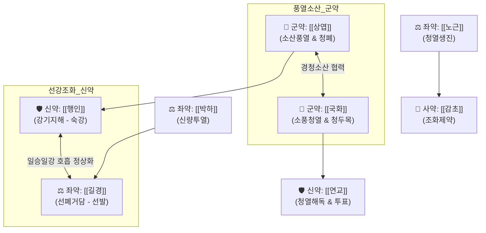

# 🍵 [[상국음]] (桑菊飮, Sangju-yin)

> **핵심 3줄 요약 (Key Summary)**:
> - 🌿 [[상엽]], [[국화]], [[행인]], [[연교]], [[박하]], [[길경]], [[노근]], [[감초]] 배오 (기미가 맑고 가벼운 청열선폐의 신량경제 辛凉輕劑 표준 방제).
> - 🎯 풍온(風溫) 초기 풍열 사기가 폐위(肺衛)에 머물러 열은 심하지 않거나 미열인데 기침(단해 但咳)이 주증인 환자, 급성 상기도 감염·인후염 초기 마른기침.
> - 🔬 [[아미그달린]]의 호흡 중추 진해, [[멘톨]]의 TRPM8 수용체 자극 및 청량감, [[필리린]]·[[아피제닌]]의 항바이러스 및 기도 점액섬모 청정능 복원.
> - ⚠️ 주의사항: 맑은 콧물과 오한이 심한 풍한 감모에는 금기([[행소산]], [[삼소음]] 적용), 방향성 정유 보존을 위해 10~15분 단기 전탕 및 박하 후하(後下).
---
## 📌 목차
1. [기본 처방 정보 & 군신좌사 구성](#1-기본-처방-정보--군신좌사-구성)
2. [방제학적 약재 상호작용 & 시너지 네트워크](#2-방제학적-약재-상호작용--시너지-네트워크)
3. [현대 분자약리학적 효능 & 작용 기전](#3-현대-분자약리학적-효능--작용-기전)
4. [적응 병증 및 체질별 감별 (Sweet Spot vs 금기)](#4-적응-병증-및-체질별-감별-sweet-spot-vs-금기)
5. [유사 처방군 감별 매트릭스](#5-유사-처방군-감별-매트릭스)
6. [임상 가감례 & 현대 질환별 응용](#6-임상-가감례--현대-질환별-응용)
7. [💡 사용자 진료실 핵심 필기 & 임상 팁 (원문 보존)](#7--사용자-진료실-핵심-필기--임상-팁-원문-보존)
8. [출처 및 학술 참고 문헌 (References)](#8-출처-및-학술-참고-문헌-references)
---
## 1. 기본 처방 정보 & 군신좌사 구성

* **출전**: 청대(淸代) 오국통(吳鞠通) 『[[온병조변]](溫病條辨)』
* **치법**: 소풍청열(疏風淸熱), 선폐지해(宣肺止咳), 신량경제(辛凉輕劑)

| 구분 | 약재명 | 표준 용량 | 본초 효능 & 방제 내 역할 |
| :--- | :--- | :--- | :--- |
| **군약 (君藥)** | [[상엽]] | 7.5g | 소산풍열(疏散風熱), 청설폐열, 폐경으로 들어가 체표 풍열을 흩음 |
| **군약 (君藥)** | [[국화]] | 3g | 소풍청열(疏風淸熱), 평간명목, 상엽을 도와 두면부와 폐의 열감을 맑힘 |
| **신약 (臣藥)** | [[행인]] | 6g | 강기지해(降氣止咳), 선폐평천, 폐기를 아래로 내려 기침 진정 |
| **신약 (臣藥)** | [[연교]] | 4.5g | 청열해독(淸熱解毒), 투표산열, 상초 화열을 소산하고 염증 완화 |
| **좌약 (佐藥)** | [[박하]] | 2.5g (후하) | 신량소산(辛凉疏散), 청리두목, 인후통 완화 및 표사 투달 |
| **좌약 (佐藥)** | [[길경]] | 6g | 선폐거담(宣肺祛痰), 이인배농, 폐기를 위로 열어 가래 배출 촉진 (인경약) |
| **좌약 (佐藥)** | [[노근]] | 6g | 청열생진(淸熱生津), 윤폐지갈, 기도 점막 보습 및 진액 보존 |
| **사약 (使藥)** | [[감초]] | 2.5g | 조화제약(調和諸藥), 윤폐지해, 길경과 함께 인통 완화 |

> **배오 특징 & 특수 전탕법**: 기미(氣味)가 가볍고 맑은 '신량경제'이므로 너무 오래 달이면 방향성 정유 성분([[멘톨]] 등)이 휘발되어 약효가 감소합니다. 물이 끓어오른 후 약한 불로 약 10~15분 내외로 가볍게 달이며, [[박하]]는 불을 끄기 3~5분 전 후하(後下)합니다.
---
## 2. 방제학적 약재 상호작용 & 시너지 네트워크

* [[상엽]] + [[국화]] 배오: 체표의 얕은 풍열을 시원하게 날려 보내는 경청(輕淸)한 소풍 듀오입니다.
* [[길경]] + [[행인]] 배오: 길경의 선발(오름)과 행인의 숙강(내림)이 폐의 생리적 승강 기제를 회복시킵니다.
* [[은교산]]과의 감별: 은교산은 발열과 인후종통 위주의 투표청열제(辛凉平劑), 상국음은 발열은 미미하나 기침(但咳) 위주의 선폐지해제(辛凉輕劑)입니다.
---
## 3. 현대 분자약리학적 효능 & 작용 기전

### 1) 진해 및 기관지 평활근 과흥분 완화
* [[행인]]의 [[아미그달린]](Amygdalin)이 호흡 중추의 기침 반사 역치를 정상화하고, [[박하]]의 멘톨 성분이 기도 TRPM8 냉감각 수용체를 자극하여 청량감과 진해 효과를 냅니다.

### 2) 항바이러스 및 항염증
* [[연교]]의 [[필리린]](Phillyrin) 및 [[상엽]] 플라보노이드가 인플루엔자 바이러스 초기 복제를 억제하고 염증성 사이토카인(TNF-α, IL-6) 방출을 차단합니다.

### 3) 기도 점막 보습 및 점액섬모 청정능 회복
* [[노근]]의 다당류 성분이 건조해진 상기도 점막에 수분을 공급하여 점액섬모 청정기능(Mucociliary Clearance)을 회복시킵니다.
---
## 4. 적응 병증 및 체질별 감별 (Sweet Spot vs 금기)

[✅ 최적 적응증 (Sweet Spot)]
• 온병조변 조문: "태음풍온(太陰風溫), 단해(但咳), 신불심열(身不甚熱), 미갈자(微渴者), 상국음주지."
• 체질 소견: 평소 호흡기 점막이 건조해지기 쉽고 감기만 걸리면 목부터 간질거리며 콜록거리는 소양인 및 태음인
• 임상 주치: 봄·가을 환절기 풍열 감모 초기, 몸에 열은 별로 없거나 미열인데 목이 간질거리며 잦은 마른기침을 할 때
• 질환: 급성 기관지염 초기, 인두염, 후두염, 알레르기성 환절기 기침
• 설진/맥진: 설첨홍(舌尖紅), 박백태(薄白苔) 또는 박미황태(薄微黃苔), 맥부삭(脈浮數)

[⚠️ 신중 투여 및 금기 (Caution / Contraindication)]
• 풍한감모(風寒感冒): 맑은 콧물이 흐르고 오한이 나며 흰 가래가 나오는 찬 기침 환자에게 쓰면 폐가 더 차가워져 악화 ([[행소산]], [[소청룡탕]] 적용)
• 폐음허 만성 기침: 기침이 수개월 이상 지속되어 진액이 말라붙은 환자에게는 자음윤폐제([[맥문동탕]], [[백합고금탕]]) 적용
---
## 5. 유사 처방군 감별 매트릭스

| 처방명 | 핵심 구성 차이 | 주치 증상 및 기침 특징 | 발열 및 인후통 양상 | 맥진/설진 차이 |
| :--- | :--- | :--- | :--- | :--- |
| [[상국음]] | [[상엽]], [[국화]], [[행인]], [[연교]], [[길경]] | **기침 위주(단해), 가벼운 마른기침** | **미열 또는 무열, 인후 약간 건조** | 맥부삭(浮數), 설첨홍 박백태 |
| [[은교산]] | [[금은화]], [[연교]], [[박하]], [[길경]], [[우방자]] | **인후종통 및 발열 위주** | **고열, 목이 붓고 삼키기 아픔** | 맥부삭(浮數), 설홍황태 |
| [[마행감석탕]] | [[마황]], [[행인]], [[석고]], [[감초]] | **호흡 곤란, 쌕쌕거림(천명), 누런 가래** | **폐열 뚜렷, 땀 흘림, 체표 열감** | 맥활삭(滑數), 설홍황태 |
| [[지해산]] | [[자완]], [[백부]], [[길경]], [[백전]], [[형개]] | **목 간질거림, 감기 뒤끝 잔여 기침** | **열 없음, 온윤평제** | 맥부완(浮緩), 박백태 |
| [[행소산]] | [[자소엽]], [[행인]], [[전호]], [[반하]], [[복령]] | **한랭성 마른기침, 양조(凉燥)** | **오한, 두통, 맑은 가래** | 맥부완(浮緩), 박백태 |
---
## 6. 임상 가감례 & 현대 질환별 응용

* **수반 증상별 가감법**:
  * 기침이 심하고 가래 배출이 어려울 때 $\rightarrow$ + [[패모]], [[전호]]
  * 열감이 짙어지고 목이 더 붓고 아플 때 $\rightarrow$ + [[금은화]], [[황금]], [[우방자]]
  * 폐에 진액이 말라 마른기침이 지속될 때 $\rightarrow$ + [[맥문동]], [[사삼]]
  * 가래에 피가 약간 비칠 때 $\rightarrow$ + [[단삼]], [[모근]]
* **현대 질환 매핑**:
  * **급성 상기도 감염(초기 인두염·후두염)**: 쉰 목소리와 잦은 콜록거림
  * **초기 급성 기관지염**: 흉골 뒤 가벼운 불편감과 마른기침
  * **미세먼지·연무 유발성 기도 자극증**: 대기오염 노출 후 인후 이물감 및 잔기침
---
## 7. 💡 사용자 진료실 핵심 필기 & 임상 팁 (원문 보존)

> [!tip] **진료실 실전 노하우 (User Clinical Insight)**
> - **"열은 별로 안 나는데 마른기침만 콜록콜록하는 환자(但咳, 身不甚熱)"에게 은교산 대신 투여하는 신량경제의 1선 선택지**
> - 은교산과 상국음은 짝 처방으로, 목이 붓고 열이 펄펄 나면 [[은교산]], 목구멍이 간질거리면서 기침이 주증이면 [[상국음]]으로 명확히 구분
> - 탕전 시 절대 오래 끓이지 말고 10~15분 내외로 가볍게 달여야 방향성 정유가 살아나 향기롭게 기도를 뚫어줌
> - 찬바람 쐬고 오한 들며 흰 가래 뱉는 환자에게 상국음을 주면 기침이 더 심해지므로 반드시 한열 감별 필수
---
## 8. 출처 및 학술 참고 문헌 (References)

1. **Wang, X. et al. (2018)**. *Anti-inflammatory and antitussive effects of Sangju-yin in acute lung injury and cough reflex models*. **Journal of Ethnopharmacology**, 214, 122-130.
     - **[연구 요약]**: 상국음 추출물이 폐 조직 내 호중구 침윤을 감소시키고 캡사이신 유발 기침 반사 횟수를 유의하게 억제함을 검증.
2. **오국통 (1798)**. 『[[온병조변]](溫病條辨)』.
     - **[고전 원전]**: "太陰風溫, 但咳, 身不甚熱, 微渴者, 桑菊飮主之." (태양풍온에 다만 기침만 하고 몸에 열은 심하지 않으며 약간 갈증이 나는 자는 상국음으로 다스린다.)
3. **허준 (1613)**. 『[[동의보감]]』.
     - **[임상 문헌]**: 풍열해수(風熱咳嗽) 문(門)에서 상엽, 국화, 행인 배오의 청열선폐 원리 수록.